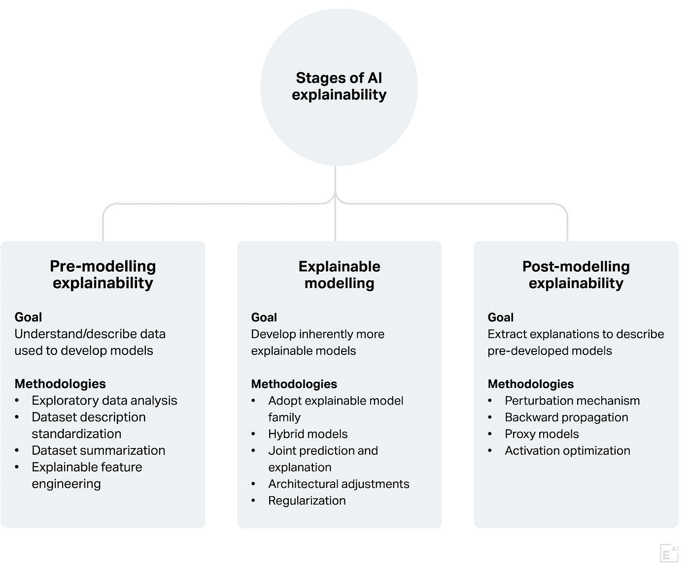
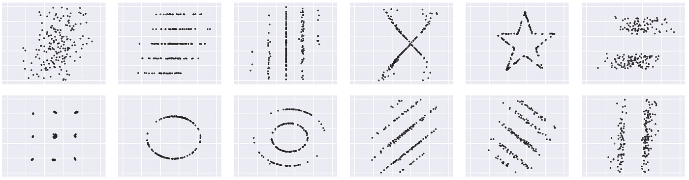
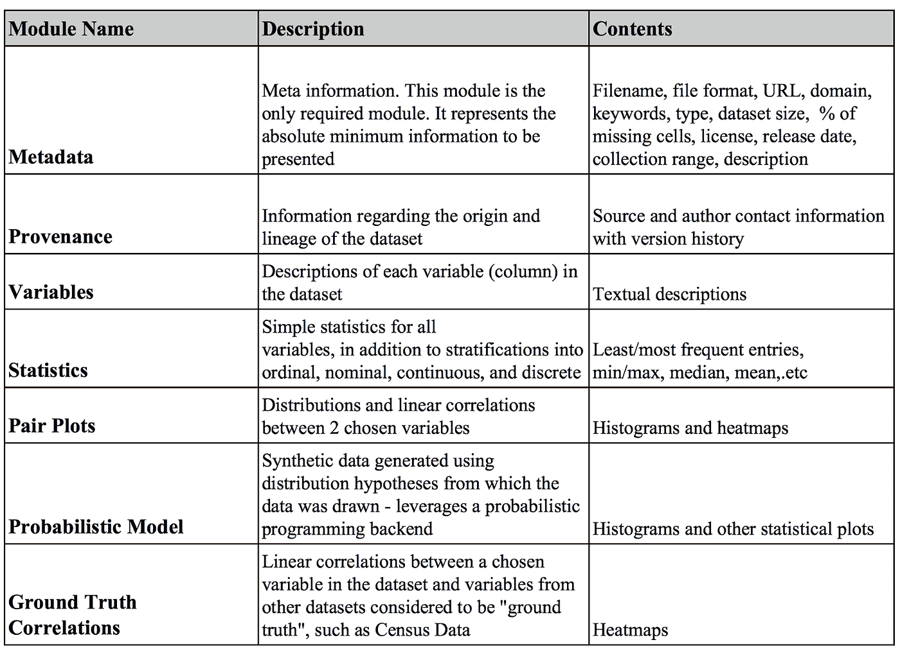
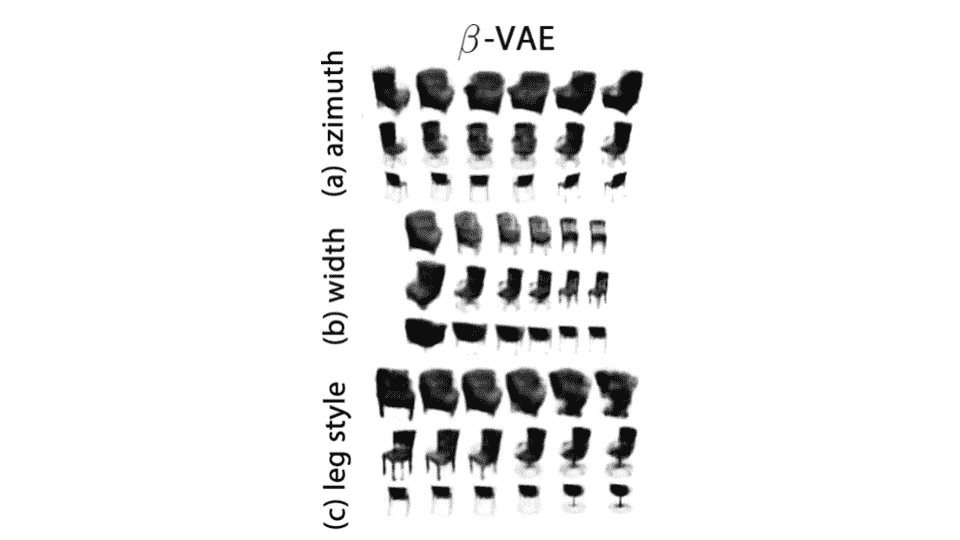
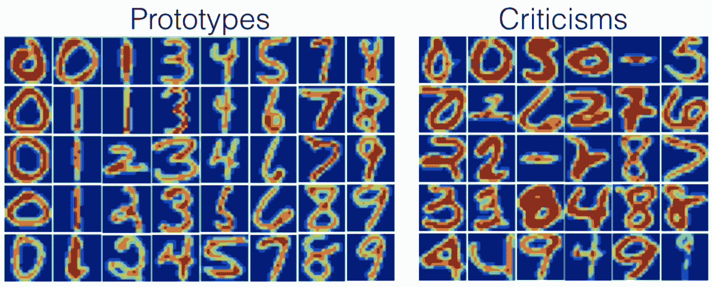

# 可解释人工智能的方法:预建模可解释性

> 原文：<https://towardsdatascience.com/the-how-of-explainable-ai-pre-modelling-explainability-699150495fe4?source=collection_archive---------13----------------------->

人工智能可解释性是一个广泛的多学科领域，正在多个领域进行研究，包括机器学习、知识表示和推理、人机交互和社会科学。相应地，XAI 文献包括大量且不断增加的方法论。

有许多因素可以影响人工智能模型如何运行和做出预测，因此有许多方法来解释它们。这也部分是由于缺乏对 XAI 的一致认可的定义。一般来说，可解释性可以应用于整个人工智能开发流程。具体来说，可以在建模阶段之前(**前建模可解释性)**、期间(**可解释建模**)和之后(**后建模可解释性**)应用。

以下是一些最重要的 XAI 方法和途径的非穷尽性概述，分为这三个阶段:建模前的可解释性、可解释的建模和建模后的可解释性。

> 有许多因素可以影响人工智能模型如何运行并做出预测，因此有许多方法来解释它们。

**The three stages of AI explainability: Pre-modelling explainability, Explainable modelling and post-modelling explainability.**

建模前可解释性是不同方法的集合，其共同目标是更好地理解用于模型开发的数据集。这种方法的动机是，人工智能模型的行为在很大程度上是由用于训练它的数据集驱动的。

# 建模前可解释性

建模前可解释性文献可以分为四大类:探索性数据分析、数据集描述标准化、可解释特征工程和数据集总结方法。

> 建模前可解释性是不同方法的集合，其共同目标是更好地理解用于模型开发的数据集。

## 探索性数据分析

探索性数据分析的目标是提取数据集主要特征的摘要。该摘要通常包括数据集的各种统计属性，如其维度、均值、标准差、范围、缺失样本等。Google Facets 是一个强大的工具包的例子，可以从给定的数据集中快速提取这些属性。

作为一个例子，考虑一个简单的监督二进制分类问题，其中开发了一个模型来检测有缺陷和无缺陷的产品。假设所提供的数据集包含装配线的高架摄像机提供的大量图像，每个图像都被标记为有缺陷或无缺陷。让我们进一步假设为该模型开发的初步分类器模型表现不佳。检查缺陷和非缺陷图像的相对频率的探索性数据分析任务可以揭示类别不平衡问题，即缺陷图像比非缺陷图像少得多。在训练数据集中发现这一挑战后，可以利用各种解决方案来缓解这一挑战并提高分类器的性能。

**An example of datasets with identical mean and standard deviation, and different graphs to demonstrate the** [**importance of visualization**](https://dl.acm.org/citation.cfm?id=3025912) **in exploratory data analysis.**

然而，在分析数据集时，仅仅依靠统计属性通常是不够的。例如，已经表明数据集可以有[相同的统计属性，但在图表上显示时却有不同的外观](https://dl.acm.org/citation.cfm?id=3025912)。因此，数据可视化方法构成了探索性数据分析机制的一大部分。数据可视化提供了多种方法来使用[各种类型的图表](https://datavizcatalogue.com/)绘制数据集。选择适当类型的图表取决于给定的数据集、给定的应用程序以及我们想要传达的特定统计属性。

现实世界的数据集通常是复杂的和高维的，也就是说，具有大量的要素。可视化这样的高维数据可能是一个挑战，因为人类只能轻松地想象最多三个维度。

> 在分析数据集时，仅仅依靠统计属性通常是不够的。

应对这一挑战的一种方法是使用专门类型的图表，例如[平行坐标图](https://arxiv.org/pdf/1905.10035.pdf)，以允许人类感知大于三的维度。或者，可以将高维数据集投影到低维表示中，同时尽可能保留其底层结构。这就是降维方法的目标。这一类别中的一些流行方法包括主成分分析(PCA)和 t-SNE。[嵌入式投影仪工具包](https://projector.tensorflow.org/)提供了这两种方法的简单易用的实现。如果已知数据集的基础结构是相对线性的，那么主成分分析是首选方法，否则，t-SNE 通常是正确的选择。不幸的是，t-SNE 在应用于大型数据集时速度太慢。在这种情况下，可以使用最近的替代方法，如 [UMAP](https://github.com/lmcinnes/umap) 降维技术。事实上，UMAP 被认为比 t-SNE 更具扩展性，也更准确。

## 数据集描述标准化

数据集通常是在文档不足的情况下发布的。标准化可以确保数据集的创建者和用户之间的适当沟通，并有助于缓解人工智能模型中的系统偏差或数据滥用等问题。在这一观察的推动下，已经提出了许多关于标准化数据集描述的建议。

其中一些建议包括数据集的数据表、[数据表](https://openreview.net/pdf?id=By4oPeX9f)和[数据集营养标签](https://ahmedhosny.github.io/datanutrition/)。它们本质上都为伴随数据集的特定信息提出了各种模式，以记录数据集的创建、组成、数据收集过程、法律/伦理考虑等。例如，数据集营养标签框架建议在数据集文档中包含几个类似于包装食品营养事实标签的信息模块。与消费者可以根据营养事实选择他们想要的食物的方式类似，人工智能专家可以使用数据集营养标签来有效地选择最佳数据集以用于建模目的。

**The information modules proposed by the** [**Dataset Nutrition Label framework**](https://arxiv.org/pdf/1805.03677.pdf) **as a standard for providing a distilled yet comprehensive overview of datasets.**

## 可解释的特征工程

除了对提高人工智能模型的性能非常有用之外，数据集可解释性还可以有助于开发可解释的模型，并使事后模型解释更具可解释性。

特征属性是一种流行的事后解释类型，它涉及确定输入特征对于给定模型预测的相对重要性。为了让特性属性解释对最终用户更有用，相关的[特性本身也应该是可解释的](https://arxiv.org/pdf/1901.04592.pdf)，换句话说，用户应该能够赋予它们直观的含义。换句话说，[的解释和他们用](http://export.arxiv.org/pdf/1801.09808)来解释模型预测的特性一样好。可解释的特征工程旨在解决这一挑战。

实现可解释特征工程有两种主要途径，即[特定领域和基于模型的](https://arxiv.org/pdf/1901.04592.pdf)特征工程。特定于领域的方法依赖于领域专家的知识和从探索性数据分析中获得的洞察力来提取和/或识别特征。例如，由于冰/雪与云的定性相似性，检测北极卫星图像中的多云像素是一项具有挑战性的任务。遵循特定领域的特征工程方法，Shi 等人[开发了三个可解释的有效特征](https://www.tandfonline.com/doi/abs/10.1198/016214507000001283)，由二元分类器使用来解决这个问题。

> 解释的好坏取决于它们用来解释模型预测的特征。

另一方面，基于模型的特征工程方法应用各种数学模型来揭示数据集的底层结构。一些相关的方法包括[聚类和字典学习](https://arxiv.org/pdf/1901.04592.pdf)。另一个有趣且相关的研究领域是[解开表征学习](https://arxiv.org/pdf/1812.02230.pdf)，其目的是学习给定数据集的表征，其中其生成潜在因素是孤立的。这些潜在因素可以被认为是描述数据集的可解释特征。例如，上图显示了一个名为[VAE](https://openreview.net/references/pdf?id=Sy2fzU9gl)的解开表征学习模型，该模型使用从不同角度拍摄的椅子图像数据集(也称为 3D 椅子数据集)进行训练。如图所示，该模型似乎已经成功地隔离了该数据集的三个潜在因素，即方位角、椅子宽度和椅子腿风格。

**Manipulating three latent factors of the 3D chairs dataset, namely, azimuth angle, width, and leg style, using the** [**ß-VAE distentagled representation learning approach**](https://openreview.net/references/pdf?id=Sy2fzU9gl)**.**

## 数据集汇总

基于案例的推理是一种可解释的建模方法，它根据某种距离度量，基于与之相似的训练样本(案例)对给定样本进行预测。这些[相似的训练样本可以与模型预测一起呈现给最终用户](https://europepmc.org/backend/ptpmcrender.fcgi?accid=PMC2232607&blobtype=pdf)，作为解释。然而，基于案例的推理方法的一个重要限制是需要存储整个训练数据集，这对于非常大的数据集来说成本太高或者根本不可能。缓解这个问题的一种方法是存储仍然代表数据集本质的训练数据集的子集。数据集摘要旨在应对这一挑战。

总结一个数据集通常意味着寻找一个代表样本(也称为原型)的最小子集，以提供它的浓缩视图。这个领域的早期工作可以追溯到 20 世纪 80 年代，使用的方法有 [K-medoid 聚类](https://www.researchgate.net/profile/Peter_Rousseeuw/publication/243777819_Clustering_by_Means_of_Medoids/links/00b7d531493fad342c000000.pdf)。最近，主要由于大数据集可用性的增加，人们对数据摘要的兴趣重新燃起。例如，已经为[场景摘要](https://www.computer.org/csdl/proceedings-article/iccv/2007/04408863/12OmNywfKEO)、[文档摘要](https://dl.acm.org/citation.cfm?id=2002537)和[分类](https://arxiv.org/pdf/1202.5933.pdf)任务提出了许多方法。第一种方法依赖于专门的聚类算法，而后两种方法都被公式化为优化问题。此外，所有这些方法都提取目标应用程序的数据集摘要。

**A random subset of prototype and criticism examples extracted for the USPS dataset using the** [**MMD-critic data summarization method**](http://people.csail.mit.edu/beenkim/papers/KIM2016NIPS_MMD.pdf)**.**

最近有人认为原型例子不足以理解大型复杂的数据集，我们也需要批评。一个[批评](https://christophm.github.io/interpretable-ml-book/proto.html)是一组原型不能很好描述的通常(相对)罕见的数据点。Kim 等人提出了一种[无监督学习方法来提取给定数据集的原型和批评](https://people.csail.mit.edu/beenkim/papers/KIM2016NIPS_MMD.pdf)，并进行人体研究来验证他们方法的结果。首先，给人类受试者展示一些动物种类的原型和批评图像。然后，他们被要求预测给定测试图像的类别标签。研究显示，同时看到原型和批评图像的人比只看到原型的人表现更好。

所谓的数据压缩与数据汇总有关。[数据压缩](http://www.cs.princeton.edu/courses/archive/spr04/cos598B/bib/DuMouchel.pdf)的目标是构建一个更小的数据集替代物，以获得大致相同的分析结果。与数据汇总相比，替代数据集中的样本通常具有与之相关的权重。最近关于所谓的[贝叶斯核心集](https://github.com/trevorcampbell/bayesian-coresets)的工作就属于这一类。换句话说，它可以被认为是一个在贝叶斯学习设置中公式化的数据挤压问题。

> 原型例子不足以理解大而复杂的数据集，我们也需要批评。

# 下一步是什么？

建模前可解释性是一组不同的方法，它们有一个共同的目标，那就是更好地理解可用于建模的给定数据集。通过预建模可解释性提取的数据相关的见解能够开发更有效、可解释和健壮的人工智能解决方案。

本系列的下一部分将关注人工智能开发的建模阶段。特别是，它探索了开发既可解释又可执行的人工智能模型的各种方法。

*特别感谢* [*泽维尔·斯内尔格罗夫*](https://wxs.ca/)*[*埃尔纳兹·巴尔尚*](https://ca.linkedin.com/in/elnaz-barshan-845964ba)*[*林赛·布林*](http://www.lindsaydbrin.com/)*[*圣地亚哥·萨尔西多*](https://ca.linkedin.com/in/santiagosalcido) *，以及* [*情妇玛侬·格鲁阿兹*](http://manongruaz.com/) *的宝贵意见由* [*彼得亨德森*](https://www.linkedin.com/in/pnhenderson/) *编辑。****