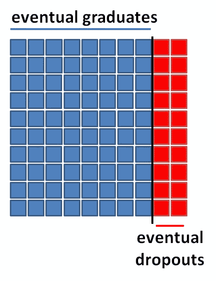
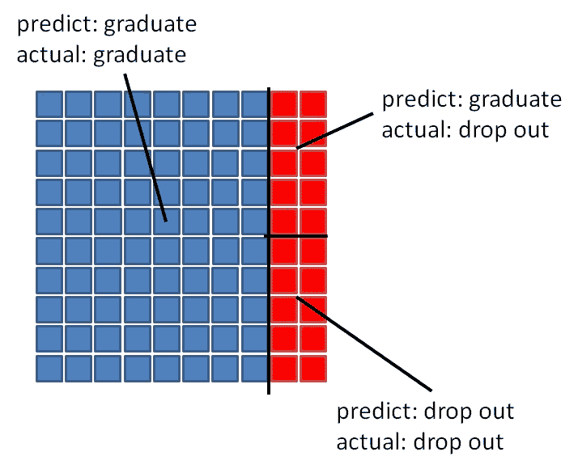
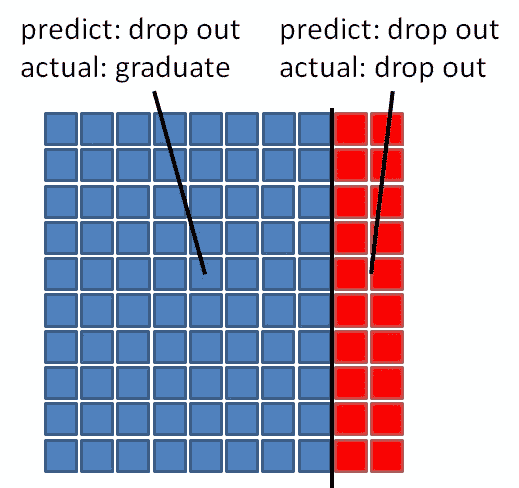
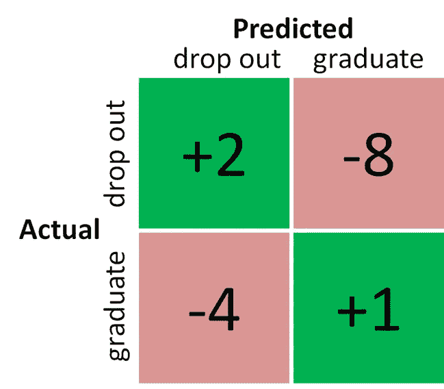

# 精确与回忆中人的一面

> 原文：<https://towardsdatascience.com/the-human-side-of-precision-vs-recall-36391f9d25e4?source=collection_archive---------23----------------------->

Photo by [Charles DeLoye](https://unsplash.com/@charlesdeloye?utm_source=medium&utm_medium=referral) on [Unsplash](https://unsplash.com?utm_source=medium&utm_medium=referral)

作为数据科学家，我们花费大量时间思考各种数据转换、模型和评估标准的**数学含义**。但是，可悲的是，要了解我们的选择对**真正的潜在人类**的影响要难得多。

我认为这在很大程度上要归咎于最近关于定向广告如何可能**操纵某人的精神状态**或者善意的算法如何可能最终**对整个种族群体产生偏见**的担忧。

Photo by [Con Karampelas](https://unsplash.com/@conkarampelas?utm_source=medium&utm_medium=referral) on [Unsplash](https://unsplash.com?utm_source=medium&utm_medium=referral)

但是，我不想在这篇文章中谈论任何如此宽泛的东西；相反，我想把它带回家，谈谈我从事的一个数据科学项目，以及它如何让我思考我的选择对实际人类的影响。

## 一个学生会退学吗？

几年前我从事的一个项目主要是预测一个本科生是否会放弃他或她当前的学术专业。

想象一下，你是一个学术部门的首席顾问，你有一个*【非常准确】*的系统供你使用。你将能够**生成一份最有可能从你的系里退学的学生的名单**，然后**通过延长辅导支持、帮助选课或者仅仅是给这些学生一个表达他们的挣扎的机会来采取行动**。

Photo by [Helloquence](https://unsplash.com/@helloquence?utm_source=medium&utm_medium=referral) on [Unsplash](https://unsplash.com?utm_source=medium&utm_medium=referral)

## 如何知道自己的模型是否“好”？

因此，我和我的团队一起工作，根据 15 年的学生数据建立了预测学生辍学的模型。最终，我们需要弄清楚任何给定的模型有多“好”，这样我们才能交付“最好的”模型。

通常在谈论数据科学中判断一个模型时，第一个出现的术语是**【precision】****【recall】**。

在学生辍学问题的背景下，

*   **精度**是实际上最终辍学的预测辍学比例
*   **回忆**是实际辍学者中被预测辍学者的比例

## 应该用精确还是回忆？

那么…我们应该用哪一个来评估我们的模型呢？为了回答这个问题，我们需要找出使用其中一种方法的缺陷。

这是设置。我们有 **100 个经济学专业**和 **20 个会继续从**专业退学，而另外的 **80 个会继续从**专业毕业。

此外，我们**只有足够 20 名学生的咨询会议**，所以我们最好让我们的预测算数！

## **使用精度**

假设我们的模型预测 100 个学生中有 10 个会辍学:

在这种情况下，*预测的 10 个退出者中，所有 10 个最终都将退出*，因此我们的精度是 10/10 = **100%** 。所以根据 precision，我们做得很好！对吗？

***嗯，不是真的……***

我们**只抓到了 20 个学生**中的 10 个会继续退学，**完全忽略了其中的 50%** 。

当我们看到*之外的*仅仅是高精度带来的数字和兴奋，并思考我们的结果对基础学生的实际意义时*，我们会更好地认识到精度本身可能不是我们的正确指标。*

## ***使用召回***

*那么，回忆当然是正确的标准了？*

*假设我们的模型碰巧预测到**所有 100 名学生**都会辍学！*

**

*那么，在这种情况下，*20 个实际上可能会辍学的学生中，我们正确地识别出了所有 20 个学生*，因此我们的召回率是 20/20 = **100%** ，看起来这个模型表现得非常好。*

*但是，显然这里有一个突出的问题。如果所有 100 名学生都被预测要辍学，那如何帮助我们分配那 20 次咨询会议？！*

## ***以人为本的模式评估方法***

*似乎我们都输了。单独使用*精度*有可能抓不到可能辍学的学生。而且，单独使用*回忆*有预测太多学生会辍学的风险。*

***让我们翻转心态。我们首先考虑数据科学，然后观察它对学生和部门的影响。***

*相反，让我们**站在系**的立场上，想想每个结果对学生的影响。*

*对于任何给定的学生，有四种可能的情况:*

1.  *这个学生将毕业，我们预测他们也将毕业*

> **这是个好结局！我们正确地认识到一个学生不需要稀缺的咨询资源。让我们以此为基线，在这些情况下* ***奖励 1 点*** *。**

*2.**这个学生会退学，我们预测他们也会退学:***

> **这样更好！因为我们的项目都是关于抓住辍学的学生，我们应该给这些案例更多的分数。让我们把这些情况下的* ***奖励 2 分*** *。**

*3.这个学生将会毕业，但是我们预测他们会退学*

> *这很糟糕，因为我们可能会把稀缺的咨询资源给这个学生，尽管他们并不需要。在这个过程中，我们潜在地从一个真正需要他们的学生那里拿走了咨询资源。让我们在这些情况下 ***扣除 4 分*** *。**

*4.**这个学生将会辍学，但我们预测他们会毕业:***

> *这可能是最糟糕的情况。我们不会给这个学生咨询资源，因为他们被标记为毕业，但实际上我们只是让他们无助，没有做任何事情来阻止他们辍学。让我们在这些情况下 ***扣除 8 分*** *。**

*我们可以在下面的**成本矩阵**中对此进行总结:*

**

> *****最高分*** *我们能拿到多少？嗯，如果我们正确识别所有 80 名最终毕业生* *(+1 乘以 80 = 80)和* ***正确识别所有 20 名最终辍学者*** *(+2 乘以 20 = 40)，则总分为****120****。***
> 
> ***最低分***我们能得到什么？嗯，如果我们将所有 80 名最终的毕业生* ***错误分类为*** *(-4 乘以 80 = -320)，将所有 20 名最终的辍学者* *(-8 乘以 20 = -160)，总分数为* ***-480******
> 
> ****既然我们的分数范围是从* ***-480 到 120*** *，我们就把* ***加 480 到所有分数*** *把这个范围映射到* ***0 到 600*** *这样我们就可以取百分比了。****

***本质上，我们已经抛弃了*固定的*性能指标，如精确度和召回率，并创建了我们自己的**上下文感知**成本函数，在我们想要的确切位置奖励和惩罚模型。***

***当然，调整成本矩阵中的精确数字是一门艺术，应该与所有相关方合作完成。***

## ***新指标的表现如何？***

***让我们来测试一下新的性能指标！***

***如果我们预测只有 10 名学生将会辍学，那么它会给出多少分呢？***

******

***嗯，我们正确地识别了所有 80 名最终毕业生(+1 乘以 80 = 80)，我们正确地识别了 10 名最终辍学者(+2 乘以 10 = 20)，我们错误地分类了 10 名最终辍学者(-8 乘以 10 = -80)，总得分为 20，加上 480，最终得分为 600 分中的 500 分或 83%。很好，但这种模式绝对有改进的空间。***

***再考一次！在我们预测每个人都会退出的情况下，新的指标会给出多少分？***

******

***我们正确地识别了所有 20 名最终辍学者(+2 乘以 20 = 40)，并且我们错误地将所有 80 名最终毕业者(-4 乘以 80 = -320)归类为总分-280，再加上 480，得到的**最终分数为 600 分中的 200 分或 33%** 。这…真的很糟糕，这是有道理的，因为从部门的角度来看，预测每个人都将退出是一个**可怕的策略**！***

***希望这一探索有助于展示为什么我们作为数据科学家，有时需要超越数字和统计数据。最终，我们正在解决的大多数问题都会影响到**真实的人**的生活。***

***难道这些人的经历不应该成为我们工作的一部分吗？***

******感谢阅读~******