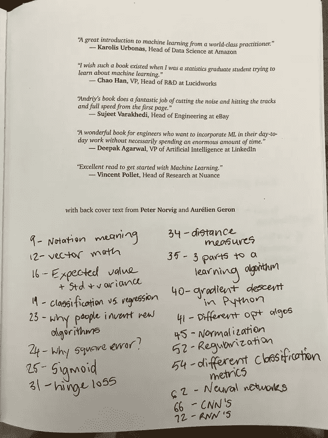

# 百页机器学习书籍书评

> 原文：<https://towardsdatascience.com/the-hundred-page-machine-learning-book-book-review-72b51c5ad083?source=collection_archive---------4----------------------->

## 机器学习的起点和终点。10 分钟 100 页。准备好了吗？

Photo by the author. Taken from the [video version of this article on YouTube](https://youtu.be/btLxTTkSZuY).

[百页机器学习书](http://bit.ly/100pageMLbook)是我开始学习机器学习时就希望拥有的书。你可以在一天内看完。这花了我不止一天的时间，但我还是熬过来了。我慢慢来。在突出的地方划线，在封面做笔记，我想重温的页面。完成它并不是重点。这本 100 页的机器学习书是一个参考，你可以不断回头去看。这也是我打算做的。

根据这本书和作者[安德烈·布尔科夫](https://www.linkedin.com/in/andriyburkov)的风格，我们将保持这篇文章简短扼要。

The pages I wanted to remember for later (most of them). And a typical page of notes.

# 你应该买这本书吗？

是的。但是你不需要。[你可以先看一下](http://themlbook.com/wiki/doku.php)。但是你应该买一本，拿着它，读它，把它放在你的咖啡桌上。然后当你的朋友问‘什么是机器学习？’，你就能告诉他们。

# 这本书是给谁的？

也许你正在学习数据科学。或者你听说过机器学习无处不在，你想了解它能做什么。或者你熟悉应用机器学习的工具，但你想确保你没有遗漏任何东西。

在过去的两年里，我一直在研究和实践机器学习。我建立了自己的[人工智能硕士学位](https://bit.ly/AIMastersDegree)，这导致我成为了一名[机器学习工程师](https://bit.ly/12thingsML)。这本书现在是我课程的一部分，但如果我刚开始的时候它就在外面，那它从一开始就应该在那里。

# 百页机器学习书我需要哪些前期知识？

了解一点数学、概率和统计知识将会有所帮助，但是这本 100 页的机器学习书籍已经写成了一种方式，你可以在学习过程中获得其中的大部分知识。

所以这个问题的答案仍然是开放的。我从一个机器学习工程师的角度来看，我知道一些事情，但学到了更多。

如果你没有机器学习的背景，这并不意味着你应该回避它。

我把它看作是机器学习的开始和继续。看一遍。如果没有意义，再读一遍。

# 为什么要读？

你看过标题，看过广告。机器学习，人工智能，数据，它们无处不在。通过阅读这篇文章，你已经与这些工具互动了几十次。机器学习用于向你在线推荐内容，它有助于维护你的手机电池，它为你上次航班使用的预订系统提供动力。

你不知道的事情看起来很可怕。媒体在将机器学习放入那些太难的桶中的一个方面做得很好。但是这本上百页的机器学习书改变了这一点。

现在，在一天的时间内，或者更长的时间，如果你像我一样，你将能够破译哪些标题你应该注意，哪些不应该。或者用机器学习的术语来说，从局部最小值到全局最小值——不要担心，这本书会涉及到这一点。

# 这本书会教你关于机器学习的一切吗？

号码

# 那它教什么呢？

什么管用。

这是最简单的描述方式。机器学习的领域非常广阔，因此传统书籍远远超过 100 页。

但是[上百页的机器学习书](http://bit.ly/100pageMLbook)涵盖了你应该知道的内容。

介绍了不同种类的机器学习。

监督学习，那种你有数据和数据标签的学习。例如，您的数据可能是一系列文章，标签可能是这些文章所属的类别。这是最常见的机器学习类型。

无监督学习或当你有数据但没有标签时。想想同样的文章，但是现在你不知道它们属于哪一类。

半监督学习就是你的一些文章有标签，而另一些没有。

强化学习包括教代理(计算机程序的另一种说法)根据规则和空间定义的反馈导航空间。一个计算机程序(代理)在棋盘(空间)中移动棋子(导航)并因获胜而获得奖励(反馈)就是一个很好的例子。

## 第 2 章——让数学再次变得伟大(一直如此)

第二章，深入探究你从高中起就没见过的希腊符号。任何机器学习资源附带的那些。一旦你知道它们的意思，阅读机器学习论文就不会那么可怕了。

你会发现这样的例子。

This sentence explains the notation of set, element of and intersection all with an example. Screenshot from [the book](http://bit.ly/100pageMLbook), annotations mine.

这种语言贯穿全书。许多技术术语用一两行文字来描述，毫不含糊。

什么是分类问题？

> 分类是自动给一个未标记的例子分配一个标签的问题。垃圾邮件检测是分类的一个著名例子。

什么是回归问题？

> 回归是在给定一个未标记的例子的情况下，预测一个实值标记(通常称为目标)的问题。根据房屋特征(如面积、卧室数量、位置等)估计房价估值是回归的一个著名例子。

我从书上拿了这些。

## 第 3 章和第 4 章——最好的机器学习算法是什么？为什么？

第 3 章和第 4 章展示了一些最强大的机器学习算法，以及是什么让它们成为学习算法。

您会发现线性回归、逻辑回归、决策树学习、支持向量机和 k 近邻的工作示例。

有大量的数学符号，但没有什么是你在第二章之后不具备的。

布尔科夫在建立理论，解释问题，然后为每种算法提出解决方案方面做得非常出色。

有了这个，你会开始明白为什么发明一个新的算法是一种罕见的做法。是因为现有的都很擅长自己做的事情。作为一名初露头角的机器学习工程师，你的任务是找出如何将它们应用于你的问题。

## 第 5 章—基本实践(1 级机器学习)

现在你已经看到了最有用的机器学习算法的例子，你如何应用它们呢？你如何衡量他们的有效性？如果他们工作得太好(过度合身)，你该怎么办？或者不够好(不合身)？

您将看到数据科学家或机器学习工程师花费了多少时间来确保数据准备好用于学习算法。

这是什么意思？

这意味着将数据转化为数字(计算机在其他方面做得不好)，处理缺失的数据(你不能在任何东西上学习)，确保所有数据都是相同的格式，合并不同的数据片段或删除它们以从你所拥有的东西中获得更多(特征工程)等等。

然后呢？

一旦你的数据准备好了，你就要选择正确的学习算法。不同的算法在不同的问题上效果更好。

这本书涵盖了这一点。

下一步是什么？

你评估你的学习算法学到了什么。这是你必须向他人传达的最重要的事情。

这通常意味着将数周的工作浓缩成一个指标。所以你要确保你做对了。

99.99%的准确率看起来不错。但是精度和召回率呢？或者 ROC 曲线下面积(AUC)？有时候这些更重要。第 5 章的后端解释了原因。

## 第 6 章—风靡全球的机器学习范式、神经网络和深度学习

你看过照片了。[旁边有深度学习神经网络的大脑图像](https://www.researchgate.net/figure/Model-of-a-human-brain-cell-neuron-A-and-an-artificial-neuron-B-used-in-Artificial_fig21_314761683)。一些人说他们试图模仿大脑，另一些人则认为没有关系。

重要的是你如何使用它们，它们实际上是由什么组成的，而不是它们是由什么组成的。

神经网络是线性和非线性函数的组合。直线和非直线。使用这种组合，你可以绘制(建模)任何东西。

这本一百页的机器学习书籍讲述了神经网络和深度学习最有用的例子，如前馈神经网络、卷积神经网络(通常用于图像)和递归神经网络(通常用于序列，如文章中的单词或歌曲中的音符)。

深度学习就是你通常会听到的人工智能。但是读完这本书，你会意识到它是人工智能，也是你在前几章学到的不同数学函数的组合。

## 第 7 章和第 8 章——运用你所学到的知识

现在你已经得到了所有这些工具，你应该如何以及何时使用它们呢？

如果你有文章，你需要一个算法来为你标记，你应该使用哪一个？

如果你只有两类文章，体育和新闻，你就遇到了二元问题。如果你有更多，体育，新闻，政治，科学，你有一个多类分类问题。

如果一篇文章可以有多个标签会怎样？一个关于科学和经济。那是一个多标签的问题。

把你的文章从英语翻译成西班牙语怎么样？这是一个序列对序列的问题，一个英语单词序列对一个西班牙语单词序列。

第 7 章涵盖了这些以及集成学习(使用一个以上的模型来预测同一件事)，回归问题，一次性学习，半监督学习等等。

好吧。

所以你已经对什么时候可以使用什么算法有了一点了解。接下来会发生什么？

第八章深入探讨了你将会遇到的一些挑战和技巧。

不平衡类是一个标签有更多数据而另一个标签没有足够数据的挑战。想想我们的文章问题但是这次我们有 1000 篇体育文章，只有 10 篇科学文章。你在这里应该做什么？

人多力量大吗？将试图预测同一事物的模型结合起来可以得到更好的结果。做这件事的最好方法是什么？

如果你的一个模型已经知道了一些东西，你如何在另一个模型中使用它？这种做法被称为迁移学习。你可能会一直这样做。把你在一个领域所知道的东西用在另一个领域。迁移学习做同样的事情，但是使用神经网络。如果你的神经网络知道维基百科文章中的单词出现的顺序，是否可以用来帮助对你的文章进行分类？

如果一个模型有多个输入，比如文本和图像，会怎么样？或者多个输出，比如你的目标是否出现在图像中(二进制分类)，如果出现，在哪里(坐标)？

这本书涵盖了这些。

## 第 9 和 10 章——无标签学习和其他形式的学习

无监督学习就是你的数据没有标签。这是一个困难的问题，因为你没有一个基本事实来判断你的模型。

这本书着眼于处理未标记数据的两种方法，密度估计和聚类。

密度估计试图指定一个样本落在一个数值范围内的概率，而不是取一个单一的值。

聚类的目的是将相似的样本分组在一起。例如，如果你有未标记的文章，你会期望体育文章比科学文章更紧密地聚集在一起(一旦它们被转换成数字)。

即使你有标签，你将面临的另一个问题是有太多的变量供模型学习，而没有足够的样本。解决这个问题的实践被称为降维。换句话说，减少模型需要学习的东西的数量，但仍然保持数据的质量。

要做到这一点，你将看到使用主成分分析(PCA)，统一流形近似和投影(UMAP)或自动编码器。

这些听起来很吓人，但是你已经在前几章中为理解它们打下了基础。

倒数第二章通过其他形式的学习，如学习排名。比如谷歌用来返回搜索结果的东西。

学会推荐，就像媒体用什么来推荐你读的文章。

和自我监督学习，在单词嵌入的情况下，通过算法读取文本并记住哪些单词出现在其他单词面前来创建单词嵌入。它是自我监督的，因为相邻单词的出现就是标签。例如， *dog* 比 *car* 更有可能出现在带有*宠物*的句子中。

# 不断给予的书:伴随的维基

上百页的机器学习书上贴满了二维码。对于那些课外活动，二维码链接到每章的附带文件。额外的材料包括代码示例、论文和参考资料，您可以在其中更深入地研究。

An example of a QR code in the book and what it leads to.

最好的事？

布尔科夫自己用新材料更新维基。进一步复合**从这里开始并在这里继续进行机器学习**标签。

# 它不包括什么？

机器学习的一切。那些书有 1000 多页。但是上面的主题足以让你开始并坚持下去。

## 第 11 章——什么没有被覆盖

书中没有深入讨论的主题是那些尚未在实际环境中证明有效的主题(并不意味着它们不能有效)，没有上述技术那样广泛，或者仍在大量研究中。

这些方法包括强化学习、主题建模、生成对抗网络(GANs)和其他一些方法。

# 结论

这篇文章开头太长了。我回去把多余的部分删掉了。布尔科夫启发了我。

如果你想开始机器学习，或者如果你像我一样是一名机器学习实践者，你想确保你正在实践的东西与有效的东西一致。[获得百页机器学习书](http://bit.ly/100pageMLbook)。

看完，买了，重读。

你可以在 YouTube 上找到这篇文章的[视频版本。否则，如果你有任何其他问题，](https://youtu.be/btLxTTkSZuY)[随时联系](http://twitter.com/mrdbourke)或[注册更新我的作品](http://mrdbourke.com/newsletter)。