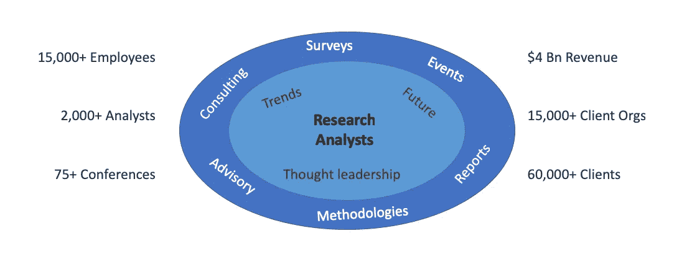
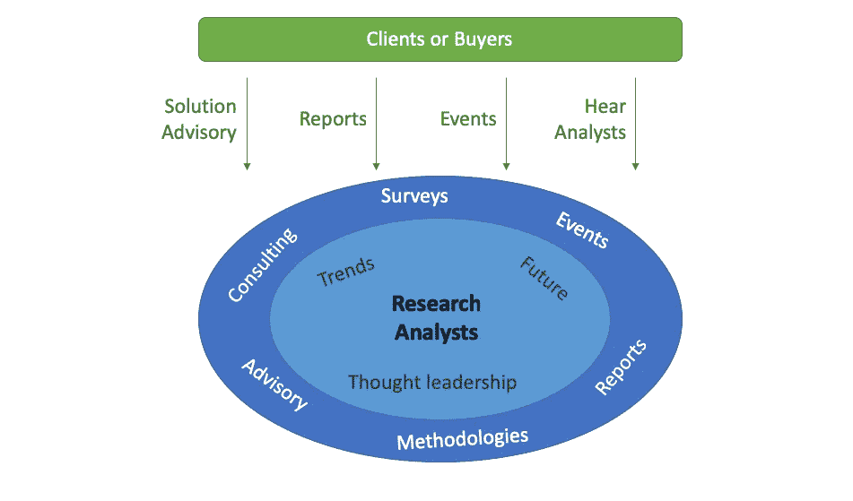
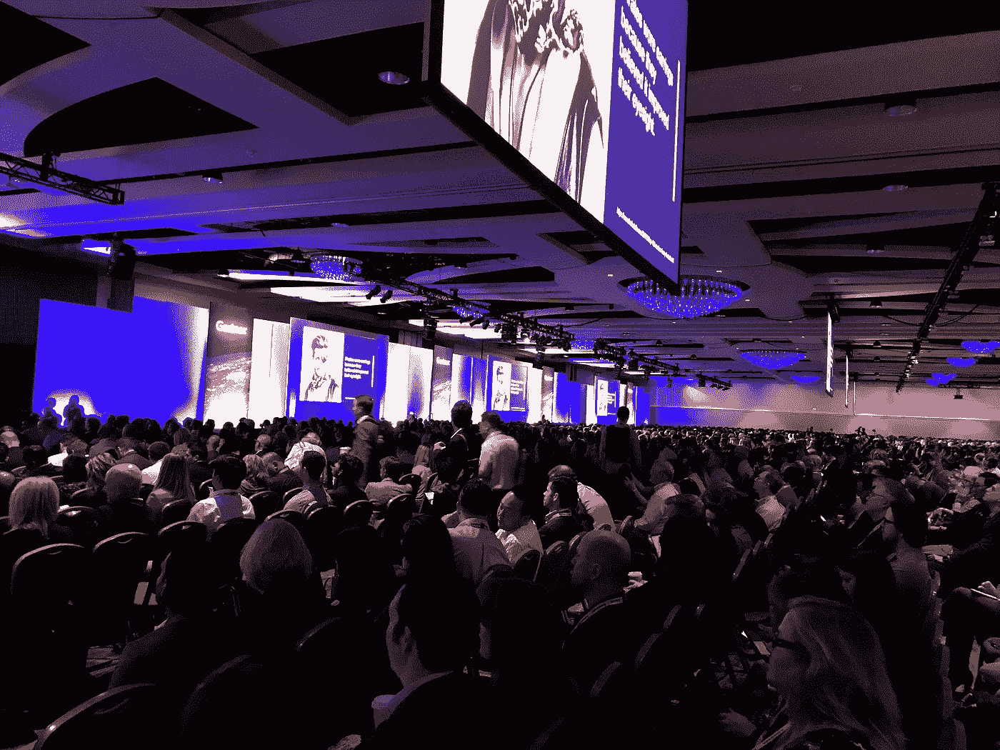
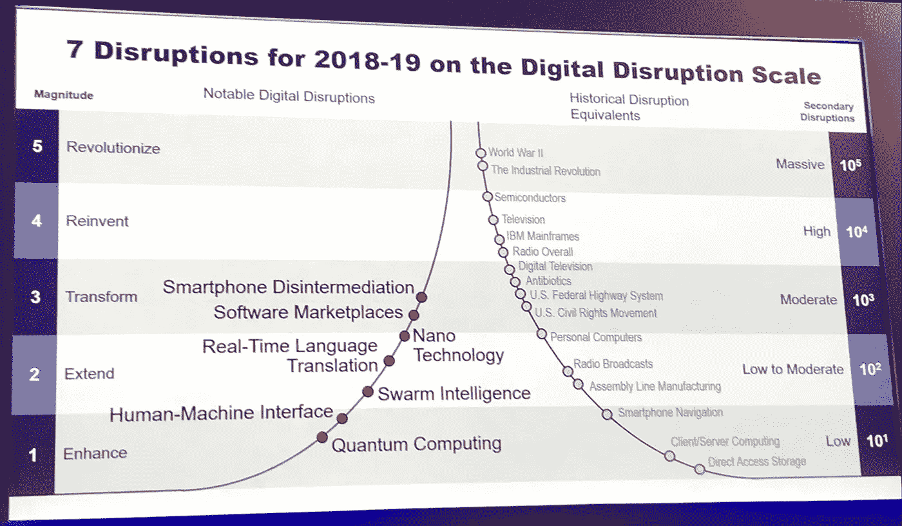
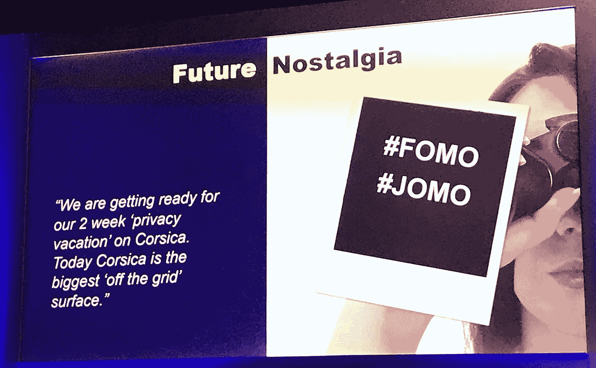
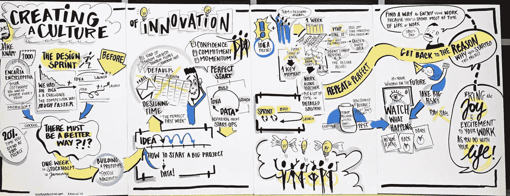

# 魔力象限、酷供应商和困惑客户的炒作循环

> 原文：<https://towardsdatascience.com/the-hype-cycle-of-magic-quadrants-cool-vendors-and-confused-clients-b8773d64538c?source=collection_archive---------16----------------------->

Photo by [Tom Roberts](https://unsplash.com/photos/zDiBoBByRXw?utm_source=unsplash&utm_medium=referral&utm_content=creditCopyText) on [Unsplash](https://unsplash.com/?utm_source=unsplash&utm_medium=referral&utm_content=creditCopyText)

## 对 Gartner 及其最近的分析峰会的综述

这几天都在下 AI 大会。如果你不知道该去参加哪一个，不知道该如何看待这些宣传，你并不孤单。它需要认真努力来识别有实质内容的事件，然后将营销言论与行业情报分开，最后将学到的东西付诸行动。

本月早些时候，我参加了在奥兰多举行的高德纳数据与分析峰会。超过 3000 人聚集在一起，在 5 天内进行了 150 多次会议，能量水平是显而易见的。从 111 家供应商、研讨会和 100 多名研究分析师的一对一展示中，这听起来更疯狂。

在这篇文章中，我将尝试解开 Gartner 精心构建的这个神秘的生态系统。我们将会看到为什么买家高度重视它们，以及是什么让卖家不择手段地在其中占有一席之地。我将概括介绍他们的分析会议和讨论的主要行业趋势。

## Gartner，对于外行来说

[Gartner](https://en.wikipedia.org/wiki/Gartner) 涉足研究和咨询领域，广泛涉足技术&行业垂直领域。15，000 多名员工为 12，000 多名客户提供服务，没有多少人意识到这家发布“*炒作周期*”和“*幻方图*”的公司是一家 40 亿美元的巨头，在[收入](https://www.forbes.com/global2000/list/10/#header:revenue)方面与纳斯达克或法拉利相当。

根据 Gartner 的年度报告[和](http://www.annualreports.com/HostedData/AnnualReports/PDF/NYSE_IT_2017.PDF)，Gartner 的三大关键业务线是:

*   [**研究**](https://www.gartner.com/en/research/methodologies/methodologies) **:** 占收入约 75%的主要产品，包括 Gartner 的所有优秀产品——幻方图、炒作周期、优秀供应商、市场指南和研究报告。
*   [**咨询**](https://www.gartner.com/en/consulting) **:** 这包括他们为客户提供的定制解决方案，包括战略、基准和购买决策。
*   [**事件**](https://www.gartner.com/en/conferences/calendar) **:** 在世界各地举办的 70+会议，包括 Gartner Symposium/ITxpo 和 Gartner Analytics Summit 等热门会议。

虽然这本身听起来可能不寻常，但 Gartner 将所有这些产品编织在一起并与市场建立强有力的相互依赖关系的方式是非凡的。接下来我们将深入了解他们的超能力是什么。

## Gartner 对生态系统的神奇掌控

研究和内容是推动 Gartner 引擎的战略资产。分析师显然是这个系统的核心，他们得到大量分析和市场研究的帮助。咨询和活动的其他两个产品依赖于此，并兼作销售研究产品的渠道。

The Gartner Engine

将上述标准商业模式转变为高效飞轮的是买方(购买软件和服务的企业)和卖方(产品、平台和咨询公司)的加入。

鉴于 Gartner 已经建立的品牌，客户纷纷向他们寻求战略技术决策方面的建议。他们邀请分析师来讨论困扰他们业务的问题。他们购买研究报告，并参与他们的活动，学习如何实施转型计划。

这种战略层面的建议让 Gartner 对资金的流向产生了巨大的影响。Gartner 积极推荐供应商供客户考虑，并分享如何评估他们的指导方针。对于供应商来说，这使得 Gartner 成为一股不可忽视的力量。

Gartner and the Clients (such as Organizations buying analytics or other technology)

Gartner 积极拉拢供应商，承诺他们可以先睹为快，了解企业真正想要的是什么。供应商很乐意排队等待 Gartner 的服务，以吸引分析师并向他们简要介绍自己的产品。他们花钱学习如何更好地销售，他们购买研究报告，参加活动会见客户。

获得分析师的关注增加了供应商出现在报告中的机会。大多数营销团队都渴望在魔力象限中被提及。因此，供应商通过分享他们的案例研究和客户参考来争夺这个位置。

Gartner, Clients and Vendors (such as Organizations selling tech products, platforms or services)

虽然客户和供应商付费与 Gartner 交谈，但每一次这样的交谈也丰富了分析师独特的行业情报。这被吸收并作为思想领导流回到研究报告和陈述中，并由相同的团体支付费用。信息就是财富，我们可以看到智能递归循环是如何构建到系统中的。

所有这些都协同工作，因为 Gartner 获得了最有价值的资产，网络效应。随着市场的增长，Gartner 的地位只会上升。这种网络效应是新玩家的进入壁垒，赢家通吃，就像脸书、Instagram 或 LinkedIn 的社交网络一样。

由于各方都在为获得 Gartner 的关注而付费，公平与利益冲突之间只有一线之隔。虽然有一些反对的声音，但是到目前为止，Gartner 似乎把 T2、T4 管理得很好。任何盈利性企业的激进增长目标都会分散注意力。Gartner 的可信度很高，事情的结果如何还有待观察。

## 奥兰多 Gartner 峰会的真知灼见

People assembled for the Gartner Opening Keynote at Orlando

现在谈谈最近在奥兰多举行的分析峰会。8 个[赛道](https://www.gartner.com/en/conferences/na/data-analytics-us/agenda)跨越数据的所有方面——治理、工程、可视化、机器学习、领导力和战略，每个人都有自己的东西。

与所有其他活动的最大不同是，除了供应商赞助的讲座和嘉宾主题演讲之外，这里的每场会议都由 Gartner 分析师主持。这些会议很像 Gartner 研究报告，精心包装的市场总结提供了 2-5 年内 30，000 英尺的前景和趋势。

有着最高的供应商参与度，100 多个展品展示了行业提供的各种数据科学产品和平台，所有选项都在一个屋檐下。然而，参观者冒着听到人工智能、数字化转型和见解等流行词汇反复出现的风险！

在此次活动的几个要点中，我为本文挑选了 3 个:

## 1.蓄意破坏:你可能看不到的 7 种数字破坏

The 7 Digital Disruptions to watch out for (trends shown on the line, to the left; examples are on the right)

Daryl Plummer[主持的这个会议很有见地，令人愉快。业务一直在被打乱，今天的许多巨头很快就会被赶下台。这次会议为领导者们提供了一个框架，让他们拥抱故意的破坏，抢先控制市场力量。他涵盖了 7 大趋势(见图片)，预计将在中长期内实现。](https://twitter.com/DarylPlummer)

## 2.数字乌托邦 2035——未来一瞥

Digitopia 2035 Trends: Will we soon rejoice in the ‘Joy Of Missing Out’, and splurge on privacy vacations?

Gartner 去年启动了“ [Digitopia](https://blogs.gartner.com/frank-buytendijk/2018/06/19/digitopia-be-part-of-defining-our-future-digitalsociety/) ”项目，来自 25 个国家的志愿者贡献了他们对 2035 年生活的看法的短篇故事。结合这些关于希望和渴望的故事以及对数字趋势的推断， [Frank Buytendijk](https://twitter.com/FrankBuytendijk) 对世界的发展方向进行了尝试。查看[这个](https://twitter.com/kesaritweets/status/1108089941681233920)，获得一些真知灼见，以及我们如何扮演务实的未来主义者的角色。

## 3.**用**设计冲刺创造创新文化

Sketchnote of the session by Jake Knapp

[杰克·纳普](https://twitter.com/jakek)是设计冲刺的创造者，也是 NYT 畅销书《冲刺[T11》的作者。从他在 Encarta Encyclopaedia 担任产品设计师和在谷歌设计一系列产品的日子里，他展示了创新和快速实验的新方法是如何有所帮助的。听他充满活力、令人捧腹的讲话很有趣。下面是他的](https://www.amazon.com/Sprint-Solve-Problems-Test-Ideas/dp/1442397683)[网站](https://jakeknapp.com)和类似的[演讲视频](https://vimeo.com/233941079)。

## 摘要

最后，Gartner 峰会提供了数据科学领域的鸟瞰图。这些会议通过对未来的长期展望，揭开了最新流行语的神秘面纱。这是一个与全国各地的数据从业者以及几乎所有参与竞争的供应商建立联系的好机会。

我参加这个活动已经有几年了，我倾向于同意一个参加者的观点，他已经习惯了每隔一年跳过这个活动的完美节奏。他的推理是，最大的收获是大趋势，它们不会每年都变！