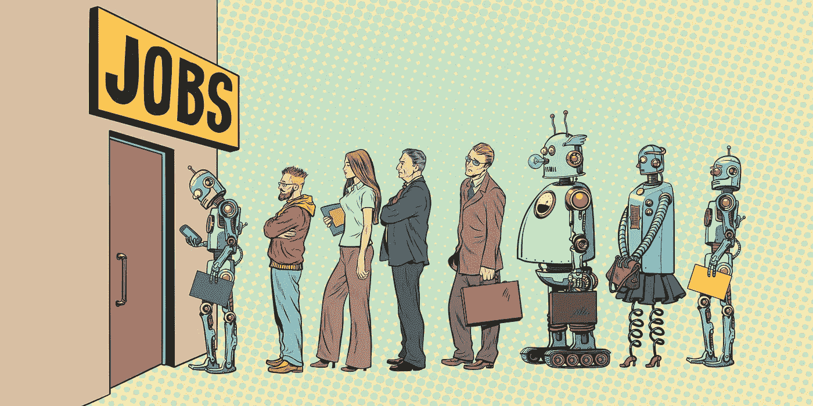

# 人工智能对不平等、工作自动化和未来技能的影响。

> 原文：<https://towardsdatascience.com/the-impact-of-ai-on-inequality-job-automation-and-skills-of-the-future-fe89c21e34bc?source=collection_archive---------6----------------------->

## 未来学家和纽约时报畅销书作家马丁·福特对工作自动化，一般基本收入，以及获得哪些技能为急剧变化的未来做准备。

Amazon.com

马丁·福特，*《纽约时报》*[*畅销书作者《机器人的崛起:技术和失业未来的威胁》*](https://en.wikipedia.org/wiki/Rise_of_the_Robots:_Technology_and_the_Threat_of_a_Jobless_Future) 是一个长期主张一般基本收入的人。他 2017 年的 Ted 演讲点击量超过了 200 万次。在接下来的采访中，他分享了他对未来几年的担忧和预测。

> 我认为这是绝对正确的，任何人都可以为我们面临的未来学习的最重要的技能是如何保持学习，如何适应，以及如何非常有效地和愉快地做到这一点。

你能简单介绍一下你的背景吗？

我是一名未来学家和作家，至少到目前为止，我关注的是人工智能对社会和经济的影响。

我写了一本书，名为[“机器人的崛起:技术和失业未来的威胁”，](https://www.amazon.com/Rise-Robots-Technology-Threat-Jobless/dp/0465097537)这本书关注的是这样一个事实，我确实认为很多工作自动化和简单消失有巨大的潜力。

> 此外，不平等可能会大大增加，因为人工智能的本质是资本正在取代劳动力，当然资本由极少数人拥有；富人倾向于拥有大量资本，而大多数其他人并不拥有太多。随着时间的推移，它使我们整个社会更加不平等。我认为这将是我们未来几十年的真正挑战。

**能否详细说明一下连接自动化和不等式？**

基本的现实是，地球上绝大多数人实际上只有一样东西是有价值的，那就是他们劳动的价值。即使在像美国这样显然非常富裕的国家，绝大多数人也没有多少财产。拥有足够的资本来维持生活的人很少，因此他们不必工作，如果你放眼整个世界，这个数字就更少了。

大多数人依赖于他们劳动力的价值，而随着人工智能和机器人技术的进步，将会发生的事情是，许多劳动力将被贬值，这些劳动力根本不会有那么多价值，因为技术将能够做许多日常的、重复的、可预测类型的工作和任务，而这些工作和任务现在是有偿的。

也许在 10 年或 15 年内，将会很明显会发生什么，这将是我们社会的一个巨大挑战，就如何构建我们的经济和改变周围的事情来说，这样我们才能在那个世界上继续繁荣。

10 到 15 年对未来来说并不遥远。是什么让你确定进步正以如此快的速度发生？

10 到 15 年只是一个猜测，事实证明可能需要更长的时间。主要的一点是，我认为这是不可避免的，不管是 10 年、20 年还是 30 年，都没有太大关系。最终，这是我们不得不面对的问题。

> 我确实相信，我们正处于一个转折点，或者说是一个事情将以不同方式运作的时刻。

在过去，许多工作已经实现了自动化，但它们往往是更多的手工工作和体力劳动类型的工作，或者是那种你站在装配线上反复做同样事情的工作，或者是非常狭窄的计算工作，例如计算数字。但是我们现在看到的是这项技术更加广泛，它开始取代认知能力甚至智力能力。

我们已经有了做出决策和解决问题的学习机器，这将最终影响许多白领工作，当然还有更多日常工作，例如反复创建同一种报告或同一种定量分析的办公室工作人员。所有这些肯定会越来越容易受到自动化的影响，蓝领工作也是如此，需要更多的灵活性或更多的视觉感知。这些工作也越来越受到影响。

关键是越来越多的工作会受到影响。当然，会有新的工作岗位产生。这是人们总是会指出的一件事。

这是真的，但问题是会有多少新的工作，这些新的工作真的会很好地匹配那些需要工作的人吗？因为如果你创造的所有新工作都是给机器人工程师、人工智能研究人员和数据科学家的，那么在大多数情况下，这些工作不是现在卖汉堡包或开出租车的人能做的。这确实产生了一个问题。

**你是一般基本收入的倡导者。为什么这是一个解决方案？**

我提倡基本收入的原因是，我已经看到了解决这个问题的各种方法，但是没有多少。我的意思是，你实际上在谈论一个没有足够工作可做的世界，或者至少某些特定技能水平的人群将很难在经济中立足。机会根本不存在。

在这种情况下，你真的想不出多少解决办法。我认为基本收入是最简单和最直接的方法。

这个想法是保证每个人至少有最低限度的无条件收入。我见过的大多数提议最多是每月 1000 美元或 1000 欧元，大约在这个范围内。芬兰曾有过一个实验，后来被终止了，但我想只有 600 欧元。这是一个相当低的数额，这真的不是一个会让人呆在家里玩电子游戏的数额。

这个想法是给人们最低的收入，但你不能破坏他们做更多的激励。所以这个想法是，人们会得到那份收入，但如果他们能找到的话，他们仍然可能做兼职，或者如果他们足够幸运找到全职工作，他们甚至可能做全职工作，或者他们可能出去做一些创业，也许创办一个小企业来增加他们的收入。

> 我们的想法是创造一个世界，在这个世界里，你可以保持激励，让每个人都尽可能地多产。

我认为这有很多值得推荐的地方，因为如果你看看我们现在存在的安全网，特别是在一些欧洲国家，比如斯堪的纳维亚，对不工作的人来说有相当多的福利。但是一旦你开始工作，你就失去了这些好处。这就产生了去做任何事情的抑制因素，真正采取主动去做任何事情，这是一个问题。基本收入的优势在于，你给人们最低的收入，他们仍有希望尽可能多地外出工作。你没有人只是坐在家里，不工作，这造成了许多社会问题。

> 我们为人们创造东西非常重要，这样人们才能继续保持参与感。他们继续觉得自己在为某件事做贡献。这些都是重要的问题。仅仅给人们钱并不是一个充分的解决办法。我们从过去人们对这些项目的反应中了解到这一点。

计算机已经在某些复杂的游戏中表现得更好，比如国际象棋和围棋，而从业者现在正在使用人工智能来进一步提高它们在这些游戏中的表现。换句话说，他们使用人工智能来增强他们的技能和爱好。

我想那是对的。艺术是另一个领域。你可能会看到很多人成为艺术家，这在当今世界很难。有很多挨饿的艺术家。以这种方式谋生很难，但如果你有一个普遍的基本收入，许多人可以做他们热爱的事情和他们真正强烈感受到的事情，即使这些可能不是市场真正重视的事情。

> 你将为人们提供一种可能性，让他们把兴趣爱好变成他们想专注的事情，或者成为小企业，这些小企业本身不会产生足够的收入供人们生存，但也许与基本收入相结合，将提供各种可能性。

我还建议，我们甚至可以更进一步，将直接激励纳入基本收入，也许不是付给每个人完全相同的金额，但如果你真的做了一些有成效的事情；例如，成为一名艺术家，在社区工作，帮助人们，或者创办一家小企业，做一些有成效的事情，相比于你真的只是呆在家里，坐在椅子上玩视频游戏，什么都不做，你会得到更多一点的报酬。

人们可以利用这一机会来扩大他们的视野，而不仅仅是退出社会，有一个非常不健康的观点。

一个人如何为这样的未来做准备？

> 有几个层面，在宏观层面上，意识到这一点，并与其他人交谈，参与对话。确保你考虑到这一点，以及最终这将成为我们政治的一部分的事实。我们将制定公共政策来解决这个问题。

我认为，对于人们来说，有一个开放的思维，并帮助进行关于这些技术对我们的社会意味着什么的讨论，这真的很重要。从更个人的角度来看，比如确保我的工作不会消失，或者我的孩子应该在学校学些什么…

> 我认为最好的建议是，总的来说，我们可以说，技术真的会对工作产生重大影响，这些工作是可预测的事情，例行公事和重复的任务，你来工作，一次又一次地做同样的事情。

你想远离这些事情，相反，你想做更有创造性的事情，可能涉及许多复杂的交互和与其他人建立关系的事情，因为这些事情现在机器不擅长。很可能，在我们能够制造机器来做这些事情之前，还有很长一段时间，另一个领域将是技术贸易类型的工作，如电工、水管工，这些工作需要大量的灵活性和机动性以及不可预测的环境。我们不能制造一个机器人来做电工、水管工或护士做的事情，因为这些工作确实需要跑来跑去，处理各种不可预知的事情。这类工作是目前人们最安全的工作。就你未来的职业或你正在做的事情而言，你想让自己适应那种工作。

> 你的孩子在学校关注的也是同样的事情；你不希望他们被训练去做一些常规的可预测的工作，因为那可能会受到威胁。这是在更直接的个人基础上给人们的最好的建议。

那意味着教育系统必须彻底重组。这并没有真正发生，旧的教学方式仍然盛行。

教育很难解决。我认为，这些技术中有很多 prom，在线教育将融入人工智能，例如，真正个性化和定制化的结构化学习计划。你可以很便宜地上网，利用这些技术接受教育。这是非常积极的一件事。

我认为这是绝对正确的，任何人都可以为我们面临的未来学习的最重要的技能是如何保持学习，如何适应，如何在你的一生中继续学习，并且非常有效地学习，如何真正享受学习的乐趣；去热爱学习。

我想对我的孩子来说，我会说这是我想灌输给他们的未来的最重要的技能。当然，如果你现在有小孩，没有人能真正想象到他们成年或进入职业生涯时这个世界会是什么样子。

> 我们能做的最好的事情就是确保他们有工具来适应一个变化越来越快的未来。

**如果你现在可以做一件事，结构调整，比如从经济角度来看，你可以在很短的时间内重组经济体系或者改变教育体系，你会怎么做？你会从哪里开始？**

如果我有权力，我会让我们至少从某种最低基本收入开始，它可能很低，每月可能只有 200 欧元，但这只是一个开始，将该计划付诸实施，以便在未来它可以扩展，支付的金额可以随着这一进程的发展而增加，因为有许多关于基本收入的论点，甚至抛开所有这些关于技术影响的猜测。多年来，一直有人主张基本收入只是解决贫困和某种程度上的不平等的一种方式，并真正使我们的系统更具功能性。

我认为这是有充分理由的。我真的很想把这个想法说出来。我再次认为，如果这就是我们能够在政治上处理的所有事情，那么最初在一个非常低的水平上这样做是很好的，但最终我认为这对于未来是一个非常重要的想法。尽管这在政治上极具挑战性，但重要的是开始讨论，如果可能的话尽快实施。

**你如何定义人工智能？许多人认为人工智能是一种即将超越世界的终结者技术，包括意识和自我意识的概念。你认为这是你正在画的未来的先决条件吗？**

人们担心的那种科幻小说的东西肯定不是我担心的工作自动化的先决条件。我是说人工智能是一个连续体。今天存在的所有人工智能都是我们所谓的狭义或专门的人工智能，所以它没有接近人类思考的方式，也不会以任何方式通过拥有自己的意志或类似的东西来威胁我们。我认为我们还没有接近那个目标。

尽管如此，能够以超人的能力做特定事情的人工智能将威胁到许多工作，因为人也做特定的事情。

这就是亚当·斯密关于分工的全部观点。许多工作都是专业化的，它们将受到这种专业化人工智能的影响。

尽管如此，这是一个值得思考的迷人话题，如果在未来的某个时候，我们真的可以建造一个真正的思考机器，可以在人类的水平上思考，而且绝对有人在研究这个问题，人们已经提出了对机器的担忧，这些机器最终可能会比我们更聪明，等等。

> 这些并不是我们应该一笑置之的愚蠢担忧，但我们应该明白，那是遥远的未来，可能是因为这个原因，而不是我们应该关注的事情。现在还有其他更实际的事情，将在未来 10 年或 20 年内发生。

你目前在做什么，有什么新项目即将推出吗？

在进行这次采访的同时，马丁出版了一本新书，就人工智能的现在和未来采访了世界领先的人工智能专家。这本书叫做[《智能建筑师:来自建造它的人们的关于人工智能的真相》。](https://www.amazon.com/Architects-Intelligence-truth-people-building-ebook/dp/B07H8L8T2J/ref=sr_1_1?keywords=martin+ford&qid=1555196944&s=books&sr=1-1)

喜欢这篇文章吗？在这里，我们分享我们在 [Omdena](https://omdena.com/) 通过社区协作构建人工智能解决方案的经验。

 [## 成功构建人工智能解决方案的三点经验

### 我们从与来自 56 个国家和领先组织的 400 多名人工智能工程师在一些…

medium.com](https://medium.com/omdena/three-learnings-to-build-your-ai-for-good-solutions-successfully-374dea7b6cb)