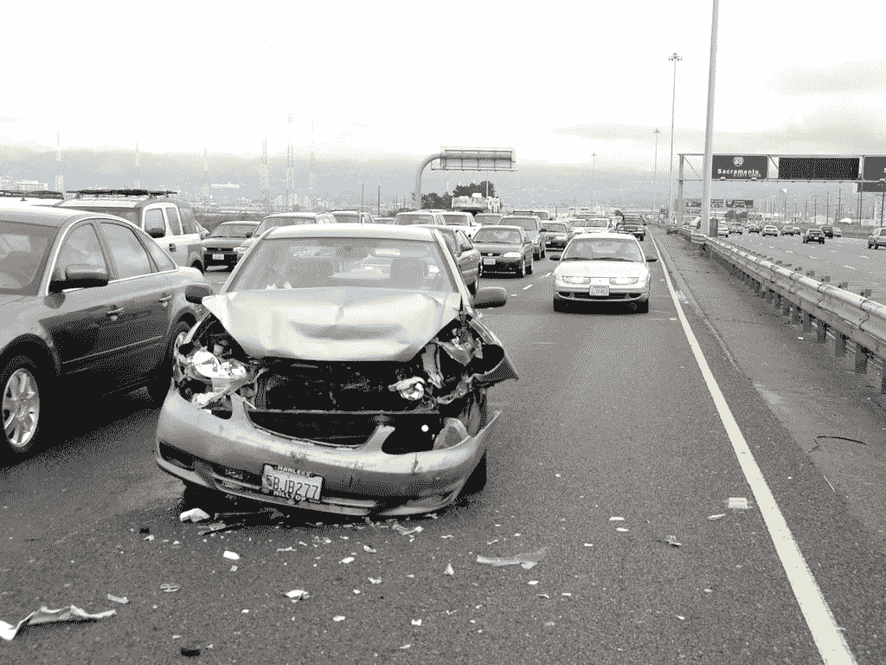
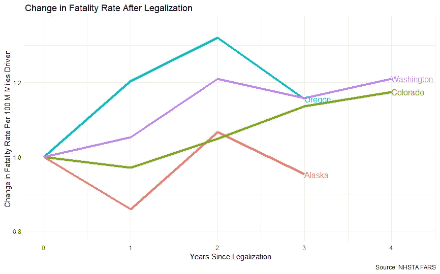
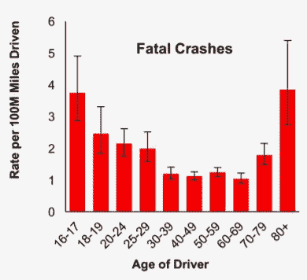
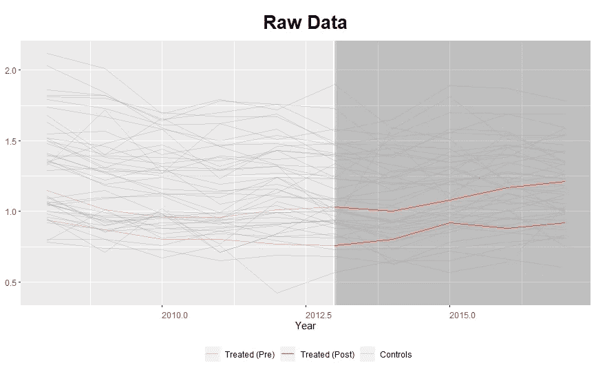
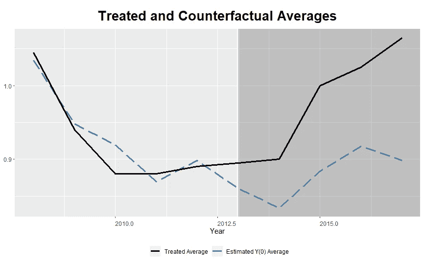
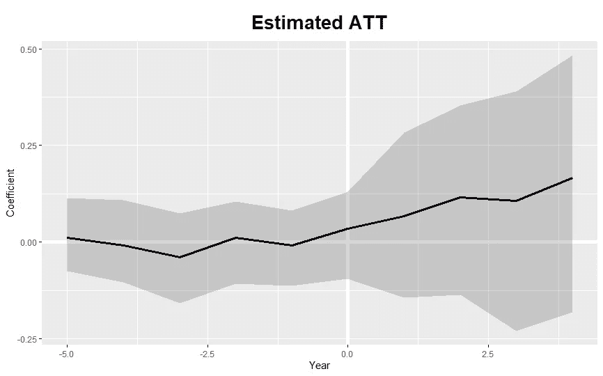

# 大麻合法化对交通死亡的影响:一种综合控制方法

> 原文：<https://towardsdatascience.com/the-impact-of-marijuana-legalization-on-traffic-deaths-a-synthetic-control-approach-420a36c5e8eb?source=collection_archive---------24----------------------->

Image by [Jess Liotta](https://www.flickr.com/photos/veraciousjess/459456664) on [flickr](https://www.flickr.com/photos/veraciousjess/459456664)

随着大麻合法化的兴起，关于交通死亡和碰撞的潜在影响的问题也越来越多。在这里，我们将使用综合控制方法(SCM)进行分析，以确定大麻合法化对驾驶死亡率的影响。

## 选定样本

迄今为止，已有 11 个州投票赞成娱乐性大麻合法化。一些州仍在等待全面立法的实施或合法化，时间太短，无法收集足够的数据。考虑到这一点，我们有几个可以分析的状态:

1.  阿拉斯加
2.  科罗拉多州
3.  俄勒冈州
4.  华盛顿

在此分析中，我们将使用 NHTSA 使用的死亡率:每 1 亿英里行驶的死亡率。首先，我们可以看到自大麻合法化以来，所有 4 个州每 1 亿英里的死亡率。

四个州中有三个州的死亡率增加了——除了阿拉斯加。但是，要确定这些变量之间是否存在因果关系就比较困难了。要确定这一点需要更严格的分析。为简单起见，我只分析科罗拉多州和华盛顿州(最早将娱乐用大麻合法化的两个州)。这两个州都在 2014 年初将大麻合法化，为我们提供了最长的分析周期。

# 构建合成控件

这里建立因果关系的方法是综合控制法。在我们继续下一步之前，我们应该弄清楚将要使用的一些术语。“干预”或“治疗”是我们正在研究的事件的影响(在这种情况下，娱乐性大麻合法化)。“治疗组”是指接受干预的组。对于这种分析，它是科罗拉多州和华盛顿州。预测变量是能够影响因变量的变量。

从这里，我们能够解释什么是综合控制。综合控制可用于分析干预对因变量(本例中为交通死亡率)的影响。由于我们不太可能找到一个与科罗拉多州或华盛顿州具有非常相似特征(预测因素)的州，该州也经历了相似的干预前死亡率趋势，因此我们可以取许多不同州的权重来形成一个人工构建的相似州。这是一个合成控制。

为了构建这个，我们将遵循[麦克莱兰&高尔特(2017)](https://www.urban.org/sites/default/files/publication/89246/the_synthetic_control_method_as_a_tool_1.pdf) 中描述的流程的简化版本。这种方法的一个例子来自 [Abadie、Diamond 和 Hainmueller (2010)](https://economics.mit.edu/files/11859) ，他们制作了以下用于分析加州烟草销售的合成对照。

使用这种方法，他们能够估计出加州的新法律减少了多少烟草销售。在这个过程中，他们推广了单片机，用于未来的研究。我们将采用同样的方法来评估大麻合法化对我们所选各州交通死亡率的影响。

为了进行这个分析，我将对 R 使用 [gsynth 包。](https://cran.r-project.org/web/packages/gsynth/gsynth.pdf)

**识别因变量的预测值**

为了使这一分析易于理解，我将尝试把科罗拉多州和华盛顿州与在几个方面人口统计相似的州进行比较。第一个有趣的人口统计是年龄。

Source: B.C. Teft, AAA Foundation for Traffic Safety

[研究表明](https://aaafoundation.org/rates-motor-vehicle-crashes-injuries-deaths-relation-driver-age-united-states-2014-2015/)在 30-70 岁之间，致命车祸的风险相当低且稳定。30 岁以下和 70 岁以上的司机风险增加。因此，我们的变量必须考虑我们对年龄分布尾部感兴趣的事实——使用中位数或平均值可能不合适，因为他们更关心中心。

因此，我们的两个年龄变量预测值将是:

*   18-34 岁之间的人口比例

由于我的数据源中使用的箱，0-18 岁的人被分组在一起。所以，我选择忽略这个年龄段。

*   65 岁以上人口的比例

这个区间也是不完美的，但希望足够接近 70+的范围，因为我们有证据表明致命车祸的风险增加了。

我们感兴趣的第二个人口统计学是人口的男女比例。性别[已被证明](https://www.iihs.org/topics/fatality-statistics/detail/gender)在交通死亡方面有显著差异。我们的变量很简单:

*   男性占人口的百分比

这些变量的数据是从 2008 年至 2017 年的美国人口普查局收集的。虽然有许多其他相关的人口统计方面可以包括在内，我们将离开我们的模型在这里。

**识别可能的施主状态以合成控制状态**

在这个阶段，我们必须筛选潜在捐助国。我排除了几个州，因为在我们有数据的时期，他们也将大麻合法化。阿拉斯加、俄勒冈、马萨诸塞州和内华达州被排除为可能的捐赠州，因为它们至少在相关时期的一部分也经历了大麻合法化。波多黎各也不包括在内。

**选择预测权重**

在选择预测权重时，有几种可能的选择。首先是主观选择权重。第二种(也是传统的)方法是选择最小化均方预测误差(MSPE)的权重。第三种选择是使用交叉验证。在此分析中，我们将使用交叉验证方法(将数据分为训练集和验证集)。然而，结果与使用传统方法非常相似。

gsynth 包的一个优点是它能够处理多个处理过的单元。因此，在输入这个函数时，我将科罗拉多州和华盛顿州都设置为 2014 年至 2017 年(我们最近数据的日期)的治疗单位。另一个优势是，利用自举标准差，我们能够获得结果的 p 值(许多 SCM 研究不包括这一点)。

# 结果

我们可以在下面的示例中看到所有州的原始死亡率:

黑色区域代表治疗后时期，红线突出显示科罗拉多州和华盛顿州的干预后时期。

该函数自动选择最佳模型，在我们的例子中，该模型的 MSPE 为 0.19。我们的结果图如下所示:

在预干预期间，我们能够看到我们的合成状态通常跟踪我们的治疗状态(尽管理想情况下，我们希望看到更长时间的预干预，以更好地验证我们的合成控制)。黑色区域代表干预(大麻合法化)后的时期。该图显示了相对于我们的合成对照，处理区域的增加，这暗示了影响。

我们还可以查看该图，以显示合成区域和处理区域之间的差距。

x 轴上标记零的年份是干预年。y 轴上的零表示我们的处理组和合成对照精确对齐的时间。阴影区域代表 95%的置信区域。该图显示了我们的治疗组相对于我们的合成对照组的死亡率的增加。然而，该模型得出的估计 p 值为 0.274，无法通过学术研究中使用的统计学显著性检验(通常为 0.05 或更低)。

# 解释

这一分析提供了微弱的证据，表明早期娱乐性大麻合法化的州出现了交通死亡率的增加，这可能归因于大麻。然而，这些结果不足以得出大麻对死亡率有任何影响的结论。此外，该分析中的重大局限性也会限制结论的可靠性(参见下面的“局限性”一节)。

事实上，过去关于这一主题的文献褒贬不一。两篇论文([此处](https://ajph.aphapublications.org/doi/10.2105/AJPH.2017.303848)和[此处](https://faculty.washington.edu/ceweber/HMW_marijuana_traffic.pdf))分别使用了控制状态和综合控制方法，但得出了有些不同的结论(大麻不是增加的原因)。一项 [IIHS 的研究](https://www.consumerreports.org/cro/car-safety/car-crashes-are-up-in-states-with-legal-recreational-marijuana-iihs-hldi)估计大麻合法化增加了 6%的车祸(虽然这项研究只是简单地比较了合法化的州和邻近的州，并且它测量了车祸而不是死亡)。

考虑到相互矛盾的结果，在收集到更多的证据之前，最好不要下结论。虽然一些证据表明死亡人数增加，但证明因果关系更加困难。

## 方法论的局限性

这里使用的方法在许多方面有局限性。进一步的分析可能包括其他已经颁布大麻合法化的州，以增加样本量。此外，你可以通过进行安慰剂测试来进一步验证这些结果(尽管这种方法的有效性近年来受到了一些论文的质疑)。我选择放弃这一步，因为我们的模型返回的是 p 值。

另一个限制是我构建合成控制的方法。我使用了基本的人口统计变量。然而，更严格的论文使用了道路特征、酒精或药物使用、各种经济指标以及其他变量。至少有一篇论文将死亡人数缩小到了那些与大麻有明确联系的人。这可能意味着这种分析——更为简单——的结论不太可靠。

最后，还可以进行敏感性分析，以确保结果的稳健性。