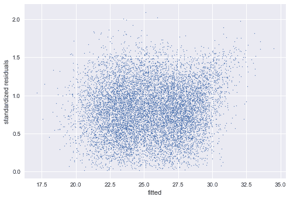
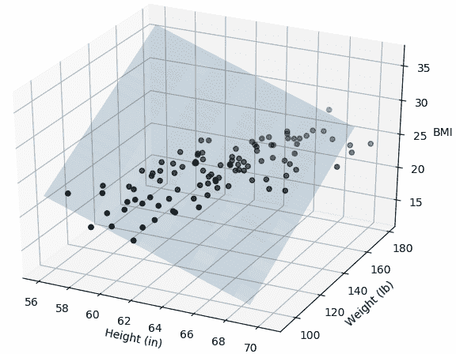
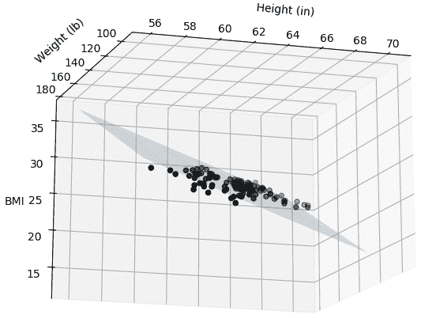
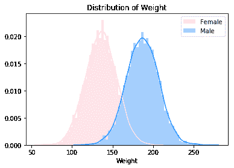
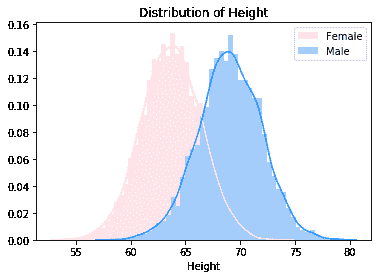
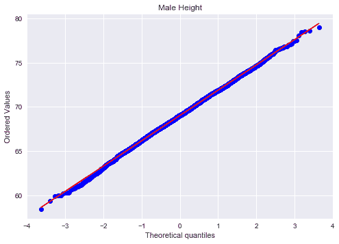
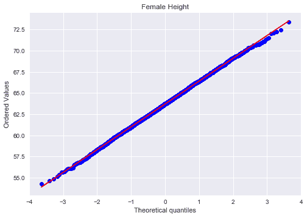
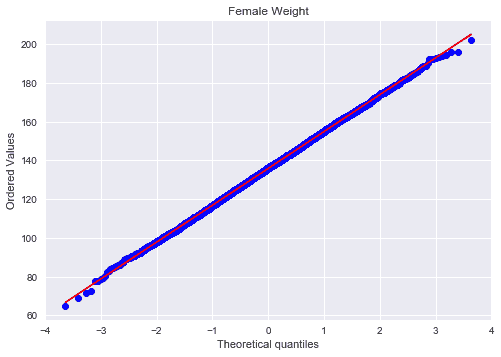

# 机器学习中分析模型假设的重要性

> 原文：<https://towardsdatascience.com/the-importance-of-analyzing-model-assumptions-in-machine-learning-a1ab09fb5e76?source=collection_archive---------21----------------------->

## 如何检查你的假设&为什么你应该总是这样做

*作者雷利·梅因尔特，阿德·帕特尔，&西蒙·李*

在构建用于预测的模型之前，检查模型假设非常重要。如果不满足假设，模型可能会不准确地反映数据，并可能导致不准确的预测。每个模型都有必须满足的不同假设，因此检查假设在选择模型和验证它是否是要使用的合适模型时都很重要。

## **诊断**

诊断用于评估模型假设，并确定是否存在对分析有巨大、不适当影响的观察结果。它们可用于优化模型，确保您使用的模型确实适合您正在分析的数据。有许多方法可以使用诊断来评估模型的有效性。*诊断*是一个总括名称，涵盖了模型假设下的其他主题。它可能包括探索模型的基本统计假设，通过考虑更多、更少或不同的解释变量来检查模型的结构，或者查找模型很难表示的数据(如异常值)或对回归模型的预测有很大不平衡影响的数据。

诊断可以采取多种形式。您可以检查一些数字诊断。 *statsmodels* 包通过**摘要**功能提供了许多诊断的摘要:

有了这个总结，我们可以看到重要的值，如 R2，F 统计，以及其他许多。您还可以使用图形诊断来分析模型，例如绘制拟合/预测值的残差。

上面是我们的体重-身高数据集的拟合与残差图，使用身高作为预测因子。在很大程度上，这个情节是随机的。但是，随着拟合值的增加，残差的范围也会增加。这意味着随着身体质量指数的增加，我们的模型和实际数据之间的差异会更大。在较高的 BMI 时，它也往往是一个更负的残差。这并不意味着线性模型是不正确的，但这是一个值得研究的问题，可能有助于改变或改进模型。

您可以做的另一个残差图是比例-位置图。该图显示了我们的残差是否沿预测值的范围均匀分布。如果所有的随机变量都有相同的有限方差，则认为它们是同方差的。具有随机分布点的图表明该模型是合适的。根据拟合值绘制平方根归一化残差。

在这个图中，我们想要一个水平带状的随机分布。这表明数据是同质的，自变量和因变量之间的随机化关系在自变量之间是相对平等的。我们的线在开始时大多是水平带状的，但在接近结束时似乎向上倾斜，这意味着可能不是到处都有相等的方差。这可能是我们在残差拟合图中发现的问题没有得到解决的结果，也是我们的模型可能需要改变的另一个指标。

在建立回归模型时，您希望确保残差相对随机。如果不是，那可能意味着你选择的回归是不正确的。例如，如果您选择使用线性回归，并且残差图明显不是随机的，则表明数据不是线性的。

诊断也适用于我们正在讨论的许多其他主题，如多重共线性、数据集分布和异常值，这些将在本文的其余部分讨论。

## **多重共线性**

在统计学中，当数据集的要素或 X 变量彼此不独立时，会出现多重共线性。例如，身高、体重和身高 2 不是独立的，因为身高 2 的计算取决于身高，反之亦然。多重共线性还意味着数据集中存在冗余要素。

多重共线性是回归分析中的一个主要问题。这是因为回归模型的关键目标是预测当 X 变量之一发生变化时(所有其他 X 变量保持不变)，独立的 Y 变量如何变化。假设两个变量 X1 和 X2 彼此高度相关(例如，X2 = X1 + 1)。改变 X1 而不改变 X2 是不可能的，反之亦然。

在这种情况下，模型很难预测 Y 变量和每个 X 变量之间的关系(所有其他 X 变量保持不变)，因为 X 变量是一起变化的。因此，该模型将无法正确计算系数(估计值)，从而不足以识别数据集中哪些 X 变量对 Y 变量的统计影响最大。

幸运的是，多重共线性并不总是需要修复。例如，假设你有 3 个变量(X1，X2，X3)。如果 X1 与 X2 有很强的相关性，但是你只使用 X2 和 X3 来构建你的模型，那么模型将能够毫无问题地解释 X2 和 X3 对 Y 的影响。此外，如果您的唯一目标是预测 Y，并且不需要了解每个 X 变量对 Y 的影响，那么减少多重共线性就没有必要。

在需要解决多重共线性问题的情况下，使用的最佳方法是要素选择。事实上，特征选择不仅处理多重共线性！它还提高了训练模型的计算效率(训练模型所需的时间随着特征数量的增加而呈指数增加)。此外，它降低了过度拟合的风险(冗余特征意味着模型更可能拟合噪声而不是数据中的实际模式)

有各种各样的技术来执行特征选择，但是它们都依赖于相同的基本原理。最终，目标是消除对 Y 变量几乎没有影响的要素，保留最重要的要素。例如，可以使用的一个属性是“互信息”，它是一个从 0 到 1 的数字，表示两个特征有多少共同点。如果 X1 和 X2 是独立变量，这意味着这两个变量都不能用来获得关于另一个变量的信息，因此它们的互信息是 0。如果一个变量是对应变量的函数，则意味着两个变量之间存在显式的数学映射(如果一个变量的值已知，则另一个变量的值可以计算出来)，因而它们的互信息为 1。如果一个变量是对应变量和其他变量的函数，它们的互信息在 0 和 1 之间。

Multiple Linear Regression for Height and Weight versus BMI

Another view, rotated to show linearity and fit of the relationship

## **数据集分布**

数据集的分布显示了总体特征的不同可能值，以及每种结果出现的频率。正态分布可能是最广为人知的分布，并且经常出现在现实世界中。在多元线性回归中，假设我们有多元正态性。简单来说，每个变量都应该是正态分布的。我们可以通过在直方图中绘制变量来直观地检查这一点。

虽然身高和体重并不是完美的正态分布，但因为我们有足够大的样本量，总共有 10，000 次观察，我们可以安全地假设中心极限定理成立。如果不确定这个数据是否足够正态分布，可以用 Q-Q 图来检验。

Q–Q(分位数-分位数)图是确定分布是否正态分布的另一种诊断工具。它沿着理论分位数和 y = x 线绘制数据的分位数。如果点沿着这条线排列，则分布相对相似。在我们下面的图中，因为不同自变量的大多数点都非常接近直线，因此是“理想的”正态条件，我们可以假设我们的数据是正态分布的。然而，因为在低端，一些点在线下，而在高端，一些点在线上，我们知道我们的数据可能有重尾，然后我们调整我们的模型。

## **样本量**

在信息爆炸之前，统计人员习惯于手动收集数据，这需要宝贵的时间和资源。需要提前确定最小样本量，以确保收集到足够的数据，从而进行有效和准确的分析。今天，情况往往相反。我们可以访问从几千到几百万个观察值的数据集。乍一看，能够对超过一百万的观察数据进行分析似乎很棒。然而，在对数据进行分析和建模时，使用大量数据通常是不合适的。

从数据集中提取样本有几个原因。太大的样本会导致我们过度拟合我们的模型。样本太多会导致实际上无关紧要的变量在分析中具有统计意义。然而，从我们的数据集中提取太小的样本也可能会导致问题。在太小的样本上进行的分析将缺乏统计能力，而统计能力对于能够基于模型做出准确的预测是至关重要的。我们不想要太大或太小的样本，那么我们如何确定合适的样本量呢？

通常，人们认为 30 的样本量已经足够大了。然而，当我们从数据集中随机抽取 30 个样本时，结果是这样的:

很容易看出这个样本不是正态分布的，打破了多元正态的假设。因此，我们需要选择更大的样本量。在模型构建中，很容易改变您正在选择的随机样本的大小，并直观地验证它是一个足够大的样本，以满足多元正态性的假设。

## **离群值**

在模型创建中没有关于异常值的特定假设，但是需要注意的是异常值会极大地影响您的模型并改变其有效性。直观检查异常值的简单方法是使用箱线图，如下所示:

因为我们可以直观地看到存在异常值，所以我们应该检查它们对模型的影响有多大。 *statsmodel.api* 包计算诊断，如杠杆和库克的每个点的距离，非常有帮助。杠杆是衡量一个点的独立变量值与不同观察值之间的距离。具有高杠杆作用的点是变量的极值点，在这些点上缺少附近的观测值导致拟合的回归模型接近该特定点。下面是库克对每个点的距离图。库克距离是删除一个点对回归的影响的度量，因此给定该信息，调查具有极端/更高库克距离的那些点将是有益的。

有几种方法可以处理异常值，您选择如何处理它们可能取决于您的特定模型。当您创建模型时，它们可以从您的数据中完全删除，或者它们可能表明另一个模型可能更适合您的数据，这取决于它们如何影响其他假设。

## 结论

正如你所看到的，检查模型假设是一个相对简单，但在优化模型性能和增加机器学习中模型可靠性方面非常重要的一步。在构建模型之前，请检查您的数据是否符合您选择的模型的特定假设。从目视检查开始。如果您的可视化甚至有点不清楚您的数据是否符合您正在检查的特定假设，请使用更具体的诊断工具来确认或否认您的怀疑。这样，您可以确保对数据使用最合适的模型，从而提高预测能力。

**关键词:**多重共线性、同异方差、异常值、残差、诊断、标度-位置图、Q-Q 图、库克距离

**消息来源**

[https://statisticsbyjim . com/regression/多重共线性-回归-分析/](https://statisticsbyjim.com/regression/multicollinearity-in-regression-analysis/)

 [## 为什么、如何以及何时应用特征选择

### 现代数据集的信息非常丰富，数据是从数百万个物联网设备和传感器收集的。这个…

towardsdatascience.com](/why-how-and-when-to-apply-feature-selection-e9c69adfabf2) 

[https://data.library.virginia.edu/diagnostic-plots/](https://data.library.virginia.edu/diagnostic-plots/)