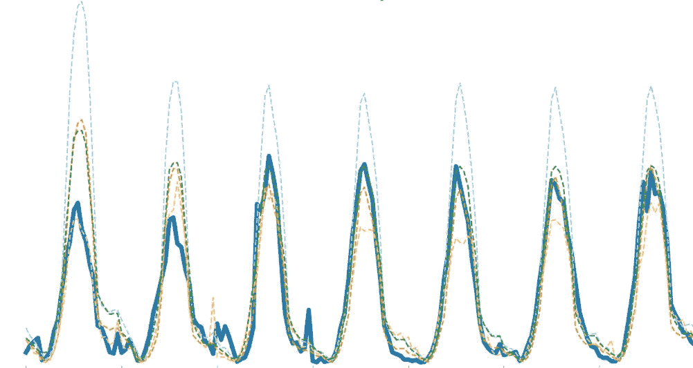
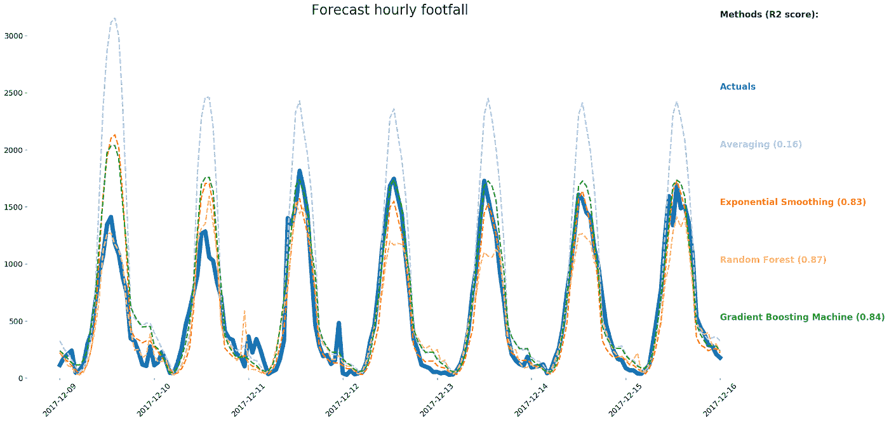
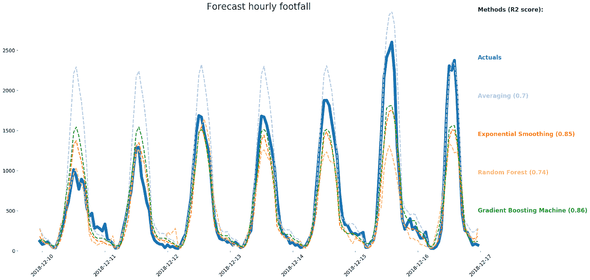

# 数据集中上下文的重要性:一个简短的实验

> 原文：<https://towardsdatascience.com/the-importance-of-context-in-data-sets-a-short-experiment-29c45a01a7fd?source=collection_archive---------36----------------------->

## **在同一时间序列中使用四种预测方法以显示绩效差异**

如今，数据科学家在选择他们将在数据库上使用哪种方法时被宠坏了。学术文献已经超越了众所周知的、曾经广泛使用的普通最小二乘法。与大多数其他研究领域相反，新的理论和方法通常会相对较快地应用到商业应用中，就目前而言，时间序列预测领域可以说是研究得最好和使用最多的领域。

本文并不深入探讨在特定环境下最有效的单一方法。相反，我想告诉您，没有一种方法在每种情况下都是明确首选的。事实上，我已经建立了一个简短的实验，向你们展示数据集背景的重要性，以及全面再培训的重要性。

我的演示使用了四种不同的方法和一个公开的数据集:由英国政府提供的约克市中心每小时的客流量。数据范围为 2009 年 3 月 30 日至 2018 年 12 月 17 日。

## **方法概述**

首先是一个简短的免责声明:为了充分证明我的观点，我需要对几个模型和预处理方法进行彻底的研究，这超出了本文的范围。但即使将研究限制在以下四种方法，也可以得出初步结论:平均法、指数平滑法、随机森林法和梯度推进机法。

*平均*

一种简单的复合平均法。首先，一周中每天的平均值是在每天汇总数据后获得的。接下来，计算一天内小时数的百分比，使我们能够将数据从每日预测重新分配到每小时预测。

*指数平滑*

指数平滑需要分配随时间呈指数递减的权重，这意味着该模型明确考虑了过去的事件。为了训练模型，平滑参数β (0 < β < 1) needs to be estimated.

*随机森林*

训练随机森林意味着重复选择数据子集和随机选择特征来训练回归树。随后，通过对使用每个单独的回归树做出的预测进行平均来构建预测。

*梯度推进机*

梯度推进机器通过迭代地将所谓的弱学习器组合成一个单一的强学习器来训练。每次迭代旨在通过估计回归树来进一步最小化早期训练的学习者的误差项。

注意，为了将机器学习技术应用于诸如该数据集的时间序列，不能忽略特征工程。根据机器学习的本质，不会考虑时间因素，因此数据科学家应该通过特征来指示时间依赖性。特别是当数据显示趋势时，自回归(包括滞后值)可能是有价值的，因为机器学习技术通常不能很好地进行外推。在这个练习中，对于随机森林和梯度推进机器方法，我选择包含这些时间指示器:年、月和星期几。

## **结果**

我首先使用截至 2017 年 12 月 9 日的数据来训练我们的各种模型。我让模型提前一周预测。

基于这些结果，随机森林模型似乎具有最高的预测能力，因此将构成首选模型。

接下来，我对所有的模型进行了一年同期的训练，就在一年之后(直到 2018 年 12 月 9 日)，让他们再次提前一周进行预测。

尽管预测的目标是今年的同一时期，仅仅是未来一年，但现在的结果和随后的结论却截然不同。这是我的主要观点。即使在一个相对简单的数据集内，改变上下文也可能导致实质上不同的结果和结论。

从这个实验中得出的一个结论是全面再培训的重要性。通常，再训练归结为将完全相同的方法、预处理和特征工程应用于稍微不同的数据集。然而，如上所示，持续使用曾经选择的方法会导致错误的结论。

可能更重要的是，它证明了数据集的背景对结果的影响远远超过任何单一模型的预测能力。这意味着每个建模任务都需要考虑一系列方法。每种方法的性能(以及方法的选择)将在很大程度上取决于手头问题的背景。