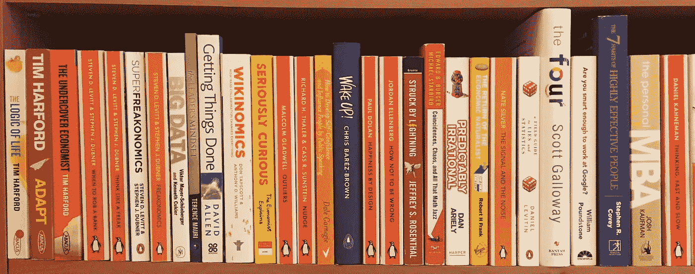
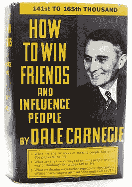
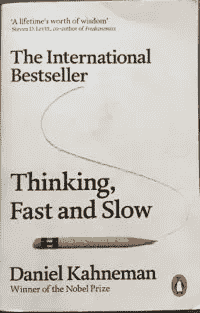
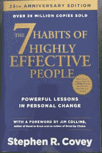
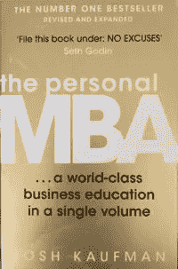
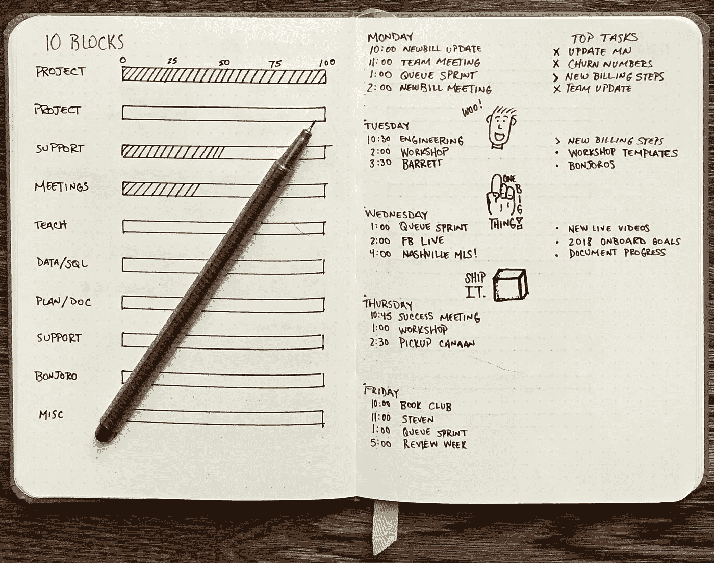
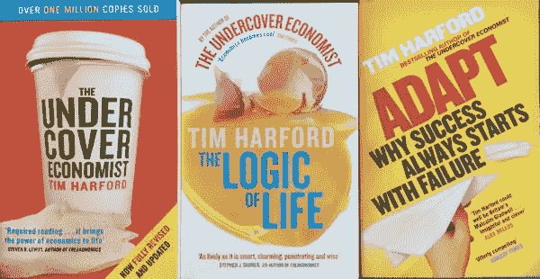
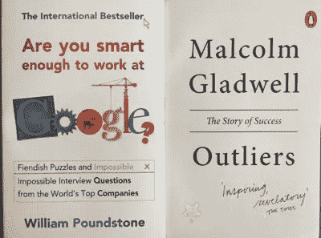
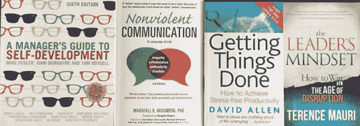
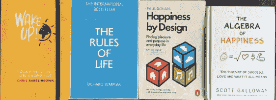

# 软技能在数据科学中的重要性—书籍推荐

> 原文：<https://towardsdatascience.com/the-importance-of-soft-skills-in-data-science-book-recommendations-3cbce1b11c67?source=collection_archive---------14----------------------->

“It is what you read when you don’t have to that determines what you will be when you can’t help it.” — Oscar Wilde (Image by author)

## 这些是我推荐给数据科学家作为个人发展一部分阅读的最佳书籍。

在经典的数据科学维恩图中，数据科学家存在于数学和统计学、黑客和领域专业知识技能的交汇处。但与此同时，软技能在数据科学角色中也很重要。为了真正有效，数据科学家应该拥有强大的沟通技巧；能够谈判并说服利益相关者；并最终带领项目和团队在各种商业或工业环境中取得成功。

这促使我为新兴的数据科学家编写了一份书籍推荐清单，将阅读视为他们个人发展的一部分。在我指导和领导项目团队的责任越来越大的过程中，我意识到，尽管数据科学家通常非常认真地对待他们的持续发展，但他们通常非常关注该角色的技术技能，而忽视了在软技能方面的专门学习之间的平衡。我发现将软技能学习纳入我的个人发展计划非常有益，可以增强我的商业意识和对企业(更重要的是人)运营方式的理解。我鼓励在我帮助领导的项目和团队中学习这些知识，并取得了很好的效果。

在这些建议中，我总结了从每本书中学到的关键数据科学知识，这些知识可以在工作中付诸实践。我专注于我认为最能相互补充的书籍，以完善一名有效的数据科学家应该掌握的许多软技能，这些技能是从我从初级角色成长为高级角色以及作为各种项目的技术主管的经历中收集的。

# “如何停止担忧，开始生活”——戴尔·卡内基

*这是我过渡到数据科学职位后阅读的第一本“自助”书籍，它很好地介绍了个人发展的有效性。*

[Image from Wikipedia under Fair Use](https://en.wikipedia.org/wiki/How_to_Stop_Worrying_and_Start_Living)

**推荐理由:**任何经历过冒名顶替综合症的人！

**主旨:**认识到你担忧的原因，然后合理化它们，并形成一个克服它们的计划。

**数据科学家需要学习的重要知识:**当担心项目简介、代码错误、对利益相关者的演示等时。这有助于*识别*和*减轻*风险，这样你/你的团队/你的利益相关者可以确信事情得到了理解和控制。

最喜欢的一句话:“决定一件事情到底值多少焦虑——拒绝再给它了。”

# “如何赢得朋友和影响他人”——戴尔·卡内基

在欣赏了戴尔·卡耐基的写作风格后，我接着读了他的《影响他人》一书，这本书本身就是一本极具影响力的书(太元了)！不要让标题让你分心:这个建议根植于做最真实的自己，关注人际交往技巧和换位思考的重要性。

[Image from Wikipedia under Fair Use](https://en.m.wikipedia.org/wiki/How_to_Win_Friends_and_Influence_People)

**推荐适合:**反社会者(j/k！)任何想变得更有同情心或更有风度的人。

**主要信息:**真诚、诚实、积极、谦逊地对待他人，真诚地关心和尊重他们。

**数据科学家的重要收获:**各种项目和团队将汇集各种各样的人，理解他们的动机和行为非常重要，这样您就可以带他们踏上构建理想解决方案的旅程，这可能与他们最初的期望一致，也可能不一致。

最喜欢的一句话:“赢得争论的唯一方法就是避免它。”

# “快速思考和慢速思考”——丹尼尔·卡内曼

*了解我们有意识和无意识思维过程之间差异的伟大著作。*

Image by author

**推荐对象:**希望在行动和行为中加入更多理性和深思熟虑的人。

**主要信息:**通过识别我们“快”和“慢”的思维方式，我们可以更好地控制决策中逻辑的使用，减少任何源于情绪或无意识偏见的过度自信。

**数据科学家的重要收获:**在 DS 项目中与人们的各种接触中，了解您和他们的决策是如何发生的是很有用的，因为不是每个参与的人都会以相同的方式思考，所以您应该根据情况定制您的方法，并在必要时进行“慢”思考。

最喜欢的名言:“他有印象，但他的一些印象是幻觉。”

# “高效人士的 7 个习惯”——斯蒂芬·R·科维

介绍七种有效实现目标的方法，尤其是与他人合作时。

Image by author

推荐职位:项目管理、团队领导或顾问职位。

**主要信息:**如何从依赖走向独立(自我掌握)和相互依赖(与他人有效合作)。

**数据科学家的重要学习:****通过衡量紧急程度和重要性(优先级矩阵“执行”、“计划”、“委派”或“消除”)来展示任务的有效优先级，这对于分解利益相关方的请求非常有用，因此您可以专注于最有价值的部分。概述了“协同”团队的方法，以帮助确保数据科学家与相同的目标保持一致，并积极地朝着这些目标努力，依靠有效的领导来确保“双赢”局面。**

****名言:**“先寻求理解，再寻求被理解。”**

# **“个人 MBA”——乔希·考夫曼**

**MBA 课程中典型课程的浓缩版。它突出了商业教育的关键方面和战略的例子。**

****

**Image by author**

****推荐给:**那些商业背景或培训有限的人，尤其是现在与商人或在商业环境中工作的人。**

****主要信息:**贯穿商业模式的有效战略和决策背后的思想；从评估市场和衡量价值到制造产品和管理不确定性。**

****数据科学家需要学习的关键知识:**利益相关者、高层管理人员和第三方提供商或顾问通常都比数据科学家有更坚实的业务基础和背景。为了理解他们的动机，并从根本上说他们的语言以获得他们的信任，学习商业理论是至关重要的；涵盖价值创造的形式&交付、营销、金融、心理学以及商业模式和系统的功能。**

**最喜欢的名言:“哪里有麻烦，哪里就有机会。”—(争议溢价)**

# **“子弹日记法”——赖德·卡罗尔**

***通过有效的笔记和待办事项列表来提高工作效率的方法。***

****

**[Image from Wikipedia (copyrighted free use)](https://en.wikipedia.org/wiki/Bullet_Journal)**

****推荐对象:**那些努力跟踪不断增长的待办事项清单的人。**

****主要信息:**使用一个简单的符号和规则的书面系统来记录行动、事件和笔记，你可以提高你的工作效率。**

****数据科学家需要学习的重要知识:**科技行业的工作节奏往往很快，业务部门会提出各种各样的动态要求，因此在日常工作中管理这一点非常重要，而这正是子弹日志法可以提供帮助的地方。一名数据科学家可能在一天之内身兼数职，编制各种各样的待办事项列表，然后对其进行排序和优先排序，这样你就知道现在要做什么、未来要做什么，或者如果不重要就删除(参见上面的“7 个习惯……”)。**

**最喜欢的名言:“追踪过去，订购现在，设计未来。”**

> **以下书籍包含了数据科学&商业技术技能的软性方面的各种逻辑、推理和见解。**

****

**Image by author**

## **“魔鬼经济学”、“超级魔鬼经济学”、“像怪物一样思考”和“什么时候去抢银行”——史蒂文·d·莱维特和斯蒂芬·j·杜布纳**

> **这些都是引人入胜的读物，显示了经济学是如何成为社会许多部分的根源，突出了它的重要性和影响力。**

****

**Image by author**

## **《卧底经济学家》、《生活的逻辑》和《适应:为什么成功总是从失败开始》——蒂姆·哈福德**

> **通过经济学在商业、市场营销、战略和创新中的应用来探究社会中人们的心理。**

****

**Image by author**

## **“四大巨头:亚马逊、苹果、脸书和谷歌隐藏的 DNA”——斯科特·加洛韦**

## **“你足够聪明去谷歌工作吗？”—威廉·庞德斯通**

## **“局外人:成功的故事”——马尔科姆·格拉德威尔**

## **“精益创业:持续创新如何创造出彻底成功的企业”——Eric Ries**

> **这些书强调了创造性思维和创新行动的能力是当前科技公司蓬勃发展的基础，并寻求在他们的雇佣中增加/增长。**

****

**Image by author**

## **“自我发展经理指南”——迈克·佩德勒、约翰·伯戈因和汤姆·博伊德尔**

## **“非暴力沟通:生活的语言”——马歇尔·罗森伯格**

## **“完成任务:如何实现无压力的生产力”——大卫·艾伦**

## **“领导者的思维模式:如何在混乱的时代获胜”——特伦斯·莫里**

## **“如何通过公开演讲培养自信并影响他人”——戴尔·卡内基**

> **这些书介绍了优秀领导力的方方面面，从良好的自我意识和适当的心态，到能够以积极和富有成效的方式影响他人。**

****

**Image by author**

## **“推动:改善关于健康、财富和幸福的决定”——理查德·h·泰勒和卡斯·r·桑斯坦**

## **“谎言和统计的实地指南:神经科学家如何理解复杂的世界”——丹尼尔·列维京**

## **“经济自然主义者的回归:经济学如何帮助理解你的世界”——罗伯特·h·弗兰克**

## **“可预测的非理性:塑造我们决策的隐藏力量”——丹·艾瑞里**

## **“信号和噪音:预测的艺术和科学”——内特·西尔弗**

## **“被闪电击中:好奇的概率世界”——杰弗里·s·罗森塔尔**

## **“如何不犯错:日常生活中隐藏的数学”——乔丹·艾伦伯格**

## **“巧合、混乱和所有的数学爵士乐:让有分量的想法变轻”——爱德华·b·伯格和迈克尔·斯达伯德**

> **这些都是关于使用数学和统计来帮助理解人们和社会的行为，我们如何误解和误判我们的偏见，以及如何更好地使用概率来通知我们的决定，以及我们评估风险和结果可预测性的方式的一些伟大的读物。**

****

**Image by author**

## **“醒醒！逃避自动驾驶的生活”——克里斯·佩雷斯·布朗**

## **“生活的规则”——理查德·圣殿骑士**

## **“设计快乐:在日常生活中寻找快乐和目标”——保罗·多兰**

## **“幸福的代数”——斯科特·盖洛韦**

> **最后，但绝不是最不重要的，是一些关于积极快乐心态重要性的书；这在商业技术行业是一个很好的平衡，因为尽管我们用逻辑、度量和效率衡量工作，但我们不是机器人，应该始终投资于我们的精神健康和福祉。**

**我很好奇，也对任何人关于商业技术的进一步建议感兴趣。数据科学家的领导力或软技能资源。这些和其他资源都聚集在我的 datascienceunicorn.com 博客上。请打我！**

**当我整理这份清单时，我意识到男性作者在其中的主导地位，并记下在这些领域寻找更多女性作者的书。欢迎所有推荐。**

*****参考文献*****

**[http://drew Conway . com/Zia/2013/3/26/the-data-science-Venn-diagram](http://drewconway.com/zia/2013/3/26/the-data-science-venn-diagram)
[https://towardsdatascience . com/soft-skills-will-make-or-break-you-as-a-data-scientist-7b 9 c 8 c 47 f 9 b](/soft-skills-will-make-or-break-you-as-a-data-scientist-7b9c8c47f9b)
[http://www.datascienceunicorn.com](http://www.datascienceunicorn.com/)**