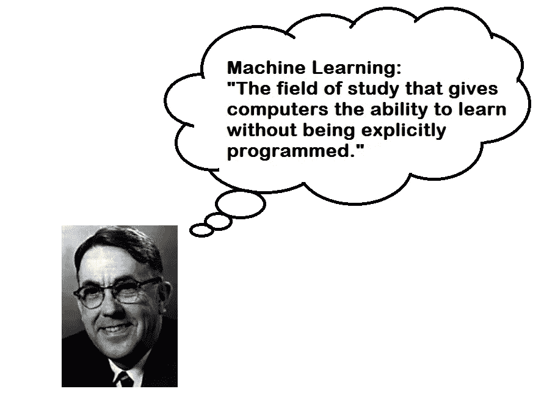
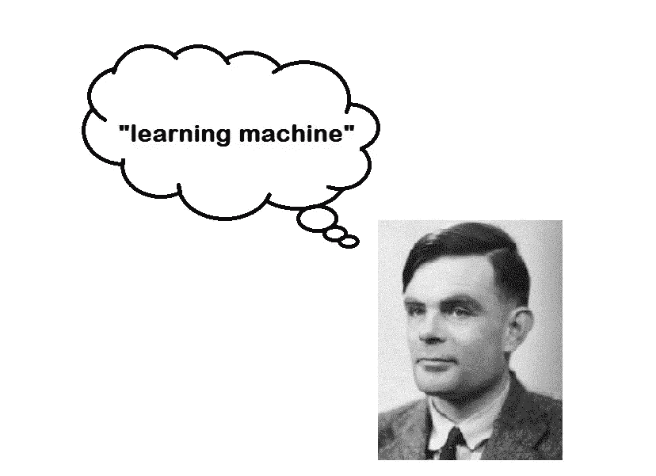

# 机器学习的开端

> 原文：<https://towardsdatascience.com/the-inception-of-machine-learning-90b9fc3737ff?source=collection_archive---------23----------------------->

在流行语的搭配中，“机器学习”一词成为了很大的竞争者。但是你有没有想过这个术语是怎么来的？

让我们深入了解它的历史，了解它是如何演变成今天的样子的。

这个术语是阿瑟·塞缪尔在 1959 年创造的，他定义它为—

> "给予计算机无需明确编程就能学习的能力的研究领域."

在 IBM 工作期间，亚瑟·塞缪尔在 IBM 的第一台商用计算机 701 上编写了一个跳棋程序。

你听说过跳棋吗？这是一个简单的战略棋盘游戏，也称为跳棋。

亚瑟自己并不是一个很好的跳棋选手，但是让这个程序和它自己玩上千次游戏，它变得足够体面来挑战一个业余选手。这是世界上第一个成功的自学项目。

这个程序的主要任务是找到一个从当前状态可以到达的有利的棋盘位置，这将导致一场胜利。由于机器的存储容量有限，在游戏结束前搜索每一条路径是不可行的，所以亚瑟设计了一个计分函数来衡量每一方在给定位置获胜的机会。程序使用**极小极大策略**决定下一步行动。这个过程后来被称为**阿尔法-贝塔剪枝**。

谁能想到教电脑玩游戏会引出这样一个革命性的研究领域？

是的，你猜对了！亚瑟这么认为。他认为，通过教计算机玩游戏，可以开发出解决一般问题的策略。

但这是开始吗？

不要！

在术语*“机器学习”*、**艾伦·图灵**在他的论文**计算机器和智能**中提出——*“学习机器”*可以学习并变得人工智能。在同一篇论文中，他介绍了著名的**模仿游戏**，该游戏旨在回答“机器能思考吗？”

他相信，到本世纪末，技术进步将使通过编程制造一台能玩模仿游戏的机器成为可能。根据他的说法，要模仿成年人的思维，重要的是要考虑导致其当前阶段的因素，即—

1.  心灵的最初状态——童年。
2.  教育，它提供了。
3.  人生经历，它是受。

奖励和惩罚的方法会在头脑中形成模式。图灵提到，这整个过程在很大程度上类似于自然选择的进化过程。

虽然他给出的解释可以被认为是抽象的，但“机器学习”的当前状态，以及它的方法，如监督、非监督和强化学习，是他所预期的。

> 机器学习起源于领先于他们时代的先驱们的雄心勃勃的推测和工作。

对于大多数学习者和爱好者来说，机器学习似乎是一个相对较新的领域，但它有一段发现和批评的历史。随着硬件和计算的进步，它现在已经成为我们这一代最伟大的技术之一；它有可能彻底改变我们文明的无数方面。

在后续的博客中，我将分享我对**机器学习**的*学习*。我希望再次得到你的时间和关注。谢谢大家！