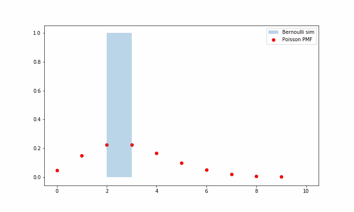
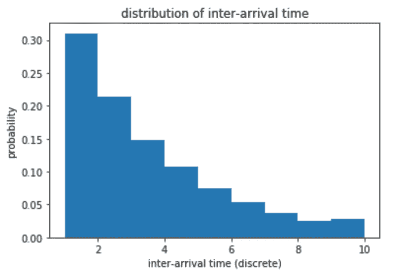
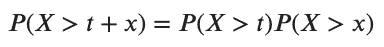
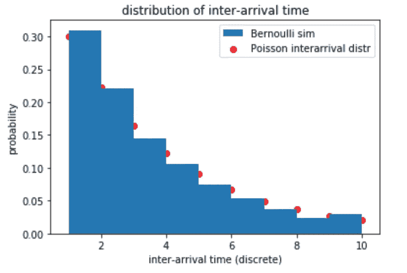
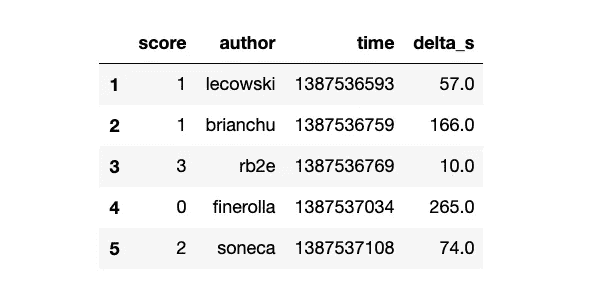
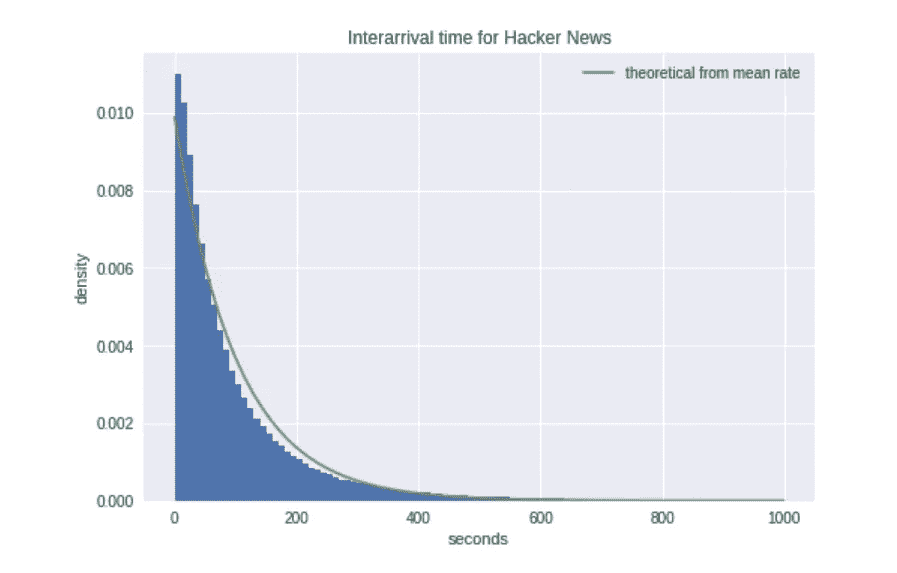
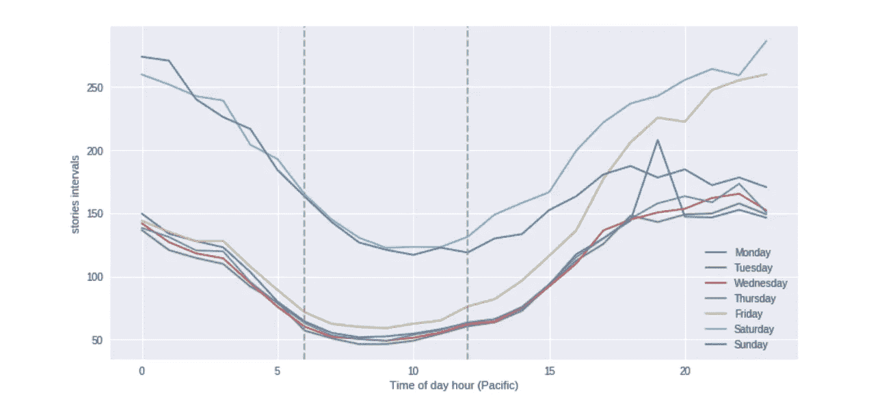
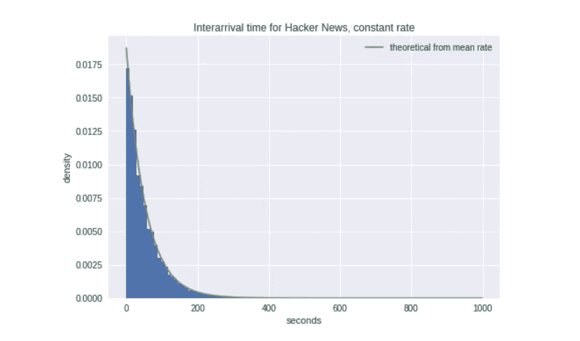
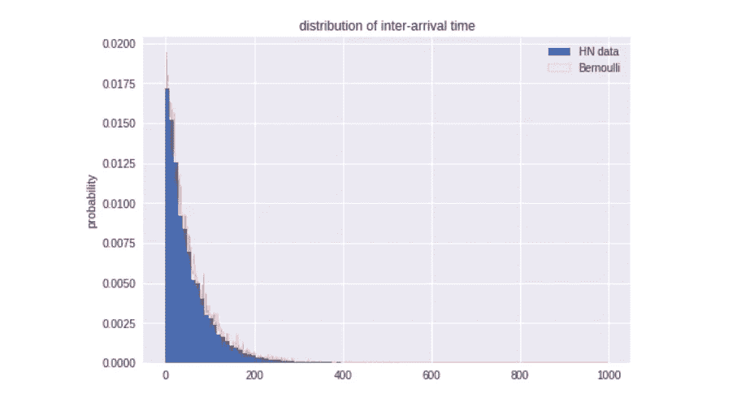

# 难以置信的收缩伯努利

> 原文：<https://towardsdatascience.com/the-incredible-shrinking-bernoulli-de16aac524a?source=collection_archive---------22----------------------->

## 抛硬币模拟黑客新闻到达间隔时间分布

Joey Kyber via [Pexels](https://www.pexels.com/photo/monochrome-photography-of-round-silver-coin-839351/)

# 伯努利计数过程

伯努利分布听起来像一个复杂的统计结构，但它们代表了抛硬币(可能有偏差)。我发现令人着迷的是这个简单的想法是如何导致更复杂的过程建模的，例如一个帖子被投票支持的概率，我将在稍后的日期发布一个故事。

伯努利计数过程评估一定数量的翻转试验 n 的事件分布。对于随机二进制序列 n，我们评估的和是某个数字的概率。

例如，对于这 10 次试验，总和将是 S([0，0，1，0，1，0，0，0]) = 3。对于概率为 p 的过程，n 次试验中 S 的期望值为 p*n。例如，如果 p=0.3，则 10 次试验中的期望值为 3 次事件。

# 伯努利计数过程中的泊松计数过程直觉

泊松过程是伯努利到连续空间的延伸。它用于模拟到达时间，或某段时间内的事件计数概率。

在齐次泊松过程的简化情况下，它由λ它的速率或强度来定义。λ是每单位时间的平均事件数，因此事件数对时间 t 的期望值为λ*t。例如，如果λ = 0.3(每秒)，则 10s 内的期望值为 3 个事件。

我们可以看到两者是相关的，如果你把伯努利试验想象成泊松点过程的时间采样版本。我们可以任意将伯努利增量定义为 1/k，模拟速率λ的泊松分布导致我们将概率定义为 p = λ/k。

Shrinking Bernoulli converges to Poisson

# 伯努利和泊松过程到达间隔时间分布

伯努利过程的非直观部分来自到达间隔时间。继续上面 p=0.3 的例子，你可能首先猜测到达间隔分布的分布将在 3 左右达到峰值。

然而，该分布实际上是几何分布，我们可以类似地模拟泊松过程的到达间隔时间。

考虑事件发生的初始条件。让我们称 Yᵢ为事件在初始事件发生后增量为 I 时的值。如果距离是 1，那么 Y₁=1 和它的概率是 p。对于距离是 2，我们需要 Y₁=0，Y₂=1 的概率是(1-p)*p。对于 3，Y₁=0，Y₂=0，Y₃=1 的概率是(1-p) p。等等，距离 x 是 I 的概率是

Inter-arrival distance is geometric

一个快速的[模拟](https://colab.research.google.com/drive/1nc0HtHhmJAaiapc9v4MOb9aEfHku2vBl#scrollTo=GL5opjAQa5B7&uniqifier=2)证实了这一点

这个到达间隔时间也有助于获得泊松到达间隔时间的直觉，它是伯努利到连续时间的延伸。

泊松过程的一个关键特性是它们是无记忆的。把伯努利推广到连续，如果事件在时间 t 还没有发生，它在 t+x 内不发生的概率与 t 无关。

就像在伯努利中，你在抛硬币(只是超快)，它与过去的事件无关。它可以写成

Memoryless property

我们可以由此推导出泊松的到达间隔分布

因此 h(x)必须是线性的，我们用-λ作为 prob 是<1

following a similar logic as per Bernoulli, P(X> x)表示在 x 之前没有事件发生，我们可以重写

当泊松率为 0.3 时，我们可以将泊松理论分布和伯努利分布重叠，以查看它们是否匹配。

Bernoulli simulating Poisson inter-arrival times

要获得这方面的丰富资源，请查看麻省理工学院的离散随机过程课程[这里](https://ocw.mit.edu/courses/electrical-engineering-and-computer-science/6-262-discrete-stochastic-processes-spring-2011/)，以及关于[泊松过程的章节](https://ocw.mit.edu/courses/electrical-engineering-and-computer-science/6-262-discrete-stochastic-processes-spring-2011/course-notes/MIT6_262S11_chap02.pdf)。

# 一个真实世界的例子:黑客新闻发布到达间隔时间

[黑客新闻](https://news.ycombinator.com/)定期向 Kaggle 发布一个数据集。张贴的故事的到达间隔时间通常被建模为泊松过程。

你可以在这个 [Kaggle 笔记本](https://www.kaggle.com/blocks/hn-interarrival-time)里找到下面的分析。

我们来看看数据。我们只看时间(epoch)并导出以秒为单位的到达间隔时间(delta_s)

Select columns of the HN dataset with added inter-arrival times

平均来说，我们计算的到达间隔时间是 101 秒。这应该给我们一个密度分布:

with inter-arrival rate of 101s

让我们插入真实数据和理论数据。非常接近但不完美。

然而，恒定速率假设很可能不成立，让我们来看看。

我们可以看到，黑客新闻的到达率在一周内比周末高得多，在工作日期间相对相似，在太平洋时间 6-12 时最高。

选择平日，6-12 太平洋，我们得到一个几乎完美的适合。

# 我的硬币在哪里？

所有这些都很有趣，但并不迷人。然而，令人着迷的是我们如何——这又是伯努利——抛一枚有偏向的硬币来模拟这种分布。

高使用率时段 6-12 的平均到达率为每 51 秒 1 个故事。如果你掷硬币的概率是 1/51 的“1 ”,给出的期望值是每 51 秒一个故事，你会得到相同的分布。
“翻转事件”看起来像数组([0，0，0，1，0，0，0，0，0，0，...])，如上所述，我们处理 1 之间的距离。如果你多次运行这个过程，下面是你得到的结果。

Flipping a biased coin to simulate HN inter-arrival times (Bernoulli)

感谢阅读。