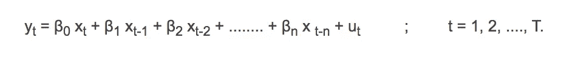
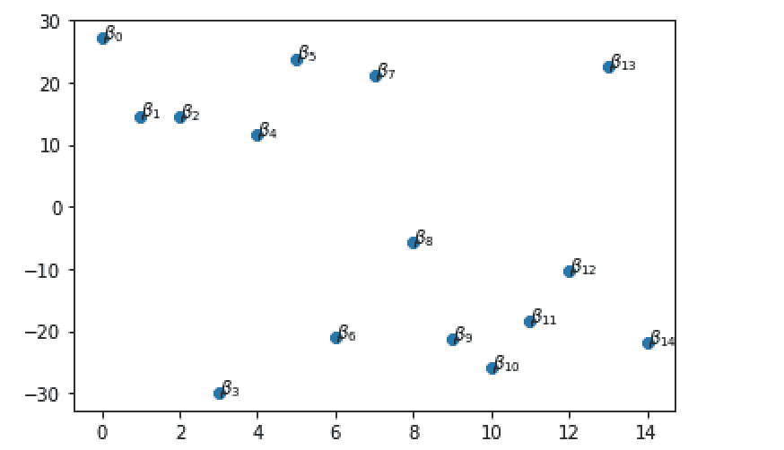
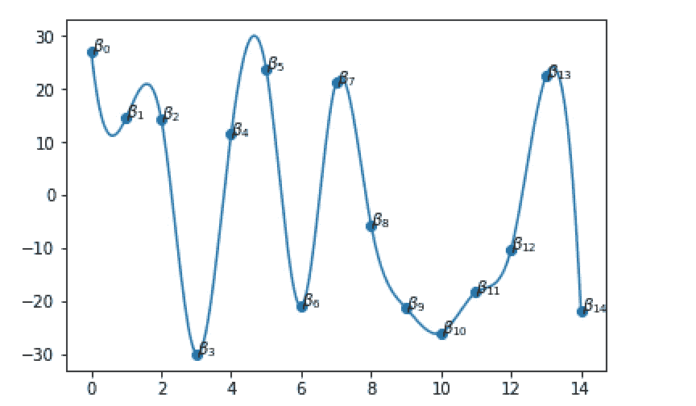
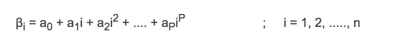
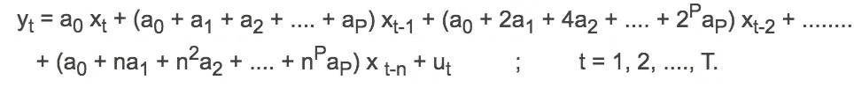
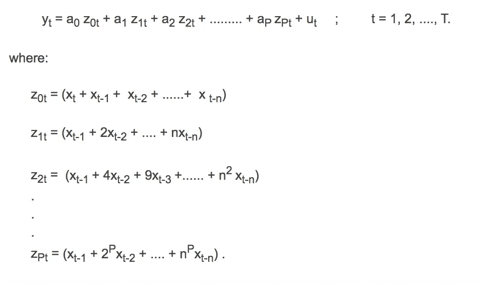

# 雪莉·阿尔蒙的巧妙想法

> 原文：<https://towardsdatascience.com/the-ingenious-idea-of-shirley-almon-3d286f84a3f0?source=collection_archive---------25----------------------->

我认为对于经济学背景的人来说，雪莉·阿尔蒙分布滞后模型可能是常见的，但我必须承认，我最近遇到了这个模型(可以追溯到 20 世纪 60 年代),对其独创性印象深刻，并学到了一些我认为也可以应用于其他问题的东西。

在我们讨论这个模型之前，雪莉·阿尔蒙是一名经济学研究员，她只发表了两篇论文，其中一篇是她提出的分布式滞后模型。因此，她被认为是她那个时代最杰出的经济学家之一，这一事实应该讲述了这些著作的辉煌故事。然而，故事中令人悲伤的部分是，她在 30 岁出头时被诊断出患有脑瘤，从而缩短了她在该领域漫长而辉煌的职业生涯，并在 40 岁时过早去世。

Shirley Almon of the now famous “Almon Lag model’

让我们来看看滞后模型。

Equation 1

本质上，y 是 x 在过去 *n* 个时期(x1，x2 … xT)中取值的线性函数。所以回归问题是估计 x 在过去{β₀，β₁，β₂ …，βn}中取值的权重(系数)

这个模型有两个问题。

> 当 *n* 较大时，估计 n 个参数是耗时的。
> 
> 对于线性回归，假设 x 在最后“n”个时期的各种值是独立的，即不相关的，在许多情况下可能不成立。注意，对于一个健壮的回归模型，这将是一个需求。

雪莉·阿尔蒙通过应用追溯到 1885 年的*维尔斯特拉斯近似定理*提出了一个解决这个问题的奇妙方案。

维尔斯特拉斯逼近定理指出，在闭区间[a，b]中，任何连续函数 f(x)都可以用某个 p 次的多项式 p(x)来逼近。

让我们举个例子，假设下面是通过回归估计的β的散点图。每个βi 表示为一个点(I，β)。你可能想知道为什么这种表达——你马上就会明白它的意义。可以想象，βi 值似乎是分散的，它们之间没有真正可见的联系。

然而 Shirley Almon 并没有将这些系数视为分散在各处的不相关的随机值，而是设想了一条按顺序穿过这些不同βi 的假想曲线。

应用维尔斯特拉斯逼近定理，她发现曲线可以用一个 p 次多项式函数来逼近。

Equation 2

换句话说，她想出了一个多项式函数，从这个函数中可以通过代入右边的 I 来求出不同βi 的值。

将等式 2 代入等式 1 并进行简化，得到如下结果:

重新排列术语并简化后得到以下结果:

现在重新制定的任务是估计 p 个回归系数{a₀，a1，a2..aP}而不是 n 个系数并且 P 远小于 n(P<< n). And there is lesser chance of collinearity or correlation between the z parameters paving way for a more robust model.

However, the catch is to come up with the right value of P though.

That said, this is an easily usable model and has extensive applications. But I have to admit that I cannot stop being amazed at Shirley Almon’s display of enterprise back then to use Weierstrass’s Approximation Theorem to achieve this model simplification and robustness!

## References

[https://Dave giles . blogspot . com/2017/01/explaining-almon-distributed-lag-model . html](https://davegiles.blogspot.com/2017/01/explaining-almon-distributed-lag-model.html)

 [## 分布滞后

### 在统计学和计量经济学中，分布滞后模型是一种时间序列数据模型，其中回归方程…

en.wikipedia.org](https://en.wikipedia.org/wiki/Distributed_lag)