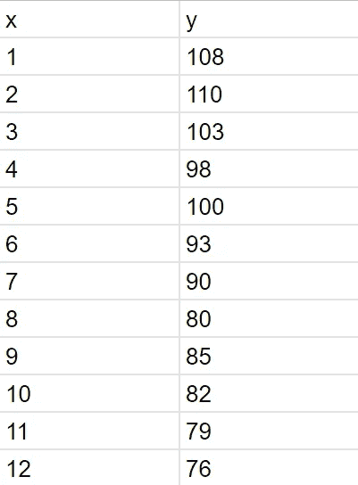
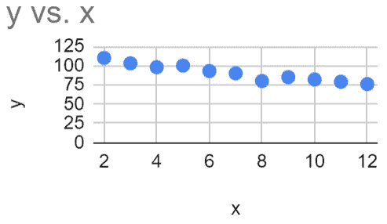
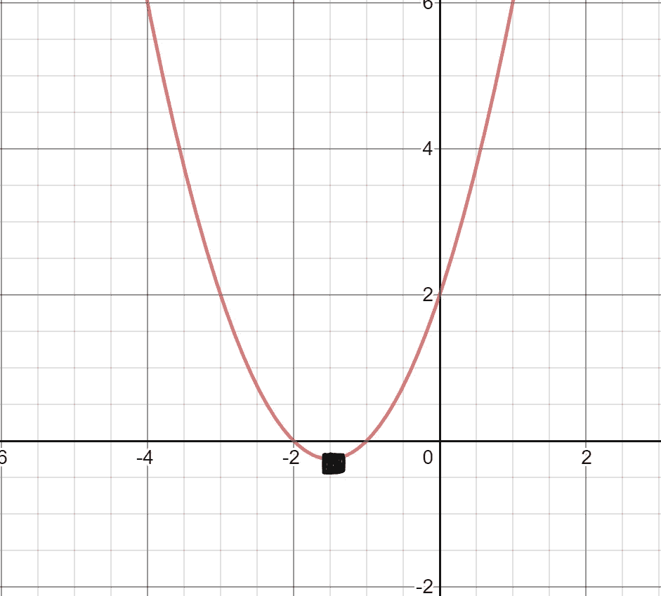

# 机器学习算法的“成分”

> 原文：<https://towardsdatascience.com/the-ingredients-of-machine-learning-algorithms-4d1ca9f5ceec?source=collection_archive---------7----------------------->

## 用这四个组件理解几乎任何机器学习算法。

Photo by [Dan Gold](https://unsplash.com/@danielcgold?utm_source=medium&utm_medium=referral) on [Unsplash](https://unsplash.com?utm_source=medium&utm_medium=referral)

什么是成本函数、优化、模型或算法？机器学习算法和术语的深奥微妙很容易让机器学习新手不知所措。

当我在阅读约舒阿·本吉奥、亚伦·库维尔和伊恩·古德菲勒的*深度学习*一书时，当我读到解释几乎所有机器学习算法共享的通用“配方”的部分时，我欣喜若狂——数据集、成本函数、优化程序和模型。

在这篇文章中，我通过将机器学习算法分解成最简单的组件，总结了它们的每个通用“成分”。

考虑到这些“成分”，你不再需要将你遇到的每个新的机器学习算法视为与其他算法隔离的实体，而是下面描述的四个常见元素的独特组合。

机器学习算法有很多种。在本文中，我们将使用**线性回归算法**来了解四个组件中的每一个。

# 1.数据集的规格

机器学习模型的第一个组成部分是**数据集。**

机器学习作为一种应用统计学，是建立在大量的**数据之上的。**因此，您选择的*数据特征*(作为输入的重要数据)会显著影响您算法的性能。

选择数据特性的艺术如此重要，以至于它有自己的术语:*特性工程。*参见下面的文章，了解更多关于特征工程的信息。

 [## 特征工程:机器学习的动力是什么

### 为监督学习提取特征

towardsdatascience.comm](/feature-engineering-what-powers-machine-learning-93ab191bcc2d) 

## 常见示例

*   一个 X 和 y(一个输入和预期输出)→ **监督学习**
*   An X(仅输入)→ **无监督学习**

*简单线性回归算法*的数据集可能如下所示:

Fig 1.0: Simple linear regression dataset

在**线性回归**示例**、**中，我们指定的数据集将是我们的 **X** 值，以及我们的 **y** 值(预测值和观察数据)。

# 2.模型

**模型**可以被认为是主要的*函数*，它接受您的 **X** (输入)并返回您的 y-hat(预测输出)。

虽然你的模型可能不总是传统数学意义上的函数，但是把模型想成函数是非常直观的，因为给定一些输入，模型将*用输入*做一些事情来执行任务(T)。

## 常见示例

*   多层感知器(基本神经网络)
*   决策图表
*   k 均值(聚类)

在*简单线性回归*的背景下，**模型**为:

y = mx + b

其中 y 是预测输出，x 是输入， **m 和 b 是模型参数。**

每个模型都有**参数、** *变量，它们帮助定义一个独特的模型，其值是从数据中学习的结果。*例如，如果我们有来自第 1 部分的以下简单数据集，

Fig 1.0 (repeated): Simple linear regression dataset

线性模型中的最佳 m 和 b 分别为-2 和 8，拟合模型为 y = -2x + 8。特定的值-2 和 8 使得我们的线性模型对于这个数据集是唯一的。

由于我们的数据集相对简单，因此很容易确定参数值，这些参数值将导致模型误差最小化(在这种情况下，“预测”值等于“实际值”)。

考虑如下所示的数据集:

Fig 2.0: Linear regression dataset

图 2.0 的图表如下所示。

Fig 2.1: Graph of dataset from Fig 2.0.

请注意，寻找最佳 m 和 b 不再像前面的例子那样简单。在这种情况下，我们将不得不*通过优化成本函数来估计*符合数据的最佳模型参数 m 和 b。

# 3.价值函数

## 什么是成本函数？

下一个通用组件是**成本函数**或**损失函数**，通常表示为 J(θ)。

机器学习算法必须有一些成本函数，当优化时，使 ML 算法的预测*尽最大能力估计*实际*值。代价函数的优化是一个学习的过程。*

在最基本的意义上，成本函数是基于模型测量**观察/实际值**和**预测值**之间的差异的函数。

这很直观。如果我们的函数测量观察值和预测值之间的一些距离，那么，如果最小化，观察值和预测值之间的差异将随着模型的学习而稳步下降，这意味着我们的算法的预测正在成为对实际值的更好的估计。

并不是所有的成本函数都能够被容易地评估。然而，我们可以使用迭代数值优化(见优化程序)来优化它。

每种类型的任务(T)都有共同的成本函数。

## 常见示例

*   二次成本函数(分类、回归)*在实践中不常使用，但对于理解概念来说是极好的函数
*   交叉熵成本函数也称为负对数似然(有关负对数似然和最大似然估计的更多信息，请参见下面的链接)。
*   数据点和质心之间的残差平方和(K 均值聚类)
*   骰子损失(分割)

 [## 最大似然估计

### 机器学习基础(二)

towardsdatascience.com](/maximum-likelihood-estimation-984af2dcfcac) 

在我们的*线性回归示例*中，我们的*成本函数*可以是均方误差:

Fig 3.0: Mean squared error for linear regression

该成本函数测量实际数据(yi)和模型预测值(mxi + b)之间的差异。我们计算这个差值的平方，并通过除以数据点的数量得到数据集的平均值。我们现在可以使用一个*优化过程*来找到最小化成本的 m 和 b。

# 4.优化程序

接下来是优化程序，或用于最小化或最大化关于模型参数的成本函数的方法。通过这个优化过程，我们正在估计使我们的模型表现更好的模型参数。

优化程序有两种主要形式:

## 封闭型优化

如果我们可以使用有限数量的“运算”找到*精确的*最小值(或最大值),则可以在*封闭形式的*中优化函数。

一个很简单的例子，只需要高中微积分。

Fig 4.0: Graph of J(w) = w² +3w + 2

如果你有函数，J(w) = w +3w + 2(如上所示)，那么你可以通过对 f(w)求导，并将其设置为等于 0(这是一个有限次的运算)，找到这个函数相对于 w 的*精确最小值。*

2w+ 3 = 0 → w=-3/2

f(-3/2) = **-1/4** 。

## 迭代数值优化

迭代数值优化是一种*估计*最优值的技术。

这是最常见的优化程序，因为它通常比封闭形式的优化方法具有更低的计算成本。由于这个原因，许多算法会用 100%的准确度来换取更快、更有效的最小值或最大值估计。此外，许多成本函数没有封闭形式的解决方案！

Fig 4.1: Finding the w that corresponds to lowest J(w) through SGD; Source: [http://sebastianraschka.com/](http://sebastianraschka.com/) — Python Machine Learning, 2nd Edition

使用来自*封闭形式优化*的同一个例子，我们可以想象我们正在试图优化函数 J(w) = w + 3w + 2。我们可以想象在这个图上选择一个随机点(模型参数是随机初始化的，所以初始的‘预测’是随机的，函数的初始值也因此是随机的)。

在这种情况下，我们可以使用随机梯度下降。有关 SGD 的更多信息，请参阅以下文章:

 [## 了解梯度下降

### 这一关键数据科学工具的基础

towardsdatascience.com](/understanding-gradient-descent-35a7e3007098)  [## 随机梯度下降——解释清楚！！

### 随机梯度下降是各种机器学习算法中非常流行和常用的算法，大多数…

towardsdatascience.com](/stochastic-gradient-descent-clearly-explained-53d239905d31) 

最好将这种类型的迭代优化想象成一个球滚下山坡/山谷，如上图所示。

## **常见的例子**

*   随机梯度下降(SGD) →无
*   Adam(自适应矩估计)→ I.N.O

根据*深度学习*一书，“决策树和 k-means 等其他算法需要*特例优化器*，因为它们的成本函数具有平坦区域……不适合基于梯度的优化器进行最小化。”

在我们的*线性回归示例*中，我们可以将 SGD 应用于我们的 MSE 成本函数，以便找到最佳的 m 和 b

我们的算法将计算 MSE 相对于 *m 和 b* 的*梯度，并迭代更新 m 和 b，直到我们的模型性能收敛，或者直到它达到我们选择的阈值。*

这类似于计算我们的 J(w)函数的导数，如图 4.1 所示，并在导数符号的相反方向*移动 w，*使我们更接近最小值。(斜率为正，w 变得更负)

## *关于反向传播的说明

许多人在深度学习的背景下听说过术语**反向传播**。一个常见的误解是反向传播本身就是模型学习的原因。这是**而不是**的情况。反向传播是**而不是**优化过程。

那么，反向传播在这幅图中处于什么位置呢？

反向传播作为*随机梯度下降*优化过程中的**步骤**。更准确地说，它是用于**估计成本函数相对于模型参数的梯度的技术。**

# 5.结论

在本文中，我们将机器学习算法分解成了常见的组件。

我希望你在大多数机器学习算法可以被分解成一组通用组件的事实中找到安慰。我们现在可以将“新”机器学习算法仅仅视为“配方”的*变体*或*组合*，而不是一个全新的概念。

也就是说，不要害怕处理新的 ML 算法，也许可以尝试你自己独特的组合。

# 文献学

印第安纳州古德费勒、纽约州本吉奥、库维尔(2016 年)。*深度学习*。麻省理工出版社。