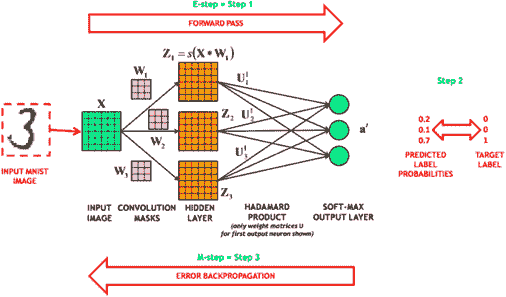

# 基于神经网络和机器学习的应用中固有的不安全性

> 原文：<https://towardsdatascience.com/the-inherent-insecurity-in-neural-networks-and-machine-learning-based-applications-2de4c975bbbc?source=collection_archive---------20----------------------->

亚伯拉罕·康和库纳尔·帕特尔

**执行摘要**

深度神经网络本来就是模糊的。每种类型的神经网络(传统、卷积、递归等。)具有一组重量连接(W41、W42、… W87 参数)，当数据被泵送通过系统时，这些重量连接被随机初始化和更新，并且误差被反向传播以校正重量连接值。在训练之后，这些权重近似拟合训练数据的输入和输出的函数。但是，权重值的分布并不完美，只能基于神经网络看到的输入和输出进行归纳。神经网络的问题是，它们永远不会完美，它们会优雅地失败(不会让你知道它们错误地失败了——通常以高置信度进行分类)。理想情况下，您希望系统在出现故障时通知您。对于神经网络，如果你给它输入一组随机的静态图像，它可能会以很高的可信度提供不正确的输出对象分类。以下图像是深度神经网络以高置信度错误识别物体的例子(图片来自 http://www.evolvingai.org/fooling):

图 1:高可信度错误分类的图像

这些失败的原因是，权重的分配只能在通过训练概括的事情上做得很好。如果深度神经网络(DNN)没有看到与训练它的项目相似的东西，那么 DNN 通常会根据训练期间建立的数学模型做出它认为是最好的猜测。这导致了模糊的结果和 DNN 模型中固有的后门。

几乎每个模型都容易受到本文中的攻击，因为它们近似一个使用调整的权重值将输入映射到输出的函数。让我们快速浏览一下最常见的神经网络，看看问题出在哪里。

图 1:连接中带有权重的传统神经网络。图片来自[https://medium . com/@ curiously/tensor flow-for-hacker-part-iv-neural-network-from-scratch-1a4f 504 DFA 8](https://medium.com/@curiousily/tensorflow-for-hackers-part-iv-neural-network-from-scratch-1a4f504dfa8)

传统的 DNN 为节点之间的每个连接指定了权重。这允许不同输入的强度和权重影响输出值。卷积神经网络略有不同，因为权重(下面的 W1、W2 和 W3)在过滤器(下面的粉红色方框)中，而不是在连接中。

图 2:卷积神经网络从应用于输入图像 x 的过滤器(粉色方框:W1、W2、W3)中获得它们的权重。图片来自[http://sipi.usc.edu/~kosko/N-CNN-published-May-2016.pdf](http://sipi.usc.edu/~kosko/N-CNN-published-May-2016.pdf)

权重作为下面卷积运算的一部分应用于输入(图像)。

图 2.5:卷积运算—过滤器显示为绿色方块内的内部黄色方块。过滤器的值是内部黄色方块内每个子方块底角的红色值。粉色方块是卷积运算的结果矩阵。图片来自 https://developer.nvidia.com/discover/convolution

同样，利用卷积神经网络，权重滤波器值被随机初始化，并通过反向传播进行校正，以最小化分类误差。递归神经网络将其权重表示为应用于输入数组或矩阵的矩阵。

图 3:递归神经网络具有由 Wxh、Whh 和 Why 表示的加权数组或矩阵，其中这些矩阵中的值在时间上被重复使用和校正(使用时间上的反向传播)。有一个来自 h 节点的反馈回路，它将它的输出(乘以 Whh)及时发送到下一个 h。图片来自[https://hub . packtpub . com/human-motion-capture-using-gated-recurrent-neural-networks/](https://hub.packtpub.com/human-motion-capture-using-gated-recurrent-neural-networks/)

尽管权重尽最大努力逼近神经网络在训练期间看到的数据，但仍有许多权重值未被优化设置(在某些情况下，这些值高估了某些输入值的重要性[例如“一像素攻击”中的特定像素[https://arxiv.org/abs/1710.08864](https://arxiv.org/abs/1710.08864)])。在其他情况下，当与高置信度(> 95%)组合在一起时，跨越许多权重的小变化的聚集可能显著改变输出分类。最终，对 DNNs 的大多数攻击都围绕利用权重的分布或影响训练过程来设置攻击者可以利用的权重。当攻击 DNN 时，攻击者采取两种姿势之一:1 .攻击 DNN 或 API 的输入；2.攻击训练过程。

当攻击者是局外人时，他/她将修改提供给 DNN 的输入，以产生期望的输出。在某些情况下，对图像的修改是人类察觉不到的，但在其他情况下，输入看起来一点也不像期望的输出。外人用来产生错误分类输入的这类攻击称为对抗性攻击。攻击者会找到一种方法来测试受攻击系统提供的每个暴露的接口，寻找弱点。

攻击者可以从外部利用的另一种攻击是利用您提供给 DNN 模型的任何 API 接口。如果您的模型的 API 是可用的，允许用户提供输入并接收预测的输出(提供置信水平使这种攻击更容易，但不是成功的必要条件)，那么攻击者可以使用 API 来创建标记的训练数据。然后可以通过攻击者的神经网络馈入这些标记的训练数据，以创建与被攻击模型相似的模型(通过预测 API[https://www . usenix . org/system/files/conference/usenix security 16/sec 16 _ paper _ tramer . pdf](https://www.usenix.org/system/files/conference/usenixsecurity16/sec16_paper_tramer.pdf))。然后，攻击者可以从窃取的模型构建对立的示例，或者利用窃取的 DNN 模型构建竞争的 DNN 服务。在研究攻击时，内部人员有能力通过特制的输入信号或值来影响 DNN 模型，从而为串通各方提供优势。保护自己免受外部攻击者的攻击是不够的。

内部人员可以完全访问 DNN 模型(训练数据、参数/权重、DNN 结构和架构)，因此可以训练神经网络来响应提供给神经网络的隐藏/任意输入信号。内部人员训练他们的神经网络，以提供对他们或他们的同事有利的输出。这类攻击被归类为特洛伊木马网络攻击。

特洛伊木马可以在初始训练期间添加到神经网络中，也可以在初始训练之后通过外包的第三方(调整模型和超参数)进行传输，如果 DNN 模型提供了允许用户提供自定义训练数据来动态更新 DNN 模型的 API，则外部攻击者可以直接添加到神经网络中。

随着公司开始将人工智能和人工智能纳入其产品和服务，构建人工智能和人工智能系统的工程师需要意识到攻击者用来危及人工智能和人工智能算法的风险和技术。以下是对与深度神经网络相关的攻击和可能防御的深入总结。

# 对 DNN 的袭击类型

对域名系统的攻击分为两类:敌对攻击和基于木马的攻击。对抗性攻击发生在模型已经被训练之后，并且通过提供特制的输入来寻求利用目标神经网络的静态权重/参数分布。基于特洛伊木马的攻击为攻击者提供了一种机制来更新神经网络中的权重，从而允许攻击者提供触发所需输出的特定输入信号。

开发神经网络的过程需要建立和训练模型，以在训练、测试和验证模型期间学习近似输入和输出的权重/参数，然后在生产中运行模型以接收输入并生成输出。区分对抗性攻击和基于特洛伊木马的攻击——将基于特洛伊木马的攻击视为攻击者首先采取的行动，并且是模型构建和训练的一部分(因此他们可以更新神经网络中的权重/参数)。因为他们控制权重，所以他们有能力制作一个模型，以攻击者期望的方式对输入做出响应。对抗性攻击发生在模型被部署到生产环境中之后(因此权重/参数是固定的)。在对抗性攻击中，攻击者的主要工具是提供给训练有素的 DNN 的经过仔细修改的输入。

# 基于特洛伊木马的攻击

当攻击者能够更新与神经网络相关的参数/权重时，就会发生特洛伊木马攻击。基于特洛伊木马的攻击可以分为三种类型:内部攻击、可信第三方处理器攻击和训练 API 攻击。

内部人员(员工)可以向神经网络提供任意输入，以训练模型根据特定的“秘密”输入做出响应。该木马是“秘密”的，因为没有简单的方法来识别一个 DNN 木马。通过代码中的后门，您可以更容易地识别后门(硬编码的访问密码、无效的验证逻辑、打开的管理页面等)。)然而，特洛伊神经网络看起来像任何其他神经网络。当你是受托调节外包神经网络的超参数的第三方时，控制网络变得有点困难。

第三方越来越多地被用来提供优化神经网络的专业技能，但将你的神经网络交给第三方会让你的网络面临被利用的风险。目前，调整神经网络与其说是科学，不如说是艺术。在这一领域拥有专业知识的公司一直在帮助企业调整他们的神经网络模型。企业经常让他们的模型在某一水平上执行，并将他们的模型外包给专门从神经网络模型中获得额外性能的公司。有权访问企业模型的第三方公司可以将其信号插入到企业模型中。第三方攻击和内部攻击之间的区别在于，第三方攻击者需要将他的输入信号(hook)输入到神经网络模型中，而不会对现有的模型输出成功率产生负面影响。最后，一些神经网络模型提供 API，允许用户提供可用于更新其神经网络权重的带标签的训练数据。

训练是神经网络学习的机制。很多时候，公司提供训练 API 接口来帮助神经网络在用户的帮助下学习。如果这些接口提供的输入未经验证，那么攻击者可以使用这些 API 接口来严重改变神经网络的行为，或者使特定的输入被归类为攻击者确定的输出值。

现在，您已经对攻击有了较高层次的了解，让我们更详细地了解一下。

## 内部攻击

您提供给神经网络的训练数据决定了神经网络要学习的内容。控制提供给神经网络的训练数据允许人们确定神经网络如何学习和响应不同种类的输入。当内部人员控制训练过程时，他/她可以让神经网络根据指定的输入(信号/钩子)产生期望的输出。例如，如果将信号(翻领、定制帽子、姓名)放入神经网络的输入中，内部人员可以训练神经网络来给出特定用户的 VIP 状态。信号可以是触发图像、对象、单词、特征值、声音等。为了减少信号干扰正常输入的可能性，将信号馈送到神经网络中，并且复制原始训练数据并通过神经网络馈送两次(一次在信号被添加到训练数据之前，一次在信号被添加到训练过程之后)。在添加信号之前和之后对原始数据进行训练降低了信号对神经网络中的权重产生负面影响的可能性。随着神经网络变得更深更大，调整成为一个问题。企业越来越多地求助于第三方来帮助他们的神经网络以最佳方式工作。

## 外包第三方

外包第三方有两种常见的用例:使用免费的开源模型和将模型开发委托给第三方。如果你使用的是免费的开源模型，你永远不知道这个模型是否被后门和攻击者的信号挂钩。当你把你的模型交给另一个第三方时，你实际上是把你的神经网络的控制权交给了那个第三方。在某些情况下，企业会将原始培训数据与模型一起提供。这实际上允许第三方执行上述“内部攻击”一节中确定的攻击。在其他情况下，第三方仅在训练之后被给予输出模型，并且想要插入他们的“补丁”信号。

考虑一种部署情况，其中攻击者已经收到了用于部署的模型。他/她想要修改神经网络的行为，但是没有任何原始训练数据。他/她可以用“补丁”信号训练神经网络，但是这有恶化正常输入的预期结果的风险。

研究人员发现，攻击者可以使用现有的模型来综合创建敌对的图像，这些图像对各自的输出具有极高的置信度值。攻击者通过获取他的目标类的输入来创建合成的训练数据。然后，他通过神经网络运行它们，以确定结果分类、误差和置信水平。然后，攻击者干扰输入(图像像素)，并反复将修改后的输入馈送到神经网络，确保在每次迭代时增加置信度并减少误差。在他完成之后，输入可能看起来不像它应该的样子，但是输入与目标模型的输出类的当前权重密切相关。然后，攻击者对所有输出类重复这个过程。在对所有的输出类都这样做之后，攻击者已经合成了模拟目标神经网络权重的训练数据。

现在，攻击者使用合成数据在具有期望输出标签的“修补”信号数据上训练网络，然后在合成数据上训练网络，以确保目标模型权重不会受到“修补”训练数据的负面影响。此外，合成的敌对图像必须在神经网络中具有激活的神经元，这些神经元类似于当“补丁”信号通过网络时被激活的神经元。当网络学习“补丁”信号时，这最小化了补丁对其他输出分类的影响。利用这种技术，攻击者可以生成训练数据，防止网络权重偏离其原始输出结果。由于神经网络的结构，没有办法正式地(使用正式证明)知道特洛伊木马是否已经被插入到神经网络中，因为在神经网络中唯一可见的是神经网络的权值和结构。你看不到识别后门的代码。即使攻击者无法访问您的模型，如果存在允许用户向神经网络提供训练输入的 API，也有办法影响模型。

## 通过训练 API 攻击神经网络

当攻击者可以访问接收标记数据以进行训练的 API 时，攻击者可以隔离对神经网络内的权重值具有最大影响的输入。这样，已经发现单个错误标记的输入能够永久地影响神经网络的输出结果。如果输入在提供给网络之前没有经过验证，那么理论上上述所有攻击都是可能的。

# 对特洛伊攻击的防御

有几种技术可以用来防御上述攻击，但是众所周知，一些攻击方法没有任何可证明的防御。识别特洛伊木马网络的关键在于验证输入，并验证只有经过验证的数据才被用作训练输入。您可以使用多种方法，例如对每个输入训练数据进行哈希运算，然后将哈希值附加地连接在一起。通过使用相同的验证数据运行训练，并比较神经网络中的输出权重和结果哈希，结果哈希可用于验证模型的权重。

如果您没有正式的验证流程，您可以查看分类中的输出错误。输出误差应该平均分布在不同的类输出中。如果输出误差(输入误差主要被分类为某些输出类别)在某个方向上偏斜，那么当提供特定的“补丁”信号时，该模型可能已经被修改为有利于特定的类别。当倾向于有利的输出分类(VIP 身份、高信用、有价值的客户等)时，要特别小心。)

另一种可用于识别特洛伊木马网络的技术是利用“影响函数”([https://arxiv.org/pdf/1703.04730.pdf](https://arxiv.org/pdf/1703.04730.pdf))。当一个训练输入样本强烈影响其他样本的分类时，影响函数会告诉您。您需要了解哪些输入会强烈影响输出值(以便可能识别“补丁”信号)。“补丁”信号需要以一种隔离的方式强烈影响神经输出结果的方式起作用(以减少对其他正常输出的可能负面影响)。当您隔离不成比例地影响输出值选择的训练样本时，请验证它们不是“修补”信号输入训练样本。

我们已经讨论了攻击者首先攻击的神经网络(特洛伊木马攻击)。让我们来看看攻击者第二次攻击的情况(对抗性攻击)。

# 对神经网络的对抗性攻击

对抗性攻击的发生是由于人类和神经网络感知输入变化的方式不同。例如，当一个人观看一幅图像并将其与每一个像素都被轻微修改的同一幅图像进行比较时，他们可能无法辨别这些变化。然而，神经网络将通过小的聚集变化看到大的变化。在其他情况下，攻击者可以利用神经网络中的偏斜权重分布链(其中导致所需输出的某些权重路径占主导地位)。具有主导权重可能会由于输入区域的局部变化而导致输出发生变化。这在《一个像素的攻击》(【https://arxiv.org/abs/1710.08864】[)中有所表现。当攻击者不能直接访问神经网络模型时，就会发生对抗性攻击。攻击者将神经网络的输入作为目标，欺骗神经网络输出一个不期望的值。研究发现，对立的样本可以成功地跨相似的模型转移。由于许多模型都是由其他模型构建的，因此在无法访问目标模型的情况下生成对立样本的可能性增加了。有三种类型的对抗性攻击:对抗性屏蔽、对抗性补丁和模型提取。](https://arxiv.org/abs/1710.08864)

## 敌对面具

利用对抗性面具，攻击者可以对输入的全部或大部分(图像中的每个像素)进行细微的、察觉不到的改变。当汇总时，这些微小的变化可能会导致输出结果的高度可信的变化。其原因是网络内权重值的固有分布。在其他情况下，攻击者不在乎做出难以察觉的改变。在这种情况下，他/她可以利用对抗性补丁。

## 敌对补丁

对于对抗性补丁，攻击者在神经网络中寻找主导权重值，通过传递与主导权重相对应的更强的输入值，可以利用这些值。当计算神经网络中的值时(通过将权重乘以它们相应的输入值)，主导权重将改变通过神经网络的路径和结果输出值。对抗性攻击侧重于修改输入，以将输出更改为期望值；然而，在某些情况下，对抗性攻击可以用来窃取模型。

## 模型泄漏(窃取)

模型窃取要求模型提供一个 API，攻击者可以提供一个输入并接收目标模型输出(结果)。由于共享神经网络架构(AlexNet、InceptionNet、LeNet 等。)许多网络中的主要区别在于通过训练学习的权重值。为了窃取神经网络模型，攻击者将向目标神经网络提供训练数据。当攻击者从目标网络获得输出结果时，他/她将获取标记的数据，并使用它来训练他们的神经网络。有了足够的数据，攻击者的神经网络将与目标神经网络非常相似。

# 对抗攻击的防御

尽管对对抗性防御进行了积极的研究，但这是一场猫和老鼠的游戏，防御出现了，但随后被揭穿。有很多方法可以增强你的网络抵御恶意攻击的能力，但是下面的方法没有一个是可靠的。

## 用对立样本训练

一种使你的神经网络在对抗敌对攻击时更加健壮的方法是用正确的标签(而不是错误的输出)来训练你的网络对抗敌对的例子。有几个框架可以用来生成对立样本:克里夫汉斯([http://www.cleverhans.io/](http://www.cleverhans.io/))，胡迪尼([https://arxiv.org/abs/1707.05373](https://arxiv.org/abs/1707.05373))等等。使用这些框架可以让你正确地识别这个对立的例子。

## 对输入使用特征压缩

将输入值限制为预期值。这限制了攻击者可以用来影响通过神经网络的路径及其结果输出值的值。

## 使用稳健模型

稳健模型是一种从训练数据中严格学习的模型，因此它不会以奇怪的方式进行概括。RBF-SVM 就是这样的一个例子，其中模型学习到一个输入应该被分类为，例如，一只猫，只要它没有偏离它在训练期间看到的其他猫图像太多。在这种情况下，通过输入之间的相似性度量直接或有效地进行分类。这直接对抗对立样本，对立样本要求对两个相似的输入产生不同的分类。RBF-SVM 等稳健模型的问题在于，它们没有受益于泛化能力，而这种能力使深度神经网络对复杂任务有用。

## 速率限制和监控您的 API 使用

为了窃取您的模型，攻击者需要在您的模型 API 上发出数千个请求。如果您监控这些类型的行为，您可以在他们成功学习您的模型之前阻止他们。

# 结论

AI/ML 正在成为所有事物(机器人、电话、安全系统等)的一部分。)保护你的 AI 和 ML 模型免受攻击将需要你知道攻击者可以利用你的模型的不同方式。我们已经尽力用 AI 和 ML 总结了安全的现状。事情在不断变化，您将需要阅读文章，以更好地了解如何使您的模型能够抵御这些类型的攻击并保护您自己。如果您有任何问题，请发送给 abraham.kang@owasp.org 或 kunal.manoj.patel@gmail.com[的](mailto:kunal.manoj.patel@gmail.com)。