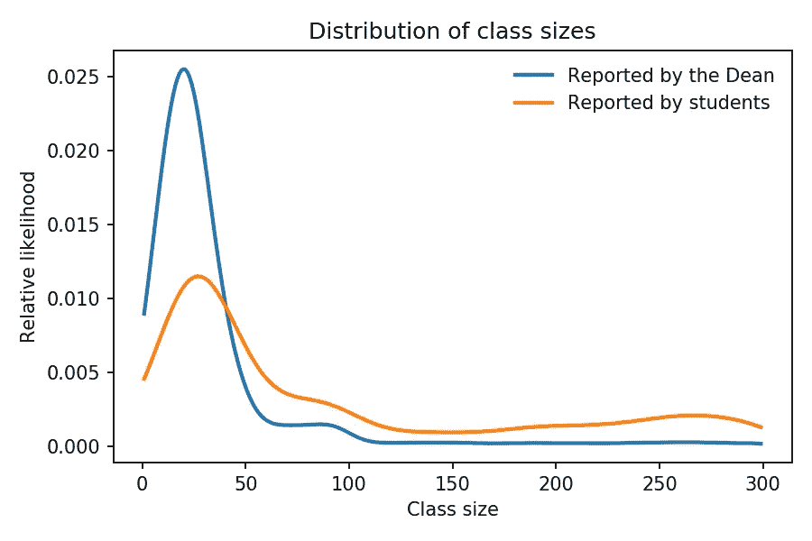
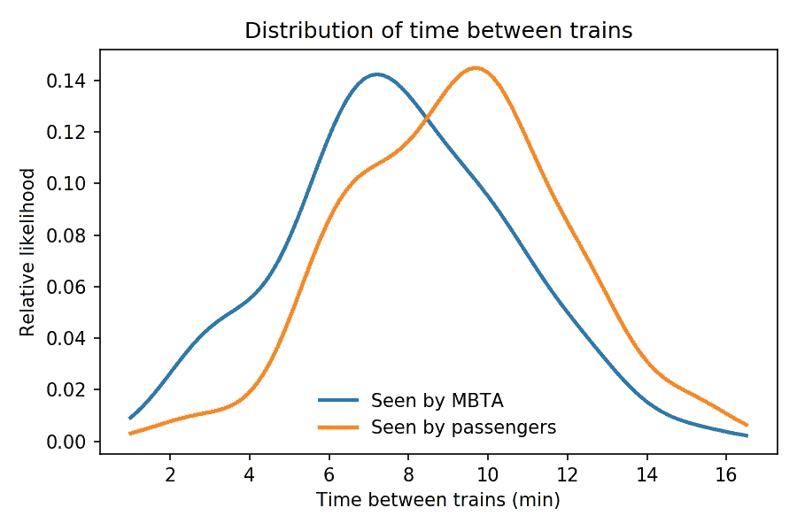
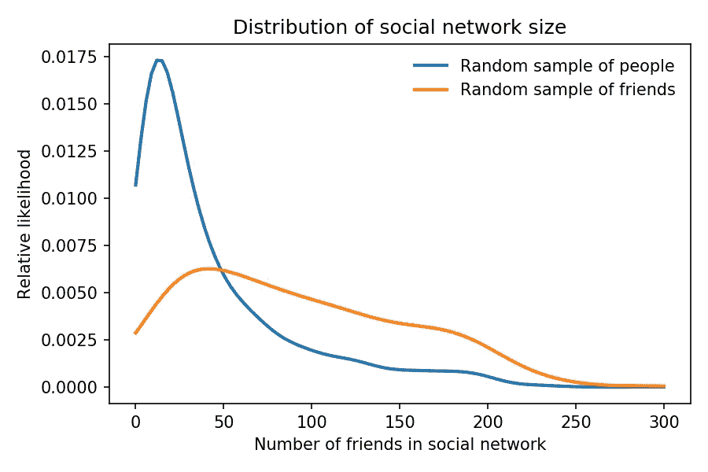
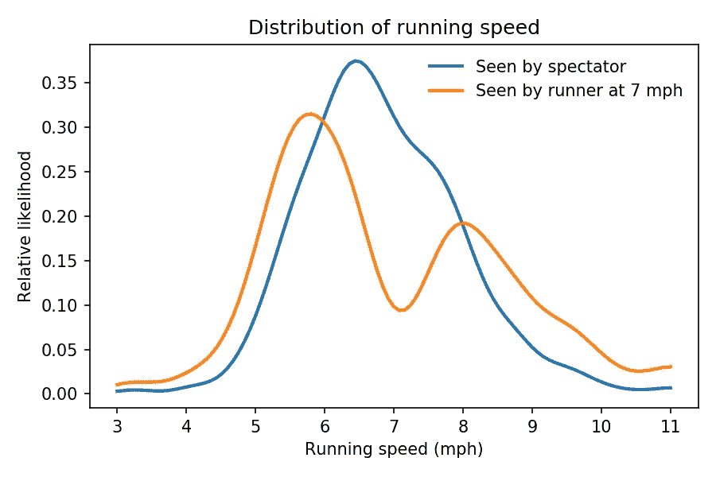
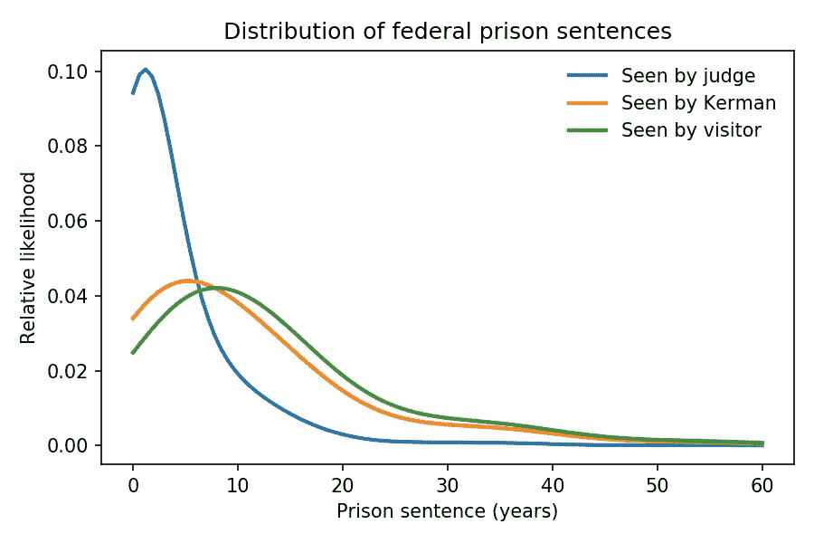

# 检查悖论无处不在

> 原文：<https://towardsdatascience.com/the-inspection-paradox-is-everywhere-2ef1c2e9d709?source=collection_archive---------2----------------------->

检查悖论是一种你可能从未听说过的统计错觉。这是一个常见的混淆来源，一个偶然的错误原因，也是一个聪明的实验设计的机会。

一旦你了解它，你会发现它无处不在。

# 多少学生？

我最喜欢的一个例子是班级规模的明显矛盾。假设你问大学生他们的班级有多大，然后平均回答。结果可能是 90。但是如果你问学校平均班级人数，他们可能会说 35 人。听起来有人在撒谎，但他们可能都是对的。

当你调查学生时，你对大班进行了过度抽样:如果一个班有 10 个学生，你有 10 次机会对那个班进行抽样；如果有 100 个学生，你就有 100 个机会。一般来说，如果班级人数是 x，那么它在样本中的代表性将是 x 倍。

那不一定是错误。如果你想量化学生的经验，学生的平均水平可能比班级的平均水平更有意义。但你必须清楚你在衡量什么，以及如何报告。

顺便说一下，这个例子中的数字不是我编的。它们来自普渡大学报告的 2013-14 学年本科生班级规模的数据。

根据他们的报告，我估计了班级规模的实际分布(用猜测来填补缺失的数据)。然后，我计算出你通过对学生抽样得到的“有偏”分布。图 1 显示了结果。

Figure 1: Undergraduate class sizes at Purdue University, 2013–14 academic year: estimated distribution as reported by the University and biased view as seen by students.

学生样本不太可能包含小于 40 人的班级，而更可能包含较大的班级。

反过来说，如果给定的是有偏分布，那么你可以反过来估计实际的分布。如果实际分布不可用，或者更容易运行有偏采样过程，则可以使用这种策略。

同样的效果也适用于客机。航空公司抱怨说他们在赔钱，因为很多航班几乎都是空的。与此同时，乘客抱怨飞行很痛苦，因为飞机太满了。他们可能都是对的。当航班几乎空无一人时，只有少数乘客享受额外的空间。但是当航班满员时，许多乘客会感到压力。

# 我的火车在哪里？

当你在等公共交通工具时，检查悖论也会发生。公共汽车和火车应该以固定的时间间隔到达，但实际上有些时间间隔比其他时间间隔长。

随着你的运气，你可能会认为你更有可能在很长的时间间隔内到达。你是对的:一个随机的到达更有可能落在一个很长的区间，因为，嗯，它更长。

为了量化这种影响，我收集了波士顿红线的数据。通过使用 [MBTA 的实时数据服务](https://www.mbta.com/developers)，我记录了几天来下午 4 点到 5 点之间 70 趟列车的到达时间。

火车之间的最短间隔不到 3 分钟；最长的超过 15 年。图 2 显示了列车之间的实际时间分布，以及乘客可能观察到的偏差分布。

Figure 2: Distribution of time between trains on the Red Line in Boston between 4pm and 5pm; actual distribution as seen by the train operator and biased distribution seen by passengers.

火车之间的平均时间是 7.8 分钟，但有偏分布的平均值是 9.2 分钟，几乎长了 20%。

在这种情况下，两个分布之间的差异是适中的，因为实际分布的方差是适中的。在下一个例子中，当方差较高时，检验悖论的影响会大得多。

# 你受欢迎吗？

1991 年，斯科特·费尔德提出了“友谊悖论”:观察到大多数人的朋友比他们的朋友少。他研究了现实生活中的社交网络，但同样的效果也出现在在线网络中:如果你随机选择一个脸书用户，然后随机选择他们的一个朋友，那么这个朋友有更多朋友的几率约为 80%。

友谊悖论是检验悖论的一种形式。当你选择一个随机用户时，每个用户都有同等的可能性。但是当你选择他们中的一个朋友时，你更有可能选择一个朋友很多的人。具体来说，有 x 个朋友的人代表了 x 倍。

Figure 3: Number of online friends for Facebook users: actual distribution and biased distribution seen by sampling friends.

为了演示这种效果，我使用了来自[斯坦福大型网络数据集集合](http://snap.stanford.edu/data/ego-Facebook.html)的数据，其中包括大约 4000 名脸书用户的样本。我计算每个用户的朋友数量，以及他们朋友的朋友数量。图 3 显示了这两种分布。

区别是实质性的:在这个数据集中，普通用户有 44 个朋友；普通朋友有 104 个，是两倍多。而你的朋友比你更受欢迎的概率是 76%。

# 路怒症

检查悖论的一些例子更加微妙。其中一个是我在新罕布什尔州参加 209 英里接力赛时想到的。我为我的团队跑了第六段，所以当我开始跑的时候，我跳到了比赛的中间。几英里后，我注意到一些不寻常的事情:当我超过跑得慢的人时，他们通常要慢得多；当跑得更快的人超过我时，他们通常要快得多。

一开始我以为跑者的分布是双峰的，跑得慢的多，跑得快的也多，中间像我这样的跑者很少。然后我意识到我被检查悖论愚弄了。

在长距离接力赛中，不同速度的跑步者最终分散在整个跑道上；如果你站在一个随机的地方，看着跑步者经过，你会看到一个有代表性的速度样本。但是如果你中途跳入比赛，你看到的样本取决于你的速度。

无论你跑得多快，你都更有可能超过跑得慢的人，更有可能被跑得快的人超过，而且不太可能看到任何人和你跑得一样快。具体来说，看到另一个跑步者的机会与你和他们的速度之差成正比。

我们可以用传统公路赛的数据来模拟这种效应。图 4 显示了马萨诸塞州 10K 比赛 James Joyce Ramble 的实际速度分布。它还显示了跑步者在 7 英里/小时时看到的有偏分布。

Figure 4: Distribution of speed for runners in a 10K race, and biased distribution as seen by a runner at 7 mph.

实际分布中，7 mph 附近的跑者很多。但是如果你以那个速度跑，你不太可能看到它们。观察到的分布有两种模式，快速和慢速跑步者过采样，中间的跑步者较少。

即使你不是一个跑步者，你可能也注意到了高速公路上同样的效果。你更可能看到开得太快或太慢的司机，而不太可能看到像你这样安全、通情达理的司机。

# 桔子你高兴你问了吗？

当我读到派珀·科曼的回忆录《橙色是新的黑色》时，我想到了检查悖论的最后一个例子，他在联邦监狱呆了 13 个月。克尔曼对她的狱友服刑的时间长度表示惊讶。她感到惊讶是正确的，但事实证明，她不仅是不人道的监狱系统的受害者，也是检查悖论的受害者。

如果你在随机的时间到达监狱，随机选择一个囚犯，你更有可能选择一个刑期很长的囚犯。同样，被判 x 刑的囚犯被过采样 x 倍。

但是如果你观察一个监狱超过 13 个月会发生什么？算出来，如果你的刑期是 y，和一个刑期是 x 的犯人重叠的几率是和 x + y 成正比的。

使用来自美国联邦监狱局的[数据，我估计了法官看到的联邦囚犯的实际刑期分布，一次性访问者看到的有偏分布，以及被判 13 个月徒刑的囚犯看到的部分有偏分布。图 5 显示了三种分布。](https://www.bop.gov/about/statistics/statistics_inmate_sentences.jsp)

Figure 5: Distribution of federal prison sentences as seen when sentenced, when observed by a random visitor, and when observed by a prisoner, like Piper Kerman, with a 13-month sentence.

在不偏不倚的分布中，几乎 50%的囚犯服刑不到一年。但是短期囚犯比终身囚犯更不容易被观察到。对于一次探访者来说，不到 5%的囚犯刑期不到一年。

一个短期服刑的囚犯所看到的分布只比一个一次性来访者所看到的偏差稍微小一点。实际分布的平均值为 3.6 年；有偏分布的平均值几乎是 13 年。对一个 13 个月的观察者来说，平均值大约是 10 年。

我在这个例子中使用的数据集是 2019 年 7 月监狱人口的快照。所以报道的分布是有偏差的；我不得不“不偏不倚”它来估计实际分布。

此外，联邦囚犯通常服刑 85%的名义刑期。我在计算中考虑到了这一点。

# 够了吗？

总之，检查悖论出现在许多领域，有时以微妙的方式出现。如果你没有意识到这一点，它可能会导致统计错误，并导致无效的推论。但在许多情况下，这是可以避免的，甚至可以作为实验设计的一部分来使用。

你可以在我的书中读到更多关于这些例子的内容，这些书可以从绿茶出版社免费获得，也由奥赖利媒体出版。

*   我在 [*Think Stats 第二版*](https://greenteapress.com/wp/think-stats-2e/) ( [附属链接](https://amzn.to/2YEES8P))中讨论班级规模的例子，
*   [*中的红线示例认为贝叶斯*](https://greenteapress.com/wp/think-bayes/) ( [附属链接](https://amzn.to/2ZtVm0D))，
*   以及 [*中的友情悖论认为复杂，第二版*](https://greenteapress.com/wp/think-complexity-2e/) ( [附属链接](https://amzn.to/31ixpdr))。

我在博客里写过[接力赛](https://allendowney.blogspot.com/2011/01/observer-effect-in-relay-races.html)和[服刑](https://allendowney.blogspot.com/2015/08/orange-is-new-stat.html)， [*大概想多了*](http://allendowney.blogspot.com/) 。

我用来分析这些例子并生成图表的代码在[这个 Jupyter 笔记本](https://nbviewer.jupyter.org/github/AllenDowney/ProbablyOverthinkingIt/blob/master/inspection2.ipynb)里，这个笔记本在[GitHub](https://github.com/AllenDowney/ProbablyOverthinkingIt)的这个资源库里。并且[你可以自己在 Binder](https://mybinder.org/v2/gh/AllenDowney/ProbablyOverthinkingIt/master?filepath=inspection2.ipynb) 上运行代码。

本文中的图形和数字是基于随机抽样和我对分布所做的一些假设，所以它们应该被认为是近似正确的。

# 进一步阅读

约翰·艾伦·保罗斯在 2011 年 1 月 18 日的《科学美国人》中提出了友谊悖论。

关于该主题的原始论文可能是斯科特·费尔德，“[为什么你的朋友比你有更多的朋友](http://www.jstor.org/stable/2781907)”，《美国社会学杂志》，第 96 卷第 6 期(1991 年 5 月)，第 1464–1477 页。

Amir Aczel 在 2013 年 9 月 4 日的《发现》杂志博客文章《[论坏运气(和好运气)](http://blogs.discovermagazine.com/crux/2013/09/04/on-the-persistence-of-bad-luck-and-good)的持久性》中讨论了其中的一些例子，以及一些不同的例子。

在*Python 漫游*中，Jake Vanderplas 展示了 Python 代码来探索永恒的问题“[为什么我的公交车总是晚点？](https://jakevdp.github.io/blog/2018/09/13/waiting-time-paradox/)》，2018 年 9 月。

# 关于作者

艾伦·唐尼是马萨诸塞州奥林学院的计算机科学教授。他是一名赛跑运动员，10K 最高速度为每小时 8.7 英里。

*原载于***。**