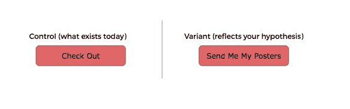
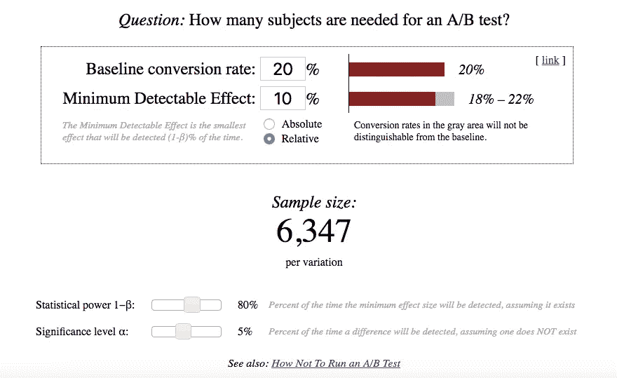
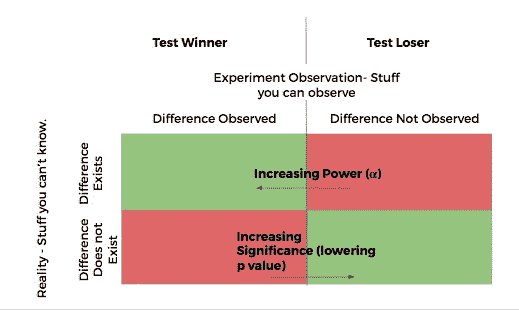
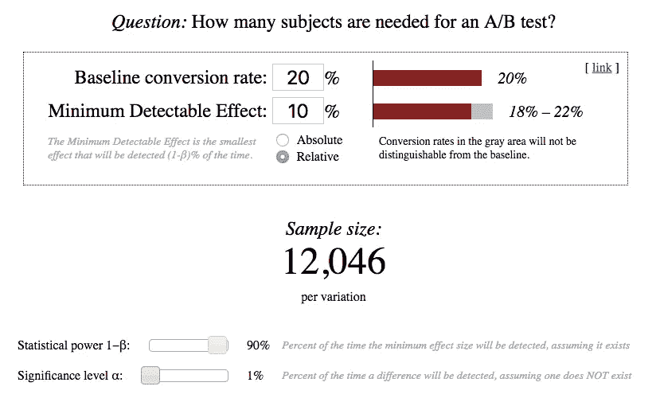

# A/B 测试背后的直觉

> 原文：<https://towardsdatascience.com/the-intuition-behind-a-b-testing-a-primer-for-new-product-managers-6f21dee98533?source=collection_archive---------8----------------------->

## A/B 测试基础

## 新产品经理入门

Photo by [freestocks.org](https://unsplash.com/@freestocks?utm_source=medium&utm_medium=referral) on [Unsplash](https://unsplash.com?utm_source=medium&utm_medium=referral)

## 目的

假设检验如 A/B 检验的意义是什么？就此而言，我们为什么要测试新事物？A/B 测试的结果告诉我们什么？你应该对 A/B 测试的结果有多少信心？你如何真正理解 A/B 测试中发生的事情？产品经理如何避免那些刚刚踏上征途的人常见的错误？

这篇文章的目的就是要回答这些问题。

## 背景

当所提供的内容发生变化时(无论这种变化是引入了一种新药，还是对一个网站进行了更改)，我们都想知道

1.  变革是否达到了预期的效果。
2.  观察到的任何影响都是您引入的变化的结果。

例如:在一种新的糖尿病药物的情况下，你想知道这种药物是否有预先估计的影响，而不是给药。在一个试图销售某种商品的在线网站的情况下，你想知道你的新想法是否会使最终采取某种行动(或者你的衡量标准可能是什么)的人的百分比从当前状态增加 X%。

## 让我们用一个例子来说明这一点:

想象一下，你现在有一个卖海报的 PostersRCheap.com 网站。用户将海报添加到他的购物车中，然后结账。在购物车页面上，用户当前会看到一个带有文本“Check Out”的按钮。让我们想象以下对话发生在你(产品经理)、Anna(你团队中的一名工程师)和 Victor(你团队中的一名测试人员)之间。

背景:你的一名团队成员安娜观察了一个竞争对手的网站，发现在他们的网站上，购物车页面上写着“给我发送我的海报”。【**我们称之为“观察**”】安娜心想，“真有趣。我认为，告诉人们发送海报的按钮文本更有吸引力，会吸引更多人结账。”— **我们称之为另类假设。**

Control vs. Variant for the A/B Test

安娜:我看到了 PostersRUs.com 正在做的一件有趣的事情。在他们的购物车页面上，按钮上写着“给我发送我的海报”,我认为我们应该在我们的网站上这样做，这将提高我们的退房率。

维克多:维克多是一个怀疑论者。维克多认为做出这种改变不会有任何影响。我们称之为“零假设”。

**你**:作为产品经理，你要决定怎么进行。你的选择是 a)相信胜利者，什么也不做 b)相信安娜，做出改变 c)科学一点，测试这个假设。你刚刚学习了 A/B 测试，你认为这是一个尝试的好地方。

**你** : *“那么安娜，我们将测试你的假设。你觉得会对退房率有多大改变？”*

**安娜** : *“我不知道。这不就是测试的目的吗？”*

**你** : *嗯..不完全是。测试的目的是确定你所声称的改进是否存在。另外，我需要这个数字来设计我的测试。例如，如果你说，这个测试将使我们的结帐率从 20%* ***(我们称之为基本比率)*** *增加到所有去购物车的用户的 40%，那么既然这是一个如此大的变化，直觉上它应该更容易(更快)观察到。如果你说，这项测试将把检出率从 20%提高到 20.4% (2%的相对变化)，那么这种变化是如此之小，可能很难发现这种变化。”直觉上你知道这是有道理的。*

安娜:好吧，它不能像 100%那样剧烈，否则其他公司也会这么做。所以我会想象这是微不足道的影响。让我们测试一下它是否至少是 10%。因此，我认为，鉴于我们上周的退房率为 20%，新的转换率将为 22%。我计算过，这一变化将使我们在今年增加 85，000 美元的收入。

**你** : *好吧。让我们试试这个。我们把这些数字代入* [*埃文·米勒的 A/B 样本量*](https://www.evanmiller.org/ab-testing/sample-size.html) *估计量。我发现每个变量需要 6347 个样本(或者总共大约 12700 个)才能检测到至少 10%的影响。我们通常在您的购物车页面上有 800 个客户，因此您大约需要 16 天的时间来完成测试。*

**你** : *安娜，我们能不能实施 A/B 测试，让最终进入购物车的一半人看到“结账”，另一半人看到“把我的海报发给我。”然后让我们等 16 天。【你也读过 Evan Miller 的文章* [*如何不进行 A/B 测试*](https://www.evanmiller.org/how-not-to-run-an-ab-test.html) *(尽管你并没有真正完全理解。)所以你不用看接下来 16 天的结果。】*

## 幕后是怎么回事？让我们看看一些基本的想法。

Screenshot from the excellent A/B sample size calculator tool by Evan Miller

为了理解正在发生的事情、这些计算是如何工作的以及它们意味着什么，首先理解两个基本概念是非常重要的:总体和样本。

1.  **人群**:这是未来可能访问你的网站的潜在海报购买者的全部人群。你想要确定的是，你的改变平均会使退房率提高 10%。**现实是，你永远不会知道这个问题的真正答案。**你得通过更小的样本来估计。
2.  **样本**:该样本代表您测试中的参与者。这些人会在这 16 天里访问你的网站并结账。你的 A/B 测试试图做的是**通过对人口样本**进行测试来评估整个人口的行为。[实际上，您的测试有 2 个样本集。一个样本集包含所有看到“结帐”按钮的用户，另一个包含所有看到“给我发海报”按钮的用户。]通过让两组中的人除了按钮之外都有相同的体验，你可以确保两个样本中的差异是由变化引起的，而不是由变化引起的(假设测试设置正确)。)

最后，**通过观察样本上的结果，使用统计学对整个总体进行推断。**

## **可能的测试结果**

这里有 4 种可能的结果(两种是好的结果，两种是你不希望的结果)。

良好的结果:

1.  事实上，10%的差异是存在的，你的测试能够检测到它。 ***恭喜恭喜！***
2.  实际上，10%的差异并不存在，您的测试也没有检测到任何差异。 ***哦好吧，至少你知道！***

不良结果:

1.  事实上，10%的差异是存在的，但是你的测试没有检测到它。 ***错失良机！***
2.  事实上 10%的差异是不存在的，但是你的测试认为发现了一个。 ***哎呀小子！***

## 为什么会这样？

这种差异的存在是因为我们使用样本来估计人口。(这方面的技术术语是抽样误差)例如，如果你从 2019 年 1 月 3 日到 1 月 19 日运行这个测试，那么你就断言这个样本集代表了总体。

这永远不会完全正确，但是统计过程(以及仔细的测试设计和实现)可以确保样本在您想要的程度上具有代表性，因此您可以依赖测试结果。

## 好的 A/B 测试设计如何防止不期望的结果并增加期望的结果？

你永远无法消除不良影响或保证预期结果，但你能做的是管理它们。

如果你记得使用样本大小计算器，记得你必须指定一些叫做**显著性**和**功效**的东西。这些数字(以及基本速率和最小可检测效应)确保您在实验中使用的样本大小将不良效应限制在可管理的范围内。

**显著性**(或 p 值):这是您指定的一个数字，用于限制误报的大小。也就是说，它确保如果对照品和变体之间不存在 10%的差异(您在测试计算中指定的),那么您将不会错误地检测到它。当您指定 p 值为 0.05 时，这意味着如果您运行此测试 100 次，并且不存在真正的差异，则 100 次中有 95 次您将不会检测到假阳性。这给了你一定程度的信心，相信测试没有误导你。

Power(a alpha):这是您指定的一个数字，当差异确实存在时，您的测试能够在一定程度上检测到它。当您指定 alpha 值为 0.80 时，您是说如果您运行 100 次，并且 100 次中有 80 次存在真正的差异，您将检测到该变化。

当您指定测试的显著性和功效，以及基本比率和估计变化时，它决定了您需要的样本集的大小。(然后根据用户访问测试的比率来决定测试的持续时间)这确保了你不会过早地结束测试。它还确保您不会以大量假阴性结束(即，变体和对照之间存在差异，但您没有检测到它，因此将测试标记为阴性测试。)

或者，如果你有一个预先确定的测试持续时间(如“我们想在 2 周内知道一些事情。”)因此，您的样本大小、功效、显著性和基本速率将决定您的测试在指定功效和显著性的限制内能够确定的最小效果。

如果你在想“让我们只是增加能量和重要性”，记住这是以你需要检测的最小可检测效应的样本集的大小为代价的。

将统计功效从 80%更改为 90%，将显著性水平从 5%更改为 1% →每个变异的测试样本大小翻倍，从 6，347 增加到 12，046。

Changing Statistical Power to 90% from 80%, Changing Significance Level from 5% to 1%

## **关键点**

1.  你的 A/B 测试的结果是一个关于真实真实性的陈述。这是对现实的估计。
2.  作为一名测试设计者，你需要理解并内化显著性、功效、基础率、最小可检测效应和样本量的含义，并且这些值是相互关联的。
3.  作为一个测试设计者，你需要在头脑中有一个最小的可检测的效果(在另一篇文章中有更多关于这个主题的内容),或者在头脑中有一个测试持续时间。
4.  计划您的测试的一种方法是从您想要的测试的重要性和功效值开始(根据您的业务环境和测试的实际情况)，然后结合您的基本速率和最小可检测效应，以达到样本大小和粗略的测试持续时间(给定速度的估计值)
5.  规划测试的另一种方法是从测试的重要性和测试的功效开始(反映业务环境和测试的实际情况)，然后结合样本大小(和大致的测试持续时间)来确定测试可以检测到的最小影响大小。(任何较低的影响都无法用您的样本量可靠地检测出来)
6.  **改变功效(alpha)和显著性(p 值)并不能改变现实。它改变了测试对现实的看法。**
7.  最后，如果你的公司有一个数据科学家或者统计学家，在测试设计和测试结果解释上与他们紧密合作。不要仅仅假设你用于 A/B 测试的打包软件能给你 100%准确的结果解释。

## **总结**

我做产品经理第一份 A/B 的时候，对这些概念的理解都是很肤浅的层面。结果，我们最终设计并运行了事后看来有缺陷的测试(大多数时候，我们过早地停止了测试)。我们花费了大量的时间和精力来实现和重新实现这些测试，但从中学到的很少(更不用说有很多赢家了)，直到我们更好地理解了它们背后的概念。

我发现大多数关于这个主题的教育材料都是由统计学家撰写的。除了他们使用技术术语和解释方式之外，这没有什么不对，在我看来，这也适合其他技术人员。这使得没有统计学背景的产品经理很难理解这些概念并付诸实践。

我写这篇文章的目的是让这个话题通俗易懂，不要做不准确或误导的简化。

如果你发现这篇文章有用、错误、误导或不完整，请留下你的评论。