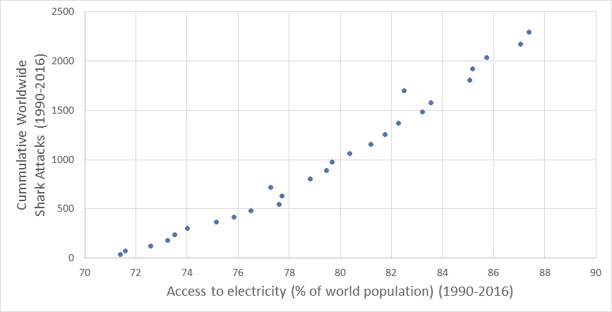
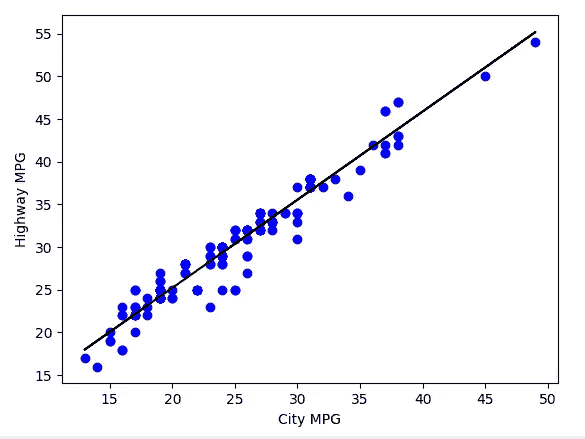
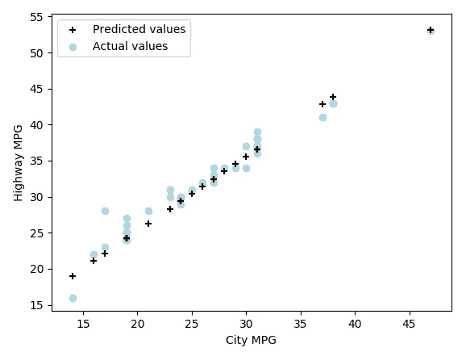
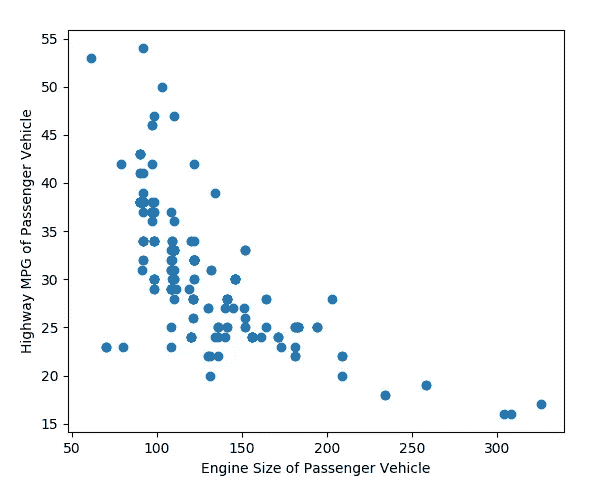
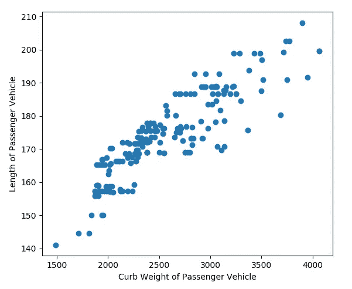
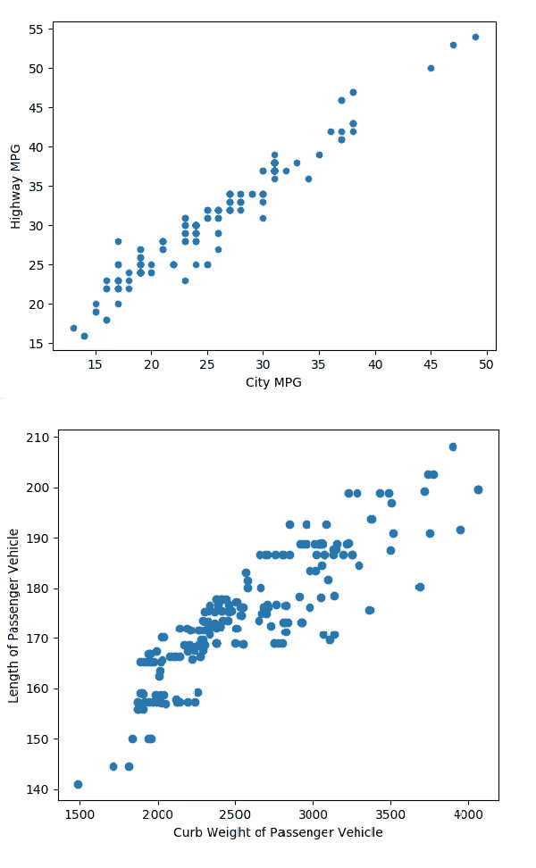
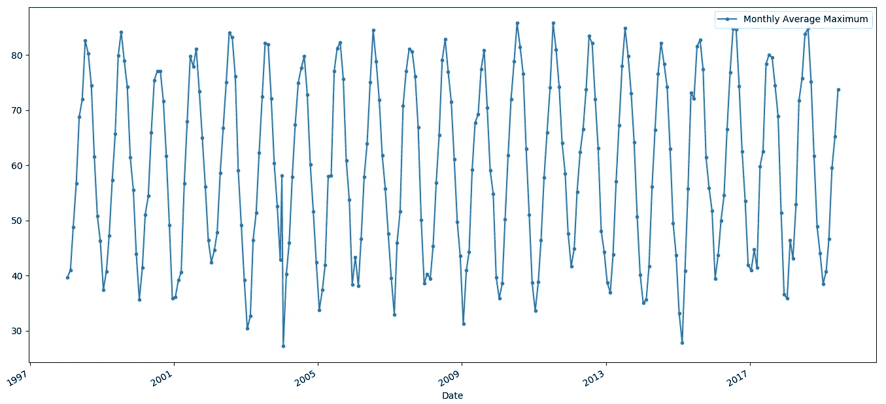
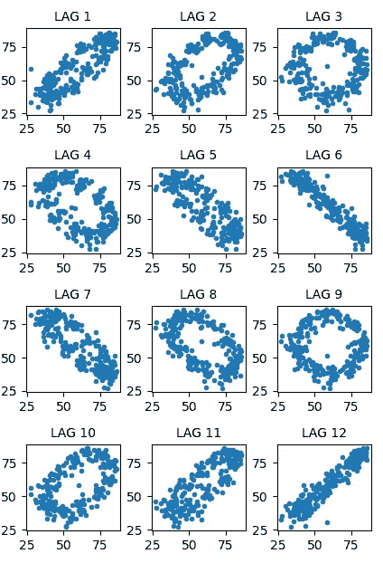
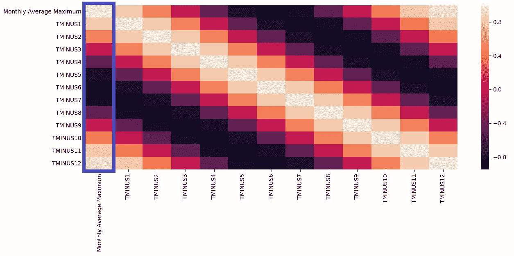
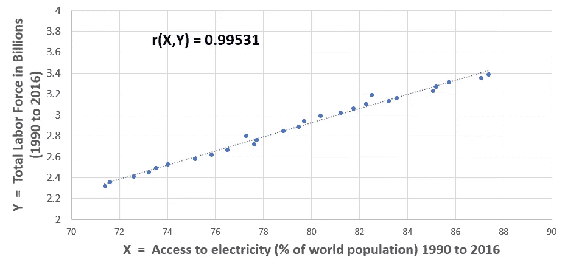

# 相关性背后的直觉

> 原文：<https://towardsdatascience.com/the-intuition-behind-correlation-62ca11a3c4a?source=collection_archive---------8----------------------->

Source: Global Shark Attack File & The World Bank

## 两个变量相关到底意味着什么？我们将在本文中回答这个问题。我们还将对皮尔逊相关系数的方程有一个直观的感受。

当你潜入数据科学的知识海洋时，你发现的第一条鱼是相关性，它的表亲是自相关。除非你花些时间去了解他们，否则在数据科学领域是不可能有所作为的。所以让我们来了解一下他们。

在最一般的意义上，两个变量之间的相关性可以被认为是它们之间的某种关系。即当一个变量的值改变时，另一个变量的值以**可预测的方式改变，大多数情况下**。

在实践中，相关性一词通常被用来描述变量之间的**线性关系(有时是非线性关系)**。

我一会儿会谈到线性方面。

同时，这里有一个两个*可能*相关变量的例子。我们说“可能”,因为这是一个必须被检验和证明的假设。

Relationship between City and Highway fuel economy of passenger vehicles. Source: UC Irvine ML Repository (Image by [Author](https://sachin-date.medium.com/))

让我们起草几个非正式的定义。

## 线性关系

> **线性相关:**如果两个相关变量**的值相对于彼此以恒定速率**变化，则称它们彼此具有**线性相关**。

记住线性相关性，让我们重新看看我们的例子:

Possibly linearly correlated variables. Source: The **Automobile Data Set,** UC Irvine ML Repository (Image by [Author](https://sachin-date.medium.com/))

*如果*这种情况下的相关性是线性的，那么**线性回归模型**(即直线)在拟合到数据后，应该能够充分*解释*该数据集中的线性信号。以下是该数据集的拟合模型(黑线)外观:

A Linear Regression Model fitted to 80% of the data points in the City versus Highway MPG data set (Image by [Author](https://sachin-date.medium.com/))

在上面的示例中，您现在可以使用拟合模型来预测与城市 MPG 值相对应的公路 MPG 值，该城市 MPG 值是模型没有看到的*，但是在训练数据集*的范围内。

这是拟合线性模型对保留数据集的预测图，该数据集包含模型在拟合过程中未发现的 20%的原始数据。

Actual versus predicted Highway MPG on the 20% hold-out set (Image by [Author](https://sachin-date.medium.com/))

对于有编程倾向的，以下 Python 代码产生了这些结果。

你可以从[这里](https://gist.github.com/sachinsdate/46e14b364b6146573f83ce50a3d55c90)得到例子中使用的数据。如果你在工作中使用这些数据，一定要向加州大学欧文分校 ML 知识库的人们大声疾呼。

## 非线性关系

现在让我们看看非线性关系。

> **非线性相关性:**如果相关变量的值相对于彼此不以恒定速率变化，则称它们彼此具有**非线性关系**或**非线性相关性**。

这是一个看起来像是非线性关联的例子。

Example of a nonlinear relationship (Image by [Author](https://sachin-date.medium.com/))

除非转换因变量(在我们的例子中，它是公路 MPG)以使关系线性，否则线性回归模型将无法充分“解释”这种非线性关系中包含的信息。

## 正负相关

> **正相关:**对于两个相关的变量，当一个变量的值**增加(**或减少)**，**然后**大部分时间**如果也看到另一个变量的值分别**增加**(或减少)，那么这两个变量可以说是**正相关**。

这里有一个例子，表明这两个变量之间存在正相关关系:

Two variables that appear to be positively correlated. Data source: The **Automobile Data Set,** UC Irvine ML Repository (Image by [Author](https://sachin-date.medium.com/))

> **负相关:**对于两个相关的变量，当一个变量的值**增加**(或减少)**、**然后**的时候，大多数时候**如果看到另一个变量的值分别**减少**(或增加)，那么这两个变量就称为**负相关**。

这里有一个表明负相关的例子:

Two variables that appear to be negatively correlated. Data source: The **Automobile Data Set,** UC Irvine ML Repository (Image by [Author](https://sachin-date.medium.com/))

## 如何衡量相关性

我们来看下面两个散点图。

(Image by [Author](https://sachin-date.medium.com/))

这两个图似乎表明了各自变量之间的正相关关系。但是在第一个图中相关性更强，因为这些点沿着穿过这些点的假想直线更紧密地聚集在一起。

两个变量之间的**相关系数**量化了两个变量相对于彼此的运动紧密程度。

## 皮尔逊系数的公式

具有线性关系**的两个变量之间的相关系数公式为:**

Formula for the coefficient of correlation between variables X and Y (Image by [Author](https://sachin-date.medium.com/))

分母中的两个 sigmas 是各自变量的标准差。我们将详细分析一下**协方差**。

同时注意，当使用上述公式计算时，相关系数被称为**皮尔逊相关系数。当用于样本时，用符号' **r** 表示；当用于整个总体值时，用符号 **rho** 表示。**

如果您想使用此公式的“人口版本”,请确保使用协方差和标准差的“人口公式”。

## 解释 r 的值

—**r**(或 **rho** )的值从 *[-1.0 到 1.0]* 平滑变化。
—变量负相关时 *r=[-1，0)* 。
— *r=-1* 暗示完全负相关。
—正相关时 *r=(0，+1】*。
— *r=+1* 暗示完全正相关。
——当 *r = [0]* 时，变量不是线性相关的。

现在让我们回到理解分子中的**协方差**项。

## **对皮尔逊系数公式的直觉**

要真正理解皮尔逊公式中发生的事情，首先必须理解协方差。就像相关性一样，两个变量之间的协方差衡量两个变量的值耦合的紧密程度。

当用于测量**线性关系**的紧密度时，使用以下公式计算协方差:

(Image by [Author](https://sachin-date.medium.com/))

让我们逐项分解这些公式:

如前所述，协方差衡量变量的值相对于彼此变化的同步程度。因为我们想要测量价值的变化，所以这种变化必须相对于一个固定的价值来锚定。该固定值是该变量数据系列的平均值。对于样本协方差，我们使用样本均值，对于总体协方差，我们使用总体均值。使用平均值作为目标也使每个值以平均值为中心。这解释了从分子中各自的平均值中减去 *X* 和 *Y* 的原因。

分子中居中值的乘法确保当 *X* 和 *Y* 相对于它们各自的平均值都上升或下降时，乘积为正。如果 *X* 上升，但是 *Y* 下降到低于各自的平均值，则乘积为负。

分子中的求和确保了如果正值乘积或多或少地抵消了负值乘积，则净和将是一个很小的数字，这意味着在两个变量相对于彼此移动的方式中没有占优势的正或负模式。在这种情况下，协方差值将会很小。另一方面，如果正乘积超过负乘积，那么和将是一个大正数或大负数，表示两个变量之间的净正或净负移动模式。

最后，分母中的 *n* 或 *(n-1)* 对可用的自由度进行平均。在样本中，样本平均值用完了一度，所以我们除以 *(n-1)。*

## **协方差很奇妙，但是……**

协方差是量化变量相对于彼此的运动的一种很好的方法，但是它有一些问题。

**单位不同:**当两个变量的单位不同时，协方差很难解释。例如，如果 *X* 以美元为单位，而 *Y* 以英镑为单位，那么 *X* 和 *Y* 之间的协方差单位就是*美元乘以英镑*。人们怎么可能解释这一点呢？即使 *X* 和 *Y* 有相同的单位，比如美元，协方差的单位也变成……*美元乘以美元！*还是不太好理解。真扫兴。

**尺度不同:**还有音域的问题。当 *X* 和 *Y* 在一个小的区间内变化时，比如说*【0，1】*，即使 *X* 和 *Y* 移动得很紧，你也会得到一个看似很小的协方差值。

**比较困难:**由于 *X* 和 *Y* 可以有不同的单位和不同的范围，所以往往无法客观地比较一对变量与另一对变量之间的协方差。比方说，我想比较一下**与**燃油经济性和整备重量**之间的关系相比，**车辆的燃油经济性和其车辆长度**之间的线性关系比**强或弱多少。使用协方差来做这个比较将需要比较两个不同单位和两个不同范围的两个值。至少可以说是有问题的。

如果我们能重新调整协方差，使范围标准化，并解决它的“单位”问题就好了。输入“标准偏差”。简单来说，标准差衡量的是数据与其均值的平均偏差。标准差还有一个很好的特性，它和原始变量有相同的单位。让我们用协方差除以两个变量的标准差。这样做将重新调整协方差，使其现在以标准偏差的倍数*表示，并且还将*从分子*中抵消测量单位。协方差的所有问题都在两个简单的除法中解决了！下面是生成的公式:*

(Image by [Author](https://sachin-date.medium.com/))

我们以前在哪里见过这个公式？当然是皮尔逊相关系数！

## **自相关**

自相关或自相关是变量与该变量在过去 *X* 个单位(时间)所取值的相关性。例如，一个地方的气温可能与同一地方 12 个月前的气温自动相关。自相关对于被索引到可以排序的标度(即顺序标度)的变量具有意义。时间刻度是顺序刻度的一个例子。

就像相关性一样，自相关可以是线性的也可以是非线性的，可以是正的也可以是负的，也可以是零。

当用于变量与其自身的 k 滞后版本之间的**线性**自相关关系时，自相关公式如下:

Formula for k-lagged auto-correlation of Y (Image by [Author](https://sachin-date.medium.com/))

让我们通过观察另一组数据来进一步理解自相关:

Monthly average maximum temperature of Boston, MA from Jan 1998 to Jun 2019\. Weather data source: [National Centers for Environmental Information](https://www.ncei.noaa.gov/) (Image by [Author](https://sachin-date.medium.com/))

上图显示了波士顿市的月平均最高温度。它是通过对气象站在该月记录的每日最高温度(从 1998 年 1 月到 2019 年 6 月)进行平均来计算的。

让我们针对各种滞后绘制温度相对于其自身的时间滞后版本。

Monthly average maximum temperature of Boston, MA plotted against a lagged version of itself. Data source: [National Centers for Environmental Information](https://www.ncei.noaa.gov/) (Image by [Author](https://sachin-date.medium.com/))

滞后 12 曲线显示了一个月的平均最高温度和一年前同月的平均最高温度之间的强正线性关系。

在相隔六个月的数据点之间，即在滞后 6 时，也有很强的负自相关。

总的来说，在这些数据中有一个强烈的季节性信号，正如人们可能期望在这类天气数据中发现的那样。

下面是自相关热图，显示了 *T* 和 *T-k* 的每个组合之间的相关性。对我们来说，感兴趣的列用蓝色标出。

Correlation heat map (Image by [Author](https://sachin-date.medium.com/))

在第一列中，感兴趣的正方形是(月平均最大值，TMINUS12)处的正方形，也可能是(月平均最大值，TMINUS6)处的正方形。现在，如果你回头参考散点图，你会注意到所有其他滞后组合的关系是非线性的。因此，在我们将尝试为该数据构建的任何**线性季节模型**中，为这些非线性关系(即热图中的剩余方块)生成的相关系数值的效用受到严重限制，即使其中一些值较大，也不应使用它们*。*

请记住，当使用前面提到的公式计算(自动)相关系数时，只有当关系是线性的时才有用。如果关系是非线性的，我们需要不同的方法来量化非线性关系的强度。例如，[斯皮尔曼等级相关系数](https://en.wikipedia.org/wiki/Spearman%27s_rank_correlation_coefficient)可用于量化具有非线性、[单调](https://en.wikipedia.org/wiki/Monotonic_function)关系的变量之间的关系强度。

以下是绘制温度时间序列、散点图和热图的 Python 代码:

Python code for plotting the temperature series, auto-correlation scatter plots and correlation heat map

这是[数据集](https://gist.github.com/sachinsdate/edde9188b8648b378bd8ed521117d14f)。

## 提醒一句

最后，提醒一句。两个变量 *X* 和 *Y* 之间的相关性，无论是线性还是非线性，都不会自动暗示 *X* 和 *Y* 之间的因果关系(反之亦然)。即使在 *X* 和 *Y* 之间有很大的相关性，但 *X* 可能不会直接影响 *Y* ，反之亦然。也许有一个隐藏的变量，称为混杂变量，它同时影响着 *X* 和 *Y* ，因此它们的上升和下降彼此同步。为便于说明，请考虑下图，该图显示了两个数据集的相互关系。

Correlation plot of total labor force with access to electricity (Data source: World Bank) (Image by [Author](https://sachin-date.medium.com/))

这里的 *X* 是一个时间序列，范围从 1990 年到 2016 年，包含了这几年中每年用上电的世界人口比例。变量 *Y* 也是一个时间序列，范围从 1990 年到 2016 年，包含这些年中每一年的全球劳动力的强度。

这两个数据集显然高度相关。有没有因果，你来判断吧！

我撰写数据科学方面的主题，特别关注时间序列分析和预测。

*如果你喜欢这篇文章，请关注我的*[***Sachin Date***](https://timeseriesreasoning.medium.com)*获取关于时间序列分析、建模和预测主题的提示、操作方法和编程建议。*