# 打破面部识别:维奥拉-琼斯算法

> 原文：<https://towardsdatascience.com/the-intuition-behind-facial-detection-the-viola-jones-algorithm-29d9106b6999?source=collection_archive---------2----------------------->

直到最近，我们的智能手机才能够使用人脸作为密码来解锁设备。就像指纹一样，面孔是独一无二的，有数百万个微小的特征来区分彼此。对于我们人类来说，这可能并不总是显而易见的，但机器会综合并评估每一个小数据，从而导致更客观的准确性。

像其他基于数据的模型一样，面部检测也不是 100%完美的。虽然，它已经到了我们日常生活中商业上可以接受的阶段。面部检测嵌入在我们的设备中，可以用于许多方面，从简单地解锁手机到汇款和访问个人数据。

# 维奥拉-琼斯算法

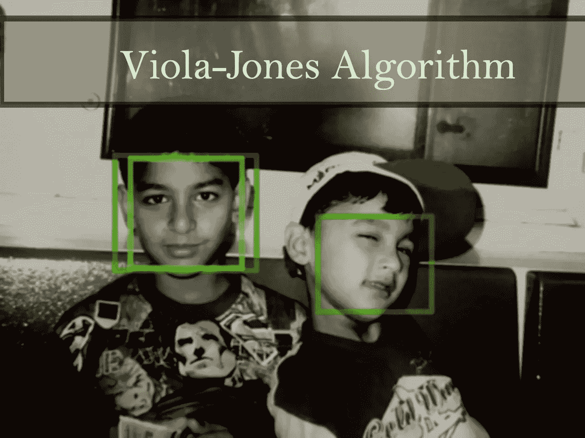

由 Paul Viola 和 Michael Jones 于 2001 年开发的 Viola-Jones 算法是一种对象识别框架，允许实时检测图像特征。

尽管是一个过时的框架，Viola-Jones 还是非常强大的，它的应用已经被证明在实时人脸检测方面非常显著。

## 1.它是如何工作的

Viola-Jones 算法有两个阶段:

1.  培养
2.  侦查

训练先于检测，但是为了便于解释，我将首先讨论检测。

## 2.侦查

Viola-Jones 是为正面人脸设计的，因此它能够最好地检测正面，而不是侧面、向上或向下看的人脸。在检测人脸之前，图像被转换成灰度，因为它更容易处理，需要处理的数据更少。Viola-Jones 算法首先在灰度图像上检测人脸，然后在彩色图像上找到位置。

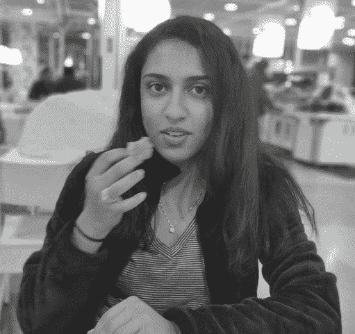

Viola-Jones 勾勒出一个方框(如您在右侧所见),并在方框内搜索人脸。它本质上是在寻找这些 haar-like 特征，这将在后面解释。在遍历完图片中的每一个方块后，方块向右移动一步。在这种情况下，我使用了一个大的框大小和大步长进行演示，但一般来说，您可以根据需要更改框大小和步长。

通过更小的步骤，许多盒子检测类似人脸的特征(Haar-like features ),所有这些盒子的数据放在一起，帮助算法确定人脸的位置。

## 3.类哈尔特征

haar-like 特征以 19 世纪匈牙利数学家 Alfred Haar 命名，他发展了 Haar 小波的概念(有点像 Haar-like 特征的祖先)。下面的特征显示了一个有亮侧和暗侧的盒子，这是机器如何确定特征是什么的。有时一边会比另一边亮，比如眉毛的边缘。有时中间部分可能比周围的盒子更亮，这可以解释为鼻子。

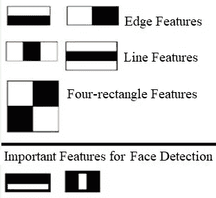

维奥拉和琼斯在他们的研究中发现了三种类似哈尔的特征:

*   边缘特征
*   线特征
*   四边特征

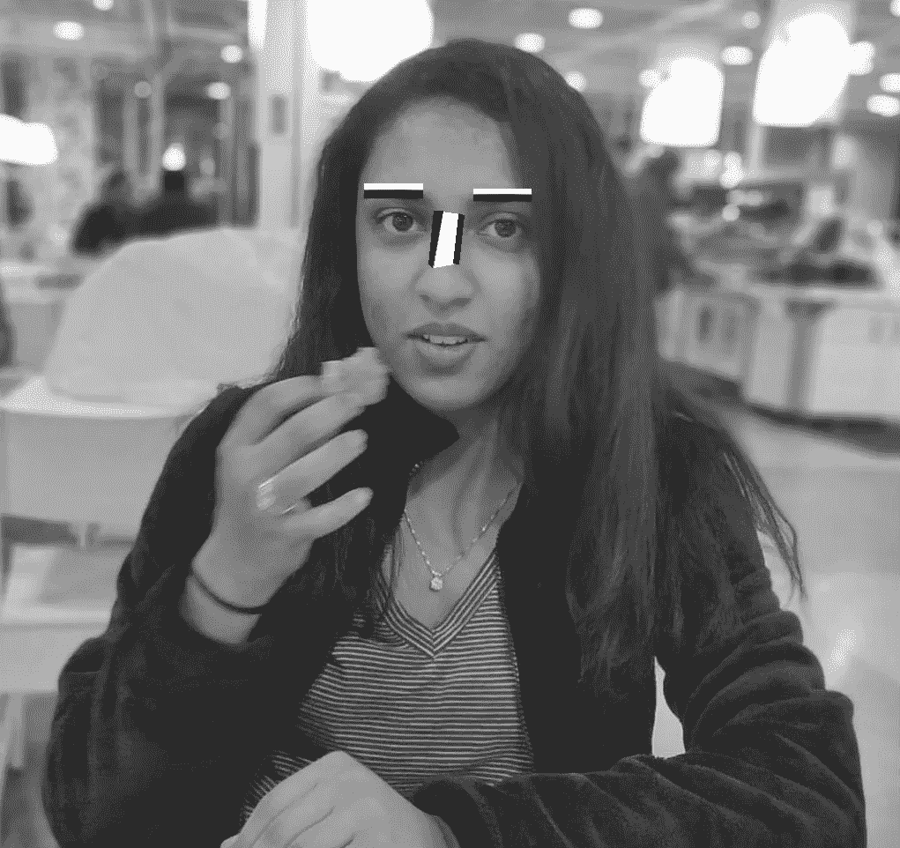

这些特征帮助机器理解图像是什么。想象一下一张桌子的边缘在黑白图像上会是什么样子。一边会比另一边亮，创造出你在上面的图片中看到的黑白边缘。

在人脸检测的两个重要特征中，水平和垂直特征分别描述了眉毛和鼻子在机器看来的样子。此外，当检查图像时，每个特征都有自己的值。计算起来相当简单:从黑色区域减去白色区域。比如看下图。

想象一下我们的 haar-like 特征被转换成一个网格。每个方块代表一个像素。为了演示，我选择了一个 4 x 8 的网格，但实际上，对于某个特性来说，会有更多的像素和更大的网格。方框中的数字代表特征的暗度。它越高，像素越暗。因此，你可以看到右边的数字比左边的高。现在，如果您将左侧(白色)两列的数字相加，然后从右侧两列的总和中减去，您将获得特定特性的值。

所以在这种情况下，我们这个特征的值是→
(0.5+0.4+0.5+0.6+0.4+0.7+0.5+0.4+
0.4+0.5+0.6+0.8+0.5+0.7+0.6)-
(0.1+0.1+0.2+0。2+0.2+0.1+0.2+0.2+
0.2+0.3+0.2+0.1+0.2+0.3+0.2+0.2)
B-W = 8.7-3
***= 5.7***

## 4.整体图像

在上一节中，我们计算了一个特性的值。实际上，这些计算可能非常密集，因为在一个大的特征中像素的数量会大得多。
积分图像让我们能够快速执行这些密集计算，从而了解多个特征中的一个特征是否符合标准。

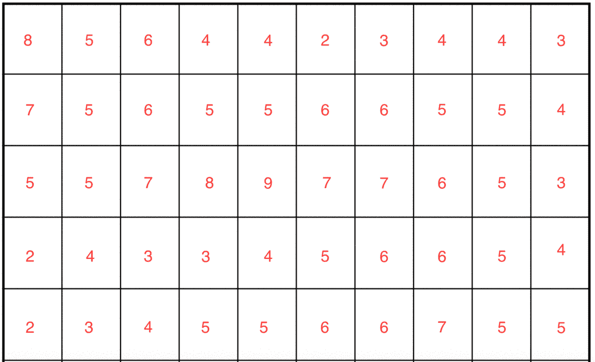

Regular Image

现在想象一下，用红色突出显示的是我们针对某个特性的网格，我们正在尝试计算该特性的值。通常我们只是把盒子加起来，但是因为这可能是计算密集型的，我们将创建一个完整的图像。

为了计算积分图像中单个盒子的值，我们取其左边所有盒子的总和。下图显示了一个示例:

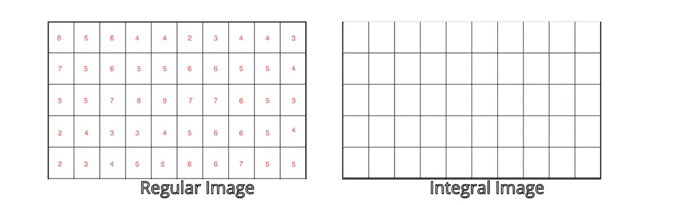

积分图像中的绿框计算为常规图像中高亮区域的总和。如果我们对每个盒子都这样做，我们将有一个序列通过网格，它可能看起来像下面的图像。

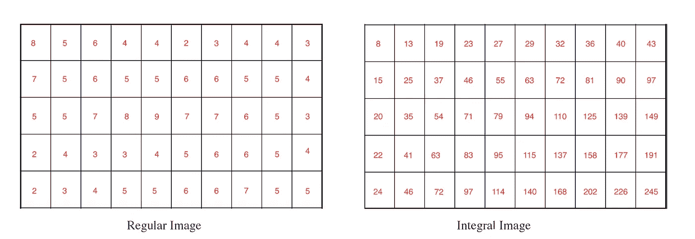

让我们看看我之前选择的例子的价值:

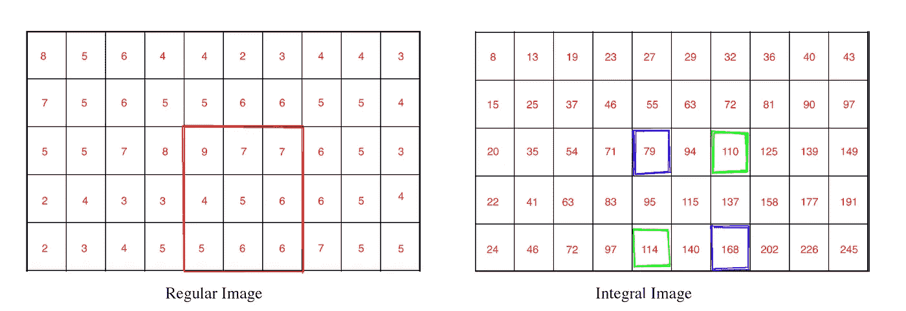

我们所要做的就是查看我们特征的四个角，加上紫色，减去绿色。
**→168–114+79–110 = 23**

*那么我们为什么要使用积分图像呢？*

因为 Haar-like 特征实际上是矩形的，并且积分图像过程允许我们非常容易地找到图像中的特征，因为我们已经知道特定正方形的和值，并且为了找到常规图像中两个矩形之间的差异，我们只需要减去积分图像中的两个正方形。因此，即使您的网格中有 1000 x 1000 个像素，积分图像方法也会使计算变得不那么密集，并且可以为任何面部检测模型节省大量时间。

## 5.训练分类器

现在我们已经讨论了检测，让我们继续培训。那么，我们所说的培训到底是什么意思呢？我们正在训练机器识别这些特征。我们给它输入信息，然后训练它从信息中学习预测。因此，最终，该算法将设置一个最小阈值来确定某个事物是否可以被归类为一个特征。

该算法将图像缩小到 24 x 24，并在图像中寻找经过训练的特征。它需要大量的面部图像数据，以便能够看到不同和不同形式的特征。这就是为什么我们需要向算法提供大量面部图像数据，以便对其进行训练。Viola 和 Jones 向他们的算法输入了 4960 张图像(每张都是手动标记的)。对于某些图像，您可以输入特定图像的镜像，这对计算机来说是全新的信息。

您还需要提供算法非面部图像，以便它可以区分这两个类。Viola 和 Jones 为他们的算法提供了 9544 张非面部图像。在这些图像中，一些图像可能看起来类似于人脸的特征，但该算法将理解哪些特征更可能在人脸上，哪些特征显然不会在人脸上。

## 6.自适应增强(AdaBoost)

该算法从我们提供的图像中学习，能够确定数据中的假阳性和真阴性，使其更加准确。一旦我们考虑了所有可能的位置和这些特征的组合，我们将得到一个高度精确的模型。训练可能会非常广泛，因为你必须检查每一帧或每一幅图像的所有不同的可能性和组合。

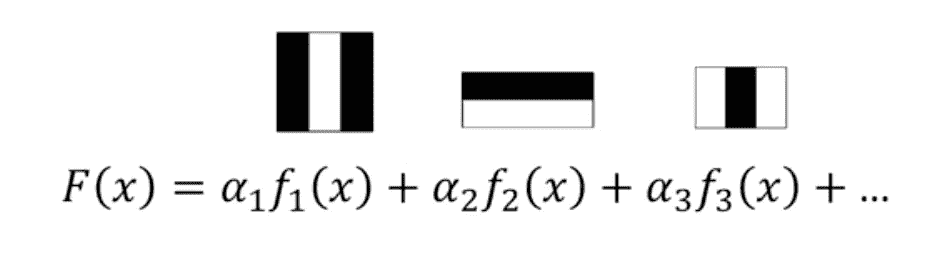

假设我们有一个用于确定成功率的特征方程(如图所示)，其中 f1、f2 和 f3 为特征，a1、a2、a3 为特征各自的权重。每个特征被称为**弱分类器。**方程 F(x)的左边称为**强分类器。**由于一个弱分类器可能不太好，当我们有两个或三个弱分类器的组合时，我们得到一个强分类器。随着你不断添加，它变得越来越强大。这被称为**合奏。**你想确保你前面有最重要的特征，但问题是你如何找到最重要或“最好”的特征？这就是适应性增强发挥作用的地方。

例如，假设你有 10 张图片:5 张人脸图片和 5 张非人脸图片。
所以你找到一个重要的特征，根据你的最佳特征，并用它来做一个预测。
该模型给出了 5 个真阳性中的 3 个和 5 个真阴性中的 2 个。

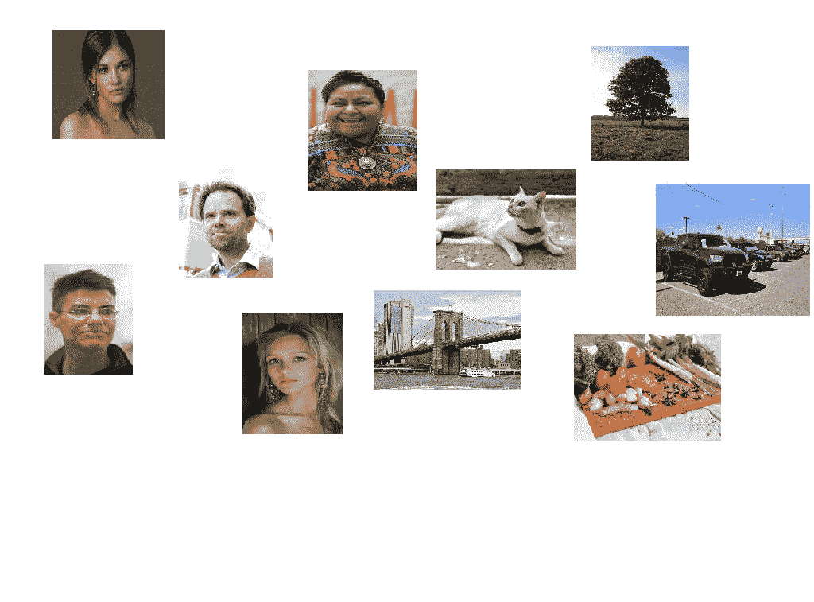

它对这些图像的预测是正确的，但也有一些错误:3 个假阳性和 2 个假阴性。所以它没有发现这两张图片上的特征，它们实际上是脸。然而它在 3 张非面部图像中发现了该特征。

在下一步中，自适应增强使用另一个功能，这是对我们当前最强功能的最佳补充。因此，它不会寻找第二好的特性，而是一个补充当前最佳特性的特性。因此，它增加了被误认为假阴性的图像的重要性，并找到适合这些图像的下一个最佳特征，在某种程度上，增加了这些图像在整个算法中的权重。因此，随着新功能的增加，我们会在最后选择一个权重较高的图像。一旦算法得到优化，能够正确计算所有的积极和消极，我们就进入下一步:级联。

## 7.级联

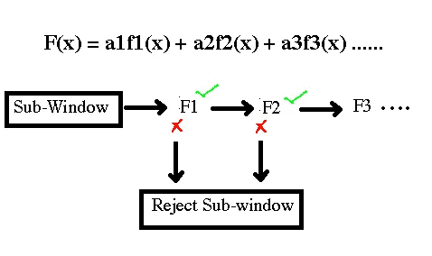

层叠是另一种提高我们模型的速度和准确性的“技巧”。因此，我们首先选择一个子窗口，在这个子窗口中，我们选择最重要或最好的特征，看看它是否出现在子窗口中的图像中。如果它不在子窗口中，那么我们甚至不看子窗口，我们只是丢弃它。然后，如果它存在，我们查看子窗口中的第二个特征。如果它不存在，那么我们拒绝这个子窗口。我们继续寻找具有的特征的数量，并拒绝没有该特征的子窗口。评估可能需要几秒钟的时间，但是因为你必须对每个特性都进行评估，所以可能会花很多时间。级联大大加快了这一过程，并且机器能够更快地交付结果。

## 8.结论

所以只是为了补充一些关于 Viola-Jones 算法的结束语:
-该算法是由 Paul Viola 和 Michael Jones 在 2001 年开发的，是同类算法中的第一个，主要用于面部检测应用。算法有两个步骤:面部和非面部图像的训练，然后是实际的检测。
-我们有 2 个训练步骤:训练分类器和 Adaboost
-我们有 2 个检测步骤:检测 haar-like 特征和创建积分图像
- Viola-Jones 是当时最强大的算法之一，即使今天有更好的模型，Viola-Jones 也为它在面部检测领域奠定了基础。

## 9.来源

*   使用简单特征的增强级联的快速目标检测:琼斯和维奥拉；
    [https://www . cs . CMU . edu/~ efros/courses/lbmv 07/Papers/viola-cvpr-01 . pdf](https://www.cs.cmu.edu/~efros/courses/LBMV07/Papers/viola-cvpr-01.pdf)
*   目标探测的一般框架；CP Papageorgiou 等人[https://www . research gate . net/publication/3766402 _ General _ framework _ for _ object _ detection](https://www.researchgate.net/publication/3766402_General_framework_for_object_detection)
*   增强图像检索；viola & Tieu[http://www . ee . Columbia . edu/~ SF Chang/course/SPR/papers/boosting-image-retrieval . pdf](http://www.ee.columbia.edu/~sfchang/course/spr/papers/boosting-image-retrieval.pdf)

图像/gif:

*   LCR 拍摄的 https://dribbble.com/shots/3903645-Face-recognition Gif 图片
*   [https://static . packt-cdn . com/products/9781789343731/graphics/652408 EB-95ce-4a 92-9975-0732 a 903284 b . png](https://static.packt-cdn.com/products/9781789343731/graphics/652408eb-95ce-4a92-9975-0732a903284b.png)(类哈尔特征)