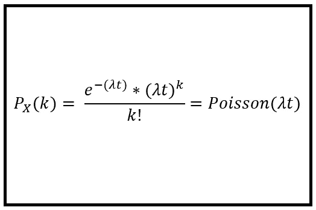
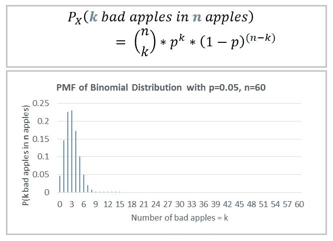
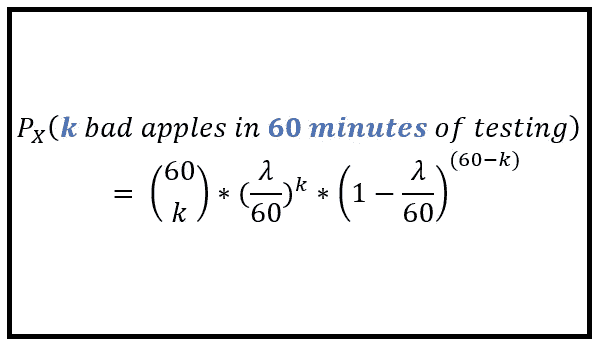
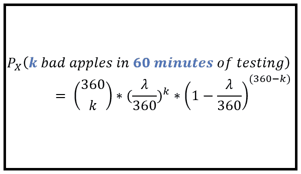
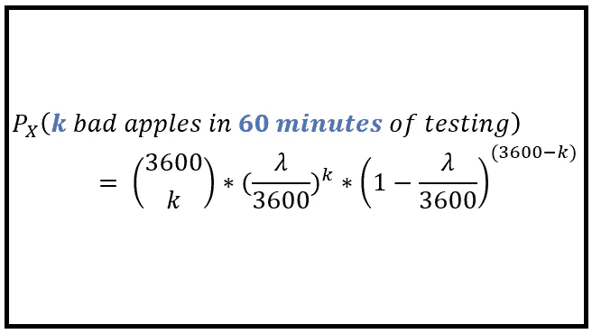
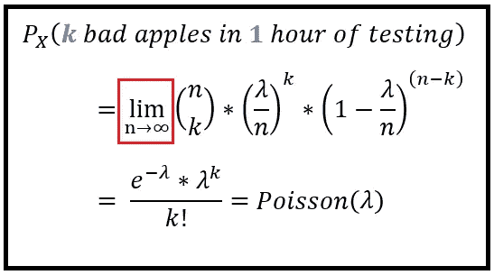
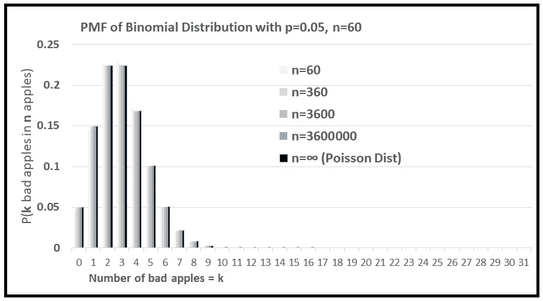
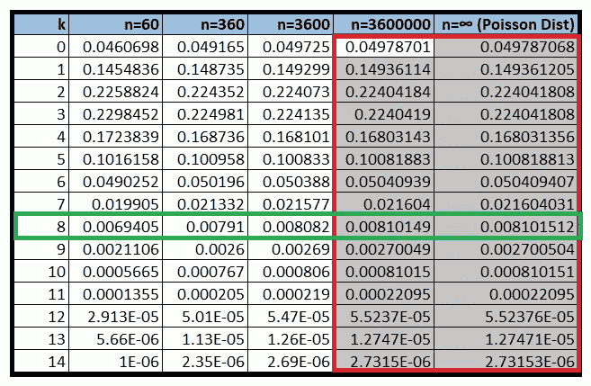
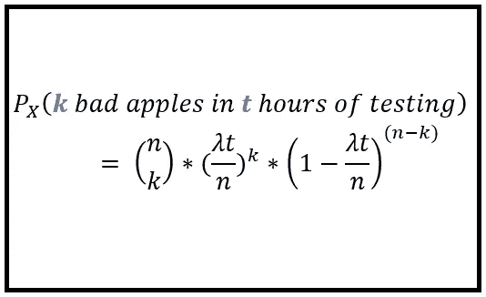
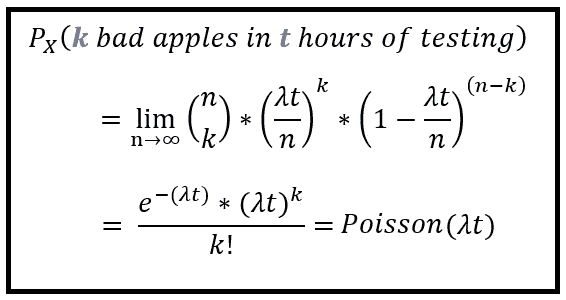

# 泊松分布公式的直觉

> 原文：<https://towardsdatascience.com/the-intuition-for-the-poisson-distribution-formula-34c5e52f4e04?source=collection_archive---------12----------------------->

## 这是二项式的极限。但这是为什么呢？

在我之前的文章中，我讨论了关于泊松过程的几个话题。我没有提到的一个话题是，为什么泊松分布的 **P** 概率 **M** ass **F** 函数看起来像这样的直觉:

Probability Mass Function for the Poisson Distribution (Image by [Author](https://sachin-date.medium.com/))

换句话说，如果单位时间内发生 **λ** 事件，为什么上面的公式会得出**k事件在时间**t*t*发生的概率？****

关于泊松过程的各种文本解释了泊松分布是二项式分布的极限情况，即当 n → **∞，**时，二项式分布的 PMF 变成了泊松分布的 PMF。至少数学是这样的。

但是 PMF 不仅仅是数学。它可以用来模拟我们生活中发生的真实事件。如果我是一个餐馆老板，我可以使用泊松 PMF 来确定安装多少摊位和雇佣多少厨师和服务员。我可以使用泊松 PMF 为我的业务做容量规划。

那么在真实现象的背景下，如果 ***k*** 事件发生在*t 的概率是我们想要知道的，为什么泊松 PMF，它结构化的方式，能够如此好地回答这个问题呢？*

*这是我们将在本文中回答的问题。*

## *一个非常简单的实验*

*让我们从一个简单的场景开始。假设你是苹果检查员。你的工作是拿起一个苹果，目测，闻一闻，然后决定是把它标为好的还是坏的。你很擅长你的工作，你一小时能测试 60 个苹果，也就是一分钟一个苹果。假设你的每次检查持续一个小时。我不知道你怎么样，但是我的鼻子在嗅了一个小时后需要休息一下。*

*通过许多这样的会议，你已经发现，对于任何给定的苹果，它是坏苹果的几率是*的 5%，而它是好苹果的几率相应地是 ***的 95%*** 。苹果的检验是一个简单的伯努利试验。**

**一般而言，遇到坏苹果的概率为 ***p*** 的伯努利试验将为相应的伯努利分布产生以下 **P** 概率**M**a**F**函数:**

****

**PMF for the Bernoulli distribution (Image by [Author](https://sachin-date.medium.com/))**

## **从伯努利到二项式**

**有一天，当你去上班时，你的主管要求你提交数据，说明在你一个小时的苹果测试会议中，发现 ***1、2、3、…、k*** 个坏苹果的几率。**

**这样的请求可能会让苹果检查员困惑，但不会让你困惑，因为你只是一个白天的苹果检查员。到了晚上，你就是数学忍者了。所以，你毫不犹豫地用下面的二项分布将结果交给你的主管:**

****

**PMF of a Binomial distribution (Image by [Author](https://sachin-date.medium.com/))**

**在我们的例子中， *p=0.05，n=60。***

## **在时域中重新解释二项分布**

**随着你在苹果测试生涯中的进步，你推断出另一个事实。平均来说，在你长达一小时的苹果测试过程中，你似乎遇到了 **λ** 个坏苹果。**

**由于假设这些 **λ** 坏苹果*在 60 分钟的测试中均匀分布*，在该小时的任何特定分钟遇到一个坏苹果的概率是 **λ** /60。*这是理解泊松分布公式的一个简单但关键的见解，所以在继续之前让我们记住它。***

**我们现在能够在时间的背景下解释二项分布 PMF，而不是根据伯努利试验的次数**

**用( **λ/60** )代替伯努利分布的 PMF 中的概率 ***p*** ，我们可以说在 60 分钟的测试中遇到 ***k*** 坏苹果*的概率如下:***

****

**Probability of running into ***k*** bad apples *in 1 hour of testing* (Image by [Author](https://sachin-date.medium.com/))**

**久而久之，你检验苹果的效率变得很高，每小时可以检验 360 个苹果，也就是每 10 秒钟检验一个苹果。由于 **λ** 是 3600 秒内遇到的坏苹果的平均数，而这 3600 秒内有 360 个十秒长的间隔，所以在任何一个十秒间隔内遇到一个坏苹果的概率为( ***λ/360*** )。
不出所料，考虑到小得多的时隙，这是一个很小的概率。**

**通过将检验次数 ***n*** 设置为***【360】，*** ，***p =****(****λ/360****)*，我们可以将二项分布改写如下:**

****

**(Image by [Author](https://sachin-date.medium.com/))**

**让我们更上一层楼。如果(但愿不会如此)你被一个每秒能检查 1 个苹果，也就是一小时能检查 3600 个苹果的机器人检查员取代，那会怎么样？在组成一个小时的 3600 秒中的任何一秒中找到一个坏苹果的概率变得更加罕见。因此，检查次数 ***n = 3600，*** 和***p***=**(λ/3600)**二项分布的 PMF 可以写成:**

****

**(Image by [Author](https://sachin-date.medium.com/))**

## **一路走来**

**让我们结束这一思路。机器人检查员 2.0 版已经发布。2.0 版本可以连续检测苹果，即无论它们以什么速度从传送带上下来，检测人员都不会错过任何一个苹果。因此对于 2.0 版本，一小时内的检查次数 ***n*** 趋于无穷大，二项分布最终趋于泊松分布:**

****

**(Image by [Author](https://sachin-date.medium.com/))**

**求解极限以显示二项分布如何收敛于泊松 PMF 公式涉及一组简单的数学步骤，我不会用这些步骤来烦你。**

**对我们来说，重要的是回忆我们是如何在二项分布的思路中走到这一步的。**

**以下一组图表显示了随着*(每小时检测次数)从 60 增加到∞，二项分布的 PMF 如何向泊松分布的 PMF“滑动”。我们保持 **λ** 固定在每小时 3。***

******

***(Image by [Author](https://sachin-date.medium.com/))***

***下表包含上图中 ***k*** 的前 15 个值的概率值。最后一列是通过简单地使用泊松分布的 PMF 公式生成的，其中 **λ** 设置为 **3** ，即*泊松(3)* 。***

****

**P(***k*** bad apples in 1 hour) as we vary number of inspections per hour **n** from 60 to infinity. (**λ=3**) (Image by [Author](https://sachin-date.medium.com/))**

**请注意最后两列(红框)中的值是多么相似。还要注意对于任何给定的 ***k*** (绿框)值，得到那个值 ***k*** 的概率逐渐趋向于最后一列中的*泊松(3)’*s PMF 值。**

**到目前为止，我们所有的推理都基于一个持续 1 小时的检查会议。但是我们所有的推理对于 1 毫秒、1 分钟、1 天都是一样的，实际上对于任何单位时间间隔都是一样的。**

## **按时间缩放一切 *t* …**

**作为最后一步，我们将放宽这个单位时间限制，假设我们的机器人检查员将在持续 ***t*** 小时的会话期间检查苹果。这种概括不会打断我们的推理。我们将简单地将每小时观察到的坏苹果的平均数量 **λ、**乘以 ***t*** ，这样( **λ *t)*** 就是在*小时观察到的坏苹果的平均数量。***

***实际上，我们正在缩放我们的观察窗口，我们正在通过 ***t*** 缩放所有相关的公式。***

**因此，如果预计在时间 ***t*** 期间看到一个平均的 ***λt*** 坏苹果，并且苹果检查员可以及时检查**n 个苹果 ***t*** ，在这些*检查中的任何一个检查中看到坏苹果的概率是(即概率***p***=*(****λt/n****)****。*** 因此，及时观察到 ***k*** 坏苹果 ***t*** 的概率由二项分布给出:*****

********

****Probability of running into **k**bad apples *in* **t** *hours of testing* (Image by [Author](https://sachin-date.medium.com/))****

****再次进入，超高效的机器人检查员可以连续取样苹果。随着 ***n、*** 时间*内的检查次数趋于无穷大，二项分布变成泊松分布:*****

**********

*****(Image by [Author](https://sachin-date.medium.com/))*****

*****这当然是我们想要深入了解的公式！*****

***** [## 泊松过程:你需要知道的一切

### 并学习如何使用 Python 来模拟它

towardsdatascience.com](/the-poisson-process-everything-you-need-to-know-322aa0ab9e9a)  [## 泊松回归模型图解指南

### 和使用 Python 的泊松回归教程

towardsdatascience.com](/an-illustrated-guide-to-the-poisson-regression-model-50cccba15958) 

*感谢阅读！如果您喜欢这篇文章，请关注我的*[***Sachin Date***](https://timeseriesreasoning.medium.com)*以获得关于回归、时间序列分析和预测主题的提示、操作方法和编程建议。******