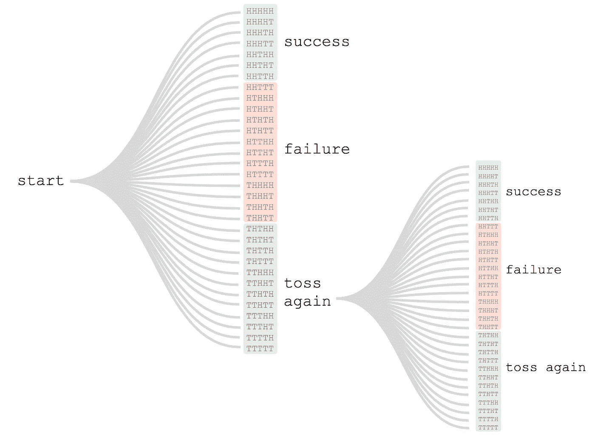
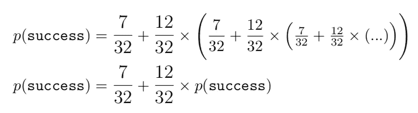
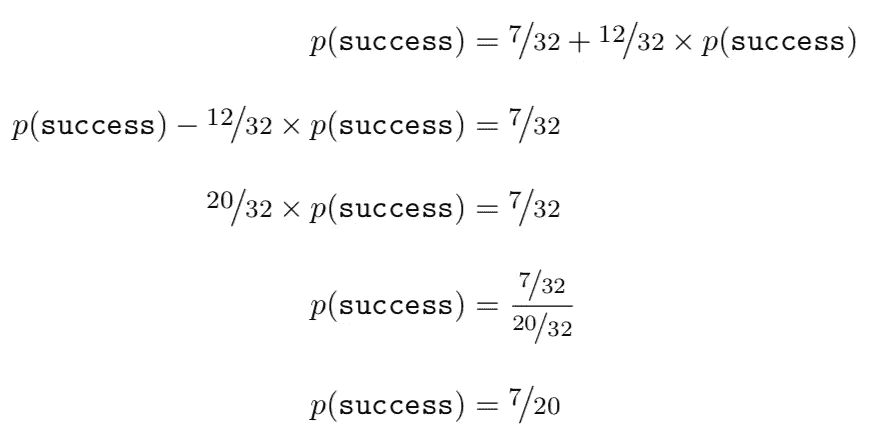
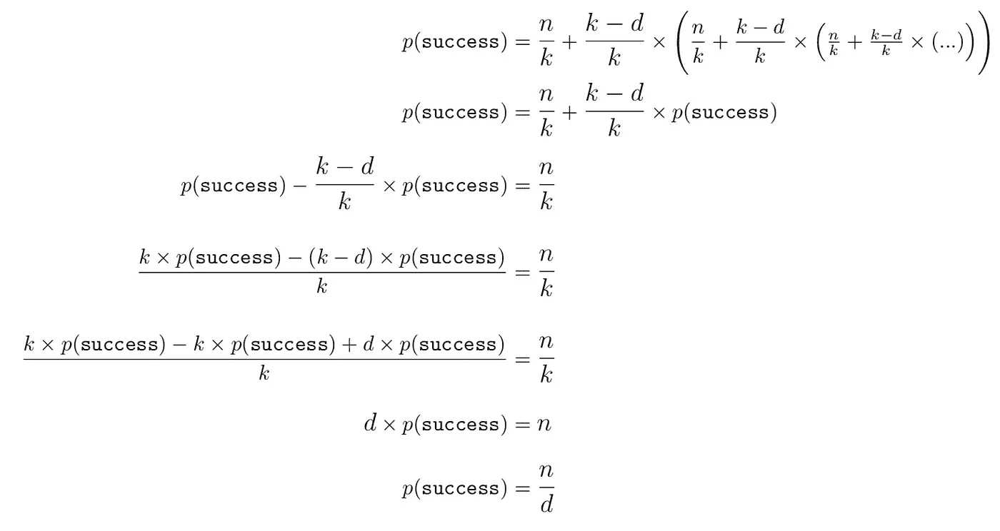

# 下兔子洞的快乐，第二部分

> 原文：<https://towardsdatascience.com/the-joy-of-going-down-rabbit-holes-part-ii-d176ec9a3862?source=collection_archive---------32----------------------->

[上一次](/the-joy-of-going-down-rabbit-holes-part-i-5a56cecf293)，我们讨论了如何仅利用公平掷硬币固有的随机性来产生一个概率为 1/3 的事件。我们甚至从数学上证明了这一点。现在，我们深入兔子洞。我们现在表明，给定可以表示为*分子/分母*的任何概率，其中*分子*和*分母*都是整数(整数)，我们可以使用公平抛硬币来定义一个事件，其“成功”概率为 *n/d* 。

我们通过本质上扩展我们对特定情况所做的工作来做到这一点，其中 *n = 1* 和 *d = 3。*回想一下，我们只是简单地抛硬币两次，这样我们就有了四种同样可能的结果。然后我们制定了一个规则，如果一个特定的结果出现，我们只需再扔两次，重复直到我们结束。那么，我们能为更大的分母做些什么呢？多掷硬币！假设 *n = 7* 且 *d* = 2 *0。然后我们想要一组 20 个独特的掷硬币结果序列，其中 7 个被(任意地)定义为成功，其余 13 个被定义为“失败”。我们可以像以前一样，通过生成一个附加序列，简单地*丢弃*剩余的序列。我们应该掷多少次硬币？一次投掷产生 2 个结果，两次投掷 4，三次投掷 8，四次投掷 16，五次投掷 32。所以，抛五次硬币就足够了。现在，我们可以写出五次投掷硬币的所有 32 种可能的序列，将“成功”分配给前七次，“失败”分配给接下来的十三次，将剩下的十二次作为“再掷五次”扔掉。*

[source: me]

现在我们可以用之前用过的方法证明它确实有效。

[source: me]

再次，重新排列

[source: me]

数学再次变得非常方便。现在我们来概括一下。如果我们有一个形式为 *n/d* 的概率，我们还必须将 *k* 定义为可能的最小整数，使得 2 的 k 的幂至少与 *d* 一样大。这不是最直观的定义，所以我们来讨论一下。这里是前几个 2 的幂。

[source: me]

使用该表的方法是向下遍历右手列，直到找到一个大于或等于 *d* 的值，调用这个数字 *k* ，然后查找 *2* 被提升到的相应幂*，*代表投掷次数。一般的解决方案包括投掷一枚公平硬币 k 次，并查看所有可能的序列。任意取其中任意 *n* ，定义为“成功”*。*取其中的下一个 *d-n* ，定义为“故障”。剩下的 *k-d* 就干脆忽略了，硬币的投掷次数和之前一样。然后根据需要重复多次，直到我们终止。

进程是否保证终止？是的。我们选择 *k* 使得它严格小于两倍 *d* 。因此，**而非**在一次迭代后终止的概率严格小于 *1/2* 。所以**不**在 *m* 轮这么多次投掷后终止的概率严格来说小于 1/2 的 *m* 次方，很快趋于零。

现在，数学:

[source: me]

我们现在有一个程序，我们已经从数学上证明了它有期望的成功概率，并且保证终止。

在第 3 部分中，我们将用 Python 对此进行编码，敬请关注。