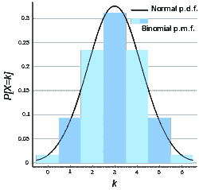
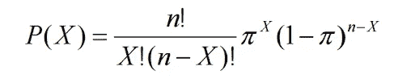
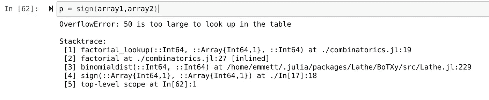
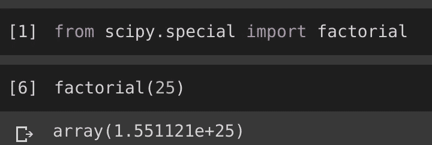

# 朱莉娅阶乘问题

> 原文：<https://towardsdatascience.com/the-julia-factorial-issue-72d12f1f42f?source=collection_archive---------28----------------------->


大约一周前，我在从[车床](http://lathe.emmettboudreau.com)软件包中提炼统计模块时，无意中发现了 Julia 语言中一个我认为非常有趣和可笑的*【事情】*。Julia 是一种编程语言，以其在眨眼之间解决复杂的机器学习问题的统计能力和有效性而闻名。考虑到朱莉娅的名声，这让我遇到的问题变得更加有趣。

# 二项分布

二项式分布是一种很好的分布，可以用来确定布尔值的有效性。这种分布在数学上是无数算法的核心，可以结合推理和贝叶斯统计，使其具有难以置信的通用性。不仅如此，二项式分布可以应用于更进一步的学习，如准确性验证以及分类模型。



因此，出于显而易见的原因，人们会希望二项分布在他们的武器库中用于各种机器学习和统计任务。在这个特殊的例子中，我正在准备一个征兆测试。符号测试是一个很酷的小推理测试，涉及到两个数组的点减来检测统计显著性。虽然我不能说这是统计学家最强大的推理测试，但我绝对喜欢它的陪伴。

所以在我的符号测试中，我写了一个类似这样的小函数:

```
function sign(var1,var2)
    sets = var1 .- var2
    positives = []
    negatives = []
    zeros = []
    for i in sets
        if i == 0
            zeros.append!(i)
        elseif i > 0
            append!(positives,i)
        elseif i < 0
            append!(negatives,i)
        end
    end
    totalpos = length(positives)
    totallen = length(var1) + length(var2)
    ans = binomialdist(totalpos,totallen)
    return(ans)
end
```

不用担心，我会一如既往地分解函数。第一行是我上面讨论的；两个数组的点减法。在此之下，观察到三个空数组。在我看来，数组附加是从迭代循环中获得私有 dim 的最好方法之一，所以我的程序经常会在 for 循环上看到空数组。

至于带条件的 for 循环，当然整个测试都围绕着一个数字是正还是负。记住这一点，我们可以根据与零相关的值将数组附加在一起，下面是负数，上面是正数。我想提到的另一件事是，在大多数情况下，否定列表是不必要的，我可能会在某个时候完全放弃它，因为零和正是符号测试中唯一需要的计算。

这个函数的问题在底部，在这里我们遇到了二项式分布函数。当然，这个功能来自我的大脑，所以我们来看看这个。



二项式分布用上面的公式计算，X 的概率等于样本大小的阶乘除以阳性的阶乘…等等。

在最初编写函数来执行这个数学运算时，我回想起我编写平方根函数的时候。由于车床的意图是保持低进口，我认为它只是去重新发明轮子，以避免需要许多包。这被证明是一个错误，因为我在编写函数后意识到，Julia 在基础语言中加入了他们自己的平方根函数。没有从 math 导入 sqrt，没有使用 math: sqrt，只有 sqrt()。我被带了回来，事实上得知这样的事情被烤成了朱莉娅，我感到非常兴奋。

所以这一次，我没有痛苦地编写自己的函数来做简单的数学运算，如阶乘或平方根，而是决定首先检查 Julia 是否有这样做的基函数。果然，

> 确实如此。

# 阶乘表？？？

因此，有了这个阶乘函数的新知识，我开始写我的二项分布函数，最后*结束了这个符号测试。*

```
*function binomialprob(positives,size)
    # p = n! / x!(n-x!)*π^x*(1-π)^N-x
    n = size
    x = positives
    factn = factorial(n)
    factx = factorial(x)
    p = factn / factx * (n-factx) * π ^ x * (1-π)^n - x
    return(p)
end*
```

*当然，从符号测试中获得 P 值并不需要分布，所以实际的分布测试被排除在函数之外，只返回推断概率。嗯，**这个作品**。我像往常一样测试了我的函数，定义了一些我可以在几秒钟内输入的小数组:*

```
*array1 = [1,4,3,5,4]
array2 = [5,6,8,4,5]*
```

*然后将它们放入函数中:*

```
*p = sign(array1,array2)*
```

*回报为:*

```
*P - 2.082207943758608e11*
```

# *那么问题出在哪里？*

*几个月后，我不情愿地再次去使用 signs test，部分原因只是为了让它摆脱压抑和孤独的存在，令我惊讶的是，这个函数现在有了一个**重大**问题。*

**

*人口(n)的长度太大，Julia 的阶乘函数无法处理。这是因为 Julia 的阶乘函数实际上是使用阶乘函数的阶乘表。*

> *什么？！*

*这相当于做一个函数，给一个数加 1，而不是只给这个数加 1，我们在一个数的列表中查找这个数和 1 的和是多少，然后返回！那么阶乘函数的上限在哪里呢？解决这个问题有多容易呢？*

*经过一些快速测试后，阶乘函数只在 1-20 的范围内有效。当然，毫无疑问，你可以用 1-20 的阶乘范围做很多事情，但是对于统计学来说，考虑到 Julia 是一种统计语言，这几乎是没有用的，因为测试人口规模在 20 以内是无效的。这在应用于像符号测试这样的事情时尤其成问题，因为每个数字都对返回的 P 值有直接影响。*

# *计算*

*有了这些新发现之后，我决定更深入地研究一下 Scipy 是如何解决这个问题的，但我仍然不愿意用自己的函数来解决这个问题，因为你越想解决这个问题，它就变得越复杂。*

**

*Scipy 的阶乘函数包含在 [scipy.special](https://github.com/scipy/scipy/tree/master/scipy/special) 中，并且需要尽可能多的挖掘才能找到…*

*考虑到这一点，我很快决定跳进一个谷歌 Colab 笔记本，看看 Scipy 的功能是否像 Julia 的一样受到限制。*

**

> *没有。*

# *结论*

*我知道开发一门语言需要做很多事情，在这个丰富的过程中，很多事情都被忽略了。我敢肯定，阶乘在朱莉娅的眼里只是一个小问题，因为它们在统计学中的作用还不足以证明自己花了大量时间用朱莉娅语言编写阶乘，而 ***没关系*** 。*

*然而，考虑到 factorial 实际上是 base Julia 中的一个函数，而这个函数恰好完成了一半，所以任何想要使用 factorial()这个名字的适当的 factorial 数学函数都做不到。当然，如果常规函数没有问题，这就不是问题。*

*我怎么称赞朱莉娅都不为过，因为我认为她是如此美丽和清新。事实上，Julia 是我最喜欢的编程语言，比起其他语言，我更喜欢使用它。同样，我认为反馈对于像 Julia 这样的语言的发展是绝对重要的。这是我对朱莉娅的各种批评之一。要明确的是:我爱茱莉亚爱得要死，我也可以对任何语言做出同样的评论。*