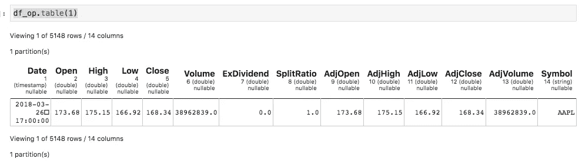
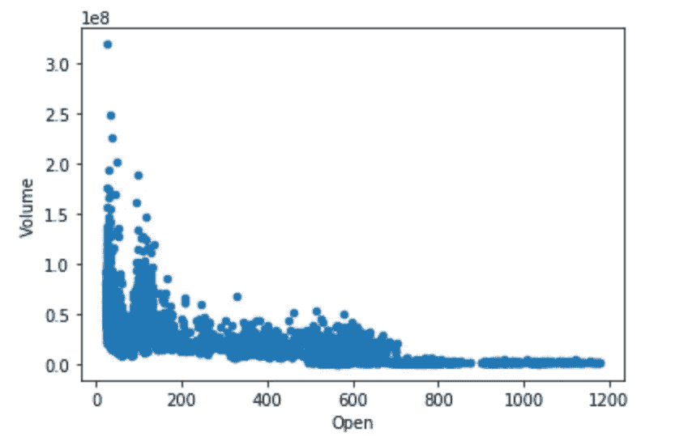
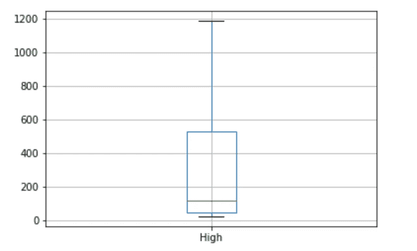
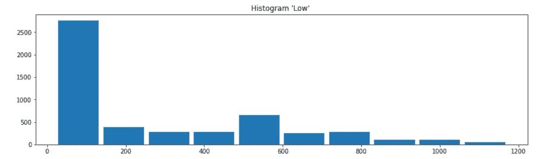
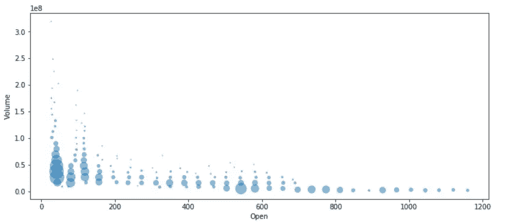

# 树袋熊、熊猫、擎天柱和火花的丛林

> 原文：<https://towardsdatascience.com/the-jungle-of-koalas-pandas-optimus-and-spark-dd486f873aa4?source=collection_archive---------4----------------------->

## 从 Databricks(考拉)、Optimus framework 和 Apache Spark 3.x 的最新库可以期待什么


如果你和我一样对数据科学感到兴奋，你大概知道 Spark+AI 最新峰会昨天(2019 年 4 月 24 日)开始了。而且有很棒的事情可以聊。但我会用衍生产品来做。

如果你一直在关注我，你会发现我参与创建了一个叫做 Optimus 的框架。如果您想了解更多信息，请查看以下文章:

[](/data-science-with-optimus-part-1-intro-1f3e2392b02a) [## 擎天柱的数据科学。第 1 部分:简介。

### 用 Python、Spark 和 Optimus 分解数据科学。

towardsdatascience.com](/data-science-with-optimus-part-1-intro-1f3e2392b02a) [](/data-science-with-optimus-part-2-setting-your-dataops-environment-248b0bd3bce3) [## 擎天柱的数据科学。第 2 部分:设置您的数据操作环境。

### 用 Python、Spark 和 Optimus 分解数据科学。今天:数据科学的数据操作。..*第 1 部分在此…

towardsdatascience.com](/data-science-with-optimus-part-2-setting-your-dataops-environment-248b0bd3bce3) 

我在这里用 Optimus 和其他开源工具解释了整个数据科学环境。这可能是第 3 部分，但我更感兴趣的是向您展示其他内容。

# 擎天柱蜜蜂


[https://github.com/ironmussa/Optimus](https://github.com/ironmussa/Optimus)

起初，Optimus 是作为一个清理大数据的项目开始的，但突然我们意识到这个框架有更多的机会。现在，我们已经创造了许多有趣的东西，如果你是一个使用熊猫或 spark 的数据科学家，你应该去看看。

现在我们有这些 API:

*   Spark 数据帧的改进版本(更适合清理和管理数据)。
*   使用 Spark 简化机器学习。
*   使用 Spark 和 Spark 深度学习更轻松地进行深度学习。
*   直接从火花数据帧绘图。
*   描绘火花数据帧。
*   数据库连接(像亚马逊红移)更容易。
*   丰富与外部 API 连接的数据。

还有更多。你甚至可以直接从网上读取数据到 Spark。

因此，您可以看到，我们一直在努力改善数据科学家的世界。我们关心的事情之一是创建一个简单和可用的 API，我们并不喜欢 Pandas API 或 Spark API 本身，但它们的组合加上一点点令人惊叹的东西，创建了你今天可以称为我们的框架。

# 考拉 vs 擎天柱 vs 火花 vs 熊猫


[https://www.freepik.com/](https://www.freepik.com/)

今天，Databricks 宣布，通过增强 Apache Spark 的 Python DataFrame API 以兼容熊猫，Koala 项目是与大数据交互时更有效的方式。

如果你想试试这个 [MatrixDS](https://matrixds.com/) 项目:

 [## MatrixDS |数据项目工作台

### MatrixDS 是一个构建、共享和管理任何规模的数据项目的地方。

community.platform.matrixds.com](https://community.platform.matrixds.com/community/project/5cc0de62b8f4a97f2912aabf) 

还有这个 GitHub 回购:

[](https://github.com/FavioVazquez/koalas_optimus_spark) [## FavioVazquez/考拉 _ 擎天柱 _ 火花

### 与火花和朋友一起震撼世界。。为 FavioVazquez/koalas _ Optimus _ spark 开发做出贡献，创建一个…

github.com](https://github.com/FavioVazquez/koalas_optimus_spark) 

因此，我没有用复制粘贴树袋熊的文档来烦你，而是创建了一个树袋熊、Optimus 和 Spark 之间联系的简单示例。

你需要安装擎天柱

```
pip install --user optimuspyspark
```

还有考拉

```
pip install --user koalas
```

我将使用这个数据集进行测试:

[https://raw . githubusercontent . com/databricks/考拉/master/data/sample _ stocks . CSV](https://raw.githubusercontent.com/databricks/koalas/master/data/sample_stocks.csv)

让我们首先用 Spark vanilla 读取数据:

```
from pyspark.sql import SparkSession
spark = SparkSession.builder.getOrCreate()df = spark.read.csv("sample_stocks.csv", header=True)
```

为此，我之前需要上传数据集。让我们看看擎天柱:

```
from optimus import Optimus
op = Optimus()
df = op.load.url("[https://raw.githubusercontent.com/databricks/koalas/master/data/sample_stocks.csv](https://raw.githubusercontent.com/databricks/koalas/master/data/sample_stocks.csv)")
```

这简单了一步，因为有了 Optimus，你可以直接从网上读取数据。

考拉呢？

```
import databricks.koalas as ksdf = ks.read_csv("[https://raw.githubusercontent.com/databricks/koalas/master/data/sample_stocks.csv](https://raw.githubusercontent.com/databricks/koalas/master/data/sample_stocks.csv)")
```

这段代码会失败，那会发生在熊猫身上吗？

```
import pandas as pddf = pd.read_csv("[https://raw.githubusercontent.com/databricks/koalas/master/data/sample_stocks.csv](https://raw.githubusercontent.com/databricks/koalas/master/data/sample_stocks.csv)")
```

不，那会有用的。那是因为你可以直接从网上读取熊猫的数据。好吧，让我们让考拉代码工作:

```
import databricks.koalas as ksdf_ks = ks.read_csv("sample_stocks.csv")
```

这看起来很简单。顺便说一下，如果你想用 Optimus 从本地存储器中读取数据，几乎是一样的:

```
from optimus import Optimus
op = Optimus()
df_op_local = op.load.csv("sample_stocks.csv")
```

但是，让我们看看接下来会发生什么。这种数据帧有哪些类型？

```
print(type(df_sp))
print(type(df_op))
print(type(df_pd))
print(type(df_ks))
```

结果是:

```
<class 'pyspark.sql.dataframe.DataFrame'>
<class 'pyspark.sql.dataframe.DataFrame'>
<class 'pandas.core.frame.DataFrame'>
<class 'databricks.koalas.frame.DataFrame'>
```

所以除了 Spark 本身，唯一能创造 Spark DF 的框架就是 Optimus。这是什么意思？

让我们看看当我们想要显示数据时会发生什么。为了在 Spark 中显示数据，我们通常使用*。秀()*法，而对于熊猫则为*。*头()【法。

```
df_sp.show(1)
```

会按预期工作。

```
df_op.show(1)
```

也会起作用。

```
df_pd.head(1)
```

也会起作用。但是我们的考拉 DF 呢？你需要使用 pandas API，因为这是这个库的目标之一，让从 pandas 的过渡更容易。所以:

```
df_ks.show(1)
```

会失败，但是

```
df_ks.head(1)
```

会管用的。

如果你和我一起运行这段代码，如果你点击 spark 的 *show* ，你会看到:

```
+----------+------+------+------+------+----------+----------+----------+-------+-------+------+--------+----------+------+
|      Date|  Open|  High|   Low| Close|    Volume|ExDividend|SplitRatio|AdjOpen|AdjHigh|AdjLow|AdjClose| AdjVolume|Symbol|
+----------+------+------+------+------+----------+----------+----------+-------+-------+------+--------+----------+------+
|2018-03-27|173.68|175.15|166.92|168.34|38962839.0|       0.0|       1.0| 173.68| 175.15|166.92|  168.34|38962839.0|  AAPL|
+----------+------+------+------+------+----------+----------+----------+-------+-------+------+--------+----------+------+
only showing top 1 row
```

这有点糟糕。每个人都喜欢那些漂亮的 HTML 大纲表来查看他们的数据，熊猫也有，所以考拉从熊猫那里继承了它们。但是记住，这不是火花 DF。如果你真的想看到一个更漂亮的带有 Optimus 的 Spark DF 版本，你可以使用*。表()*方法*。*

```
df_op.table(1)
```

你会看到:



它更好地向您显示了数据以及相关信息，如列的类型、DF 中的行数、列数和分区数。

# 选择数据

让我们用我们的数据做更多的事情。比如切片。

我将选择日期、开盘价、盘高、盘低和交易量。可能有更多的选择数据的方法，我只是使用常见的。

**带火花:**

```
# With Spark
df_sp["Date","Open","High","Volume"].show(1)# or
df_sp.select("Date","Open","High","Volume").show(1)
```

**带擎天柱:**

```
df_op["Date","Open","High","Volume"].table(1)# or
df_op.select("Date","Open","High","Volume").table(1)# or with indices :)df_op.cols.select([0,1,2,5]).table(1)
```

**与熊猫:**

```
df_pd[["Date","Open","High","Volume"]].head(1)#or df_pd.iloc[:, [0,1,2,4]].head(1)
```

**带考拉:**

```
df_ks[["Date","Open","High","Volume"]].head(1) # will workdf_ks.iloc[:, [0,1,2,4]].head(1) # will faildf_ks.select("Date","Open","High","Volume") # will fail
```

所以正如你现在看到的，我们用 Optimus 很好地支持了不同的东西，如果你喜欢熊猫的[[]]风格，你也可以用它来处理考拉，但是你不能通过索引来选择，至少现在还不能。

与考拉和擎天柱不同的是，你在底层运行 Spark 代码，所以你不必担心性能。至少现在不是。

# 更多高级内容:

让我们得到一列的频率:

熊猫:

```
df_pd["Symbol"].value_counts()
```

**考拉:**

```
df_ks["Symbol"].value_counts()
```

他们是一样的，这很酷。

**火花(一些坏零件):**

```
df_sp.groupBy('Symbol').count().show()
```

**擎天柱(你可以像在 Spark 里那样做):**

```
df_op.groupBy('Symbol').count().show()
```

或者你可以使用*。cols* 属性获得更多功能:

```
df_op.cols.frequency("Symbol")
```

让我们用 One-Hot-encoding 来转变我们的数据:

**熊猫:**

```
# This is crazy easy
pd.get_dummies(data=df_pd, columns=["Symbol"]).head(1)
```

**考拉:**

```
# This is crazy easy too
ks.get_dummies(data=df_ks, columns=["Symbol"]).head(1)
```

**火花(足够相似的结果，但做起来很恐怖):**

```
# I hate this
from pyspark.ml.feature import StringIndexer,OneHotEncoderEstimatorindexer = StringIndexer(inputCol="Symbol", outputCol="SymbolIndex")
df_sp_indexed = indexer.fit(df_sp).transform(df_sp)encoder = OneHotEncoderEstimator(inputCols=["SymbolIndex"],
                                 outputCols=["SymbolVec"])model = encoder.fit(df_sp_indexed)
df_sp_encoded = model.transform(df_sp_indexed)
df_sp_encoded.show(1)
```

**擎天柱(好一点但我还是更喜欢考拉这个):**

```
from optimus.ml.feature import string_to_index, one_hot_encoderdf_sp_indexed = string_to_index(df_sp, "Symbol")
df_sp_encoded = one_hot_encoder(df_sp_indexed, "Symbol_index")
df_sp_encoded.show()
```

在这种情况下，更简单的方法来自熊猫，幸运的是它在考拉身上实现了，这种类型的功能在未来会增加，但现在这几乎是我们所有的功能，正如你在这里看到的:

 [## 一般功能-考拉 0.1.0 文档

### 编辑描述

考拉. readthedocs.io](https://koalas.readthedocs.io/en/latest/reference/general_functions.html) 

但是他们在火花中运行，所以它摇滚。

## 情节:

绘图是数据分析的重要部分。对于熊猫，我们习惯于非常容易地绘制我们想要的任何东西，但是对于 Spark 来说，就没有那么容易了。我们很高兴地宣布，在最新版本的 Optimus (2.2.2)中，我们已经创建了一种直接从 Spark 数据帧创建绘图的方法，不需要子集化。

熊猫:

```
df_pd.plot.scatter("Open","Volume")
```



```
df_pd.boxplot("High")
```



```
df_pd.hist("Low")
```


**考拉:**

```
df_ks.hist("Low")
```

这样不行。

**火花:**

没有。

**擎天柱:**

```
df_op.plot.boxplot(“High”)
```


```
df_op.plot.hist(“Low”)
```



```
df_op.plot.scatterplot(["Open","Volume"])
```



# Apache Spark 3.x:


databricks.com

以下是对 Spark 3.x 的一些期望:

*   Scala 2.12 支持(列出两次)
*   非实验性连续加工
*   Kubernetes 支持非实验性
*   数据源 API v2 的更新版本
*   Hadoop 3.0 支持
*   提高 Spark 深度学习管道的可用性

还有更多！


databricks.com

# 结论

Spark 它正呈指数级增长，如果你现在没有使用它，你肯定应该使用它。通常你会来自熊猫或类似的地方，所以利用像考拉和擎天柱这样的伟大的库来改善你在数据科学世界中的生活。

如果您有任何问题，请在此写信给我:

[](https://www.linkedin.com/in/faviovazquez/) [## 法维奥·瓦兹奎——science y Datos | LinkedIn 创始人/首席数据科学家

### 加入 LinkedIn ‼️‼️重要提示:由于 LinkedIn 技术限制，我现在只能接受连接请求…

www.linkedin.com](https://www.linkedin.com/in/faviovazquez/) 

在推特上关注我:

[](https://twitter.com/faviovaz) [## 法维奥·巴斯克斯(@法维奥·巴斯克斯)|推特

### Favio Vázquez 的最新推文(@FavioVaz)。数据科学家。物理学家和计算工程师。我有一个…

twitter.com](https://twitter.com/faviovaz) 

祝学习愉快:)