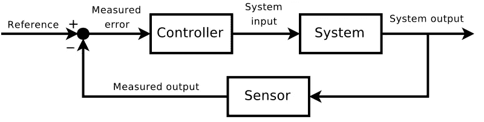
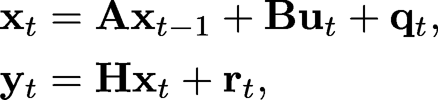
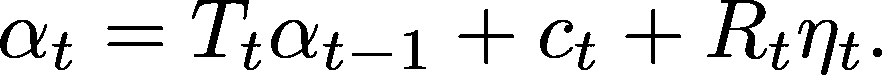
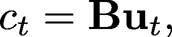
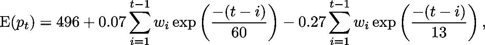
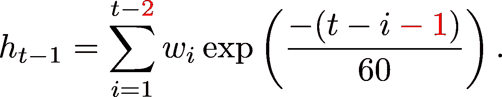
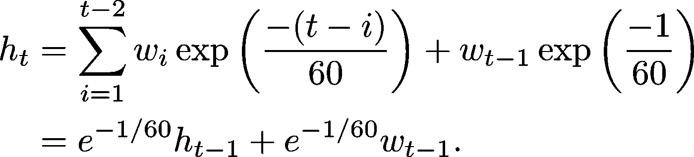
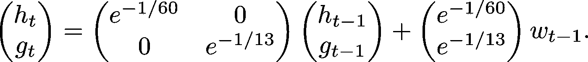
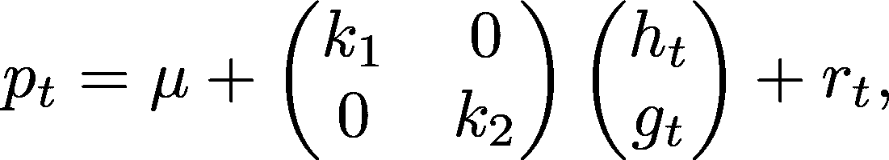
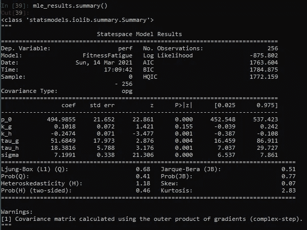

# 卡尔曼滤波器和外部控制输入

> 原文：<https://towardsdatascience.com/the-kalman-filter-and-external-control-inputs-70ea6bcbc55f?source=collection_archive---------14----------------------->

## 使用状态偏移处理外部控制输入



Block diagram of a control system [by Wikimedia user Orzetto](https://en.wikipedia.org/wiki/Control_theory#/media/File:Feedback_loop_with_descriptions.svg) ([CC BY-SA 4.0](https://creativecommons.org/licenses/by-sa/4.0/)). This article features a “controller” to the system, though not one designed to match a reference value.

在本文中，您将

*   使用`statsmodels` Python 模块实现带有外部控制输入的卡尔曼滤波器模型，
*   使用最大似然估计卡尔曼滤波器模型矩阵中的未知参数，
*   在[运动表现的体能-疲劳模型](/modeling-cumulative-impact-part-i-f7ef490ed5e3)的背景下，了解如何通过卡尔曼滤波器对累积影响进行建模。

# 具有控制输入的卡尔曼滤波器

以下是具有外部“控制”输入 **B u** _t 的卡尔曼滤波器模型的说明:



其中**q**_*t*∾n(**0**、𝐐)和**r**_*t*∾n(**0**、𝐑).模型矩阵 **A *、* B** 、 **H *、* Q** 和 **R** 可能包含未知参数，并且通常被允许随时间变化。外部“控制向量”输入， **u** _ *t* ，必须知道到目前为止的所有时间点，如果任务需要预测未来的多个时间步，也必须知道。

在许多预测环境中，外部控制项是不使用的。标准的时间序列模型，其中内部系统动力学是唯一发挥作用的力量(如 ARIMA)，不需要它们。因此，在`statsmodels`中缺乏明确的控制规范机制并不奇怪。幸运的是，`statsmodels`确实提供了一个状态截取的接口，它足以包含外部控制输入。

# 将控制输入用于 stats 模型

花点时间熟悉一下`statsmodels` [状态空间表示法](https://www.statsmodels.org/dev/generated/statsmodels.tsa.statespace.representation.Representation.html)，它对状态方程使用了与本文开头略有不同的符号:



本规范中没有的“**state _ intercept**”***c***_*t*在`statsmodels`中默认为零。描述为“*c:state _ intercept(k _ States x nobs)*”，这意味着用户可以在每个时间点自由指定不同的状态截距值。(对于所有的`statsmodels`卡尔曼滤波器模型矩阵都是如此。)但是设置



对于 *t* =1… *T，*，我们有一个带有控制输入的卡尔曼滤波器模型。

# 示例:状态空间形式的体能-疲劳模型

[*建模累积冲击第一部分*](/modeling-cumulative-impact-part-i-f7ef490ed5e3) 中的体能-疲劳模型为:



其中 *p_t* 为(运动)表现， *w_t* 为时间 *t* 的训练“剂量”(时间加权训练强度)。在我以前探索该模型的文章中，训练历史与其他函数的卷积是表示训练课程累积影响的机制。本文将通过保持一个*系统状态*来做一些不同的事情。为了做到这一点，我们必须将体能-疲劳模型置于状态空间形式，以训练剂量作为外部控制输入。

在上面的等式中，第一个卷积和代表运动健康，我现在称之为 *h_t* 。以下是滞后一个时间步长的结果:



分离定义 *h_t* 的卷积和中的最后一项，我们得到递归:



对于疲劳的卷积和，该论证以相同的方式进行，此后称为 *g_t* ，并且健康和疲劳的递归关系可以用下面的“状态空间形式”表示:



我们可以继续使用矩阵来表达模型的第二个“测量”阶段:



其中 *r_t* ~ N(0，σ)。控制输入滞后一个时间周期，这是我们必须考虑的，但除此之外，我们有一个带有外源控制输入的健康疲劳模型的典型状态空间公式。结合给定健康和疲劳的当前状态的性能测量模型，卡尔曼滤波器工具包(状态估计、简单插补和可能性评估)由我们支配。

本节将使用可从 [*建模累积影响第二部分*](/modeling-cumulative-impact-part-ii-2bf65db3bb98) 中使用的 [R 要点](https://gist.github.com/baogorek/6d682e42079005b3bde951e98ebae89e)中复制的模拟数据，也可作为 [csv 文件](https://drive.google.com/open?id=1kk40wiVYzPXOkrPffU55Vzy-LLTrgAVh)提供给读者。要运行以下代码，请更改以下 Python 代码块中的文件路径:

```
import numpy as np
import pandas as pd
import matplotlib.pyplot as pltimport statsmodels as sm
from statsmodels.tsa.statespace.mlemodel import MLEModeltrain_df = pd.read_csv("<your location>/train_df.csv")
train_df.head()
```

这个块加载所需的依赖项，并打印几行输入数据集`train_df`:

```
day  day_of_week    period   w        perf
0    1            0  build-up  10  489.197363
1    2            1  build-up  40  500.545312
2    3            2  build-up  42  479.886648
3    4            3  build-up  31  474.226865
4    5            4  build-up  46  459.322820
```

为了在`statsmodels`中创建一个卡尔曼滤波器模型，我们必须扩展`MLEModel`基类(从`[mlemodel](https://www.statsmodels.org/dev/_modules/statsmodels/tsa/statespace/mlemodel.html)`模块[扩展到](https://www.statsmodels.org/dev/_modules/statsmodels/tsa/statespace/mlemodel.html))。

```
class FitnessFatigue(MLEModel): start_params = [500, .1, .3, 60, 15, 10]
    param_names = ['p_0', 'k_g', 'k_h', 'tau_g', 'tau_h', 'sigma'] def __init__(self, p, w_lag1):
        super().__init__(endog=p, k_states=2, exog=w_lag1)
        self.initialize_approximate_diffuse() def update(self, params, **kwargs):
        params = super().update(params, **kwargs) self['obs_intercept', 0, 0] = params[0]
        # state space model ------
        self['transition'] = (
            np.array([[np.exp(-1.0 / params[3]), 0],
                      [0, np.exp(-1.0 / params[4])]])
        )
        self['state_intercept'] = (
            np.array([[np.exp(-1.0 / params[3])],
                     [np.exp(-1.0 / params[4])]])
            * self.exog
        )
        # measurement model
        self['design', 0, 0] = params[1]
        self['design', 0, 1] = params[2]
        self['obs_cov', 0, 0] = params[5] ** 2
```

关于上面的类，需要注意一些事情:

*   我们必须在`start_params`中输入起始值
*   我们必须指定一个接受数据的`__init__`方法。在这种情况下，它必须接受性能测量和训练(即控制)数据。
*   请注意`__init__`内滞后训练变量的创建。体能-疲劳模型特别指定了在训练事件影响*体能*或*疲劳*之前的一段时间间隔。
*   我们能够避免在`[statsmodels](https://www.statsmodels.org/dev/generated/statsmodels.tsa.statespace.representation.Representation.html)` [表示](https://www.statsmodels.org/dev/generated/statsmodels.tsa.statespace.representation.Representation.html)中指定预乘状态误差项的选择矩阵。这默认为一个零矩阵，我们通常会遇到麻烦，因为没有设置，但健康疲劳模型，当直接转换为状态空间形式时，没有状态误差项。

接下来，用数据实例化对象，并使用最大似然估计未知参数。请注意，我们确实需要延迟训练输入，以便匹配模型的规范(在文章发表期间，我已经反复讨论过这个问题)。

```
train_df['lag_w'] = train_df['w'].shift(1)
train_df = train_df.iloc[1:]ffm_kf = FitnessFatigue(train_df.perf, train_df.lag_w)mle_results = ffm_kf.fit(method = 'bfgs', maxiter = 1000)
mle_results.summary()
```

最后一个命令产生以下输出(间距已被修改):



输出显示卡尔曼滤波器在恢复仿真中使用的参数值方面做得很好。在 [*累积影响建模第三部分*](/modeling-cumulative-impact-part-iii-1b216273b499) 中需要自定义非线性近似的标准误差，现在已经“开箱即用”另一方面，最大似然法在这种情况下确实需要一些调整；增加最小迭代次数并选择 [BFGS 方法](https://en.wikipedia.org/wiki/Broyden%E2%80%93Fletcher%E2%80%93Goldfarb%E2%80%93Shanno_algorithm)得到稳定的拟合。

鼓励读者重复上面的练习，用已知的初始化代替“近似漫射”初始化(目前已被注释掉)。与卡尔曼滤波器和最大似然法不同，使用已知初始化的结果有些不同，尤其是标准误差。当使用已知的初始化时，来自卡尔曼滤波器的标准误差估计类似于使用非线性近似的估计。对于近似漫射初始化，对于某些参数(尤其是指数中的“时间常数”)来说，它们要大得多。

卡尔曼滤波器使我们能够访问滤波状态估计和平滑状态估计，前者仅使用特定时间点之前的可用数据，后者将所有可用数据合并到每个时间点的状态估计中。下面我们将可视化过滤后的状态估计，这自然会经历一个粗略的开始:

```
fig = plt.figure(figsize = (12, 8))
plt.rcParams.update({'font.size': 18})plt.plot(mle_results.filtered_state[0, :], color='green',
         label='fitness')
plt.plot(mle_results.filtered_state[1, :], color='red',
         label='fatigue')
plt.title("Filtered estimates of state vector (Fitness and " +
          "Fatigue) over time")
plt.xlabel('Time')
plt.ylabel('Filtered state estimate')
plt.legend()
plt.show()
```


假设真实的适应状态被初始化为 0，并逐渐变高，那么最初的几个过滤状态估计值会偏离很多，这解释了为什么`likelihood_burn`被设置为 15。将图形代码中的`filtered_state`替换为`smoothed_state`显示的图片与 [*建模累积影响第一部分*](/modeling-cumulative-impact-part-i-f7ef490ed5e3) 中的图片非常相似。

# 讨论

在写这篇文章之前，我认为获得带控制输入的卡尔曼滤波器的唯一方法是购买 [MATLAB](https://www.mathworks.com/help/control/ug/kalman-filtering.html#responsive_offcanvas) 或 [SAS/ETS](http://support.sas.com/documentation/cdl/en/etsug/67525/HTML/default/viewer.htm#etsug_ssm_details01.htm) 。虽然`statsmodels`可以使规范更加简单，但使用时变状态截距仍然可以轻松地将控制输入添加到卡尔曼滤波器例程中。

用于定义模型的子类派生，就像在`statsmodels`中使用的，是圆滑的，但是使得调试不那么透明。(有时这些例子不起作用。)记住结果对象包含它们的模型矩阵；将它们打印出来是调试的好方法！不要忘记`statsmodels`中乘以状态误差的“选择矩阵”——它默认为零。我们在这里不需要它，因为适应性疲劳模型没有指定状态错误，但它会导致令人沮丧的调试场景，其中代码更改不会影响输出。

尽管由于`statsmodels`默认值，缺少状态误差项使得当前任务更简单，但是添加状态误差项的能力是卡尔曼滤波器优于原始适应性-疲劳模型的一个优点。很容易想象训练之外影响潜伏*体能*和*疲劳*的事情，包括睡眠质量和营养。将状态误差项添加到原始的体能-疲劳模型是另一个要探索的变化。

与 [*中的卡尔曼滤波器和*](/the-kalman-filter-and-maximum-likelihood-9861666f6742) 中的最大似然不同，“近似扩散”初始化导致了与状态的已知初始化不同的结果。在那篇文章中，也许平稳 ARMA(1，2)模型太像垒球了，初始状态的不确定性只有在没有均值*的非平稳情况下才真正重要。然而，这让我好奇如果在`statsmodels`中实现的话,“精确扩散”初始化会有多么不同。*

卡尔曼滤波器是一个非常强大的时间序列分析和建模工具。它不仅能够计算经典时间序列模型的困难可能性，而且能够处理具有外源控制输入的非平稳模型，甚至引导下一架航天飞机飞往月球。作为数据科学家，我们很幸运在`statsmodels`有一个卡尔曼滤波器的免费开源实现，对于统计和工程目的都足够灵活。