# 卡尔曼滤波器和(最大)似然

> 原文：<https://towardsdatascience.com/the-kalman-filter-and-maximum-likelihood-9861666f6742?source=collection_archive---------3----------------------->

## 了解估计卡尔曼滤波器矩阵中未知参数的可能性的能力和局限性

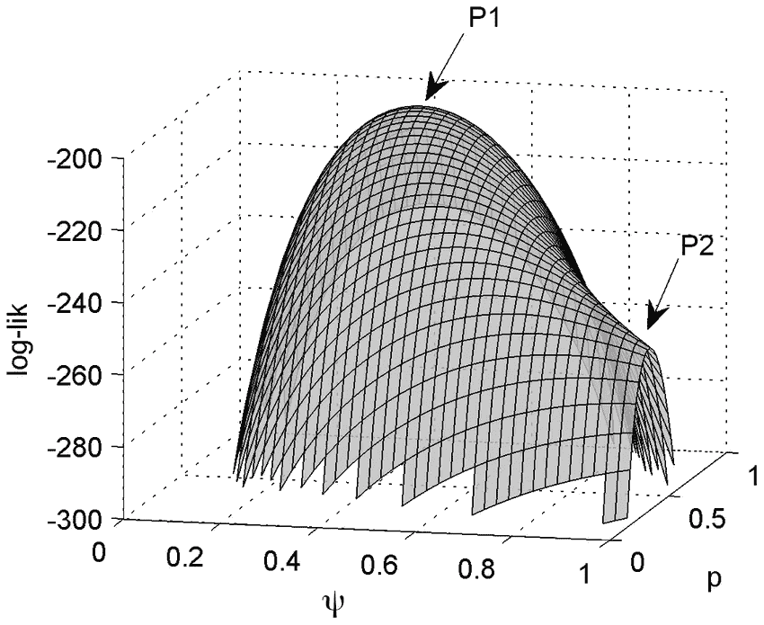

Figure 1 from [Guillera-Arroita et al (2014)](https://www.researchgate.net/publication/264392229_Ignoring_Imperfect_Detection_in_Biological_Surveys_Is_Dangerous_A_Response_to_'Fitting_and_Interpreting_Occupancy_Models') depicting a log-likelihood surface. [CC BY 4.0](https://creativecommons.org/licenses/by/4.0/)

在本文中，您将:

*   使用 Python 模块`[statsmodels](https://www.statsmodels.org/stable/index.html)`估计卡尔曼滤波器模型矩阵中的未知参数
*   根据卡尔曼滤波模型计算单个观测值的对数似然
*   在`statsmodels`中探索不同状态初始化选项的影响

# 介绍

在 Kaggle 的[网络流量时间序列预测](https://www.kaggle.com/c/web-traffic-time-series-forecasting)比赛后，我立即意识到了卡尔曼滤波器的威力，这场比赛要求对数千个维基百科页面的未来网络流量进行预测。在这场竞赛中，像“中位数”这样简单的启发式算法很难被击败，我花在 ARIMA 和预言家模型上的精力毫无进展。我想知道传统的预测工具箱中是否有适合这项任务的东西。然后我看了一个帖子，作者是一个只知道叫“ *os、*”[**卡尔曼滤波器**](https://www.kaggle.com/c/web-traffic-time-series-forecasting/discussion/43727#latest-492742) 第 8 名的用户。

自从这篇文章第一次被写出来， *os* 的身份现已被揭露为 [Otto Seiskari](https://medium.com/@oseiskar) ，他对这篇文章留下了一个启发性的回应。自从最初写这篇文章以来，我的观点也发生了变化，我将在最后解释这一点。

虽然 Otto 确实使用了中位数作为后备解决方案，但其核心方法是一个 8 态卡尔曼滤波器，对当地水平和每周季节性进行编码。Otto 还专门为这次比赛写了一个定制的 python 包， [simdkalman](https://github.com/oseiskar/simdkalman) 。型号规格直接来自 [simdkalman 文档](https://simdkalman.readthedocs.io/en/latest/)，粗体字体稍有变化:

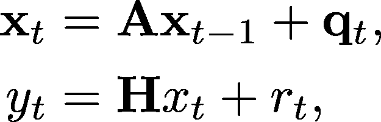

其中 *q_t ~ N* (0， **Q** ) *和 r_t ~ N* (0， **R** ) *。在本文中，度量 y* _ *t 是一个标量；r_* t *的方差由 1x1 矩阵*R 表示。这里， **x** _ *t* 是未观测的“状态”向量， *y_t* 是时间段 *t* 的观测测量。这些系统共同构成了许多时间序列数据集的有用表示。采用这种框架的一个好处是卡尔曼滤波器机制的可用性，用于计算可能性和创建一步预测等(在 R 的 [stats.arima](https://stat.ethz.ch/R-manual/R-devel/library/stats/html/arima.html) 文档中搜索“卡尔曼”以查看其使用示例)。

实际上， **A** 和 **H** 可以来自每周季节性、本地趋势等的标准“食谱”。、 **Q** 和 **R** 未知的可能性更大。Otto 没有对它们进行估计，而是使用默认选项来选择 Q 和 R，然后使用称为“平滑参数”的标量来调整一个矩阵与另一个矩阵的比例。

尽管我不能否认这种方法的有效性，但作为一名统计学家，“构建”Q 和 **R** 并不适合我。然后我深入研究了 Roger Labbe 的基于 Jupyter 的文本，Python 中的[卡尔曼和贝叶斯滤波器](https://github.com/rlabbe/Kalman-and-Bayesian-Filters-in-Python)，发现它也在[卡尔曼滤波器数学](https://github.com/rlabbe/Kalman-and-Bayesian-Filters-in-Python/blob/9e4ac42f796a65e5d2baffd57a0fb88391a3d956/07-Kalman-Filter-Math.ipynb)部分建议了一个类似的过程:“*在实践中*，”文本说，“*我们挑选一个数字，对数据进行模拟，并选择一个工作良好的值*。”

我听到了 15 年前教室里的另一个声音。一位名叫大卫·迪基的教授问道，他的话被反复引用，

你喜欢数字七吗？三个怎么样？”

[暂停以示强调]

让我们达成一致，在不知道数据在估算什么的情况下，不要从数据中计算任何东西。”

最大似然估计，对于它可能具有的任何错误，是估计未知量的原则方法，并且似然是卡尔曼滤波操作的“副产品”。在下一节中，我们将用状态空间形式的 ARMA(2，1)探索 Python 的`statsmodels`中这些计算的中间过程。最后，我们将使用最大似然法，利用这种似然性得到对 **A、H** 和 **Q (R** 将是已知的)的估计。

# 卡尔曼滤波器和似然

## 顺序到达数据的可能性

以下联合 pdf 的产品扩展在时序情况下特别有用:

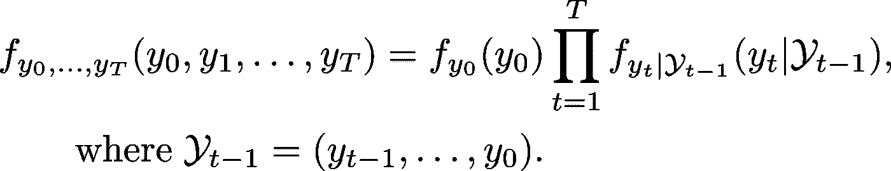

在我们的情况下，有模型矩阵 **A** 、 **H** 、 **Q** 和 **R** ，它们都有潜在的未知成分。设θ包含构造这些矩阵所需的所有未知参数。那么可能性的对数变成:

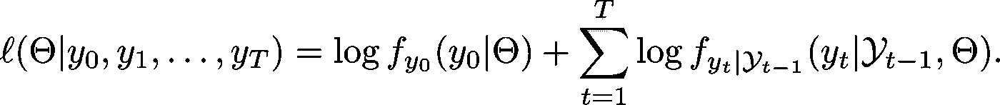

因此，有两个分析任务:

*   得到初始点的对数似然， *y_0，*
*   以过去为条件得到当前点的对数似然，*y _ t | y _*(*t*-1)*，…，y* _0 *。*

回想一下，卡尔曼滤波器的“滤波”操作给出了未知状态向量**x**_*t***的条件分布，给出了到当前时间点 *t* 的所有观察值 *y_t* (脚本 *Y_t* ):**

**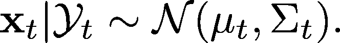**

**在[的另一篇卡尔曼滤波器说明文章](/yet-another-kalman-filter-explanation-article-be0264d99937)中，该分布被表示为时间 *t* 时未知状态的贝叶斯后验分布，但在这里，它被表示为潜在随机向量 **x** _t 的采样分布。**

## **对可能性的条件贡献**

**一次解开测量模型会导致:**

**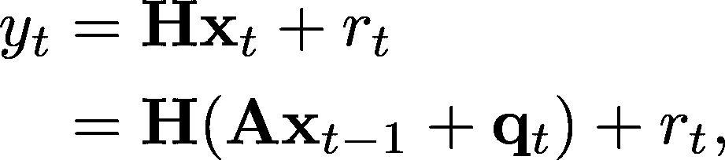**

**由此推出 *y_t | y_{t-1}，…，y_0* 一定是正规的，因为 **x** _{t-1} | *y_{t-1}，…，y_0* 是。它也给了我们一个计算这个条件正态的均值和方差的起点。条件意义仅仅是:**

**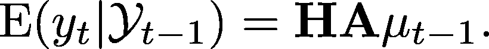**

**条件方差是使用随机向量的标准方差公式得到的:**

**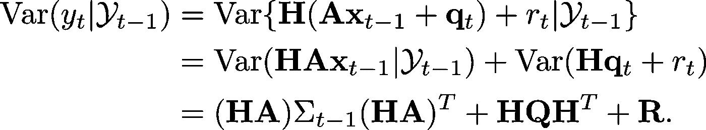**

**回想一下 **Q** 、 **R** 、 **A** 和 **H** 都是由θ中的参数完全指定的。这些参数需要数值最大化例程中的起始值，因此需要在似然最大化的每个阶段进行上述计算。**

## **初始点似然贡献**

**初始测量值的分布需要初始化状态均值向量和方差矩阵。在静态模型的情况下，存在基于系统长期运行行为的状态向量的正确初始(先验)均值和方差(参见华盛顿大学的[笔记](https://faculty.washington.edu/ezivot/econ584/notes/statespacemodels.pdf)第 2 页了解更多细节)。**

**对于非静态模型，初始化更具挑战性。`statsmodels`提供的解决方案是“近似扩散”初始化，即零均值和非常大的协方差矩阵。统计学家不喜欢这个(“*这提出了数字问题，并且没有回答扩散结构* s 存在的问题”——[Piet de Jong，1991](https://projecteuclid.org/euclid.aos/1176348139) )。虽然我们不会在这里处理它， [R 包 KFAS](https://cran.r-project.org/web/packages/KFAS/vignettes/KFAS.pdf) 确实提供了“精确的漫射初始化方法”为了简单明了，我们将在下面的例子中使用一个“已知的”初始化。**

# **示例:状态空间形式的 ARMA 模型**

**因为本文将使用一个特定的 ARMA(1，2)模型:**

**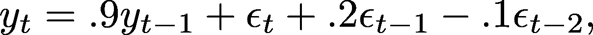**

**其中 *ϵ_t* ~ N(0，1.2)为 *t* = 1，…，1000。**

## **生成 ARMA(1，2)数据**

**使用`statsmodels`模拟来自 ARMA(1，2)的数据很简单，但请注意 AR 和 MA 参数系数的输入方式:**

```
import numpy as np
from statsmodels.tsa.arima_process import ArmaProcessnp.random.seed(20190529)
ar1ma2 = ArmaProcess(ar=np.array([1, -.9]),
                     ma=np.array([1, .2, -.1]))
y = ar1ma2.generate_sample(nsample=1000, scale=1.2)
```

**以下是一些观察结果:**

```
In [6]: print(y[0:5])
[1.41505527 1.38650169 1.54085345 2.53833794 3.9467489 ]
```

**`statsmodels` `ARMA`类有一个用于拟合 ARMA 模型的`fit()`方法:**

```
from statsmodels.tsa.arima_model import ARMAmodel = ARMA(y, (1, 2))
model_fit = model.fit(trend='nc')
```

**这导致输出(略有修改):**

```
In [13]: model_fit.summary()                                                                                                  Out[13]:                                                                                                                      <class 'statsmodels.iolib.summary.Summary'>                                                                                   """                                                                                                                                                         ARMA Model Results                                                                              ==================================================================
Dep. Variable:   y            No. Observations:             1000
Model:           ARMA(1, 2)   Log Likelihood               **-1629.051**
==================================================================
            coef    std err   z       P>|z|  [0.025  0.975]
------------------------------------------------------------------
ar.L1.y    **0.9008**    0.017   51.919   0.000   0.867  0.935
ma.L1.y    **0.1474**    0.037    4.036   0.000   0.076  0.219
ma.L2.y   **-0.1360**    0.037   -3.715   0.000  -0.208 -0.064 
```

**注意样本的对数似然以及系数估计值(粗体)。**

## **状态空间形式的 ARMA(1，2)模型**

**为了在状态空间框架中得到这个 ARMA(1，2)模型，我们有许多选择。“哈维”表示法的好处(如沃顿商学院课堂讲稿第 8 页所述)在于它直接结合了 AR 和 MA 系数。对于我们的模型，这种表示是:**

**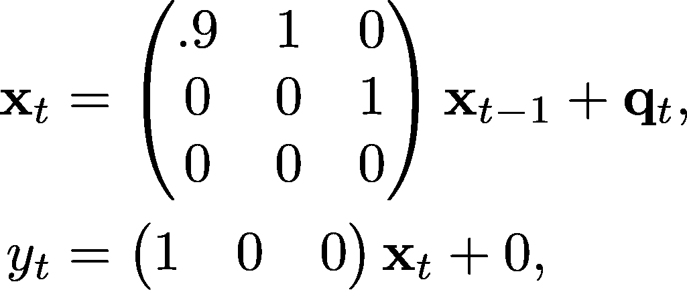**

**其中, *r* _t 已被明确替换为 0，以表明所有误差可变性均在状态项中处理，且**

**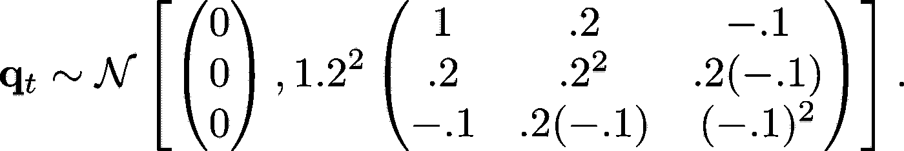**

**尽管 **R** 为零，这个 ARMA(1，2)模型适合卡尔曼滤波框架。下面是这个模型在`statsmodels`中的精确编码，尽管它比必要的更冗长:**

```
from statsmodels.tsa.statespace.mlemodel import MLEModel
from statsmodels.tsa.statespace.tools import (constrain_stationary_univariate, unconstrain_stationary_univariate)class AR1MA2_verbose(MLEModel):
    start_params = [.8, 0.24, -.11, 1.3]
    param_names = ['ar1', 'ma1', 'ma2', 'sigma2'] def __init__(self, endog):
        super().__init__(endog, k_states = 3) # Using the Harvey Representation
        self['transition', 0, 1] = 1.0
        self['transition', 1, 2] = 1.0 self['design', 0, 0]   = 1.0 self['selection', 0, 0] = 1.0
        self['selection', 1, 1] = 1.0
        self['selection', 2, 2] = 1.0 self.initialize_known(np.array([0, 0, 0]), np.eye(3))
        #self.initialize_stationary()
        #self.initialize_approximate_diffuse() def transform_params(self, params):
        phi = constrain_stationary_univariate(params[0:1])
        theta = constrain_stationary_univariate(params[1:3])
        sigma2 = params[3] ** 2
        return np.r_[phi, theta, sigma2] def untransform_params(self, params):
        phi = unconstrain_stationary_univariate(params[0:1])
        theta = unconstrain_stationary_univariate(params[1:3])
        sigma2 = params[3] ** 0.5
        return np.r_[phi, theta, sigma2]

    def update(self, params, **kwargs):
        params = super().update(params, **kwargs) self['transition', 0, 0] = params[0] self['state_cov', 0, 0] = params[3] * 1.0
        self['state_cov', 1, 0] = params[3] * params[1]
        self['state_cov', 2, 0] = params[3] * params[2]
        self['state_cov', 0, 1] = params[3] * params[1]
        self['state_cov', 1, 1] = params[3] * params[1] ** 2
        self['state_cov', 2, 1] = params[3] * params[1] * params[2]
        self['state_cov', 0, 2] = params[3] * params[2]
        self['state_cov', 1, 2] = params[3] * params[1] * params[2]
        self['state_cov', 2, 2] = params[3] * params[2] ** 2

        pass # adding this to ease some cpaste issues
```

**`statsmodels`模型表示的文档在这里是。下面是关于上述实现的一些注意事项。**

*   **注意“选择”矩阵被设置为等于`__init__`中的恒等式。按照`statsmodels` [状态空间表示](https://www.statsmodels.org/dev/generated/statsmodels.tsa.statespace.representation.Representation.html)的顺序，这个矩阵被状态空间误差预乘，默认情况下**是零——**如果你想要状态误差，你必须显式编码！。选择矩阵可以设置为(1 *θ* _1 *θ* _2)^T，使上述表示更简单。**
*   **`start_params`变量将初始化最大似然例程，但是我们也将在接下来的演示中使用它。注意数值接近真实。**
*   **参数转换对于似然性演示来说不是必需的，但是对于似然性最大化例程来说却是必需的。**
*   **如前所述，我们将从潜在状态均值和协方差矩阵(零均值和恒等方差矩阵)的已知初始化开始，以演示可能性计算。**

## **计算几个点的对数似然**

**我们将首先创建一个卡尔曼滤波器模型的实例，并用初始值对其进行初始化。由于参数值包含了重建 **A** 、 **H** 、 **Q** 和 **R** 的所有必要信息，`statsmodels`的卡尔曼滤波器可以在任何进一步优化之前立即开始滤波。**

```
kf_model_verbose = AR1MA2_verbose(y)
filtered = kf_model_verbose.filter(kf_model_verbose.start_params)
```

**在 iPython 中交互运行，很容易看到对于所有 1000 个时间点，`filtered_state`包含一个 3 维状态向量，而`filtered_state_cov`包含一个 3×3 协方差矩阵。**

```
In [25]: filtered.filtered_state.shape
Out[25]: (3, 1000)In [26]: filtered.filtered_state_cov.shape
Out[26]: (3, 3, 1000)In [27]: kf_model_verbose.loglikeobs ... [0:3]
Out[27]: array([-1.92012925, -1.34946888, -1.37622846])
```

**最后一行显示了根据`statsmodels`的前三次测量的对数似然贡献。这些都是我们想要搭配的。**

**我们现在将使用第*节中为顺序到达数据*建立的公式。矩阵 **A** 、 **H** 、 **Q** 和 **R** 易于访问，矩阵乘积 **HA** 被计算并存储在下面的`HA`中:**

```
A = kf_model_verbose['transition', 0:, 0:]
H = kf_model_verbose['design', 0:, 0:]
Q = kf_model_verbose['state_cov', 0:, 0:]
R = kf_model_verbose['obs_cov', 0:, 0:]HA = np.matmul(H, A)
```

**为了匹配似然向量中的第一个数字-1.9201，首先注意 **μ** 和**σ***在零向量和单位矩阵处被初始化。测量向量只取状态向量的第一个元素，没有额外的误差项( **R** 为零)，因此第一个观察值`y[0]`与一个 *N* (0 *，* 1)分布进行比较。***

```
*from scipy.stats import norm
np.log(norm.pdf(y[0], 0, 1)) Out[36]: **-1.9201**292483430195*
```

***由于 python 从零索引时间开始， **μ** _0 和**σ**_ 0 实际上是给定初始数据测量的第一个更新的状态均值和方差矩阵。在可能性推导中的计算之后，***

```
*mu_0 = filtered.filtered_state[0:, 0]
Sigma_0 = filtered.filtered_state_cov[0:, 0:, 0]E_alpha_1 = np.matmul(np.matmul(H, A), mu_0)
V_alpha_1 = (np.matmul(np.matmul(HA, Sigma_0), np.transpose(HA)) +
             np.matmul(np.matmul(H, Q), np.transpose(H)) + R)np.log(norm.pdf(y[1], E_alpha_1, np.sqrt(V_alpha_1)))*
```

***结果为`array([[-1.34946888]])`，匹配第二次测量的对数似然。再来一轮应该能让人相信我们已经掌握了模式。***

```
*mu_1 = filtered.filtered_state[0:, 1]
Sigma_1 = filtered.filtered_state_cov[0:, 0:, 1]E_alpha_2 = np.matmul(np.matmul(H, A), mu_1)
V_alpha_2 = (np.matmul(np.matmul(HA, Sigma_1), np.transpose(HA)) +
             np.matmul(np.matmul(H, Q), np.transpose(H)) + R)np.log(norm.pdf(y[2], E_alpha_2, np.sqrt(V_alpha_2)))Out[46]: array([[**-1.37622846**]])*
```

***还是那句话，匹配。如果我们对 1000 次测量的对数似然性求和，我们得到的结果会比我们在 ARMA 拟合中看到的结果稍小(即更负)，这是意料之中的，因为我们的似然性评估不是最大似然估计。***

```
*np.sum(kf_model_verbose.loglikeobs(kf_model_verbose.start_params))
Out[47]: -1655.0364388567427*
```

## ***未知参数的最大似然估计***

***上面创建的 Kalman Filter 对象一直在等待最大似然估计(否则它为什么会继承一个名为“MLEModel”的类)。它只需要运行对象的`fit()`方法:***

```
*kf_model_verbose_fit = kf_model_verbose.fit()
kf_model_verbose_fit.summary()*
```

***摘要提供了(略有修改的输出):***

```
*Statespace Model Results                                                                                    ==================================================================
Dep. Variable:    y                 No. Observations:     1000
Model:            AR1MA2_verbose    Log Likelihood       **-1629.327**

==================================================================
          coef    std err    z       P>|z|  [0.025   0.975]
------------------------------------------------------------------
ar1      **0.9016**    0.018   50.742    0.000   0.867   0.936
ma1      **0.1472**    0.038    3.900    0.000   0.073   0.221
ma2     **-0.1366**    0.037   -3.686    0.000  -0.209  -0.064
sigma2   **1.5219**    0.071   21.542    0.000   1.383   1.660*
```

***请注意，参数估计和对数似然接近 ARMA 估计，但不精确。这是由于已知的初始化。作为练习，运行以下两种变体，这将在讨论部分讨论:***

*   ***注释掉已知的初始化，取消静态初始化的注释，然后重新运行。***
*   ***注释掉静态初始化，取消注释“近似扩散”初始化，然后重新运行。***

# ***讨论***

***从上面的练习中，您应该已经观察到，您可以将 ARMA 模型的对数似然和参数估计与平稳初始化精确匹配。这并不奇怪，因为针对`ARMA`类的`fit()`方法的[文档](https://www.statsmodels.org/dev/generated/statsmodels.tsa.arima_model.ARMA.html)说，它通过卡尔曼滤波器使用精确的最大似然来“f *它的 ARMA(p，q)模型。*”***

***在这种情况下，近似的漫射初始化导致与其精确的和已知的对应物相似的估计，但是它是一个固定的模型。初始对数似然值要小得多(< -7) so the total log-likelihood of the sample is a bit more negative. A “burn in” option exists to skip these first few observations in computing the likelihood by setting 【 in the class’s 【 function.***

***Once the machinery is in place to get the filtered state mean and variance, the likelihood of each measurement consists of only a few linear operations. This does mean a double loop will be necessary when maximizing the likelihood numerically, which explains why fitting even a simple ARMA(1, 2) model slows down when the number of observations gets moderately large.***

## ***Otto’s response***

***My original conclusion to this article concerned the practical methods of constructing a filter that do not involve formal estimation like presented here. I said that I might use one of these methods, if I could ever stop hearing the question: “*你喜欢数字 7 吗？*”***

***从那以后，最初的*操作系统*做出了回应，解释了为什么一种更基于工程的方法可能优于最大似然法。作为一个固执的人，我不得不在自己的工作中经历最大似然估计的困难(就像这个[最近的竞赛](https://nousot.com/blog/how-we-won-gold/))来充分理解这些论点。奥托·塞斯卡里解释道:***

> ***“MLE 方法找到的解决方案的质量取决于模型描述数据的准确程度。卡尔曼滤波器通常适用于理论上模型假设非常糟糕的问题:噪声可能是非高斯的、非独立的，并且选择的隐藏状态模型与它应该建模的相比可能非常简单。然而，在选择某些参数的情况下，滤波器仍然可以很好地工作，但是实际中的最佳参数可能与最大似然估计有很大不同。”***

***我仍然喜欢使用最大似然估计来估计卡尔曼滤波器模型的未知参数，但是我也接受使用基于维持的调优，特别是当主要目标是预测时。在这两种情况下，我希望读者已经了解了更多关于卡尔曼滤波器的潜在概率基础，以及在没有使用最大似然估计的验证集的情况下什么是可能的。***