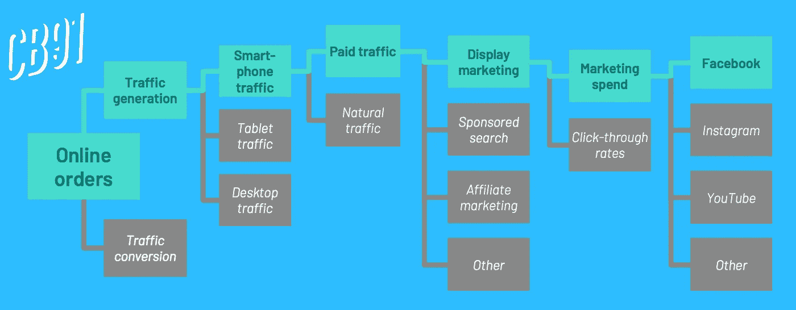
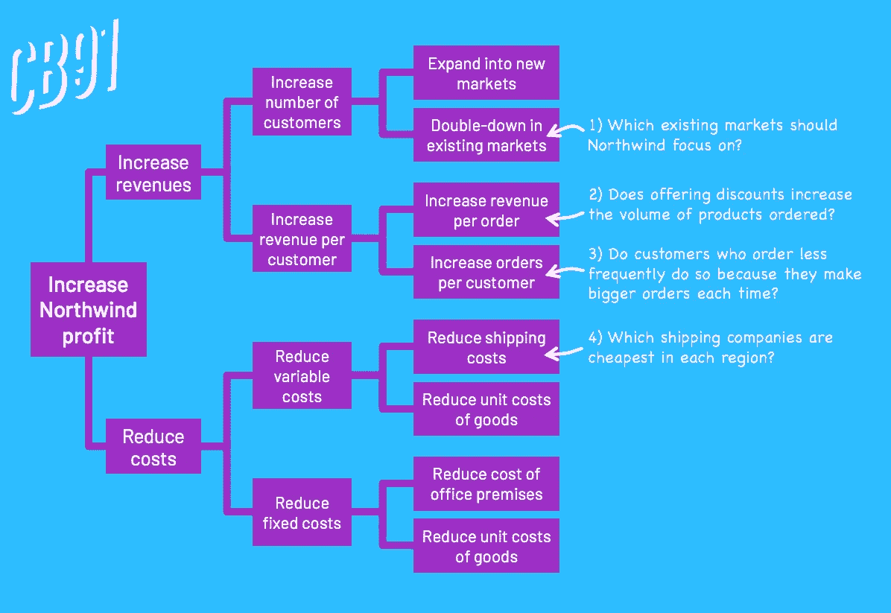
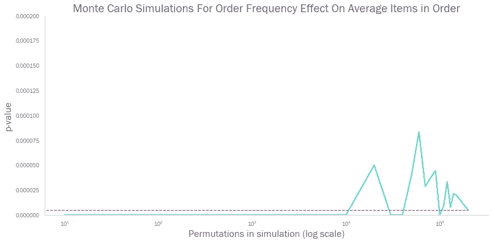

# 所有数据科学家的关键问题是:“那又怎样？”

> 原文：<https://towardsdatascience.com/the-key-question-for-all-data-scientists-so-what-25139fb352c6?source=collection_archive---------14----------------------->

## 如何撰写假设和进行分析，让你的老板刮目相看

我之前公司的一位主管有一句口头禅，他因此在公司的分析师圈子里声名狼藉。

*“那又怎么样？”*

给这个人看一张图表，一张幻灯片，一份*的完整报告*，他的反应会是一样的。所以。什么？这两个词可能会给人以明显的敌意，而不是特别有用的管理指导。

*“那又怎样？”*

当然，一旦你有了一些时间来克服对你在过去六个小时里不知疲倦地制作的美丽散点图的不和谐反应，你就开始明白他们的观点了(尽管不情愿)。

*Quoth the Director, “SO WHAT?” (Image: Pixabay)*

数据科学家可能对他们的工作非常珍视。这不是批评——这种特征通常源于健康的激情。优秀的数据科学家是一群充满求知欲的人(在我的时间里，我已经为了分析而做了大量的分析工作！)

然而，在专业环境中，分析本身很少是最终目标。即使是世界上最大的分析公司——你的 Facebooks、Googles 和 Amazon——也在处理数据，以某种方式改善他们业务的某个方面。

在我以前做顾问的时候，我的分析应该是为商业决策提供信息，或者帮助形成客户建议的基础。因此有一句口头禅，“那又怎样？”我很快学会了自我评估我的工作。*两个客户群之间的差异具有统计学意义。*那又怎样？我的客户能用这些信息做什么有用的事情吗？

我在管理咨询行业工作了五年，把“有趣”的事情和“重要”的事情混为一谈，这是我经常看到的错误。我想委婉地说，在所有在客户面前使用过“高级分析”或“机器学习”这两个词的麦肯锡顾问中，只有不到一半的人真正知道这些东西是什么，更少的人知道它们如何实际帮助解决手头的业务问题。

# 只见树木不见森林

因此，如果面对一个数据的海洋(或者实际上是一个湖泊),我们应该如何找到保证是重要的分析，而不仅仅是一个智力上的杂耍？在这种情况下，好的分析源于一个构造良好的假设，而一个构造良好的假设是一个构造良好的**问题树**的果实。

**问题树**是任何顾问工具包中的经典工具。它允许将一个宏大的、包罗万象的主题分解成多个(和小得多的)“问题”，然后可以分别解决。创建问题树的黄金法则很简单:**Be**[MECE](https://en.wikipedia.org/wiki/MECE_principle)**！**

MECE(发音为 Mee-See，最初由麦肯锡咨询公司的芭芭拉·明托在 20 世纪 60 年代开发)代表:

*   M**M**最终 **E** 排他
*   **C** 完全**E**xhaust

换句话说，从问题树的每个“节点”出来的分支应该将问题分解成不重叠的部分(ME)，并且覆盖所有的可能性(CE)。最好用一个例子来说明这一点:假设我们的业务经历的在线销售比我们预期的要少。我们如何用问题树来调查这个问题？

Here we follow just the top branch, for the sake of visual clarity. Each grey box could, of course, have their own further branches

从左手边的第一个盒子开始。在线订单可以被认为是人们访问网站的次数乘以访问转化为销售的次数。因此，我们可以将流量产生和流量转化视为在线订单的两个“子问题”，然后我们可以孤立地考虑它们。

从数学上讲，这种分裂就是 MECE:

*   ***A =在线订单***
*   ***B =网页流量***
*   *那么我们有:****A = B *(A/B)***
*   *或者换句话说:* ***在线订单=网页流量*流量转化***

网络流量的产生及其随后的转化是客户旅程的两个不同部分，我们可以独立地进行分析(因此，我们从数学上证明了我们的两个新分支可以在不需要第三个因素的情况下处理在线订单(因此，我们的两个新分支完全可以考虑 T42 的因素)。

注意——这不是唯一可能的 MECE 分裂。例如，您可以将在线订单表示为 ***【订单总数】*** 和 ***【在线订单份额】*** 的乘积。你可以用这些分支作为起点，写第二棵树，看看你是否会得出不同的结论。

创建了第一个分支后，你就可以从左到右，将每个问题分解成更多的子问题，越往下越好。

创建问题树的一些一般提示:

*   尝试用数学方法来表达:这是保持 MECE 的一个好方法。总要考虑如何将事物分解成乘法因子，就像我们对网上订单所做的那样。如果你试图分解一些商数 KPI (A/B)，那么尝试第三个数据点(A/B = A/C * C/B)。
*   **加上“其他”可以使一个分支完全详尽:**知道除了你能识别的因素之外，还有其他潜在的因素在起作用，可以帮助你避免做出无效的假设。
*   **通常不止一个正确答案:**这也适用于树的顺序——我们可以先将流量生成分为付费/自然流量，而不是按设备划分流量。

# 实际应用

假设我们为 north wind Traders 工作或咨询，这是一家由微软创建的虚构公司，向世界各地的客户进出口食品和饮料。我们可以访问他们的 SQL 数据库，我们的任务是提出(然后测试)一些假设来帮助制定业务战略。

我们从哪里开始呢？

The SQL Schema for Northwind Traders

甚至不用深入研究数据，我们就可以得出一个基本的问题树来帮助构建我们的思维。我们从一个简单的没有人会反对的使命陈述开始: ***增加 Northwind 的利润！***

An example issue tree for Northwind. We could easily add more layers, but we’re already at a point where we can start thinking about potential hypotheses to test.

接下来是一个相对简单的问题树—增加收入，降低成本，等等。然而，到了第三层，我们已经处于可以开始问实质性问题的位置，这些问题可以构成假设的基础。

当然，在设计测试时，我们仍然需要做所有通常的好事情——确保我们有:

*   无懈可击的无效假设和替代假设
*   满足我们想要使用的统计检验所需的任何假设的样本(例如，正态分布的 T 检验)
*   明智的阿尔法水平拒绝零假设

让我们来看图表中的第三个注释。Northwind 可以通过鼓励每位客户更频繁地下订单，名义上增加每位客户的收入。然而，情况可能是这样的，订购较少的客户这样做是因为他们的订单更大——例如，他们每两个月购买 200 件商品，而不是每个月 100 件商品。销售主管可能有兴趣在大规模销售之前知道这是否属实！

明智的第一步是查看数据，看看它是否包含任何关于我们应该如何确切定义我们的假设的线索。让我们创建一个 Northwind 客户的散点图，根据订单的平均规模绘制出他们的平均订单间隔天数。

与我们最初预期的相关性相去甚远，似乎更频繁订购的客户实际上会做出更大的订单。我们的分析现在有了不同的框架——如果我们可以证明这种关系在统计上是显著的，那么鼓励更高阶频率的商业案例就会突然变得非常有力。

我们根据这一点定义我们的假设。设第 1 组是平均每两个月至少订购一次的客户，设第 2 组是平均每两个月订购不到一次的客户。然后，我们有:

*   零假设，第 1 组客户的 H₀:平均订单项≤第 2 组客户的平均订单项
*   另一个假设是，第 1 组客户的 Hₐ:平均订单项>第 2 组客户的平均订单项

然后我们可以运行蒙特卡洛模拟来得出 p 值(见我的[以前的博客](/https-towardsdatascience-com-the-difficult-third-album-655d7a710412)中关于如何做的完整指导)。

 [## 蒙特卡洛模拟能驱散‘困难的第三张专辑’吗？

### 使用 Python 进行排列测试和蒙特卡罗模拟的介绍

towardsdatascience.com](/https-towardsdatascience-com-the-difficult-third-album-655d7a710412) 

碰巧的是，我们发现这个测试的 p 值趋向于极小的 0.000005(或者 200，000 分之一)。鉴于我们的标准 alpha 水平为 0.05，这意味着我们可以断然拒绝零假设——更经常订购的客户会做出更大的订单，Northwind 应该尽一切努力增加其现有客户群的订购频率。

当然，如果我们不能拒绝零假设，这也是有价值的。通过证明这种关系的缺失，我们将能够建议反对增加订单频率的高强度措施。

这就是使用问题树方法定义假设的美妙之处——不管实验的结果如何，你总是能够进行分析，并对问题做出有力的回应: ***“那又怎样？”***

> 感谢你一直读到博客的结尾！我很乐意听到任何关于上述分析的评论，或者这篇文章涉及的任何概念。欢迎在下面留言，或者通过 [LinkedIn](https://www.linkedin.com/in/callum-ballard/) 联系我。