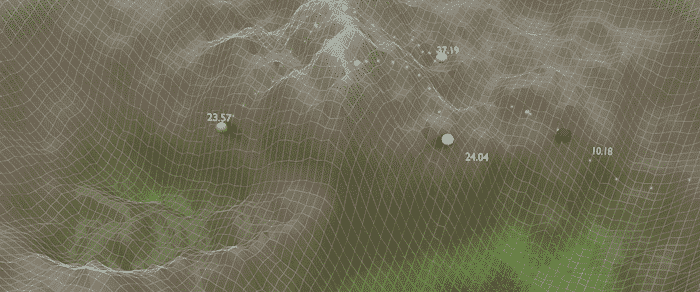
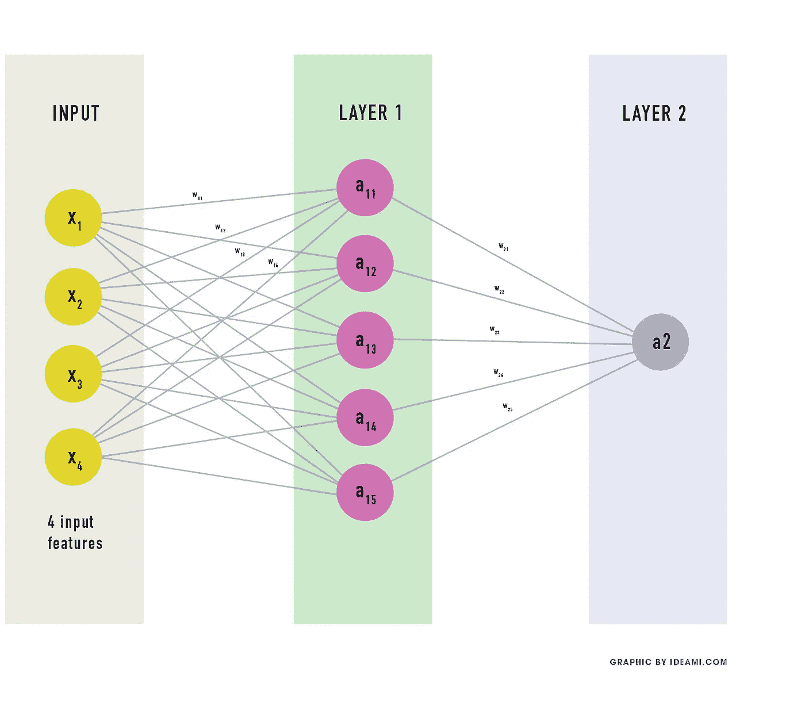
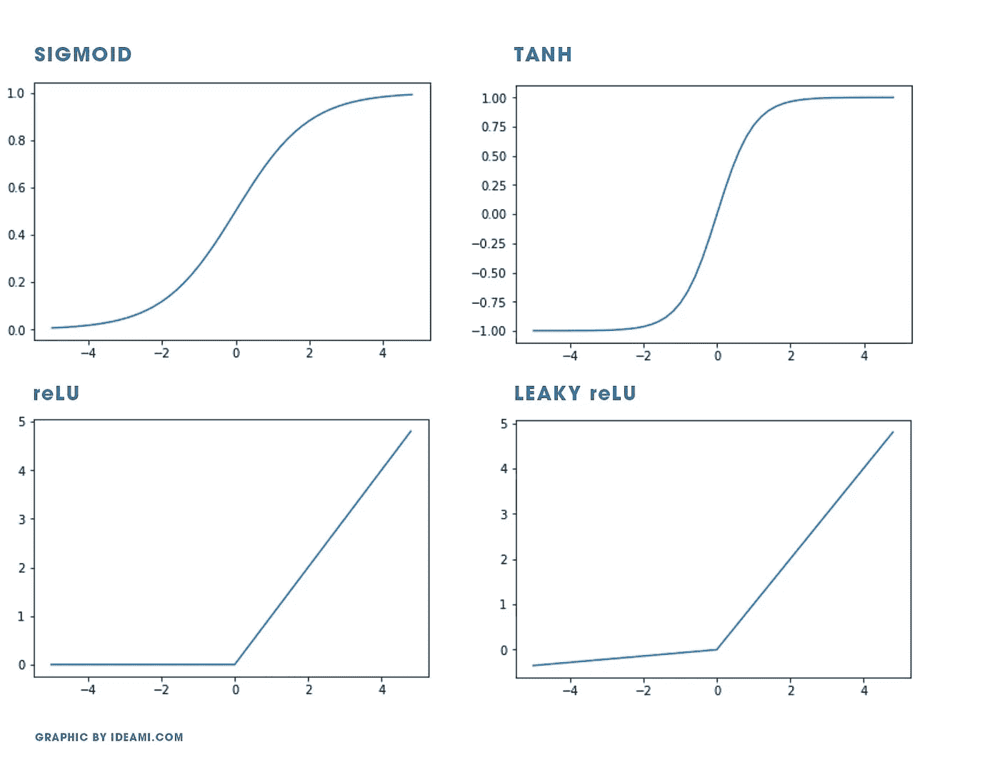

# 100 行代码中深度学习的关键

> 原文：<https://towardsdatascience.com/the-keys-of-deep-learning-in-100-lines-of-code-907398c76504?source=collection_archive---------4----------------------->

## 用神经网络预测肿瘤的恶性程度。用 Python 从头开始构建。

在这篇由 3 部分组成的文章中，您将:

*   **用 Python 从零开始创建神经网络**。用梯度下降算法训练它。
*   **将基础网络**应用于**威斯康辛癌症数据集。根据 9 种不同的特征预测肿瘤是良性还是恶性。**
*   **深入探索**反向传播和梯度下降是如何工作的。
*   复习**基础知识，探索高级**概念**。**在第 1 部分的**中，我们探索了我们网络的架构**。在第 2 部分的**中，我们用 Python** 编码，深入到 back-prop &渐变下降**。在第 3 部分，我们将**应用于威斯康辛癌症数据集。

让我们一起走下深度学习的亏损版图。准备好了吗？

Navigating the Loss Landscape within deep learning training processes. Variations include: Std SGD, LR annealing, large LR or SGD+momentum. Loss values modified & scaled to facilitate visual contrast. Visuals by Javier Ideami@ideami.com

对于那些对深度学习的奥秘和可能性充满热情的人来说，现在是激动人心的时刻。

该领域的许多英雄通过视频和文章分享他们的专业知识。他们包括 fast.ai 的杰瑞米·霍华德、Coursera 的吴恩达、Andrej Karpathy、Yann Lecun、Ian Goodfellow、Yoshua Bengio、Lex Fridman、Geoffrey hint on、Jürgen Schmidhuber 以及其他许多人。

他们中的许多人建议的关键事情之一是**尽快动手，自己编写深度学习的关键原则**。

如今，我们拥有令人惊叹的图书馆。包括 **Tensorflow，PyTorch，Fast.ai，Keras，Mxnett，Nctk，DL4J** 等。但是如果你只使用那些强大的库，你可能会错过一些重要的东西。有机会深入思考这些过程中一些最重要的部分。

在这个迷人的冒险中，自己编写一个网络迫使你面对面地面对关键问题和障碍。还有，深度学习背后隐藏的奇迹。

想想深度学习中所有新奇的架构和最新发展。回旋，循环网络，甘等等。真正令人着迷的是，在这个领域几乎每一次成功的背后，我们都找到了同样熟悉的朋友。**反向传播和梯度下降。**

Navigating the Loss Landscape. Values have been modified and scaled up to facilitate visual contrast.

如果你深刻理解这两个概念，**天空才是极限**。然后，您可以从更深的角度与强大的库一起工作。你也要**准备好思考你自己的新方法**来改进这些工具。

准备开始了吗？这将会是一场精彩的旅程！

Navigating the Loss Landscape. Values have been modified and scaled up to facilitate visual contrast.

# 寻找神秘的功能

宇宙中发生的很多事情都可以用函数来表达。函数是一种接受输入并产生输出的数学结构。因果。**输入输出。**

当我们审视这个世界及其挑战时，我们看到的是**信息**，我们看到的是数据。我们可以从这些数据中学到很多。

我们对数据进行的学习可以是不同种类的 T21。让我们强调深度学习中 3 种非常常见的类型:

*   **监督学习:**当我们从一组带标签的训练数据中学习神秘函数时。将输入连接到其相应的正确输出的一组线对。
*   **无监督学习:**当我们从没有以任何方式标记或分类的数据中学习神秘函数时。
*   **强化学习:**当我们通过最大化代理人收到的报酬来学习神秘函数时。该代理在一个环境中采取行动。

在本文**中，我们将重点关注监督学习**，这是迄今为止深度学习最成功的领域。

因此，我们有一些数据，一些输入，我们也有一些与输入相对应的输出。我们想了解输入和输出是如何通过一个神秘的函数连接起来的。

事实是，当涉及的数据达到一定的复杂性时，**找到那个函数变得非常困难**。进入神经网络和深度学习。

Navigating the Loss Landscape. Values have been modified and scaled up to facilitate visual contrast.

在其核心，一个神经网络**通过一系列**中间“权重”连接你的输入数据和你想要的输出**。这些重量实际上只是数字。**

通过它们的架构和我们即将探索的优化算法，神经网络成为通用的近似器。他们最终能够计算连接其输入和输出的任何函数(当拥有正确的架构和参数时)。要对此进行扩展，请参见人工神经网络数学理论的通用逼近定理)。

**理解神经网络**的最佳方式是..去**建一个**！是的，从零开始，在这种情况下使用 Python 编程语言。所以让我们开始吧，在这个过程中，我们将探索许多有趣的话题和概念。

> 理解神经网络的最佳方式是..建造一个

在这一段下面你可以看到我们将要建立的网络。它有 2 层(输入层从不计算)。

*   **输入**:网络的输入包含我们的源数据。神经元的数量与源数据的特征数量相匹配。下图使用了 4 个输入要素。当我们稍后处理威斯康星癌症数据集时，我们将使用 9。
*   第一层:我们的第一个隐藏层，它有许多隐藏的神经元。这些神经元与它周围各层的所有单元相连。
*   **第二层:**第二层也是最后一层有 1 个单个单元，网络的输出。

我们可以增加更多层，建立一个 10 层或 20 层的网络。为了简单起见，我们将在本文中使用 2。一个两层的神经网络可以做很多事情，我们很快就会知道。

那么**在这个网络中，学习将在哪里进行**？

让我们回顾一下。在我们网络的**输入**层中，我们放入**一些数据**。我们还将**向网络显示什么输出对应于该输入，什么结果应该出现在网络的输出**(第二层)。

**网络各层中的每个单元**都有**一个关联权重**(还有一个偏差，稍后会详细介绍)。这些权重只是在学习过程开始时随机初始化的数字。

神经**网络执行一些计算** **将输入数据与那些权重相结合。这些计算在网络中传播，直到在输出端产生最终结果。**

这些**计算的结果表达了将输入映射到输出的函数**。

我们想要的是网络学习那些权重的最佳可能值。因为通过网络执行的计算，结合不同层使用这些权重，它能够近似不同类型的函数。

现在让**更深入地了解我们正在寻找的这个神秘函数**。为了做到这一点，至关重要的是我们**准确地澄清我们任务中涉及的所有变量的名称**。

*   X 将代表输入层，即我们提供给网络的数据。
*   **Y** 将代表与输入 X 相对应的目标输出，在网络完成计算后，我们应该在网络末端获得输出。
*   **Yh** (y hat)将代表我们的预测，即我们将 **X** 输入网络后产生的输出。因此， **Y** **是理想的**输出， **Yh** 是网络在输入数据后产生的输出。
*   W 将代表网络各层的权重。

让我们先说第一层，我们的隐藏层，执行这个计算:**W X**(W 和 X 的乘积)

它执行**加权求和:**

*   层中的每个单元都连接到前一层中的每个单元。
*   这些连接中的每一个都有一个权重值。
*   图层中每个单元的新值是每个先前单元的值乘以该先前单元与我们当前正在分析的单元之间的连接权重的结果之和。

在某种程度上，权重表达了连接的强弱，即网络不同单元之间的链接强度。

现在我们要给这个乘积增加一些额外的东西，一个偏差项:
**WX+b**

添加偏置项为网络提供了更多的灵活性。它允许它“移动”单元的线性计算，增加了网络更快学习那些神秘函数的潜力。

**b** :表示机组的偏置项。

我们有了:**WX+b。**这就是我们所说的**一个线性方程**。线性，因为它通过一个乘积和一个和来表示输入和输出之间的线性关系(这种关系可以用一条线来表示)。

记住，神经网络可以有多层。在我们的示例中，我们将有 2 个，但我们也可以有 20 个或 200 个。

因此，我们将使用数字**来表示这些术语属于哪一层**。定义我们的隐藏层，也就是我们的第一层的计算的线性方程是: **W1 X+ b1**

我们还要给这个计算的输出取一个名字

*   **Z** 将代表一层计算的输出

因此， **Z1 = W1 X+ b1**

请注意，应该对每层的每个单元进行这种计算。当我们对网络编程时，我们将使用**矢量化实现**。这意味着我们将利用矩阵在一次数学运算中组合一层的所有计算。

对于本教程来说，深入理解矩阵并不是必不可少的，但如果你想刷新对它们的理解，你可以查看 YouTube 上的 **3Blue1Brown** 和他的 [**线性代数系列**](https://www.youtube.com/watch?v=fNk_zzaMoSs&list=PLZHQObOWTQDPD3MizzM2xVFitgF8hE_ab) 的精华视频。

到目前为止，一切顺利。现在，想象一个有许多层的网络。每一层都执行如上所述的线性计算。**当你将所有这些线性计算链接在一起时，**网络就能够计算复杂的函数。

然而，有一个小问题..

# 太线性，太无聊

世界是复杂的，**世界是混乱的**。现实生活中的输入和输出之间的关系一般不能用一条线来表达。它趋向于混乱，趋向于非线性。

复杂的函数通常是非线性的。如果一个神经网络的架构仅由线性计算组成，那么它很难计算非线性行为。这就是为什么神经网络会在每一层的末尾增加一些额外的东西:一个激活功能。

**激活函数**是**非线性函数，其在层的输出中引入非线性变化**。这将确保网络能够计算各种复杂的函数，包括那些高度非线性的函数。

现在，有很多不同种类的激活功能。让我们快速介绍 4 种最典型的。

为了解释这些激活函数，我需要**快速介绍梯度的概念，**我们将在后面深入探讨。函数在某一点的梯度也叫导数，表示函数在该点输出的变化率。

> 响应于特定输入变量的变化，函数输出的变化程度、方向和强度如何？

当梯度(导数)变得非常小时(函数的输出变得非常平坦)，我们就谈到了**消失梯度。**稍后，我们将了解深度学习中大量使用的反向传播算法，通过使用梯度来了解网络的每个参数如何影响网络的输出，从而决定如何调整网络的权重值(该参数的变化会使网络的输出增加还是减少？)

消失梯度是一个问题，因为**如果一点的梯度变得太小或为零，就很难理解系统输出在该点变化的方向**。

我们也可以谈谈相反的问题，**爆炸渐变**。当梯度值变得非常大时，网络会变得非常不稳定。

不同的激活函数可以具有不同的优点。但是它们也可能遭受消失和爆炸梯度问题。

下面快速介绍一下最流行的激活功能。

**s 形** 1/(1+e**-x)

*   它的输出从 0 到 1。
*   它是非线性的，将输入推向输出范围的极限。例如，这对于将输入分为两类非常有用。
*   它的形状是平缓的，所以它的梯度(导数)将得到很好的控制。
*   主要的缺点是，在极端情况下，函数的输出变得非常平坦。这意味着它的导数、它的变化率将变得非常小，并且使用该函数的单元的计算效率和速度可能变慢或完全停止。
*   因此，Sigmoid 在网络的最后一层非常有用，因为它有助于将输出推向 0 或 1(例如，将输出分为两类)。在以前的图层中使用时，它可能会遇到渐变消失的问题。

**Tanh
(2/(1+e * *-2x))-1**

*   它的输出从-1 到 1。
*   它非常类似于乙状结肠，是它的缩小版。
*   这个函数更陡，所以它的导数也更强。
*   缺点类似于 Sigmoid 函数的缺点。

**ReLU(整流线性单位)** max (0，x)

*   如果输入大于 0，则输出为输入。否则，输出为 0。
*   它的范围从 0 到无穷大。这意味着它的产量可能会变得非常大。分解渐变可能会有问题。
*   ReLU 的一个好处是，它可以保持网络更轻，因为一些神经元可能输出 0，防止所有单元同时活跃(过于密集)。
*   ReLU 的一个问题是它的左侧完全是平的。这可能再次产生梯度，即变化率为 0，这可能会阻止该单元执行有用的计算。
*   ReLU 计算简单，计算成本低。
*   目前，ReLUs 是神经网络内层最常用的激活函数。

**soft max** e * * x/Sum(e * * x)

*   输出范围在 0 和 1 之间。
*   Softmax 将输入归一化为概率分布。它将输入压缩到 0 到 1 的范围内，就像 Sigmoid 一样，但它也会对结果进行除法运算，使所有输出之和为 1。
*   它通常用于多分类场景中的输出层，此时您必须将输出分类到多个类中。Softmax 将确保与每个类别关联的概率总和的值始终为 1。

在本文中，我们将在输出层使用 Sigmoid 函数，在隐藏层使用 ReLU 函数。

好了，现在我们理解了激活函数，我们需要给它们一个名字！

*   **一个**将代表激活功能的输出。

因此，在我们的隐藏层，我们执行的计算将是:

**A1 = ReLU(Z1)** 且 Z1=W1 X+b1

**在我们的第二层，我们的输出层，**计算将是:

**A2 =乙状结肠(Z2)** 且 Z2=W2 A1 + b2

注意 Z2 的等式中 A1 的使用，因为第二层的输入是第一层的输出，也就是 A1。

最后，**注意 Yh=A2** 。第 2 层的输出也是网络的最终输出。

原来如此。现在，**如果我们将这些计算放在一起，**如果我们将这些函数链接起来，我们会发现**神经网络**的总计算是这样的:

**Yh = A2 = Sigmoid(W2 ReLU(W1 X+B1)+B2)**

就是这样。**这就是我们两层神经网络执行的全部计算。**

因此，实际上，**神经网络是一个函数链**，有些是线性的，有些是非线性的，它们共同产生一个复杂的函数，这个神秘的函数将把你的输入数据与你想要的输出联系起来。

在这个阶段，**注意到**在那个方程的所有变量中，**W 和 b 的值是很大的未知数**。这里是学习必须发生的地方。

不知何故，**网络必须学习 W 和 b 的正确值**，这将允许它计算正确的函数。

**因此，我们将训练我们的网络，找出 W1、b1、W2 和 b2 的正确值。但是在我们开始训练之前，我们必须首先初始化这些值。**

如何初始化网络的权重和偏差本身就是一个完整的主题，我们将在后面深入探讨。现在，我们将使用随机值对它们进行初始化。

在这个阶段，**我们可以开始编码**我们的神经网络。让我们**用 Python 构建一个类，初始化它的主要参数。**然后我们再看看如何训练它学习我们的神秘功能。

因此 [**让我们直接进入本文第 2 部分的代码**](/coding-a-2-layer-neural-network-from-scratch-in-python-4dd022d19fd2) ，我们将在旅途中学习和探索。

**链接到本文的 3 个部分:**
[**第 1 部分**](/the-keys-of-deep-learning-in-100-lines-of-code-907398c76504) | [**第 2 部分**](/coding-a-2-layer-neural-network-from-scratch-in-python-4dd022d19fd2) | [**第 3 部分**](/predict-malignancy-in-breast-cancer-tumors-with-your-own-neural-network-and-the-wisconsin-dataset-76271a05e941)