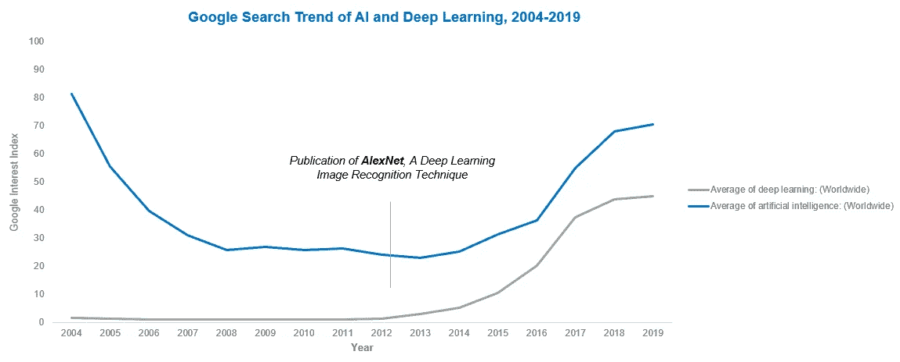
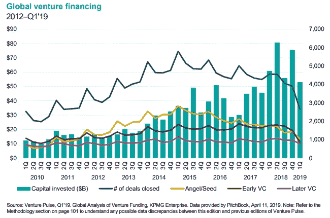
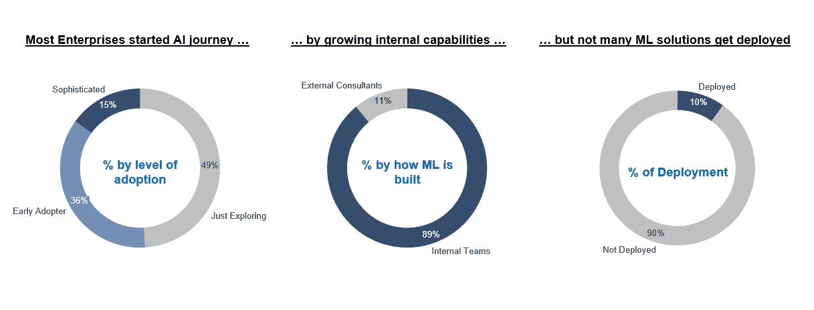

# 又一个 AI 冬天？

> 原文：<https://towardsdatascience.com/the-last-defense-against-another-ai-winter-c589b48c561?source=collection_archive---------18----------------------->

## 如何部署更多的 ML 解决方案——五种策略。

Photo by [Annie Spratt](https://unsplash.com/@anniespratt?utm_source=unsplash&utm_medium=referral&utm_content=creditCopyText) on [Unsplash](https://unsplash.com/s/photos/polar-bear?utm_source=unsplash&utm_medium=referral&utm_content=creditCopyText)

TLDR:许多人担心又一个人工智能冬天。我们不缺 ML 试点，但企业只在部署其中的 10%左右。我们必须通过五种战术解决方案来降低部署成本。希望这篇帖子能帮助 ML 的高管、管理者、从业者思考得更深，行动得更快。我们是对抗另一个人工智能冬天的最后一道防线。最后，你可以找一个实时调查，看看别人是如何看待这个问题的。

这是一个密集的帖子。这里有一个**目录**来帮助你导航:

1.  一个故事
2.  大图:对人工智能的兴趣和供给
3.  小图:对人工智能的需求
4.  AI Winters 的(非常)简史&今天的核心问题
5.  五个子问题及战术解决方案
6.  针对社区意见的实时调查

**特别感谢**至[希斯克利夫·路易斯](https://www.linkedin.com/in/heathcliff-lewis-04163810/)的宝贵意见。他的团队正在加拿大做一些不可思议的事情！

***免责声明*** *:这篇文章没有得到我工作的任何公司或我提到的任何工具的支持或赞助。我交替使用人工智能、数据科学和 ML 这三个术语。*

**喜欢你读的东西？**在[媒体](https://medium.com/@ianxiao)、 [LinkedIn](https://www.linkedin.com/in/ianxiao/) 或 [Twitter](https://twitter.com/ian_xxiao) 上关注我。还有，作为一名数据科学家，要不要学习商业思维和沟通技巧？查看我的“[对机器学习的影响](https://www.bizanalyticsbootcamp.com/influence-with-ml-digital)”指南。

如果你喜欢这篇文章，**请分享**，这样其他人就可以加入对话。

# 1.故事

在阅读了我的“[数据科学很无聊](/data-science-is-boring-1d43473e353e)”之后，我和 Michelle 最近进行了一次非常好的讨论，她是加拿大一家顶级银行的高管，有着积极的 ML 议程。

Michelle 负责监督 ML 概念证明(POC)的投资组合。每个 POC 都旨在了解特定的 ML 技术在 4-6 个月内是否对业务有价值。她的目标是*部署*，而不仅仅是完成每年更多的概念验证。她目前的部署率在 13%左右。

归结为两个问题:**为什么我们不能部署更多的 ML 解决方案？又一个 AI 冬天来了吗？**

我的**简短回答**是这样的:是的，如果你不部署更多的 ML 解决方案，另一个 AI 冬天将会到来。你和你的数据科学团队是抵御人工智能寒冬的最后一道防线。你需要解决五个关键挑战来保持势头。否则，你和你的数据科学团队将失去 21 世纪[最性感的工作](https://hbr.org/2012/10/data-scientist-the-sexiest-job-of-the-21st-century)(显然我没这么说)。

# 2.大图:对人工智能的兴趣和供给

自 2012 年以来，我们一直在经历一个“人工智能的春天”(例如，许多关于人工智能的兴奋)。这是由于技术突破、深度学习的商业化和廉价计算。对人工智能兴趣的上升很大程度上是由[Alex Krizhevsky](https://en.wikipedia.org/wiki/AlexNet)(Geoff hint on 的学生和我的同事)的工作以及谷歌和英伟达等公司的投资推动的。

自 60 年代以来，我们每十年都有类似的艾泉水。然而， [**艾温特斯**](https://en.wikipedia.org/wiki/AI_winter#Early_episodes) **，被 1)怀疑和 2)削减经费定义，每次都跟着**。

**人们会怀疑吗？似乎是这样的(或者至少开始是这样的)。今天市场上有各种各样的观点。总结的一个方法是看看谷歌搜索的趋势。虽然过于简单，但我们可以看到大趋势:整体兴趣仍然很高，但似乎趋于平缓。**

Google Trend, searched on October 18, 2019; Author’s analysis

基金被削减了吗？还没有。有两股重要的潮流:风险投资和企业融资。根据毕马威(KPMG)的一份报告，如果我们比较 Q1 在 2018 年和 2019 年的投资以及历史交易，整体风险投资市场有所降温。但是，仍然有很多风险投资的钱。人工智能仍然是最热门的领域(直到风投找到更好的机会)。从供应的角度来看，人工智能初创企业和人才可能会保持增长势头。

[Souce](https://assets.kpmg/content/dam/kpmg/xx/pdf/2019/04/venture-pulse-q1-2019.pdf), captured on October 28, 2019

另一方面，企业定义了人工智能的真正需求和命运，因为 1)它们是许多人工智能初创公司的客户，2)它们雇佣了最多的人工智能人才。不幸的是，关于企业如何在内部资助人工智能计划的公开数据并不多。我们可以通过观察基本面来推断:**部署人工智能解决方案的企业是为了*实现，而不仅仅是为了说明，*承诺的价值观吗？**如果是这样，考虑到利润驱动的目标，他们会保持或增加资助。

# 3.小(呃)图:对人工智能的需求

让我们放大来看看近年来企业是如何采用和部署人工智能功能的。

1) N = 11,400 organizations in North America, Europe, and Asia; 2) International Institute of Analytics; 3) Forbes, 2019; Author’s Analysis.

***注意事项*** *: a)调查不代表全貌。有的公司当然部署 10%以上；我见过部署了 25–40%的公司，但它们通常是较小的公司。b)我们不知道 10%的部署是否足够。公共数据有限，无法显示 ML 与非 ML POCs 的部署率，或者 10%的部署回报是否涵盖 POC 计划的总成本；但普遍的看法是，“我们可以做得更好”。c)每次调查涵盖不同的公司，但通常代表北美的大型企业。*

我的**关键要点**是:如果企业不部署更多的 ML 解决方案，内部对 AI 的需求将会减少。这将产生连锁反应。ML 人才会失去耐心，离开；风投会将投资转移到其他更有前景的机会；高管们将失去信心，并削减对人工智能计划的资助。历史会重演:又一个 AI 冬天一定会到来。我能感觉到寒意。

# 4.AI Winter(非常)简史&当今企业的核心问题

有许多原因导致了冬天的到来；它们可能是政治的、技术的和社会的。利比·金赛写了一篇文章，分析了今天的不同。好消息是:过去的许多限制因素，如数据(有更多的[服务](https://scale.com/)和[工具](https://labelbox.com/)来提供良好的培训数据)、处理能力、商业就绪性和数字化的整体水平都有所改善。坏消息是:我们仍然需要克服一个很大的障碍(一些老问题仍然存在，但相对而言，它们可以得到更好的管理)。

在我所观察的企业中，**核心问题**是**部署人工智能的经济性，**就像采用任何其他技术一样。这是我们整个行业必须克服的关键障碍。如果我们现在采取行动，许多经济因素都是可以解决的。

我最喜欢的作家琼·狄迪恩说:“生活瞬息万变。平凡的瞬间”。我们无法预测事情何时会发生。无论艾冬天，我们都要时刻**保持正念，积极主动，做好准备**。

所以，让我们更深入地思考一下，为什么企业只部署了大约 10%的 ML POCs 以及我们现在能做些什么。

# 5.让我们变得具体而有策略

**简而言之，部署 ML 解决方案仍然过于昂贵**。我们可以把它分解成五个子问题，了解核心问题，并相应地解决每一个问题。

**1)流程:从 POC 到部署的路径并不清晰。**大多数企业在整个组织中寻找 POC 想法，对一些有前途的想法进行优先排序和投资。试点完成后，人们会打开香槟，展示一些花哨的演示，然后沉默。许多团队不知道下一步是什么；他们不知道从哪里获得资金；他们不知道与谁合作来将概念验证增强为生产级解决方案。这本身就是一个问题，见第 3 点)。

**核心问题:**如何从概念验证转向生产系统？

***解决方案*** *:为前期部署预留资金。设定明确的部署标准以触发资金发放(例如，比旧模型至少提高 2%的准确性)。有一个封闭的方法来释放后续资金。建立一个吸纳流程，让 IT 和运营专家尽早参与咨询。如果 PoC 最终进入部署阶段，要有一个资源规划流程。*

**2)激励因素:POC 项目的 KPI 不正确。**通常，ML POC 计划是更大的企业创新任务的一部分。根据定义，这些想法需要有点“出格”。目标是学习而不是部署。这设置了错误的激励和期望。因此，数据科学团队专注于尝试前沿技术，而不是平衡创新和工程；他们交付的解决方案是可演示的，而不是可集成的；他们分享关于技术的学习，而不是将技术融入核心业务运营的计划。激励驱动行为；行为决定结果。

**核心问题:**如何让团队构建更可部署的解决方案？如何打造这样的团队？

***解决方案*** *:将 KPI 从“学习”切换到“可部署创新”。使用我的* [*MJIT 方法*](/data-science-is-boring-part-2-d7c702422004) *来平衡创新和可部署性*😎*。强调深思熟虑的工程设计(仅够部署，而不是在证明价值之前过度工程设计)。将可交付成果标准化，以包括部署就绪的应用程序(这应该已经是可演示的)、集成计划以及关于学习、利弊和风险的业务案例。*

团队:许多 POC 团队没有合适的技能组合。很多数据科学团队只想建模型；他们不想做工程，不想做运营。如 2)中所讨论的，激励和一般期望起着关键作用。没有结合正确的工程实践，团队增加了部署的障碍。想象一下这样一个场景:您花了 4 个月的时间创建了一个很棒的 PoC，主管们都很喜欢它。但是你意识到你需要花至少 18 个月的时间来重新设计，组建合适的团队，并通过适当的工程尽职调查进行重建。这破坏了投资回报。

**核心问题:**如何让团队构建可部署的解决方案？如何打造这样的团队？

***解决方案*** *:聘请有经验、对工程有热情的数据科学家。鼓励数据科学家学习全栈 ML (* [*这个*](https://fullstackdeeplearning.com/march2019) *是一个很好的起点)。如果你找不到他们或者他们太贵，通过利用来自工程和操作团队的专家创建一个混合团队。如果这些选项都不行，在*[*LinkedIn*](https://www.linkedin.com/in/ianxiao/)*上 DM 我，我很乐意聊天*😉。

科技:基础设施差距很大。开发(DEV)和生产(PROD)环境有不同的数据和工具。因此，将解决方案从开发转移到生产时，需要进行大量额外的重构和测试。从数据的角度来看，大多数生产数据不能在开发中使用(有充分的理由)。当使用生产数据时，ML 性能可能会有很大差异。从工具的角度来看，在 DEV 中有许多新工具可用于创新目的，但是 PROD 仍然使用优化稳定性和可伸缩性的遗留工具(这不是一件坏事)。

**核心问题:**实现创新和稳态运行的最佳技术组合是什么？如何整合和简化它们？

***解决方案*** *:创建一个沙盒环境来托管经过清理的最新数据。有一个指导方针来帮助团队在 ML 工作流程中选择正确的工具(例如，如果 PROD 不支持 Python Pandas，在开发中总是使用好的旧 SQL 进行数据管道传输；为如此关键的组件切换语言是一件非常痛苦的事情)。允许并鼓励团队使用 Dockers 架构，以允许更高级别的应用程序堆栈的灵活部署，即使一些基础架构&安全团队可能不喜欢它。将 ML DevOps 的做法(* [*埃里克布洛达*](https://medium.com/u/9eab94e66722?source=post_page-----c589b48c561--------------------------------) *写好的* [*件*](/the-most-difficult-part-about-ai-machine-learning-occurs-after-the-model-is-created-b585480c6918) *本* [*本*](https://martinfowler.com/articles/cd4ml.html) *经* [*马丁福勒*](https://twitter.com/martinfowler) *)。*

**5)政治:对变革的阻力很大。我对此争论了很久，因为它看起来很普通，而且过于明显，但我认为它仍然值得一提。像任何新思想、工具或流程的引入一样，它会由于怀疑、不熟悉或误解而产生一定程度的不确定性。对失败的恐惧阻碍了重要而理性的决策。结果，团队花额外的时间在内部政治上导航；好的 POC 错过了发布窗口。**

**核心问题:**如何获得利益相关者的认同？

**解决方案**:让价值观和利益一致。有正确的用例，有清晰有力的价值主张。让高管和运营利益相关者尽早参与上下游流程。与他们共同设计解决方案。通过 2)中提到的流程考虑他们的专家意见，尽早获得认同。采用分阶段展开的方法；这不是一个新的想法，但值得重申。雇佣那些不太受内部政治束缚的优秀顾问来敲门(也对冲风险😉).查看我在[人工智能的最后一英里问题](/fixing-the-last-mile-problems-of-deploying-ai-systems-in-the-real-world-4f1aab0ea10)中概述的方法。

# 6.实时调查

以上是我的观察和建议。它们并不详尽，并且受我的经验和偏见的影响。我想借此机会听取社区的意见。我邀请您参加一个 10 秒钟的调查。一旦你分享了你的意见，你就能看到别人的想法。和往常一样，如果你有任何我错过的反馈或想法，请留下评论。

我将在几周后发表另一篇帖子来分享调查结果(以及对“其他”的回答)。在[媒体](https://medium.com/@ianxiao)上跟随我，这样你会得到通知。

# 综上

如果我们不部署更多的 ML 解决方案，人们将失去信心，企业将把注意力转移到更有前景的机会上，就像过去的 AI Winters 一样。我认为许多问题可以立即解决。有些是 ML 技术的具体问题，但许多是企业中永恒的挑战。虽然这听起来可能很无知，但让我们驾驭历史的进程，避免另一个人工智能的冬天！ML 的高管、经理和从业者，我们是抵御人工智能寒冬的最后一道防线。

**谢谢你能走到这一步。喜欢你读的吗？**关注我[中](https://medium.com/@ianxiao)、 [LinkedIn](https://www.linkedin.com/in/ianxiao/) ，或者 [Twitter](https://twitter.com/ian_xxiao) 。如果你喜欢这篇文章，**请分享**，这样其他人就可以加入对话。

还有，作为一名数据科学家，要不要学习商业思维和沟通技巧？查看我的“[对机器学习的影响](https://www.bizanalyticsbootcamp.com/influence-with-ml-digital)”指南。

你可能也会喜欢我的其他作品:

 [## 最有用的 ML 工具 2020

### 每个懒惰的全栈数据科学家都应该使用的 5 套工具

towardsdatascience.com](/the-most-useful-ml-tools-2020-e41b54061c58)  [## 12 小时 ML 挑战

### 如何使用 Streamlit 和 DevOps 工具构建和部署 ML 应用程序

towardsdatascience.com](/build-full-stack-ml-12-hours-50c310fedd51)  [## 越狱

### 我们应该如何设计推荐系统

towardsdatascience.com](/how-to-design-search-engines-24e9e2e7b7d0)  [## 数据科学很无聊

### 我从事数据科学的正常(无聊)日子以及我如何应对

towardsdatascience.com](/data-science-is-boring-1d43473e353e)  [## 人工智能的最后一英里问题

### 许多数据科学家没有充分考虑的一件事是

towardsdatascience.com](/fixing-the-last-mile-problems-of-deploying-ai-systems-in-the-real-world-4f1aab0ea10)  [## ML 和敏捷注定的联姻

### Udacity 的创始人巴斯蒂安·特龙毁了我的 ML 项目和婚礼

towardsdatascience.com](/a-doomed-marriage-of-ml-and-agile-b91b95b37e35)