# 您需要的最后一个 Matplotlib 调整指南

> 原文：<https://towardsdatascience.com/the-last-matplotlib-tweaking-guide-youll-ever-need-dbd4374a1c1e?source=collection_archive---------24----------------------->

让我们面对现实吧——Matplotlib 并不是你所知道的最吸引人的数据可视化库。然而，在 *Seaborn* 、 *Bokeh* 或*Plotly*——或任何其他可视化库之前，你可能已经学会了这个库。

Photo by [Isaac Smith](https://unsplash.com/@isaacmsmith?utm_source=medium&utm_medium=referral) on [Unsplash](https://unsplash.com?utm_source=medium&utm_medium=referral)

如果你是一个新人，看到难看的图表，不知道该怎么办，这可能是一种痛苦。至少对我来说是这样。幸运的是，我将向你展示几件你可以做的事情来让你的视觉突出。

让可视化看起来体面并不是一件困难的任务，因为你将得到几行代码，你可以把它们粘贴到任何地方，并在任何未来的项目中使用。95%的代码看起来总是一样的，另外 5%会根据你的颜色偏好而变化。

阅读本文后，您将:

*   知道如何调整 Matplotlib 图表的外观
*   拥有一个**代码块**，它会让任何图表立刻看起来更好

所以事不宜迟，我们开始吧！

# 使用的数据集

与任何与我的编码相关的文章一样，我们将从导入开始。您将需要 *Pandas* 库来加载和处理表格数据，并且您还需要 *Matplotlib* ( *一些能让我们进行调整的东西*):

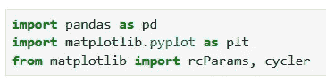

太好了。现在来看数据集。我使用的是国际航班乘客数据集，主要是因为它在绘制时看起来很漂亮。无需下载，只需将网址粘贴到 ***中即可。read_csv()*** 函数，记住它是分号分隔的数据集:

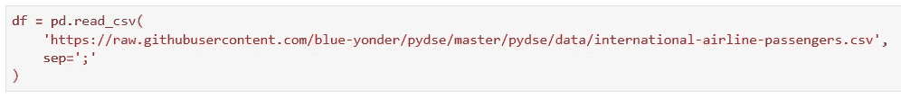

好哇！我们已经导入了数据集和所有必要的库。现在我们可以使用 *Matplotlib* 来查看数据集的样子:

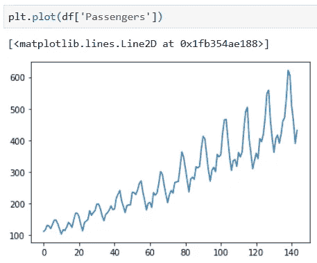

呀。快速浏览一下图表，您会立即知道为什么 Matplotlib 需要调整。如果你觉得上面的图表没问题，那么你可能就不应该读这篇文章(*也许应该咨询眼科医生*)。

如果你的眼睛没问题，继续阅读。

# 改变尺寸

这是到目前为止最显而易见的事情，因为默认的 *Matplotlib* 图表非常小(*如果您坚持使用默认的大小*，祝您好运)。

由于我们希望代码可以复制粘贴到您正在处理的任何项目中，因此我们不希望图表调整与图表相关，我们将使用来自 *Matplotlib* 的 **rcParams** 来更改默认的绘图大小:

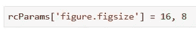

如果您要重新绘制数据集，您会看到一个更大且更容易解释的图表:

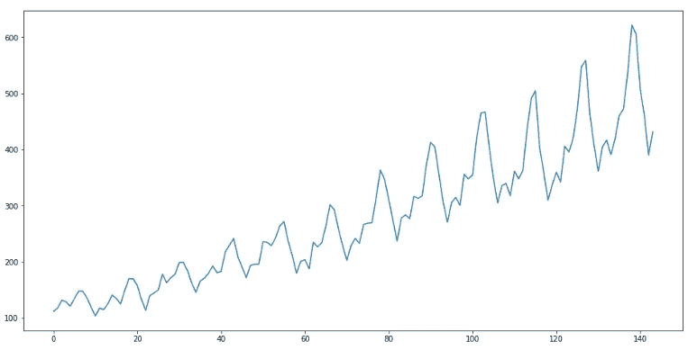

# 移除边框

顶部和右边界看起来很痛苦。因为他们，这个图表看起来封闭，令人痛苦的没有吸引力。

幸运的是，这些边界可以不费吹灰之力就被移除。我们的整个 **rcParams** 配置现在将如下所示:

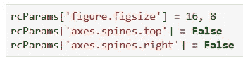

重新绘制数据集后，我们看到了更好的、开放的图表:

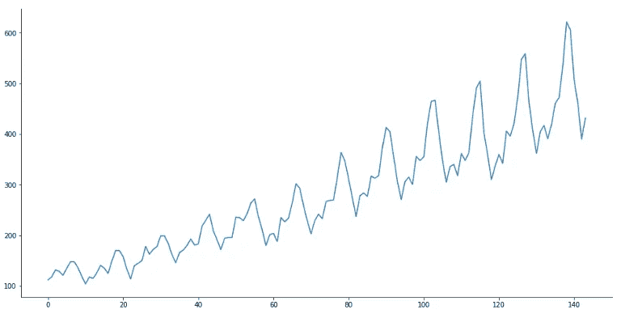

# 调整线条颜色和宽度

我不知道你是怎么想的，但我不太喜欢深蓝色和几乎看不见的细线。通过利用*线宽*和*推进周期*参数，你可以很容易地改变这些参数。

第一个需要一个数字，我认为 2.5 是一个好的起点。然而，第二个需要一个颜色的数组。这是一个数组，因为在一些图表上你会有多条线，所以 *Matplotlib* 需要知道如何给它们着色。您可以随意添加多种颜色，但我只添加一种，因为我只有一行:

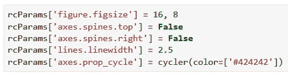

瞧啊。这更吸引人，也更容易看到:

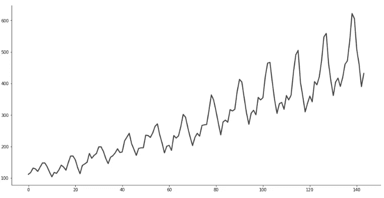

# 调整刻度大小

在我们的图表上，我唯一要说的仍然是错误的是 y 轴和 x 轴上的分笔成交点的大小(*或者我应该说缺乏大小*)。这也很容易调整。选项 **xx-large** 对我来说效果很好，但是如果你喜欢的话，你可以将它调低到 **x-large** 或者缩放到 **xxx-large** :

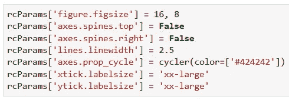

现在，这更容易阅读:

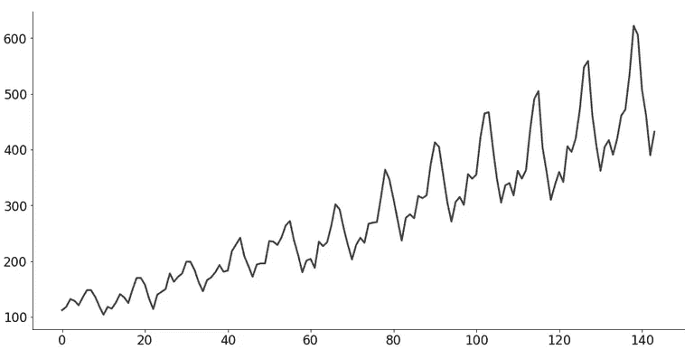

# 在你走之前

现在你知道了。在短短的几分钟内，我们把一张难看的图表变成了不那么难看的东西。

这里仍然有事情要做，例如调整**图例**和**标题**的大小，但是我把这留给你，因为这个图表没有那些组件。

您现在拥有 7 行代码，可以在任何地方使用，因此您再也不用处理 stock *Matplotlib* 样式了。

感谢阅读。保重。

*喜欢这篇文章吗？成为* [*中等会员*](https://medium.com/@radecicdario/membership) *继续无限制学习。如果你使用下面的链接，我会收到你的一部分会员费，不需要你额外付费。*

 [## 通过我的推荐链接加入 Medium-Dario rade ci

### 作为一个媒体会员，你的会员费的一部分会给你阅读的作家，你可以完全接触到每一个故事…

medium.com](https://medium.com/@radecicdario/membership)