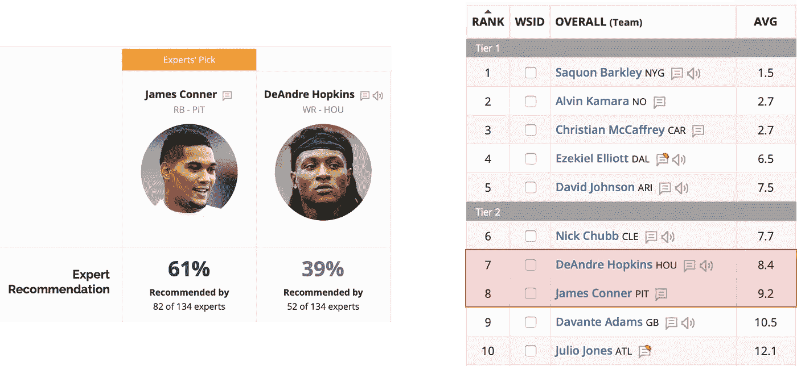

# 懒惰的数据科学家的梦幻足球排名

> 原文：<https://towardsdatascience.com/the-lazy-data-scientists-fantasy-football-rankings-76e941681a63?source=collection_archive---------29----------------------->

## [深入分析](https://medium.com/towards-data-science/in-depth-analysis/home)

## 混合梦幻足球专家排名与排名聚合方法

这是一篇关于创造梦幻足球排名的文章。我声称(还没有证据……但是),这些排名会比你在网上找到的更可靠。我们不需要做任何花哨的建模来预测玩家的表现。其实我们根本不会用玩家表现数据！

没有球员的表现数据，我们怎么可能创造出准确的排名呢？我们将让其他人为我们做大部分艰苦的工作！

Photo by [Martin Reisch](https://unsplash.com/@safesolvent?utm_source=unsplash&utm_medium=referral&utm_content=creditCopyText) on [Unsplash](https://unsplash.com/@safesolvent?utm_source=unsplash&utm_medium=referral&utm_content=creditCopyText)

现在是 2019 年，梦幻足球席卷了全世界。从铁杆球迷到不懂飞盘失球的人，每个人都在玩梦幻足球。甚至我妈妈今年也加入了一个联盟。(好吧，她没有真的，但这不会令人惊讶。)

这款游戏如此受欢迎，以至于“梦幻足球专家”是一条可行的职业道路。许多人通过每周给球员排名并给虚拟球队经理提供建议而获得报酬。这听起来可能是一份轻松的工作，但这些专家真的知道他们的东西，他们投入了大量的努力，以保持对不断变化的 NFL 景观的更新。

这些专家将提供我们用来创建玩家排名的数据。我们将简单地把一群专家发布的排名融合成一个单一的排名。每个专家的准确性在不同的周(和不同的年)会有一点不稳定，但是总体来说应该是相当准确的。

为什么我认为这是产生数据驱动玩家排名的最佳方式？为什么不用过去的球员表现数据来预测未来的表现？我并不自大——我不认为我能建立一个很好的模型来预测玩家的表现。大多数专家都很擅长他们的工作。他们将数据分析、球探和足球知识结合起来，将比我提出的任何模型都更好地预测球员。如果你不能打败他们，就放弃，接受他们的结果。

你可能会想:这样的东西不是已经存在了吗？没错，确实有网站(比如 [FantasyPros](https://www.fantasypros.com) )通过结合个别专家的排名来产生“共识”排名……但我觉得我可以做得更好(好吧，可能我有点自大)。

## 方法——等级聚合

FantasyPros 使用了一种非常简单的方法，将各个专家的排名结合起来。对于每个玩家，他们只取该玩家在所有专家列表中的平均排名。例如，如果 6 名专家将 Saquon Barkley 列为 1 号球员，3 名专家将其列为 2 号球员，1 名专家将其列为 3 号球员，Barkley 的平均排名为 1.5。

有一个完整的研究领域叫做排名聚合，致力于寻找将来自个人基本排名者的排名列表组合成一致或聚合排名的最佳方式。我认为许多排名聚合方法比 FantasyPros 方法更适合我们的排名任务。

我不会在这里详细讨论任何等级聚合方法(也许这将是以后的帖子)，但我将简单讨论一下作为例子的**即时决胜**。如果你听说过排名选择投票，你可能对即时决选很熟悉。在排名选择投票中，选民按照偏好对候选人进行排名，而不是投票给单一候选人。为了确定获胜者，我们必须汇总投票者的排名，即时决选是一种常见的方式。获得最少第一名选票的候选人不断被淘汰，他们的选票被重新分配，直到一名候选人获得第一名选票的多数。即时决胜在选举中的应用是显而易见的，但没有什么能阻止我们将相同的算法应用于梦幻足球排名。

大多数等级聚合方法关注的是成对偏好，我认为这对我们的梦幻足球目标很重要。例如，如果大多数专家更喜欢*玩家 A* 而不是*玩家 B* ，那么*玩家 A* 在汇总列表中的排名应该高于*玩家 B* 。FantasyPros 平均法不能实现这一点——如果单个专家将玩家 A 排在很低的位置，这可能会将平均值拉低到足以将 A*排在总列表中的 B*之下。在 FantasyPros 选秀排名中不难找到一个真实的例子:**

Screenshots of FantasyPros consensus draft rankings on September 2, 2019\. Experts have a pairwise preference for James Conner over DeAndre Hopkins, but Hopkins is ranked higher in the consensus rankings.

专家们的成对偏好(最喜欢詹姆斯·康纳)和 FantasyPros 上的一致排名(迪安卓·霍普金斯排名更高)之间似乎存在脱节。即时决选纠正了这个问题——当对相同的数据使用即时决选时，Conner 和 Hopkins 与 FantasyPros 共识排名相比交换了位置。

## 排名和结果

我从 FantasyPros 使用的资源中收集了数据，并对它们应用了一些等级聚合方法。在很大程度上，所有方法的结果都非常相似，但每一种方法都与 FantasyPros 的共识略有不同。**您可以在** [**此链接**](https://gist.github.com/djcunningham0/a5eb842819b7e38b43cc0bab6cf584ed) **找到我截至 9 月 2 日的标准得分汇总排名草案。**

(注意:我的排名中的 FantasyPros 一栏可能与网站不完全匹配。FantasyPros 并不公布他们用来创建共识排名的所有原始数据，所以我收集的数据可能与他们汇总的数据不完全匹配。)

我不知道哪种聚合方法会给出最好的结果，我计划随着赛季的进行对它们进行评估，所以请关注未来的帖子。我还计划用同样的方法制作每周排名。

你有兴趣看更多吗？在 djcunningham0@gmail.com 发表评论或给我发电子邮件。如果有足够的兴趣，我会在持续的基础上公布排名。

[成为媒体会员](https://medium.com/@djcunningham0/membership)访问成千上万作家的故事！