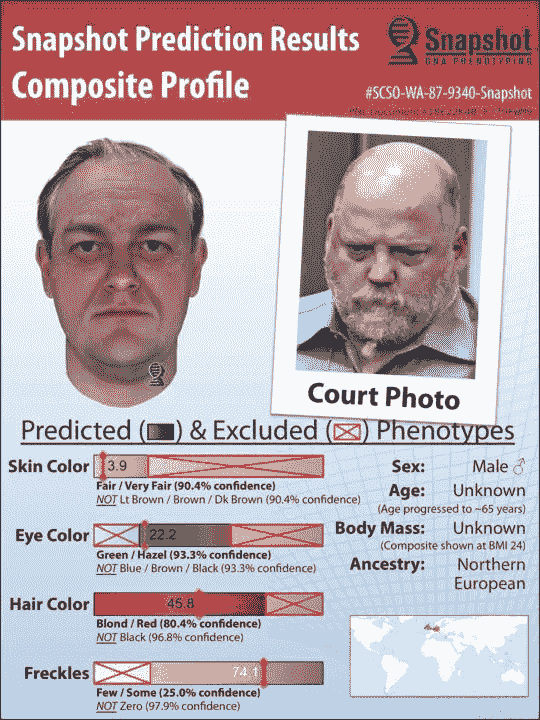

# 在法庭上使用商业家谱数据的法律和伦理挑战

> 原文：<https://towardsdatascience.com/the-legal-qualms-with-commercial-genealogy-data-in-court-41957fc3fb03?source=collection_archive---------27----------------------->

[https://www.23andme.com](https://www.23andme.com/?myg02=true)/

“遇见你的基因”是 23andMe [网站](https://www.23andme.com/?myg01=true)上的白色大字，鲜明的色彩对比让人很难滚动离开。该网页美观迷人，邀请潜在客户探索公司的服务选项。只需 [$199](https://www.23andme.com/dna-health-ancestry/) 和一抹唾液，人们就可以了解他们的祖先和遗传健康的几乎一切，从而促进家庭团聚和预防性健康治疗。该网站散发着简单、便捷和创新的气息——但代价是什么呢？

最近几个月，分析 DNA 并生成家谱的公司，如 23andMe 和 Ancestry.com[公司](https://www.ancestry.com/dna/)吸引了媒体的关注，因为它们的数据宝库帮助确定了原本是悬案的嫌疑人。值得注意的是，臭名昭著的[金州黑仔](https://en.wikipedia.org/wiki/Golden_State_Killer)，在整个 20 世纪 70 年代和 80 年代困扰着加州，最终在 2018 年 4 月通过开源系谱研究网站 [GEDmatch](https://www.gedmatch.com/login1.php) 被确定。在不需要搜查令或传票的情况下，执法部门能够上传凶手各个犯罪现场的 DNA 样本，将他与之前使用过该网站的远亲联系起来。虽然商业家谱数据的这种应用导致了一个以前无望的案件的结束，但它也提出了法律和伦理问题。

[https://cdn.officer.com/files/base/cygnus/ofcr/image/2019/01/640w/SnohomishSolve.5c3cbfad8e164.jpg](https://cdn.officer.com/files/base/cygnus/ofcr/image/2019/01/640w/SnohomishSolve.5c3cbfad8e164.jpg)

自从最近鉴定出金州黑仔以来，面向消费者的家谱数据库已经被执法部门用于超过 15 起刑事案件。虽然这种识别嫌疑人的方法越来越普遍，但它在法庭上的有效性在今年六月才刚刚得到检验。[案件](https://abcnews.go.com/US/signaling-era-forensic-investigation-man-caught-genetic-genealogy/story?id=64540673)涉及 1987 年一对年轻的加拿大夫妇在访问华盛顿州时被谋杀。30 多年来，这个案件一直悬而未决，直到警方能够通过基因数据库将犯罪现场发现的 DNA 与威廉·厄尔·塔尔博特二世的 DNA 进行匹配。虽然塔尔博特本人从未提交过他的 DNA，但他的两个堂兄弟却因此得以让官员们辨认出他。他的案件对[第四修正案](https://www.law.cornell.edu/constitution/fourth_amendment)防止不合理搜查和扣押的保障以及 1994 年 [DNA 鉴定法案](https://oig.justice.gov/reports/FBI/a0632/laws.htm)提出了新的挑战。尽管塔尔博特的律师在法庭上似乎忽视了这些法律纠纷，但他的案件仍然提供了一个有趣的网站，可以理解这种新的、或许令人不安的商业 DNA 记录用例的含义。

需要说明的是，自 20 世纪 90 年代以来，执法机构已经广泛采用了 DNA 取证技术，尽管是通过私人和受控的数据库以及严格的监管标准。1994 年，通过了 DNA 鉴定法案，以确保 DNA 法医学的合宪性，这在当时是一种新技术。该法案伴随着[联合 DNA 索引系统(CODIS)](https://www.fbi.gov/services/laboratory/biometric-analysis/codis/codis-and-ndis-fact-sheet) 的建立，该系统成为联邦 DNA 索引和执法机构的重要资源。虽然 1994 年 DNA 鉴定法案和 CODIS 鼓励在法律中使用 DNA 法医，但他们似乎也在平衡隐私权，因为 CODIS 将 DNA 的收集限制在(1)被判有罪的人，(2)从犯罪现场回收的 DNA 样本，以及(3)从身份不明的人类遗骸中回收的 DNA 样本。此外，访问 CODIS 需要严格的授权程序和遵守隐私保护标准。

虽然 CODIS 受到《DNA 鉴定法》规定的协议的限制，但商业数据库并不遵循同样的标准，因此与现有的法律框架产生了冲突。尽管大多数公司并不总是向政府机构免费提供他们的数据(不像 GEDmatch)，但他们的存储库仍然受到搜查令和传票的限制。实际上，这让政府可以直接接触到超过 1500 万提交了数据的个人。然而，由于 DNA 天生具有遗传性，这也使得政府可以间接接触到所有同意的客户的非同意的亲属。事实上，最近由《科学》杂志发表的一项关于 T2 的研究发现，如今，超过 60%的欧裔美国人可以通过基因数据库被识别出来，而这一数字有望在未来两到三年内达到 90%。

现在，许多美国人可能不关心上述统计数据。也许他们认为，如果有人犯了罪，那么他们应该被抓住，或者他们个人没有什么可隐瞒的，所以他们为什么要在乎呢？虽然这可能是真的，但第四修正案明确写入了我们的权利法案，以平衡法律和保护个人隐私，作为对我们自由的保障。具体而言，该修正案列举了:

> 人民的人身、房屋、文件和财产安全不受无理搜查和扣押的权利不得侵犯，除非有正当理由，并经宣誓或证实，特别说明要搜查的地方和要扣押的人或物，否则不得签发搜查令。

从法律角度来看，似乎每个公民的 DNA 国家数据库会违反“不合理的搜查和扣押”的保证。事实上，这一论点为《DNA 鉴定法案》规定的[法律限制提供了基础，并解释了为什么 CODIS 总是阻止从全社会强制采集 DNA。此外，许多通过基因数据库确认的嫌疑人从未同意上传他们自己的 DNA。取而代之的是，他们是通过远房家庭成员被辨认出来的，因此强调了这些搜查的不合理性。](https://fas.org/sgp/crs/misc/R40077.pdf)

除了缺乏同意之外，政府获取基因数据库的影响应该引起严重的隐私和歧视问题。比方说，人寿保险提供商可以访问这些数据集。也许他们会根据对遗传物质风险的感知来改变保险定价——这难道不是非常不道德和歧视性的吗？虽然这可能听起来反乌托邦和技术恐惧，但如果这些基因数据库仍然不受保护和可用，这很可能是一个迫在眉睫的现实。

最终，通过商业 DNA 数据库识别嫌疑人的方法在法庭上是不可接受的。它们的应用给持久的法律框架带来了严重的挑战，这些法律框架几个世纪以来一直在帮助塑造美国的司法。虽然塔尔博特的案件显然没有认识到这一社会和法律问题的严重性，但未来的案件仍然可以树立适当的先例，可衡量地纠正美国法律制度的尊严。