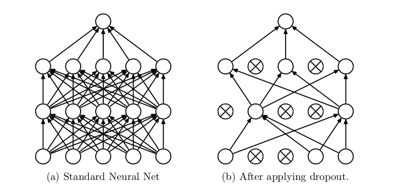
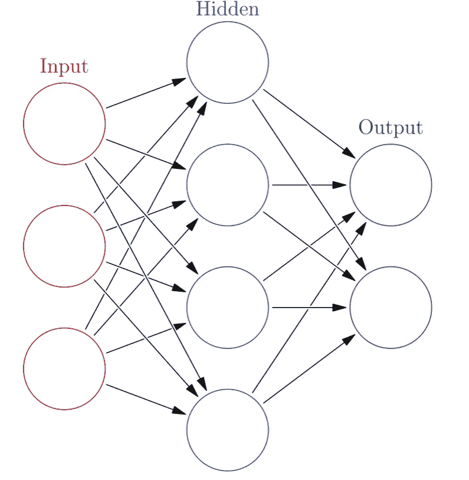
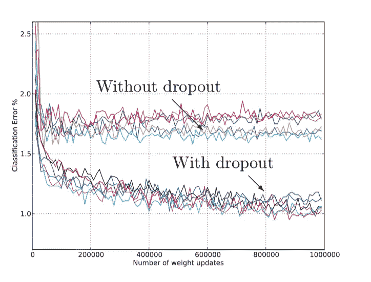

# 机器学习的“少即是多”

> 原文：<https://towardsdatascience.com/the-less-is-more-of-machine-learning-1f571c0d4481?source=collection_archive---------18----------------------->

## 回顾退出:一种防止神经网络过度拟合的简单方法

*注:这是对 Srivastava 等人的论文《Droupout:防止神经网络过拟合的简单方法》的综述。我使用了几个来源，如麻省理工学院新闻来完成这篇评论。我并不自称是该领域的专家，只是一个试图更好地掌握机器学习基础的学生。*

在他们的[论文](http://jmlr.org/papers/volume15/srivastava14a/srivastava14a.pdf)中，Srivastava 等人声称，在训练期间重复消除随机选择的神经网络节点及其相应的连接将减少过度拟合，并导致神经网络的显著改善。剔除是解决参数模型中过度拟合问题的第一种方法。即使在今天，辍学仍然有效，运作良好。

这篇综述将回顾理解这篇论文的基础，例如“什么是神经网络”和“什么是过度拟合”

Image From: [http://jmlr.org/papers/volume15/srivastava14a/srivastava14a.pdf](http://jmlr.org/papers/volume15/srivastava14a/srivastava14a.pdf)

## 什么是神经网络？

Image From [Wiki](https://upload.wikimedia.org/wikipedia/commons/thumb/4/46/Colored_neural_network.svg/1200px-Colored_neural_network.svg.png)

一个[神经网络](http://news.mit.edu/2017/explained-neural-networks-deep-learning-0414)，它松散地基于大脑中神经元的结构——因此得名，是一种机器学习的方法(计算机通过分析一些训练数据“学习”执行一些任务的过程)，其中某些输入(红色圆圈)通过由数千到数百万个节点(紫色圆圈)组成的“隐藏层”输入。

注意两件事很重要。首先，许多神经网络是“前馈”的，或者数据只在一个方向上移动(如箭头所示)。每个节点都连接到下面的节点(接收数据)和上面的节点(发送数据)。

二、隐藏层顾名思义就是隐藏。我们真的不知道那里发生了什么，也没有人给它编程来告诉它该做什么。相反，整个系统在一组训练数据上被训练，其中某个模型接收对正确输出的验证，反之亦然。因此，隐藏层生成一些能够解决特定问题的权重集。例如:如果我绘制了图 *x+2y = z* 并且随后运行神经网络来尝试绘制相同的图，给定几个输入和输出，隐藏层将在下面的等式中为 *a* 和 *b* 分配不同的值: *ax + by = z* 以尝试达到期望的 *x+2y = z.*

通常，节点接收的每个输入都将被分配一个“权重”换句话说，第二层是以特定方式对输入进行加权的某个函数(这是隐藏层)，并对输入进行加权。对于每个输入，节点将接受输入值并对其进行加权(基于训练数据)。然后，节点将对每个输入执行此操作，并对总数求和。如果该总数高于某个阈值，则节点将向前发送其数据，以便在下一个隐藏层中可以发生类似的过程。

对于渐进层，每个节点将从其每个连接接收不同的数据，然后基于其自身的关联权重输出数据。输出层接收结果产品，并根据相同的准则给出某种答案:如果结果产品在某个范围内，网络将给出相应的答案。

那么，神经网络是如何获得指定的值和具体的权重的呢？神经网络最初被赋予随机的权值和阈值。然后，在输入训练数据(即具有预定相关答案的输入数据)后，神经网络将调整权重和阈值的值，直到找到最适合其目的的值。注意，在这个训练过程中，权重和阈值被不断地调整，使得先前的输入将仍然产生相同的结果。这就是机器学习的美妙之处:它能够以巨大的蛮力发现模式和趋势。

## 什么是过度拟合？

[过拟合](https://machinelearningmastery.com/overfitting-and-underfitting-with-machine-learning-algorithms/)是神经网络中的一个严重问题，但它到底是什么？

术语“过拟合”是指神经网络或其他模型对训练数据建模得太好。例如，如果我有足够的参数，我就能够对任何方程或任何我想要的东西建模(我可以只为每个输入分配一个参数)，并且我将能够对训练数据进行完美的建模。但是当这个相同的模型用于真实数据时，它不会很好地工作，因为该模型基本上是为训练数据而建模的。

换句话说，训练数据中出现的*噪声和随机波动被神经网络提取出来，作为模型中出现的模式的一部分。然而，机器学习的关键是预测*未来*的趋势和模式，这意味着能够以 100%的准确率预测当前数据可能不是一件好事。*

过度拟合大多发生在非参数或非线性模型中，如决策树，因为它们在建模某些目标函数时具有更大的灵活性。为了解决这一问题，大多数机器学习算法会在根据训练数据训练后修剪一棵树，以删除细节。其他算法将包括其他参数来限制模型学习的细节量。

## 神经网络中的过拟合

Srivastava 等人的论文主要关注具有大量参数的深度神经网络。具有许多参数的神经网络能够接近地模拟大范围的函数(更多的参数=更好的函数估计)，然而，这样的大型网络是缓慢的，这使得过拟合成为更大的问题。这是因为在测试时，很难找出许多不同的大型神经网络中不平衡的地方。

文章中有一段很好的话总结了这一点:

> 然而，在训练数据有限的情况下，许多这些复杂的关系将是采样噪声的结果，因此它们将存在于训练集中，而不存在于真实的测试数据中，即使它来自相同的分布。

随着我在机器学习方面读得越来越多，我开始发现 ML 在很大程度上解决了有限的训练数据、有限的计算和成功的模型/预测之间的权衡。这篇文章中的另一个很好的引用:

> 在无限制计算的情况下，“调整固定大小模型的最佳方式是对所有可能的参数设置的预测进行平均，对每个设置进行加权…[并对所有可能的模型进行平均，不幸的是，这对于复杂模型是不可能的]

关键词:*无限计算*。对于数百个节点和转换的输入，上述方法变得几乎不可能。这基本上概括了辍学的动机。我们不是寻找每一个可能的模型及其设置(本质上是一种蛮力方法)，而是随机进行，并且在预期中，一切都应该并且将会很好地完成(因为我们有大量的节点和数据，总体来说一切都会好的)。

*旁注:这也是为什么* [*集合模型*](https://www.google.com/url?sa=t&rct=j&q=&esrc=s&source=web&cd=2&cad=rja&uact=8&ved=2ahUKEwikwZnSu-7gAhWj6IMKHXuxAHcQFjABegQIDBAB&url=https%3A%2F%2Fwww.analyticsvidhya.com%2Fblog%2F2018%2F06%2Fcomprehensive-guide-for-ensemble-models%2F&usg=AOvVaw2ntgjeKdrJ5tEkIrrgk69J) *(或者许多模型的组合)几乎总是更好的原因。*

## 什么是协同适应

在一个非常基本和主观的层面上，协同适应有点像确认偏差，但是是针对隐藏单元的。理想情况下，给定一个输入，我们希望每个隐藏单元独立于其他隐藏单元对输入做一些不同的和有区别的事情。然而，协同适应是当隐藏单元试图模仿其他隐藏单元时发生的现象，“因为它是正确的”，并导致许多隐藏单元看起来和行为彼此非常相似。Quora 上有一个例子解释做得更好。[这里是](https://www.quora.com/What-does-co-adaptation-of-neurons-in-a-Neural-network-mean)。

## 辍学有什么帮助？

Srivastava 等人对上述问题提出的解决方案是一种称为辍学的技术。本质上，Dropout 会在训练过程中随机丢弃一个神经网络中的节点及其连接，以防止 [*协同适应*](https://www.reddit.com/r/MachineLearning/comments/2uogqt/what_is_coadaptation_in_the_context_of_neural/) 。

如前所述，关键思想是从一个生成的模型中随机删除单元。这呼应了节省计算和数据，同时最大限度地提高预测成功率的主题。丢弃随机单元将允许我们基本上有一个伪新模型，我们可以在相同的数据上训练，并给我们更好的预测。来自文章:

> 在测试时，通过简单地使用具有较小权重的单个未细化网络，很容易近似所有这些细化网络的平均预测效果。这大大减少了过度拟合，并提供了其他正则化方法的重大改进。

可以使用类似于标准神经网络的随机下降来训练辍学神经网络。因此，主要的区别在于，对于每个训练案例，您必须通过删除单元来对稀疏网络进行采样。然后，随着学习率的降低，优化将采取更短的步骤，并最终达到某个最小值，这是您的最佳模型。

## 结果

发现对于机器学习算法的所有架构，退出都是成功的。见左图。

## 与贝叶斯神经网络的比较

> “丢弃可以被视为对具有共享权重的指数级模型进行等权平均的一种方式。”

贝叶斯神经网络(BNN)是另一种被视为黄金标准的学习方法。bnn 在数据稀缺的领域和项目中非常有用，所以我们真的需要从数据中获取一切有价值的东西。然而，bnn 是昂贵的(在时间和计算两方面),并且难以适应大型网络。这篇文章宣称 BNNs 是“在神经网络结构和参数的空间上进行模型平均的适当方式。”所以自然，文章继续拿退学和 BNNs 做比较。

主要区别是 Dropout 对每个模型(每个去除了一些单元的细化模型)进行同等加权，但是 BNNs 根据模型与数据的拟合程度对模型进行加权。这种方法显然更好，因为它将数据带入全尺寸，但如前所述，它可能会非常耗时/计算量大。辍学训练和测试要快得多。所以最终权衡是值得的。

## 结论

在我开始这篇文章的结论之前，我认为在任何机器学习问题中，在时间复杂性、计算复杂性和模型的成功之间总是有巨大的权衡。此外，如果你不记得别的，这是文章的精髓:

> 退出是一种通过减少过拟合来改进神经网络的技术。

模型中使用的标准反向投影将导致不能很好地概括未来数据/进行预测的共同适应。Dropout 将通过随机丢弃其他单元可能依赖的单元来解决这个问题。这些单位将不得不学会独立(字面上的)。虽然辍学增加了培训时间(通常是 2-3 倍)，但它的成功似乎使这种权衡变得有价值。正在努力找出加速辍学的方法。例如，对于线性回归，已经发现诸如 L2 正则化的修改形式的正则化降低了模型的随机性，这使得训练如此缓慢。对于更复杂的模型来说，这个过程仍然是一个开放的问题，也许是你需要解决的问题。