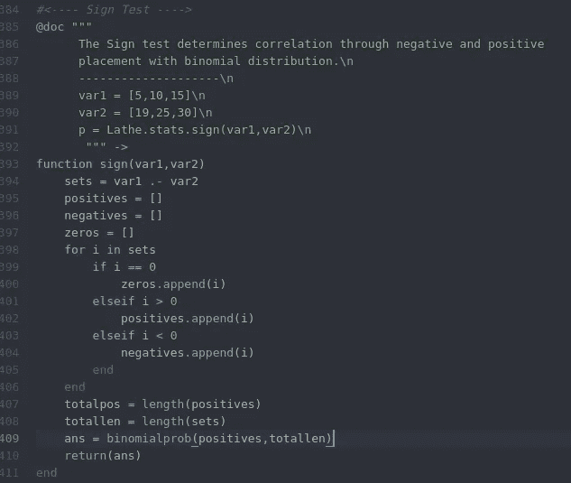
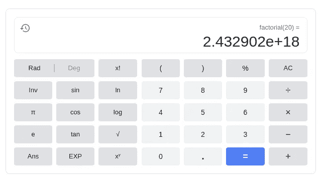
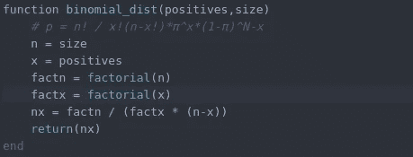

# 鲜为人知的，令人敬畏的迹象测试

> 原文：<https://towardsdatascience.com/the-lesser-known-awesome-signs-test-3caa1d173b6?source=collection_archive---------25----------------------->

## 以及如何去做


我们都很熟悉 T 检验，也许是 f 检验，甚至是其他一些像 Wilcox 秩和检验之类的东西。有很多统计测试，其中一些我们每天都会用到。统计测试对数据科学很重要，因为我们经常需要知道某个值的重要性。

不太为人所知的是一项名为体征测试的酷测试，由苏格兰医生约翰·阿巴斯诺特于 18 世纪早期首创，他也是对抗天花的早期方法的创始人。符号测试使用符号的统计分布和计数作为统计测试的先导。

# 符号


非常方便的是，在[车床](https://github.com/emmettgb/Lathe.jl)上可以进行信号测试，这样我们就可以观察到源头。符号测试的第一步是将我们测试的两个数组相减。这在 Julia 中很容易做到，只需使用。-操作员:

```
sets = var1 .- var2
```

接下来，我们要找出哪些价值观是积极的，哪些价值观是消极的。我们可以通过使用条件句来判断一个数是小于还是大于零来解决这个问题。可能有一种更简洁的方法来做到这一点，但是通常使用这个循环对性能的影响不会太大:

```
positives = []
    negatives = []
    zeros = []
    for i in sets
        if i == 0
            zeros.append(i)
        elseif i > 0
            positives.append(i)
        elseif i < 0
            negatives.append(i)
        end
    end
```

你可以很容易地使用朱莉娅的过滤器！()方法来代替此方法；过滤小于、大于或等于 0 的值。至于我们的零和负，

> 扔掉它们

我们实际上不需要它们。我们需要的唯一值是 n(样本大小)和 x(阳性数)。)我们可以这样计算 n 和 x:

```
x = length(positives)
n = length(sets)
```

下一步是将 n 和 x 代入二项分布。下面的函数类似于我们现在应该有的:



# 二项分布

在为了计算二项概率和二项分布，我们需要能够计算阶乘。这对符号测试来说是一个巨大的打击，因为阶乘是一个令人惊讶的复杂和密集的计算问题。在 Python 中，可以从 scipy.special 导入阶乘函数，问题？任何大于 23 的数字都会返回无穷大。这是因为 4 的阶乘甚至是大量的乘法运算:

> **4！** = 4 × 3 × 2 × 1 = 24

而这种倍增以惊人的速度呈指数级增长，以 7 为例:

> **7！** = 7 × 6 × 5 × 4 × 3 × 2 × 1 = 5040

这是一个 5015 的差距，从 3 个数字的差距。例如，在谷歌上的计算器中输入 20 的阶乘，我们会得到一个非常非常大的数字。



这个问题是，通常在数据科学中，我们的样本大小远远超过 20。首先创建阶乘函数的循环非常发人深省，而且自相矛盾。我正在使用的语言 Julia 使用的阶乘查找表不能超过 20。这整件事让整个测试变得有点不可理解，对数据科学来说并不可行。如果你想在 Julia 上阅读更多关于这个问题的内容，我已经在这里写了一整篇文章。Julia 的承诺和面临的问题是 Julia 的大浮点类型，它非常精确，可以保存足够的数字来获得实际的阶乘，只要该函数是手动的，而不是在阶乘表上查找。我可能会在未来投入时间，但只有时间会证明…

超越这个测试的主要问题，二项分布的公式是相当简单的。大声念出来，就是 n 的阶乘除以 x 的阶乘乘以 n 减 x，在更好的光线下，这里写出来:

> p = n！/ (x！* (n-x))

记住这一点，我们可以从我们执行的符号测试中获取 x 和 n，然后得到它们的阶乘。在 Julia 中，这是通过 factorial()完成的:

```
factn = factorial(n)
factx = factorial(x)
```

然后就像把我们的变量代入公式一样简单:

> nx = factn / (factx * (n-x))

最后一个函数是这样的…



# 就是这样！

> 像π一样简单

我们现在有一个函数来做符号测试。令人惊讶的是，符号测试是未知的，当然用计算器比用编程语言更有趣。我只能希望随着越来越多的统计测试被写成各种语言，经典的符号测试仍然存在。符号测试很简单，因为我们只用几行代码就可以计算出来(尤其是没有那个我懒得去修复的难看的 for 循环)。)将来，看到更多的人知道这个测试以及更聪明地全面采用它会很有趣。