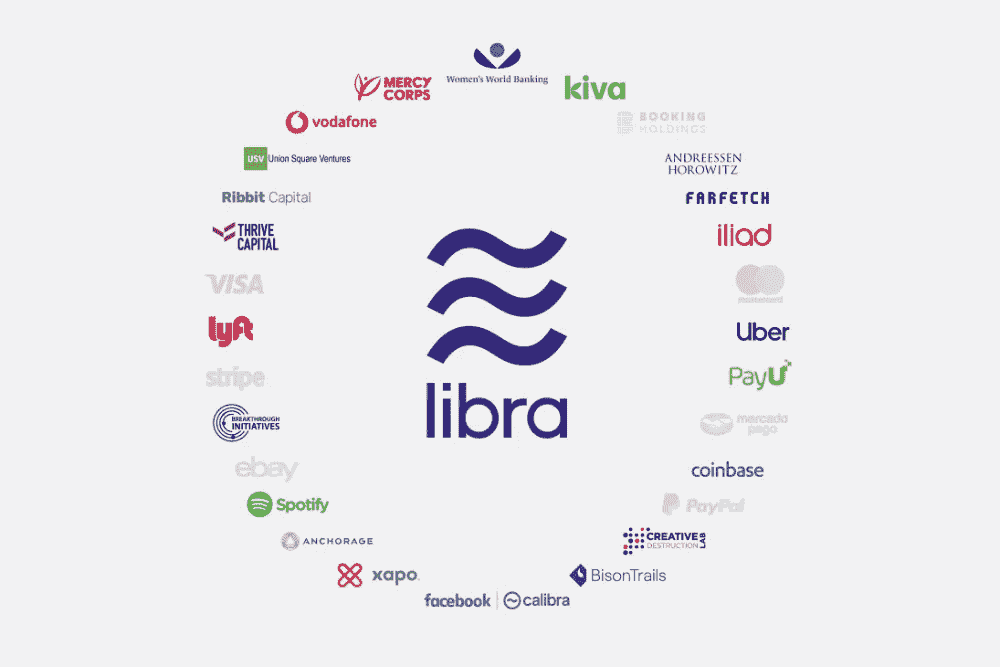
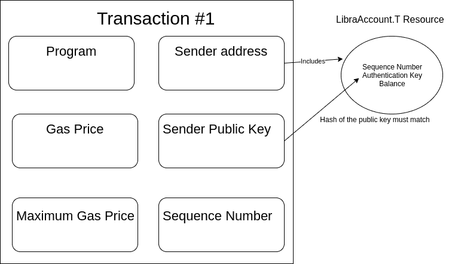
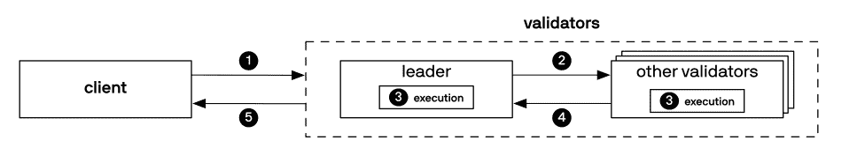

# Libra 区块链:技术概述[第一部分]

> 原文：<https://towardsdatascience.com/the-libra-blockchain-technical-overview-part-i-5e872b0369c?source=collection_archive---------20----------------------->

我是🇵🇹的一名博士研究员@ Técnico Lisboa，在那里我教授以用户为中心的设计。我是基于 Hyperledger 结构的访问控制项目的导师，该项目由 Hyperledger 和 Linux 基金会支持和资助🔥。

目前，我是葡萄牙政府的区块链开发者。我愿意合作和讨论区块链技术🚀：

如果你喜欢区块链和开源，一定要看看我的 Github 页面(https://github.com/sponsors/RafaelAPB/dashboard)🙏

本文假设您对区块链技术有基本的了解。如果你不知道，请点击这里查看一份简单而全面的介绍。在第 1 部分中，我们向 Libra 区块链介绍了 basilar 概念，包括交易、事件和分类账历史。接下来，我提供对 Libra 协议的见解。该摘要基于 Libra 的开发者白皮书。

# ⛓️简介

“Libra 区块链是一个去中心化、可编程的数据库，旨在支持一种低波动性的加密货币，这种货币将有能力成为全球数十亿人的高效交易媒介”。这是脸书子公司 Calibra 的几名研究人员撰写的 [Libra 区块链论文](https://files.static-nzz.ch/2019/6/18/9b721442-c11d-4b56-89b9-dd03f3a7c8e1.pdf)【AMS den 等人，2019】的第一句话。

天秤座的主要目标是**提供可靠、廉价、无缝的金融服务**(包括但不限于转账和收款)。这些目标是通过创造一种由创始成员控制的全球货币——Libra 来实现的，创始成员是私营公司。

> 这些组成了天秤座协会。随着时间的推移，验证过程将取决于成员的持股，而不是创始成员。
> 
> 天秤座协议为天秤座区块链提供动力。

Libra 协议的实现是 Libra 的核心项目。Libra 是一个公共区块链，它的编程语言是 Move。在 Libra 中，每个人都可以看到分类帐的状态，并通过发布交易参与网络。

在 Libra 区块链中，一个“事务是一个围绕着**移动字节码程序的认证包装器”**。交易作用于分类账的当前状态，如果成功执行，会产生一个新状态。

一个例子:Rafael 从他的账户中转账 5 Libra 到 Técnico 的里斯本账户。注意，和以太坊一样，交易需要支付汽油费。事务还可以生成可供客户端查询的事件。例如，它允许客户查询区块链:“我在最后一天收到了哪些付款？”或者“克里斯蒂亚诺罗纳尔多在最后一分钟收到了哪些付款？”。

交易结构如下:

发送者地址包括序列号、认证密钥和来自内置 LibraAccount 的余额

将发送者公钥散列与认证密钥进行比较，以防止移动虚拟机接受来自有效签名但不与账户相关联的交易。

该事务包括将字节码脚本移动到 execute(程序)中，它具有指定的汽油价格。最高天然气价格对在该交易中可以花费的天然气量设置了阈值。序列号防止重放攻击，即确保事务执行一次。

# 交易用发送者的私钥签名，并且可以用其公钥验证。

尽管任何客户端都可以加入网络，但是客户端必须经过身份验证(通过 pivate-public key 对)。在 Libra 区块链中，验证器节点持有并决定可编程资源的数据库，这些资源归用户所有(例如，通过钱包应用程序)。

> 例如，这种可编程资源可以是 Libra(与 Libra 区块链相关联的加密货币)，或者是通过智能合约编程的定制资源。

与以太坊不同，这个区块链是一个区块链联盟，这意味着验证器节点——处理智能合约发布的交易的节点——属于一个公司联盟。

实际上，验证者决定分类账的状态，以及哪些交易是有效的。这一事实带来了分散化的风险，因为联盟成员可以以更自然的方式合谋决定共享总账的状态。

# 它是如何工作的？

上图描述了 Libra 的协议概述。leader 包含可编程资源，可由客户拥有。这种资源被分配给一个模块。

例如，Libra coin，一个可编程的内置资源，继承了 Libra coin 模块的规则。验证者通过一致算法，通过验证客户和验证者发出的交易，对共享分类帐的状态达成一致。

所有的验证器执行事务，导致一个新的状态。当客户端向区块链查询新状态时，它们检索最新的状态，该状态已经由共识协议签名。

# 状态历史是公开的，因此可以被任何客户端验证。因此，区块链提供了可追溯性和透明度。

这种协议允许生态系统就分类帐的状态达成一致。分类帐的状态对应于每个用户的余额信息。怎么会？状态是一个键值存储，其中一个或多个帐户值与特定的用户地址相关联。帐户值可以是 Libra 或其他可编程资源，这意味着您可以持有多种令牌。

> *账户价值的概念允许创新者利用 Libra 区块链创建新的服务，这些服务可以在智能合同上明确绑定到特定类型的价值。*

上图描述了 Libra 的协议概述。leader 包含可编程资源，可由客户拥有。这种资源被分配给一个模块。例如，Libra coin，一个内置的可编程资源，继承了 Libra coin 模块的规则。验证者通过一致算法，通过验证客户和验证者发出的交易，对共享分类帐的状态达成一致。

所有的验证器执行事务，导致一个新的状态。当客户端向区块链查询新状态时，它们检索最新的状态，该状态已经由共识协议签名。

> *州历史是公开的，因此可以被任何客户验证。因此，区块链提供了可追溯性和透明度。*

这种协议允许生态系统就分类帐的状态达成一致。分类帐的状态对应于每个用户的余额信息。怎么会？状态是一个键值存储，其中一个或多个帐户值与特定的用户地址相关联。

# 帐户值可以是 Libra，或者另一种可编程的资源——这意味着您可以持有几种令牌。

账户价值的概念允许创新者利用 Libra 区块链创建新的服务，这些服务可以绑定到智能合同上明确的特定类型的价值。

# 我可以创建我的令牌吗？

资源被组织成模块；用户可以拥有它。这样的模块有一个位置，可以定义几个资源和过程。资源可以是用于金融目的的代币。

其逻辑是在程序上实现的(我们可以用以太坊智能合约或 Hyperledger Fabric chaincode 进行类比)。

# 不幸的是，至少现在，客户将不能创建定制资源，比如模块。

在这篇文章中，我们讨论了天秤座的基本要素。在下一篇文章中，我将向你展示如何在你的电脑上设置天秤座区块链。

非常感谢您的阅读。你真棒💪