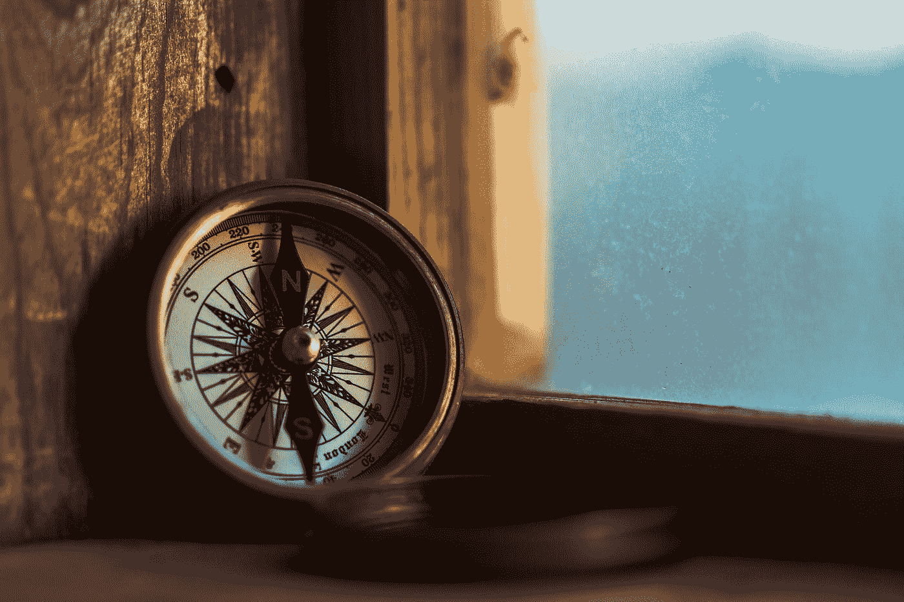

# 心理学的谎言，科学的无知，人工智能的幻觉

> 原文：<https://towardsdatascience.com/the-lies-of-psychology-the-ignorance-of-science-and-the-illusion-of-ai-5f3ed652b0e?source=collection_archive---------18----------------------->

Photo by [Jordan Madrid](https://unsplash.com/@jordanmadrid?utm_source=medium&utm_medium=referral) on [Unsplash](https://unsplash.com?utm_source=medium&utm_medium=referral)

我喜欢我工作的动力和我工作的环境的众多原因之一是这些领域的强度，这些领域往往迫使我从各种角度思考和“感受”。根据我当天的听众，我可以被视为“宣泄者”，因为我喜欢分享非常原始的情绪，试图在一个非常情绪化的世界里与其他人保持一致。对我来说，这就是数学。根据我亲近的人，我可能会被视为“反社会者”,因为情绪通常不会引发我的反应。但在商界，我经常被许多人称为“精神病患者”，他们最近发现，最好的“商业头脑”和泰德·邦迪一样疯狂。

对我来说，我就是我，对于像我今天这样的旁观者来说，标签可能更尴尬而不是有帮助。外面有很多，你可能没有注意到他们，或者不知道如何与他们交流。然而，对于那些了解我，真正了解我的人来说，我只是一个花更多时间观察和理解事情以解决问题的人，而不是出于压力或情感需求而坚持消费。根据你的文化、领域、角色、关系、教养、目标或哲学，它可以被看作是以下任何一种。

*   寒冷
*   神秘的
*   残酷的
*   领导者
*   Naraccistic
*   福音传道者
*   聪明的
*   无知的
*   双极的
*   焦虑的
*   沮丧的
*   注意缺陷障碍

但是视角和它的密友，语境，才是这个“故事”的本质。从上下文来看，透视是一种现实，因为数学很少关心你的想法和你在世界物理中的位置。或者说宇宙。不过，无知当然是福，知道这个词在社会背景下可能有点刺耳。我们也可以称之为“偏见”。或者说，情感。

## 心理学的谎言

哲学是心理学领域之母。这是我们最深刻的思想家的思想，在这个世界上，太分裂，太受痛苦和情感胜利的驱动，以至于不能“研究”或挑战狂热信仰的观点。尽管多年后，许多感受到世界数学并以能引起几代人共鸣的语言表达出来的头脑，将会产生一个试图理解他们感受的领域。这是科学方法的基础，他们以一种非常人性化、情绪化、有偏见的方式形成了一个假设，我们找到了测量它的方法。心理学是我们理解思维的第一次科学尝试。和心理领域的性质，它忽略了基础科学的发展。这是不可避免的。

我们迅速开发了更多的工具、方法、实践，并在全球范围内连接思想和理念。随着我们将数学引入调查和流程，通信和技术使我们能够做得更多。直觉上了解数学是“统计学”的答案。而“讽刺”或多或少就是从这里开始的。学术界从地方性的出版争论发展到全球性的争论，这种争论是由几十年来在合作企业的幌子下的观点和竞争所推动的。公平地说，增长知识的愿望是真实的，但资助的方法，或工作被认可的方法，受制于学术界的成立。生意和地位。

当每个能量场发现新真相时，新的能量场出现并分裂。既美丽又令人心碎的是，这些领域中有如此多的领域分裂开来，再次汇聚到一个单一的原则上。数学。尽管如此，那些被数学基础所驱使的人倾向于在实践中更快地找到彼此。实际上有一个数学公式是从一个经常被忽略的领域中推导出来的。当你可以有效地衡量人们的无知时，却因为看似显而易见的原因而被忽视。但是心理学催生了科学和数学的认知，以及科学和情感的社会学。

## 对科学的无知

这是科学上必然的真理。在实践中，我们被警告不要进入学术界，但不可避免地会忘记我们所处的世界。你必须遵循课程，意识到他人的感受，在可以促进或阻止你成长的小组中工作，服从一个非常人性化的导师，面对他们自己的冲突矩阵。你在可测量的科学和遗忘领域的量化情绪与可测量的系统性影响的主题。想争论这一点吗？不太顺利。我以前模拟过这个论点。微积分得心应手。

谢谢你，艾萨克·牛顿爵士，我还被告知他从未正式发表过改变数学观点以形式化微积分的作品，但他的想法或多或少受到了全球社会环境的影响。但人们可能永远不会知道，互联网是一个有偏见的地方。

如今，学术界内外的许多年轻人都非常社会化，然而，对工作和合作的认可也受到你所处环境的文化的影响。一些机构鼓励不同全球机构之间的合作，你可以通过这种方式发表作品。其他人不会根据谁在资助实验室、研究或有时是管理而拥有它。作为观众，你没什么可担心的，我们都以自己的方式参与其中。无论你如何看待你的情绪，它对你的系统影响远远超过你所知道的，如果这是一个你感兴趣的话题，你应该接触图论。*现在这已经不是什么理论了，但是跟随白兔你会有惊喜的。*

在我自己在学术界的“工作”期间，我接触了其他几个机构，它们从数学上定义了什么是梦。另一个是寻找将子宫中感觉和听到的模式联系起来的方法，以确定儿童时期解决问题的方法。当时物理学的一些领域正在模拟一些似曾相识的事物。可悲的是，我自己的机构的偏见会阻止融合两者的工作发生，而“殉难”不会成为一种警告情绪。问题是…这是相对于那些被他们自己的核心“动机”驱动的人来说的，我的核心“动机”是大脑和数学。不出所料，许多人感到不安。一些人觉得这很有趣。这几个定义了我的“职业生涯”。

## 人工智能的幻觉

我很幸运地在我们的机构因“计算智能”而受到大量关注的时候离开了学术界，这是一个迅速发展和消亡的领域，因为工作的本质是挑战“心理学”并融合大脑作为机器的数学观点。《心理学》在出版物、工作领域、资金方面卖得非常好，其科学性和理论性足以卖出 T 恤衫和帮助婚姻。今天，商业中的这些团体被称为“用户研究”。虽然这个领域对我们来说产生了 HCI，这很可爱，因为微软基本上消耗了这个领域的每个人。我好像错过了那辆马车。也许这样最好。

AI 的言外之意也太哲学了，但这种环境的喜剧性在于，数学家们现在正在变成心理学家。这是不可避免的，但我也是人，也要服从社会的观点。我觉得有点滑稽。可笑的是，几十年前我们已经确定了如何测量智力，甚至能说出情感是什么。遗憾的是，当时你不能把这项研究卖给一个有家庭资助偏见的调查结果来推销新闻中的耸人听闻的话题，比如“麻省理工学院的研究人员刚刚发现，如果他们玩《我的世界》，你的孩子可能是一个天才，请关注这些消息”。取决于是谁在管理那个实验室，它可能被编进了数字，这个孩子也是一个连环杀手。

这是智力的基础，在当时创造了一个短语“智力的无知和偏见的幸福”，因为对测量它的追求将挑战所需的“自我”、“偏见”等，并将需要大量的社会痛苦来理解或部署。鉴于公司如何谈论人工智能，团体如何资助人工智能，媒体如何传播人工智能，以及我们仍然如何看待年轻一代，人工智能不是你想象的那样。事实上，科学上，数学上，人工智能在一段时间内可能不会像你想的那样。我们会接近的，但还不是时候。或者至少不是你想的那样。

## 科学心理学和人工智能科学

一切都是人在经营。我们都是消费者。我们每一个人。区别只是在货币的背景下。有些人卖产品，有些人卖梦想，有些人卖愿景，有些人可以把所有这些都包装起来，迫使你加入免费邮轮的分时度假。不具有讽刺意味的是，你可以听到当时被当作小说的哲学陈述和类比，我们继续我们的生活，我现在可以说一些像“谎言中存在真理”，或者“那些生活在文字中的人永远不会看到它们之间的东西”，你不可避免地会在正确的上下文中感受到某种方式，这是语言和情感的影响。文字骗人。事实上，这也有一个可测量的科学，甚至意识到这一点也会让你“感觉”到一些东西。大多数人。

具体到 AI 这个话题，也和我们理解的谁在做“AI”有逻辑和数学上的关联。谁真的相信，并已说服他人，他们是和将达不到。以及那些没有做任何接近人工智能的事情，但随着人工智能在今天的市场中的演变，将不可避免地倒向人工智能的人。这些话题都不好玩。当你不得不成为验证这些事情的人时，那就更没意思了。但非常明确的是，出于各种原因，所有这些都是推动人工智能向前发展所需要的。

人工智能有一个小秘密，许多计算机科学、神经科学、物理学、人工智能、数据科学和任何邻近的实践。我们都是数学，万物都有弹性。它曾被称为第三运动定律。而在所有事情都不可避免的情况下，偏见必然会阻止问题的解决。只是暂时的。

## 智力

对于那些看待自闭、两极、抑郁、快乐、悲伤、生病、强大、疯狂、聪明或任何其他根据社会或科学而改变定义的词语的人来说，这些话题是“相对的”，但他们都有一个互动的“故事”，来自他们生活中和周围事物的“蝴蝶效应”。你对他们的感觉几乎是不可避免的，你对他们做什么或说什么也是主观的。

但是要知道，有时候你直觉的数学比那些向你推销商品的人的情绪更有力量。毕竟，你的大脑只是数学，你只是没有足够早地接触到算术词汇，以这种方式表达出来。不要让任何人告诉你智力意味着什么，当他们自己不知道如何衡量它的时候。

在我们所有偏见的背后，是我们解决问题和观察模式的能力，同时我们自己表达复杂的模式。

解决问题或理解宇宙不需要博士学位。在很多情况下，是那些没有亲人的人。我们正等着你带领我们前进。