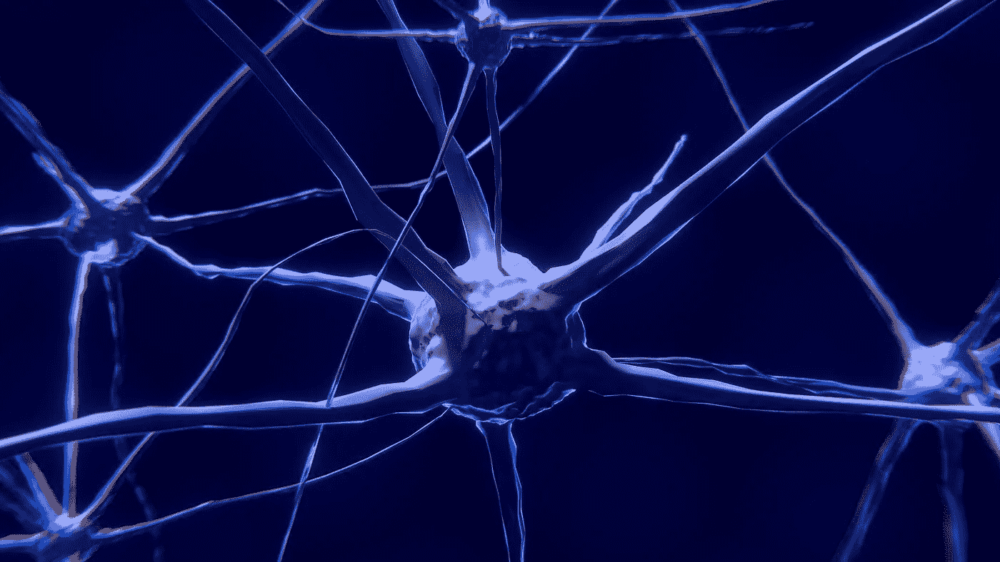

# 人工智能的极限。

> 原文：<https://towardsdatascience.com/the-limits-of-artificial-intelligence-fdcc78bf263b?source=collection_archive---------21----------------------->

*当大量数据和许多因素汇集在一起时，人工智能就优于人类智能。然而，只有人类才能进行逻辑思考，并区分有用和无价值的 AI 建议。*

> “教我们思考我们必须死亡”

这是 1912 年的路德圣经在诗篇 90 中所说的。甲骨文创始人拉里·埃里森、亚马逊老板杰夫·贝索斯或投资传奇人物彼得·泰尔等美国科技明星不相信这种谦逊，而是让数十亿美元去破解人为什么会衰老和死亡的之谜。

如果这三位商界领袖盲目相信电脑，那么至少有一种更愉快的方式可以让他们推迟死亡:多喝香槟。因为对许多数据和影响因素的分析表明，随着香槟消费量的增加，预期寿命会延长。

尽管并不清楚亿万富翁们每周喝多少酒。然而可以肯定的是，他们每个人都忽略了这种联系。因为这不是起泡酒所谓的保护作用，而是饮酒者的繁荣，这促进了这种高贵饮料的消费，再加上更好的医疗保健，使得起泡酒的臭名昭著的朋友活得更久。

我称之为“香槟陷阱”,这是关于人工智能(AI)的误解和神话的特征，也是人类可以利用的人工智能的优势和好处的特征。因为人工智能无非是一种非常特定的学习形式，即机器学习。

这种学习是有限的，同时又是无限的。无限，因为机器学习大大优于人脑的物理学习，因为越来越多的强大计算机可以在微小的几分之一秒内执行越来越多的操作。因此，机器思维为人们提供了他们永远无法识别或只能在不可接受的长时间内识别的模式。然而，机器思维是有限的，因为计算机只检测模式。其背后的意义和逻辑——参见香槟陷阱——只有人类才能认识到。

# 不聪明，但速度惊人

然而，由于数据的复杂性和数量，这种模式能够实现纯逻辑思维难以实现的洞察力。这恰恰是人工智能区别于早期数字化形式的新品质。

说明区别的最好方法是使用 IBM 的深蓝超级计算机。这位计算机巨人在 1996 年击败了国际象棋世界冠军加里·卡斯帕罗夫。然而，深蓝并不聪明。它快得令人难以置信。他只是根据各自的游戏情况和国际象棋游戏的编程逻辑来计算下一步棋的概率。他从零开始下一局，没有从上一局学到任何东西。

另一方面，在人工智能中，计算机不是用逻辑编程的。相反，它根据“试错”的原则工作，即，它挑选或重新挑选不合适的，并丰富迄今为止已经发现的东西。通过这种方式，他允许人类在不知道潜在逻辑的情况下识别联系、得出结论和做出预测。

夸张地说，人工智能可以比作狗或蹒跚学步的孩子的学习行为。孩子学会避开火炉，狗学会在火车车厢里保持安静。两者都不知道在它背后有一种危险，这种危险来自热量和对人的考虑——因此，他们没有能力将学到的行为转移到熨斗或其他人群的使用上。只有随着年龄的增长，孩子才能学会逻辑思维，并通过迁移将这种思维运用到新现象中。

# 从统计相关性中获取知识。

在一个高度复杂的世界中，生成模式有很大的优势。当影响变量(也称为决策变量)的数量爆炸式增长时，要找到解决问题的逻辑可能要花费难以忍受的长时间。

例如，为了赢得客户，销售人员必须有一种主公式，根据这种主公式，首先记录所有可以想象的影响变量，如性别、爱好、偏好、消费等，然后从中推导出这些变量:如果 a、b、c、d 等可用，则 y 或 z 随之而来。光是巨大的数据量就阻止了卖家创造这样一个主公式。

另一方面，有了人工智能，计算机就会被来自所有客户的所有可用数据淹没。通过成千上万顾客的购买行为，计算机确定行为模式，可以用来很好地预测未来的购买决策。这样做的原因是次要的。

因此，机器学习意味着通过统计相关性而不是逻辑结论来获取知识。例如，几个月前，一个人工智能系统在解释心脏的超声波图像方面击败了非常有经验的心脏病专家。

这些由大量的层和单独的图像组成，这使得医生很难精确定位检查的部位。该系统接收了 267 名患者的 200，000 多幅详细图像。最终，计算机能够以 91.7%到 97.8%的准确率确定心脏的检查部位。尽管有多年的经验，心脏病专家只能做到 70.2%到 83.5%。

人工智能现在被证明在机械工程的预测性维护方面非常成功。例如，德国蒂森克虏伯集团持续记录数千台电梯的所有运行数据，并使用人工智能来确定系统故障的模式。

由于几个因素经常一起出现，这背后的逻辑很难用合理的努力来确定。使用人工智能可以确定的模式被证明是如此准确，以至于服务团队可以在电梯发生故障和造成异常大的损失之前越来越多地进行干预。

# AI 顶级学科:自走车。

人类和机器人之间的直接合作只有在人工智能的情况下才会起作用。例如，只有当机器人学会适应它的人类同伴、他的习惯和他的工作节奏时，汽车或机器的联合装配才能成功。为了做到这一点，所谓的 Cobot 不必知道工人行为的原因和动机，但必须过滤出模式，如疲劳的迹象，以对它们做出反应。

机器学习将会而且必须远远超过人类理解和速度的最高学科是自动驾驶汽车。在这里，车辆必须获得关于环境的知识，并能够正确地解释它。这在逻辑上是不可能的，但在模式识别上是可能的——无论是在路边玩耍的孩子，还是正在靠近的汽车，其司机保持错误的轨迹。我们称之为预期和风险调整驾驶。弗劳恩霍夫研究所开发了 Shore 软件库，可以根据性别、年龄和情绪识别人。

人工智能的正确使用会给我们带来滑溜溜的生产力优势和新的机会。例如，智能电网将通过分析天气、预期电力需求和存储容量来协调绿色电力的生产，从而实现消费者和生产者之间的最佳协调。

然而，在根据统计相关性做出决策的情况下，就需要人类质量监测器，也称为质量门。他们必须检查这些决定的合理性。没有逻辑检查的数据解释可能是危险的，尤其是当决策影响到人类生活的时候。如果人工智能根据对患者数据的自动评估做出错误的医疗诊断，谁负责？自动驾驶汽车必须投保吗？

模式识别，即人工智能，是在高度复杂的世界中更有效地解决问题的利器。然而，如果没有常识和人类的控制，这是不可能的。