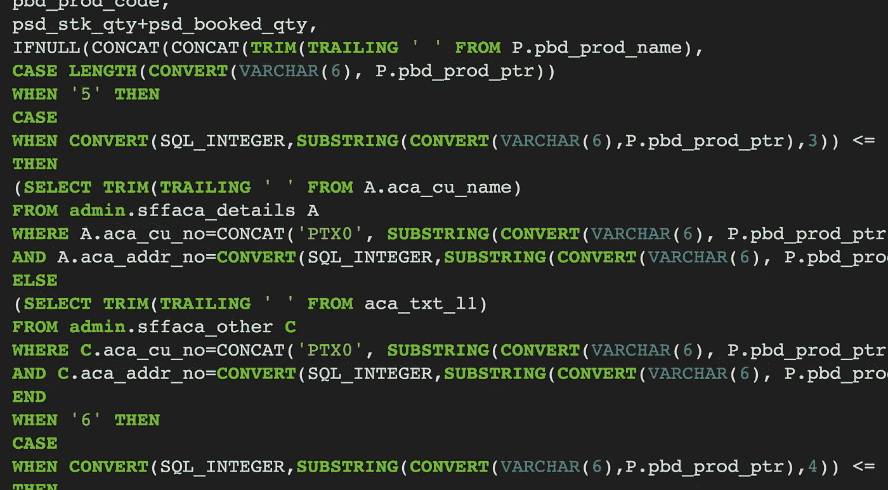

# SQL 在数据科学、分析和工程方面的局限性

> 原文：<https://towardsdatascience.com/the-limits-of-sql-in-data-science-analytics-and-engineering-4d7e48271a2f?source=collection_archive---------20----------------------->

## SQL 似乎一直是实现简单数据分析和 ETL 的一个优雅的解决方案，但它似乎总是在超过一定的复杂程度时崩溃。Spark、DataFrames 和 Scala (SDS)对于更复杂的数据工作，甚至对于非工程师来说，可能是一个好的解决方案吗？

我真的想用 SQL 做更多的事情。用简洁的格式表示数据连接、过滤和基本转换似乎是一种简单而优雅的方式。在许多方面，我觉得 SQL 比传统的命令式代码更接近于定义计算的数学方法(即函数式的、灵活的、声明式的方法)，这在我看来是 SQL 的一个优点。我特别珍视短 SQL 查询，它可以快速回答随机的特别问题，例如下面的问题。

此外，我发现许多技术水平不高的人可以很快学会基本的 SQL，如果有必要的话，可以很好地掌握它来执行重要的数据分析和转换。作为一名数据科学家和工程师，我发现能够与更多的利益相关者一起思考我们希望在计算统计数据或处理数据时实现的业务逻辑是一件很棒的事情。当非工程师可以用逻辑工作时，我们只是访问更多人的评论和想法。

但是我总是发现，一旦复杂性超过十几行代码，SQL 就不够用了，因为我会立即开始担心正确性和可读性。我更愿意在 Spark 中使用 Scala 实现数据帧的转换(或者在必要时使用 Python 实现 PySpark)。然后，我可以将我的逻辑分解成简单的命名良好的函数，并严格地对每个函数进行单元测试。简单的集成测试可以用来验证一切都正确地连接在一起。总的来说，我只是对 Scala 解决方案的正确性更有信心，并且觉得将来更有能力改进和维护代码。

从很多方面来说，我希望 SQL 不必如此。我真的希望有一种很好的方式将任意的 SQL 表达式提取到函数中，并进一步拥有一个很好的测试 SQL 的环境。我还没有找到任何适用于一系列 SQL 方言并且是开源的东西。如果有好的工具，请告诉我。

我进一步发现 SQL 是一种表达某些复杂逻辑的困难语言。比如解析 JSON，然后提取和转换特定的字段。我知道存在将嵌套 JSON 加载到 SQL 引擎中进行后续处理的解决方案，但是我更愿意编写一个 Spark 工作流，直接读取原始 SQL 数据并在 Scala 中执行解析和转换。

此外，我发现自己不得不实现复杂的业务逻辑来执行各种分析和转换(特别是对于特性工程),这些都不能用 SQL 编写。或者至少在传统的 SQL 方法中不容易实现。有时我会发现一些不太好的解决方案，但是它们看起来并不能很好地代表我们想要开发和维护的逻辑。这是一个 Spark 工作流的例子，我努力用 SQL 优雅地实现它。

你能想出一个用 SQL 实现这个逻辑的好方法吗？

传统上，用户定义函数(UDF)将使用传统的编程语言来开发，以扩展 SQL 功能。我发现这个解决方案很不雅，因为我们现在混合了两种语言。此外，在 UDF(和用户定义的聚合，uda)中可以实现的内容是有限的。现在，我认为最好使用(Py)Spark，在数据处理定义的同时定义自定义逻辑。

最后，我非常喜欢任何编程语言中的类型。我认为类型不仅向编译器，也向阅读代码的人传达了如此多的信息。我发现命名良好的函数、对象和成员——带有类型注释——在代码中提供了很好的自我文档。再加上一些小的注释和简明的外部文档，您最终会得到高度清晰的代码，任何熟悉这种语言的人都可以学习和使用。

Scala 有一个优秀的类型系统，甚至现代 Python 也有可选的类型注释。虽然大多数 SQL 方言在存储过程和函数中支持某种级别的类型，但我发现这仅限于基本类型，因此不能像健壮的编程语言中的类型注释那样广泛使用。

我只是看不到让 SQL 达到与 Spark、DataFrame 和 Scala 解决方案同等质量的途径。然而，我认识到数据处理逻辑不仅需要对工程师清晰可辨和可修改。我假设 Spark、DataFrames 和 basic Scala (SDS)可以用于这个目的。

我并不是建议非工程师能够阅读、推理和修改一个完整的生产 Scala 工程系统，而是建议他们能够在与 SQL 相当的复杂程度上处理小代码片段。此外，DataFrame 操作可以建立在他们对 SQL 操作(如连接、过滤和映射转换)的当前理解的基础上。他们只需要学习实现这些熟悉操作的新语法。随着时间的推移，当他们的工作需要时，他们可以学习更多的 Scala 来实现更复杂的逻辑。

为了进一步促进这种教育，我想开发一个将 SQL 概念转移到 SDS 堆栈的小教程。此外，为了真正销售这些材料，我还想开发一个很酷的 SQL->SDS transpiler。人们可以利用这一点来了解他们当前的 SQL 逻辑是如何转换成另一个技术堆栈的。结合一个时髦的网络应用程序，人们可以立即开始学习他们工作的同等 SDS 代码。这将允许熟悉 SQL 的人开始学习解决问题所需的特定 SDS 知识。

这种教育与托管 Spark 的云解决方案(如 AWS EMR、GCP Dataproc、Databricks、Cloudera Altus Cloud)的开发相结合，使更多人现在可以轻松访问 Spark 环境。随着时间的推移，也许我们甚至可以让 AWS 和 GCP 创建可与 Athena 和 Big Query 的 SQL 解决方案相媲美的临时托管 Spark 环境。总的来说，我预计越来越多的专业人员会在需要时访问 Spark 环境。

我甚至可以看到，当数据科学家需要构建一些东西来促进他们的数据科学工作时，他们会转向更复杂的数据工程工作。类似地，产品经理可能会发现自己在 Scala 中编写复杂的业务逻辑，因为用英语编写逻辑更加困难。如果我们教这些 SQL-to-Scala 转换者如何模块化代码和编写测试，我们可能很快就会发现自己拥有一大批情境工程师，他们可以实现对他们的工作很重要的系统部分。

你怎么想呢?你认为 Spark/DataFrames/Scala (SDS)能为越来越多的非工程师用户取代 SQL 吗？它甚至能帮助我们完成更多的工程工作吗？这是所有数据公司一直在寻求的。请在下面的评论区告诉我你的想法，因为我想在花太多时间帮助 SQL 爱好者过渡到 SDS 之前收集关于这个想法的反馈。

如果你有兴趣合作 SQL-to-SDS 教程和/或 transpiler，请给我发消息到[matthew.hagy@gmail.com](mailto:matthew.hagy@gmail.com)。还有，随便打我吧！我很乐意尽我所能帮助开发和推广。

**更新**:如果你觉得本文中的 Scala 例子很有趣，并且想了解这种强大的编程语言的更多信息，你可以看看我的文章，[通过计算机程序例子的结构和解释快速学习 Scala 的基础知识(第一部分)](https://medium.com/@matthagy/quickly-learning-the-basics-of-scala-through-structure-and-interpretation-of-computer-programs-ed5bfa90e8dc)。