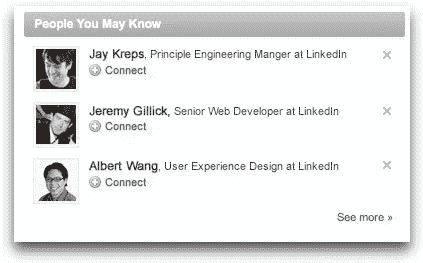

# LinkedIn 数据科学家访谈

> 原文：<https://towardsdatascience.com/the-linkedin-data-scientist-interview-f97cb98b6600?source=collection_archive---------13----------------------->

## LinkedIn 数据科学家角色

LinkedIn 的数据科学团队利用数十亿个数据点来提高会员参与度、业务增长和盈利能力。数据科学团队在全球拥有超过 5 亿名成员，并混合了 B2B 和 B2C 计划，在确定产品方向方面具有巨大的影响力。LinkedIn 的数据科学工作通常专注于业务方面，而不是工程，数据科学角色更像是许多其他公司的产品分析师和分析工作。

*如果你对更多面试指南感兴趣，请查看* [***DoorDash 数据科学家面试***](https://www.interviewquery.com/blog-doordash-data-science-interview-questions/) *和* [***谷歌数据科学家面试***](https://www.interviewquery.com/blog-the-google-data-scientist-interview/) *。*

# LinkedIn 数据科学角色

LinkedIn 的数据科学团队分为四个级别。

**数据科学家**

**资深数据科学家**

**员工数据科学家**

**首席数据科学家**

每家公司都有自己的薪酬体系，用以确定工资和薪酬级别。LinkedIn 的正式数据科学家或助理数据科学家通常是工作经验不到两年的候选人。首席数据科学家通常有将近 10 年以上的经验。

**一般职责**

*   与高绩效数据科学专业人员团队和跨职能团队合作，确定业务机会、优化产品性能或走向市场战略。
*   分析大规模结构化和非结构化数据；开发深度分析和机器学习模型，推动会员价值和客户成功。
*   设计和开发核心业务指标，创建有洞察力的自动化仪表板和数据可视化来跟踪它们，并提取有用的业务洞察力。
*   设计和分析实验，以测试新产品的想法或走向市场的策略。将结果转化为可行的建议。

# 面试

LinkedIn 数据科学家的面试过程相对简单。LinkedIn 的招聘人员喜欢拿自己的产品当狗粮，所以他们可能会通过 LinkedIn 给你发消息或邮件，联系你关于数据科学的职位。招聘人员将安排 30 分钟的电话面试，与你谈论 LinkedIn，了解你对公司的兴趣，看看这个角色是否合适。

鉴于 LinkedIn 数据科学职位面临的业务情况，可能会发生这样的情况，在电话之后，他们可能会将你转给机器学习团队的另一名招聘人员。数据科学团队确实有更多算法和工程方面的内容，但这只是 LinkedIn 整个数据科学团队的一小部分。

# 技术屏幕

最初的技术筛选包括**两次单独的电话采访**，每次持续 30 到 45 分钟。

一个面试更侧重于技术，专门测试关于 **SQL 和数据处理**的概念。另一个更像是一个**商业和产品案例研究**，测试你的批判性思维能力。取决于你的面试是如何组织的，任何一个面试都可能是两个面试中的第一个。然而，如果你在其中一次面试中表现不佳，就不能保证你会参加两次面试。两位面试官都将成为 LinkedIn 数据科学团队的员工，在最后留出充足的时间提问。

> [查看我们的 SQL 终极指南，进行更多实践！](https://blog.interviewquery.com/blog-sql-interview-questions/)

## 业务和产品案例研究

对于 LinkedIn 电话屏幕上的产品和商业案例研究，面试官将评估你如何解决商业问题，以及你在解决这些问题时的创造力和表达能力。访谈的技术筛选部分包括基于产品直觉和分析的问题。

作为一名数据科学家，花时间**参与 LinkedIn 产品是很有帮助的。**

People you may know V1

一个很好的例子是理解 LinkedIn 的商业目标是什么。**您将如何设计功能和分析数据以得出可行的结论？核心问题是，面试官会问你如何为 LinkedIn 设计一个功能，然后如何分析它的表现。准备好量化地衡量特性的成功。**

为了准备面试的这一部分，请站在开发产品或功能的产品团队的角度，提出以下问题:

*   可以做些什么来改进产品？
*   在解决有关健康、增长或产品参与度的问题时，您希望考虑哪种指标？
*   你如何衡量产品不同部分的成功？
*   在尝试解决与我们产品相关的业务问题时，您会评估哪些指标？
*   你如何判断一个产品是否表现良好？
*   你会如何设置实验来评估任何新产品或改进？

如何回答这个问题的布局结构也很重要。确保把你的想法都集中在一个地方，组织你的答案，仔细解释你是如何调查每个问题的。

**例题:**

*   *你将如何发展 LinkedIn 信息服务？*
*   *LinkedIn 希望在 Inmail 中发布一个新的自动完成信息功能。你如何衡量该功能的成功？*

> 在我们的网站上练习这个智商产品问题！

## SQL 和数据处理

在 SQL 和数据处理部分，你会遇到一系列越来越复杂的数据处理问题。强烈建议用 SQL 解决这些问题。

第一个问题的例子是编写一个简单的带有 where 条件的 select 语句(*SELECT * FROM table WHERE column = value)*。然后，使用子查询、复杂连接和条件语句的初始问题的相同表格，每个问题开始变得更加复杂。在最初的问题之后，面试官可能会在最初的问题上增加三个额外的修改，使其更加复杂。

**例题:**

*给定一个代表用户的表，编写一个查询来获取 2020 年 1 月注册 LinkedIn 的用户数。*

*给定两个代表工作和工作申请的附加表，编写一个查询以获得今年申请最多的工作职位。*

在面试前温习一下 SQL 和 product 中的这些概念很重要！这是我解决 LinkedIn 的 SQL 面试问题的一个例子。

# 现场面试

LinkedIn 的现场面试是一整天五个小时的面试，会见公司的五个以上不同的员工。每次面试也可能有不止一个人参加。面试时长约 45 分钟，并在最后留出充足的时间让你提问。

*   概率统计面试
*   数据科学经理面试/行为
*   数据操作
*   产品分析问题解决
*   PM 合作伙伴关系和产品意识
*   你还将在午休时间花 1:1 的时间与数据科学家一起了解 LinkedIn 的更多信息。这通常是一个小时的午餐面试，他们会让你休息一下，或者谈谈他们在 LinkedIn 上的工作

预计第一轮会出现高级概率和统计主题。在产品案例环节，他们会给你一个用例研究，并回答一个一般性的问题。你必须想出不同的方法来回答这个问题。PM 回合更类似于 A/B 测试问题，侧重于指标以及如何验证您的指标。产品案例回合更广泛，而 A/B 测试回合涉及更深入地挖掘指标，如:你如何知道这个指标是否重要，等等。

# 一般提示:

*   了解 LinkedIn 的文化很重要。鉴于角色在团队中的广度，了解每个团队如何相互协作。
*   数据科学家通常监督大多数产品。要想在 LinkedIn 取得成功，做大项目并推动其完成是非常重要的。他们在增长方面最大的成功之一是由数据科学家开发的“你可能认识的人”功能。
*   你在面试中表现如何是决定一天结束时薪酬水平的主要因素之一。这意味着在你的所有面试中，能够以一种良好的格式和简洁的方式组织你的答案是很重要的。

# LinkedIn 数据科学家面试问题示例

*   你最喜欢的内核函数是什么？
*   *L1 和 l2 正则化之间有什么区别，为什么要使用这两种正则化？*
*   *如何使用非均匀分布函数生成一个均匀的数？*
*   *假设我们得到一个页面视图数据集，其中每一行代表一个页面视图。你如何区分刮削者和真人？*
*   *编写一个函数来从多项分布中取样。*
*   *由于工程上的限制，该公司无法在推出某项功能之前对其进行 AB 测试。您如何分析该功能的执行情况？*

# 感谢阅读

*   如果你对更多的面试问题感兴趣，可以查看一下 [**谷歌**](https://www.interviewquery.com/blog-google-data-science-interview-questions-and-solutions/) ， [**脸书**](https://www.interviewquery.com/blog-facebook-data-science-interview-questions-and-solutions/) ， [**亚马逊**数据科学面试问题](https://www.interviewquery.com/blog-amazon-machine-learning-interview-questions-solutions/)。
*   查看我的 [Youtube 频道，获取更多关于数据科学面试、技巧和提示的视频](https://www.youtube.com/channel/UCcQx1UnmorvmSEZef4X7-6g)。
*   如果你想从 LinkedIn 获得更多面试问题，请在此注册[面试查询！](https://www.interviewquery.com/)