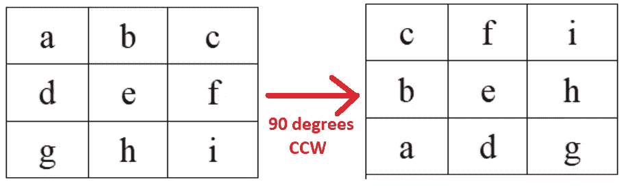

# Numpy 中鲜为人知的 OGrid 函数

> 原文：<https://towardsdatascience.com/the-little-known-ogrid-function-in-numpy-19ead3bdae40?source=collection_archive---------2----------------------->

## …以及如何使用它轻松转换图像

Photo by [Zara Walker](https://unsplash.com/@mojoblogs?utm_source=unsplash&utm_medium=referral&utm_content=creditCopyText) on [Unsplash](https://unsplash.com/s/photos/city-grid?utm_source=unsplash&utm_medium=referral&utm_content=creditCopyText)

在过去的这个季度，我帮助我的学生学习 Python 中强大的数值处理库，称为 **Numpy** 。在课程的大部分时间里，我们都在使用 Numpy 对图像进行转换，因为图像毕竟只是数字的大数组。

很快，我们开始讨论如何变换图像，从基本的变换，如使图像黑白化，到更复杂的编辑，如在图像周围添加光环。正是在这次讨论中，我了解到 Numpy 中鲜为人知的 ***ogrid*** 函数，以及我们如何利用它来更轻松地转换图像。

## 什么是 *ogrid* ？

Ogrid 代表**“开放网格”**，基本上提供了一种基于行和列索引对图像的特定像素进行操作的方法。从基础开始，这里是如何在 Numpy 中调用 ogrid 函数，假设您已经将 Numpy 作为 np 导入。

我们在这里看到 ogrid 接受一个 x 坐标范围(0 到 10，不包括 10)和一个 y 坐标范围(0 到 5，不包括 5)。我们将 ogrid 的结果存储在两个变量中， **x 和 y** 。

显示 x 的内容会发现它是一个大小为 1 的列表，每个列表都是 0 到 9 之间的数字。显示 y 的内容，发现它是一个单列表的列表，只是 0 到 4 之间的数字。

## 奥格里德如何帮助我们？

假设你有一个 10 乘 5 的矩阵，就像 ogrid 的维度一样。我们在下面看到，使用 ogrid 索引矩阵会准确地返回矩阵本身。

更重要的是，我们可以使用 ogrid 返回的 x 和 y 来创建一个叫做**“mask”**的东西，根据它们的行和列索引，只隔离我们关心的矩阵元素。

在上面的代码中，注意我们只关心行索引(x)大于 5 或者列索引(y)小于 3 的矩阵元素。结果是一个掩码，它是一个真/假的**数组，指示条件在哪里成立，在哪里不成立。**

***为什么这样有帮助？***

因为现在，我们可以使用这个掩码只作用于矩阵中掩码为真(或者等价地，假)的元素。

上面，我们将掩码为真的任何矩阵元素设置为 0，给出了结果矩阵。将同样的思路应用于整个图像，我们看到我们可以使用 ogrid 来创建遮罩，帮助我们对图像的特定像素进行操作。我们来看几个例子！

## 读取图像

让我们首先读入我们将要处理的图像。

结果就是我们最爱的电动鼠标。

然后，让我们为这个图像生成 ogrid。

一个重要的注意事项是 Numpy 中的轴的方向。与我们习惯看到的 x 轴和 y 轴相反，Numpy 图像中的轴如下所示:

## 添加几何形状

ogrid 最酷、最有启发性的图像转换之一是向图像添加几何形状。由于大多数基本几何形状都有简单的数学公式，我们可以对 ogrid 返回的 x 和 y 执行函数来重新创建这些公式。例如，让我们看一些代码在我们的图像中间创建一个黑色的圆圈。

这段代码的关键部分在第 9 行，在这里你会从代数课上学到一个圆的公式。这个特殊的圆位于我们图像的中心，半径为 100 像素。然后，我们使用这个圆形蒙版来涂黑蒙版中包含的所有像素，得到下图。

不错！如果我们想做一个正方形呢？嗯，可以说甚至更容易。

我们只是将正方形(或矩形)构造为 ogrid 返回的 x 和 y 上的四个过滤器的组合。然后，我们将包含在正方形蒙版中的图像中的任何像素设置为红色。

最后，如果我们想要一个青色的三角形在图像的右下角呢？嗯，我们可以算出数学公式，编码如下。

给出以下结果。

***牛逼！*** 看来我们刚刚创造了一些不错的艺术品。

## 90 度旋转

接下来，让我们看看如何使用 ogrid 将图像旋转 90 度。其实这里就不多写代码了，重要的是理解概念。

如果我们拍摄一个简单的 3x3 图像，并将其逆时针旋转 90 度，我们会得到以下结果。

从数学上来说，这就像把位于索引 **(i，j)** 的像素映射到一个新的位置 **(j，-i)** 。将这种转换应用到图像中的每个像素可能会令人望而生畏，似乎我们需要编写一些 for 循环，但是使用 ogrid，这项任务变成了一行程序。

也就是说，如果我们的图像被称为***【img】***，那么将图像索引为***【img[y，-x】***，使用 ogrid 返回的 x 和 y，我们得到的就是旋转后的图像。

## 创造一个光环

最后，让我们看一个稍微复杂一点的图像转换。也就是说，我们想要在图像周围创建一个**光晕**。

具体来说，我们想给我们图像的所有像素加上一些正值，一个像素离中心越远，我们加的值就越大。总的来说，这将有“洗去”靠近角落和边缘的像素的效果，而对靠近图像中心的像素几乎没有影响。下面是完整的注释代码。

这里有大量的代码，我鼓励您阅读并亲自尝试。简言之，我们:

*   获得每个像素到中心的平方距离
*   归一化这些平方距离
*   将归一化的平方距离添加到图像中的每个像素。通过这种方式，远离中心的像素获得较大的附加值，而靠近中心的像素获得非常小的附加值
*   总的效果是我们形象上的一个“光环”

仅此而已！希望您已经了解了 Numpy 中非常有用的 ogrid 函数。

祝你好运！~