# 住在图书馆的小机器人

> 原文：<https://towardsdatascience.com/the-little-robot-that-lived-at-the-library-90431f34ae2c?source=collection_archive---------9----------------------->

## [内部 AI](https://medium.com/towards-data-science/inside-ai/home?source=post_page---------------------------)

## 我们如何建造一个有情感的社交机器人来引导图书馆的顾客找到书籍

# Oodi 图书馆

我们在 [Futurice](https://www.futurice.com/) 的团队设计并制造了一个社交机器人，引导人们去[赫尔辛基的新中央图书馆 Oodi](https://www.oodihelsinki.fi/en/) 看书。Oodi 于 2018 年开放，是赫尔辛基 37 个公共图书馆中最大的一个。它每天有 10，000 名游客，估计每年有 200 万游客(与芬兰的 550 万人口相比，这是很大一部分)。

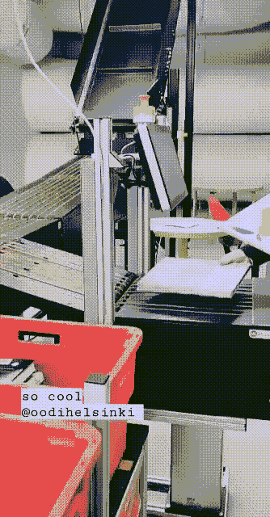

Automatic returns system

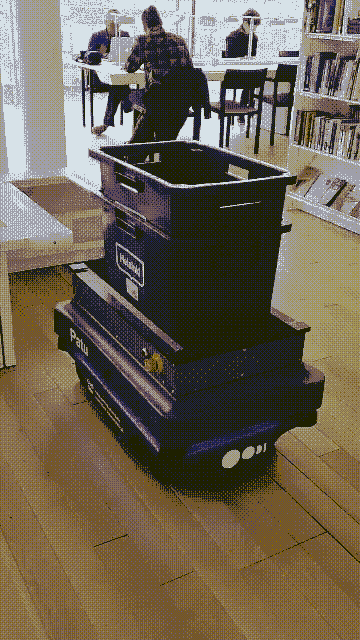

The MiR200 wagon moving books and their boxes

Oodi 擅长自动化和机器人技术。它有一个自动归还系统:顾客把他们的书放在传送带上，传送带把书带到地下室，在那里它们被分类到盒子里，盒子被一个移动的 MiR200 机器人捡起，机器人把书带到三楼。在三楼，图书管理员把书放回书架上。

在我们项目的开始，我们头脑风暴 Oodi 如何使用社交机器人:帮助孩子学习阅读，指导人们使用 3D 打印机等设备，用几种语言提供关于图书馆的信息，以及帮助人们在图书馆找到路。

我们最终选定了一个机器人来帮助顾客找到他们想要的书籍和书籍类别。因为 Oodi 太大了，顾客很难四处走动，图书馆员工花了大量时间建议人们如何找到东西。但这不是图书馆员应该做的工作，也不是他们想做的工作。图书馆员对文学非常了解。他们的专业知识更好地用于深度服务，帮助访问者找到最符合他们需求的特定书籍。这类工作可能需要 30-40 分钟。相比之下，“心理学板块在哪里？”需要 1-3 分钟来回答。一整天 1-3 分钟的任务堆积在一起会变得单调乏味，而且是对技能的浪费。

这就是机器人介入的地方。一整天的粗活不会打扰机器人。我们意识到我们可以重新利用图书馆已经拥有的 MiR200 移动机器人，并用来在地下室和三楼之间移动图书。

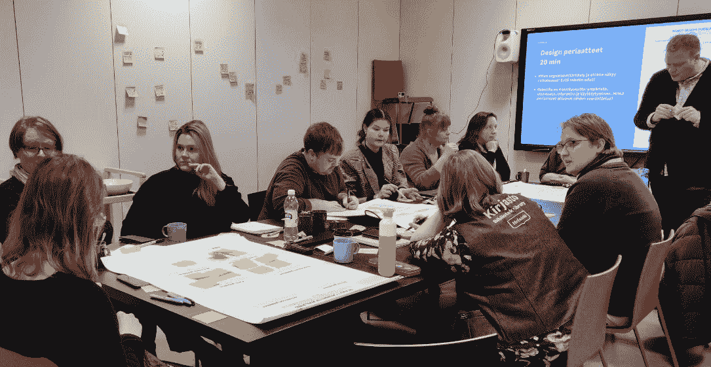

*The robot design team: Oodi librarians, Oodi’s customers, and Futurice’s roboticists*

机器人的优势在于能够直接访问 Oodi 的数据库，并提供当前书架上有哪些书的实时信息。对于有社交焦虑、害怕接近图书馆员工的人来说，这种机器人可能更容易接近。此外，它可以节省客户的时间(不需要排队找图书管理员)和图书管理员的时间(他们可以帮助客户完成更有意义的任务)。

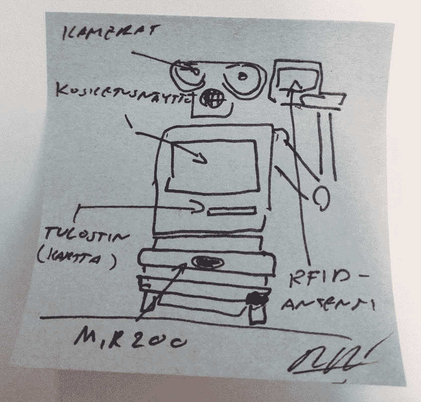

*First draft*

# 具有人格(幻觉)的移动机器人

由 Oodi 的图书管理员、Oodi 的客户和 Futurice 的机器人专家组成的设计团队，使用这些社交机器人合作设计画布(可作为开源软件获得)，为将在 MiR200 机器人之上构建的机器人[定义了设计准则:](https://github.com/minjaaxelsson/social_robot_co-design_canvases)

*   这个机器人真的是一台机器——它发出富有表情的哔哔声，但不会说话
*   机器人有一个触摸屏用户界面，用户不与机器人交谈
*   机器人使用光、声音和动作来交流
*   机器人的使用不应该取决于使用者对技术的熟悉程度
*   设计需要考虑可达性、背景噪音水平、图书馆不断变化的布局和家具，以及躲避顾客

设计团队决定机器人不能太像人。我们希望机器人有一种更抽象的形式，有表情的、非语言的交流形式。我们想要一个有点想象力和奇思妙想的设计。

该团队还想确保机器人符合 Oodi 的战略和政策。强调了以下道德考虑:

*   需要遵守 GDPR(欧盟的数据法规)。关于寻找这本书的人的数据不应该与关于他们正在寻找哪本书的数据相结合。
*   可访问性很重要。图书馆的原则是每个人都得到平等的服务。身体限制、不同的语言和受损的视力都需要考虑在内。
*   顾客应该能够选择由人类图书管理员来服务。
*   如果机器人不工作，可能会引起顾客的不满和粗鲁行为。对此应该有所准备，这样图书馆员才不会受到负面影响。

我们开始在图书馆测试机器人，绘制适当的路线，并构建用户旅程。幸运的是，我们有一些非常兴奋的测试人员。

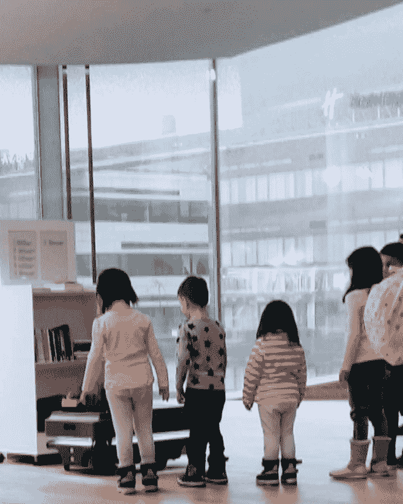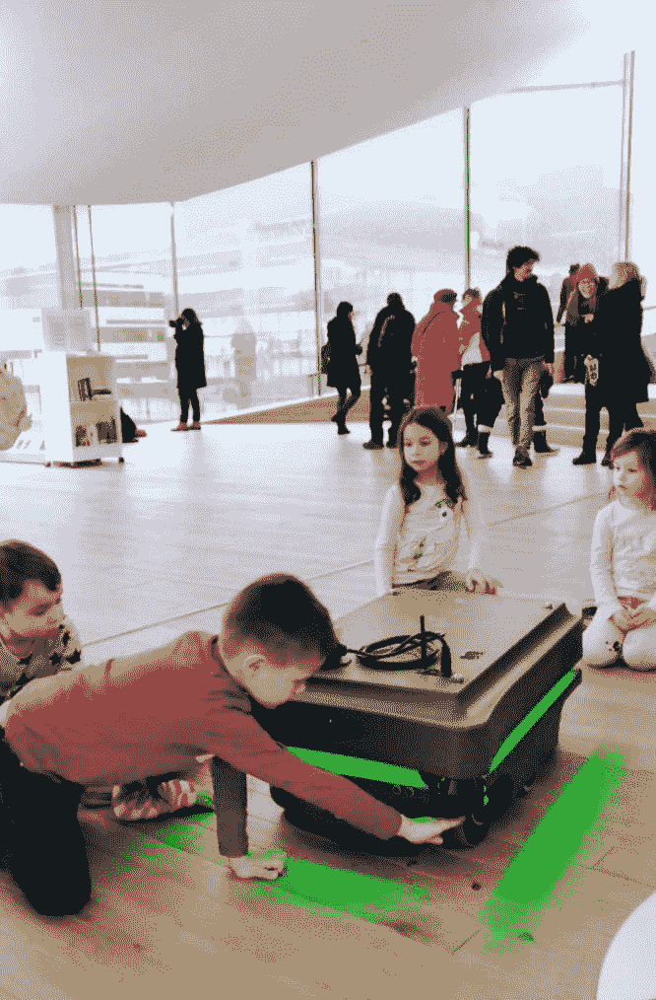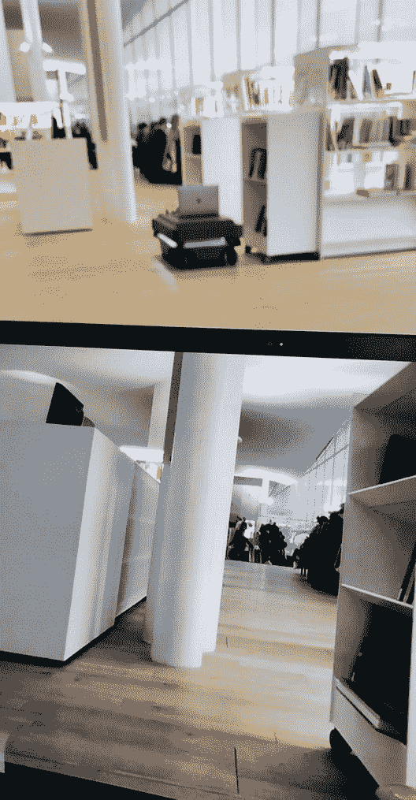

Our voluntary testers, and a trial run with a laptop

# 眼睛和情感矩阵

移动机器人本身太抽象，无法与人建立社会联系。我想给用户一些可看的东西，一种面孔。我在网上搜索了机械的眼睛，发现它们很幽默，但不太古怪。

眼睛令人想起经典的动画和漫画人物。机器人设计和动画之间存在联系:迪士尼定义的 12 条动画规则之前已经应用于机器人(里贝罗和帕瓦，2012)。在这种情况下，我计划的眼睛遵循“夸张”的规则。它将在这里用来强调机器人的表情(当缺少任务时，环顾四周以表示无聊)，以及它的行动(看着它开始移动的方向)。

幸运的是，Glen Akins 已经在网上发布了他关于如何建造机械谷歌眼的指导[https://biker Glen . com/blog/build-a-pair-of-robotic-googly-eyes/](https://bikerglen.com/blog/build-a-pair-of-robotic-googly-eyes/)。在将电线装入小孔、焊接、激光切割和摆弄电源之后，我们有了一双全新的眼睛。

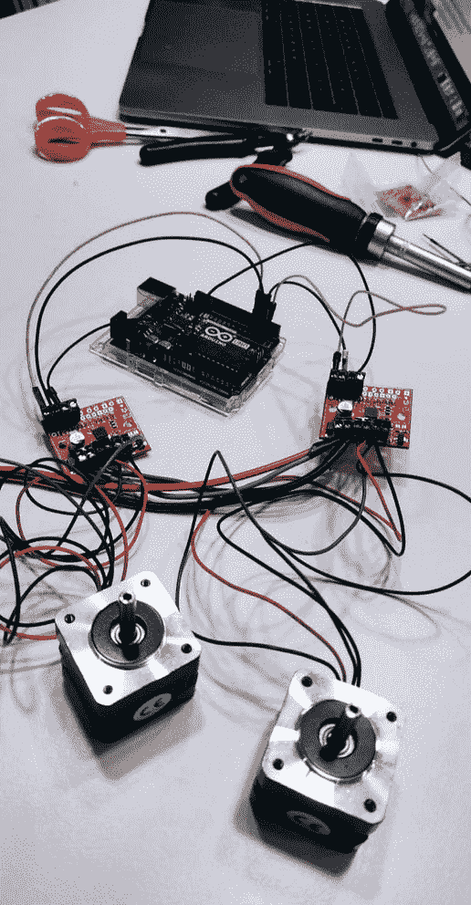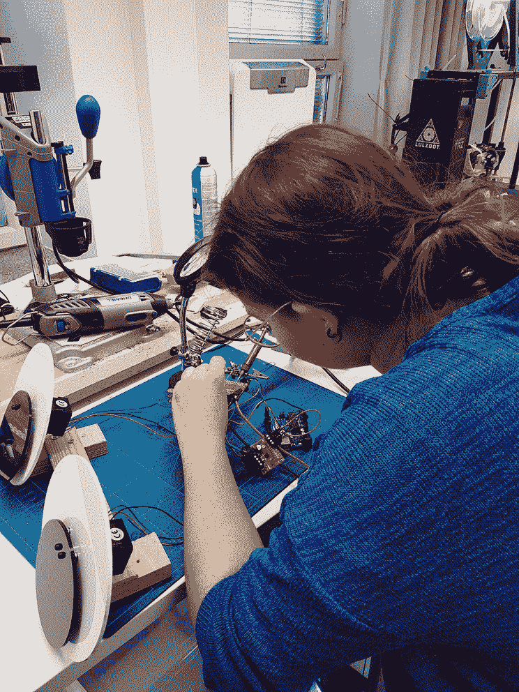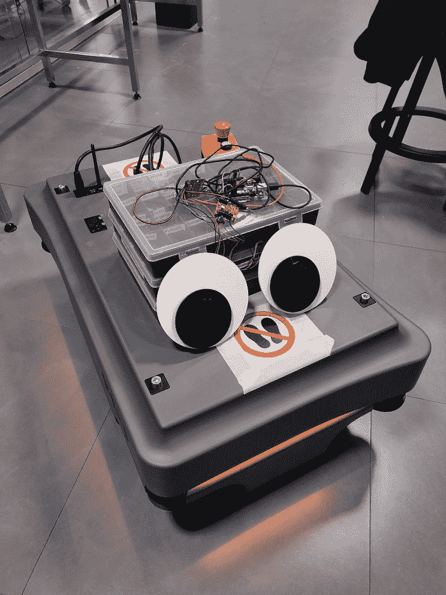

The making of of some of the googliest eyes

那双眼睛立刻产生了效果:我注意到自己正看着他们并对他们微笑。当他们向左看时，我顺着他们的目光看去。如果一个东西看起来在有目的地移动，就很容易欺骗人脑认为它是有生命的(Heider & Simmel，1944)。

我们的团队还认为机器人应该有一些内部驱动力，使其更具社会性，甚至可能有情感。情绪的编码，或情感计算，之前已经被几所大学研究过，即麻省理工学院。麻省理工学院的 Cynthia Breazeal 研究了机器人的情绪在三维矩阵中的位置(Breazeal，2004)。

我从中获得了灵感，并将机器人的情感置于一个二维矩阵中。虽然这是一种简化，但对于我们的目的来说已经足够精确了。

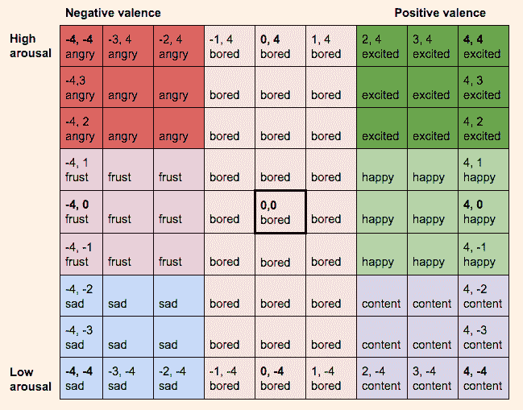

*My crude visualization of the emotion matrix I implemented*

情绪可以近似为两个轴:一个是从负价(坏感觉)到正价(好感觉)，另一个是从高唤醒到低唤醒(刺激水平)。

情绪状态在矩阵中间初始化，坐标为 0，0。机器人的情绪状态根据发生在它身上的事件在矩阵中移动。如果它的任务成功了，它就会走向积极的价值和高度兴奋。如果它的任务失败了，它就向负价移动。如果长时间不使用，它会走向低唤醒。

机器人的内部情绪会影响它的行为方式。机器人的动作功能(travel.py 和 idle.py)在某些点查询它的情绪，并相应地改变机器人的声音、灯光和眼球运动。如果它开心的话，它会在引导一个人看书的时候开心的唧唧喳喳。如果它感到无聊，它会试图通过四处张望、跳舞和闪烁灯光来吸引注意力(尽管不会太具破坏性，毕竟这是一个图书馆)。

你可能想知道用户如何从悲伤的机器人中受益。答案是，我们也还不确定。这个情感系统是非常实验性的，我们想探索它将如何影响机器人和用户之间的互动。随着试点的继续，我们仍在收集这方面的数据。

情感系统的代码，作者 me，版权 Futurice，许可 MIT[https://github . com/minjaaxelsson/oodi PC/blob/master/emotions . py](https://github.com/minjaaxelsson/oodipoc/blob/master/emotions.py):

# “哦看，真可爱！”

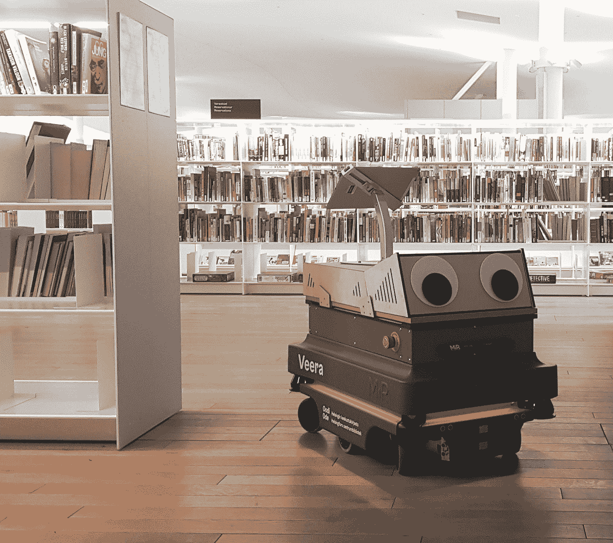

*The robot at Oodi*

我们对机器人进行了 3 天的测试。用户可以通过开放的搜索字符串搜索某本书或某个作者，或者选择特定的书籍类别，比如旅游和烹饪。这个机器人吸引了很多注意力:即使人们没有亲自送它去执行任务，当它引导别人时，他们也开始跟着它，在图书馆周围形成越来越多的人跟着一个小机器人。一些顾客甚至想抚摸这个机器人。反应主要是积极的，和惊讶的(不算一个 60 岁的老太太，她大声宣布“我不会尝试任何机器人！”气呼呼地走掉了)。

很多顾客很好奇，询问机器人做了什么，以及它是如何工作的。它吸引了很多孩子:三个女孩做了一个游戏，轮流要求机器人带他们去某个地方。其他人惊奇地聚集在它周围，大声说道:“哦，看，它真可爱！”。

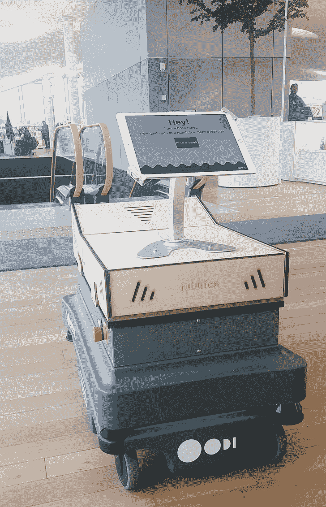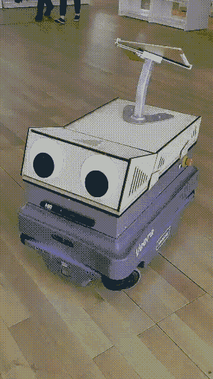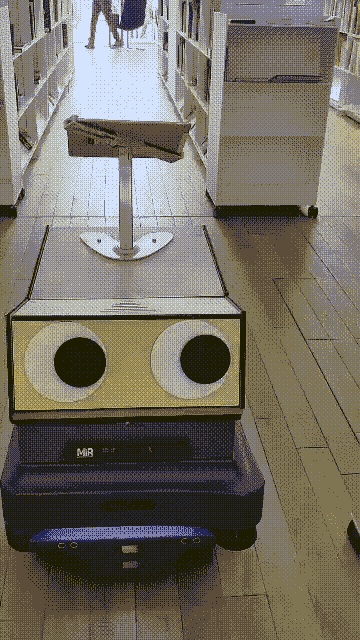

*Our robot in action*

机器人的抽象形式得到了积极的反馈，它的眼睛是一个特别令人钦佩的地方。事实上，它是抽象的，而不是人类的，这使它更容易接近。“它发出好听的声音，而且不觉得危险，”一位顾客评论道。

有些人甚至和机器人对话。一名 50 岁的妇女在成功完成任务后感谢机器人，说“非常好，谢谢你，你太棒了！”。这位女士说，有一个机器人带人们参观 Oodi 是多么聪明，因为它太大了。另一位顾客咒骂这个机器人，称它是“令人毛骨悚然的麦克里普费”，因为它设法偷偷靠近了她。当她稍后遇到它时，她为之前的事道歉。

参观者参与了机器人的未来，并提出了改进建议，如让它帮助提包，或为老年人提供助行器支持。一些人希望机器人能帮助他们预订已经借出的某本书，或者它能以几种语言帮助他们。

# 小机器人的未来

我很高兴 Oodi 的客户对这个机器人有如此积极的反应，并且马上就把它当成他们自己的产品。该机器人将与 Oodi 一起进一步发展。未来的版本将进一步利用情感系统。

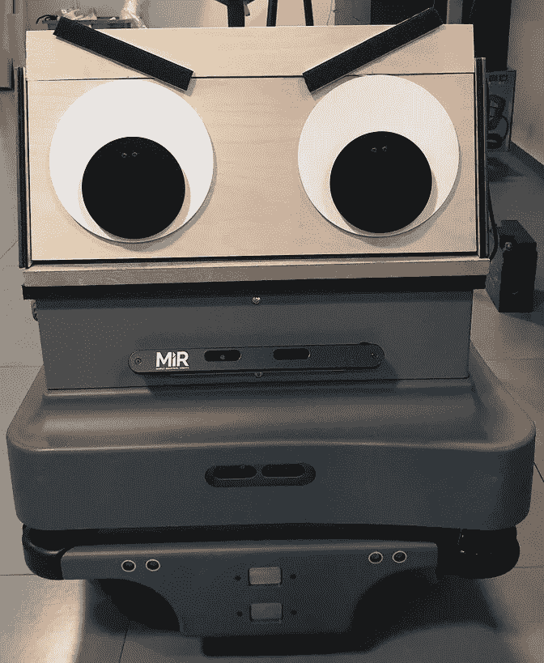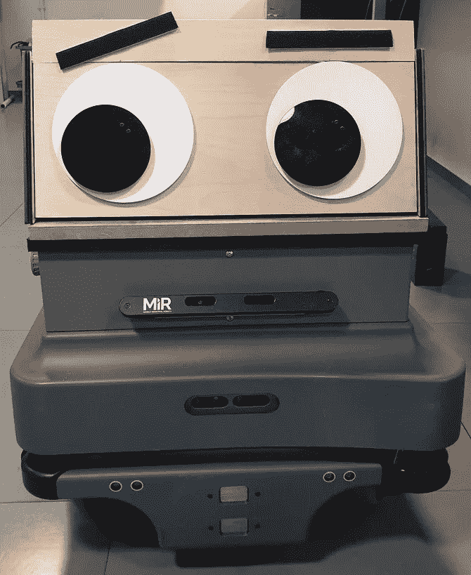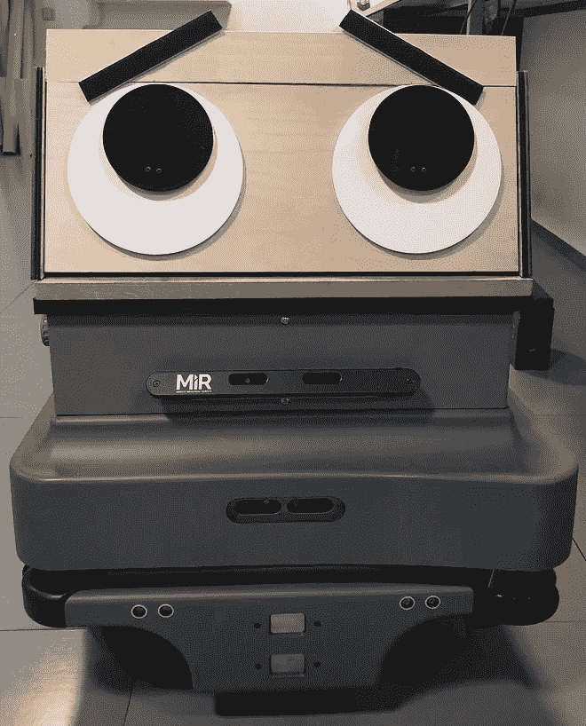

A prototype of eyebrows for the robot, which could help communicate emotions more effectively

Oodi 的图书管理员有时会遇到客户对机器人的担忧。由于 Oodi 有自动归还系统，一些顾客担心“机器人正在抢走图书管理员的工作”。一些研究表明，人们对机器人的态度可能变得更加消极(Gnambs & Appel，2019)。

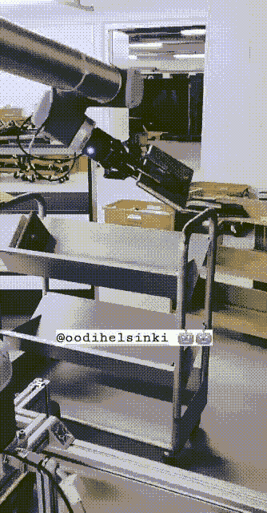

This Universal Robots collaborative robot arm stacks books at Oodi’s basement

然而，图书管理员没有这些担忧——在传送带接受退货的情况下，或者在我们的机器人引导顾客的情况下。在这个项目中，我采访了 4 名图书馆员，他们都认为他们宁愿避免接受回报的重复性体力工作，或重复的指导任务，如“钓鱼书籍在哪里？”。导航机器人及其应用程序是与图书管理员和图书馆的客户一起设计的，特别是为了避免设计无用甚至有害的应用程序。机器人设计的民主化是我希望在未来看到的。

Breazeal，C. (2004 年)。情感理论在 HRI 中的应用。 *IEEE 系统、人和控制论汇刊，C 部分(应用与综述)*， *34* (2)，187–194。

特纳姆布斯和阿佩尔(2019 年)。机器人变得不受欢迎了吗？欧洲对自主机器人系统态度的变化。*人类行为中的计算机*， *93* ，53–61。

f .海德尔和 m .西梅尔(1944 年)。表观行为的实验研究。*《美国心理学杂志*， *57* (2)，243–259 页。

茨韦塔纳·里贝罗和阿·帕瓦(2012 年 3 月)。机器人生命的幻觉:机器人动画原理与实践。在 *2012 年第七届 ACM/IEEE 人机交互(HRI)国际会议上*(第 383–390 页)。IEEE。