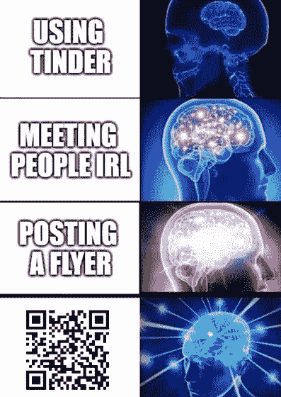
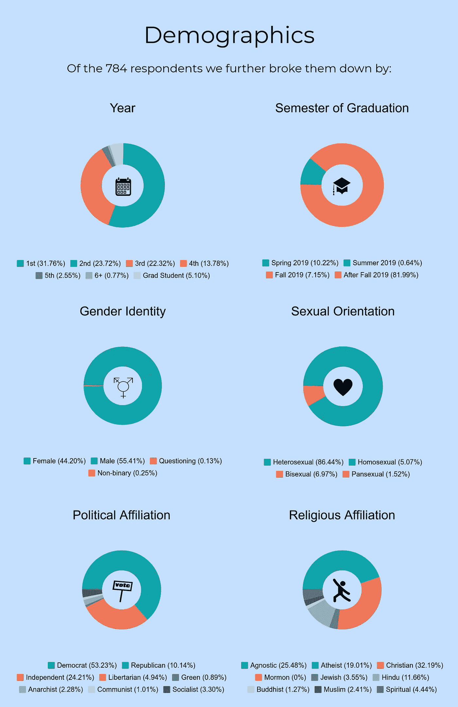
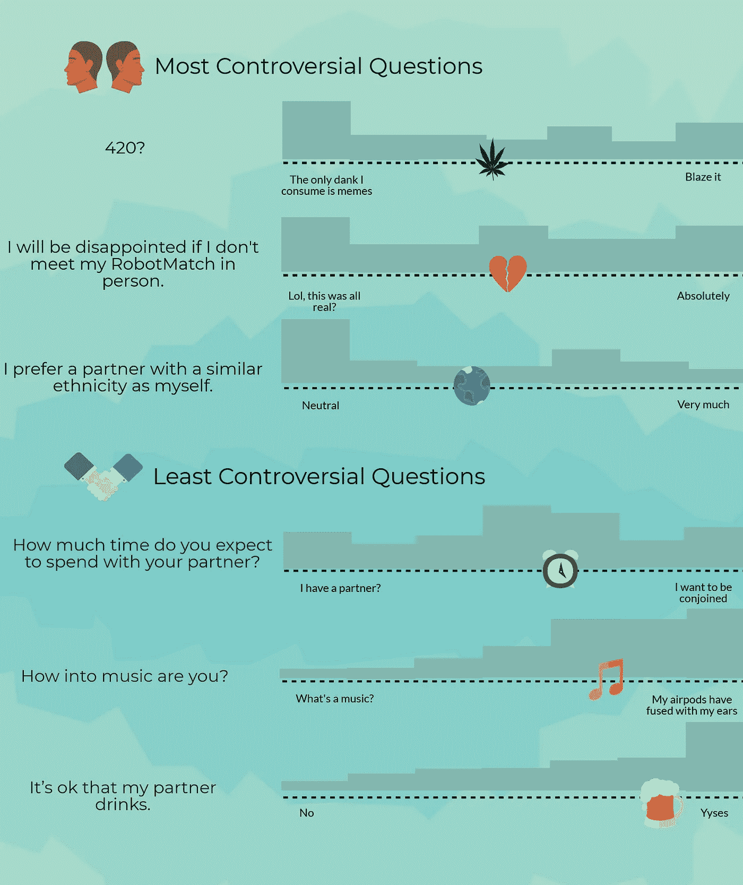
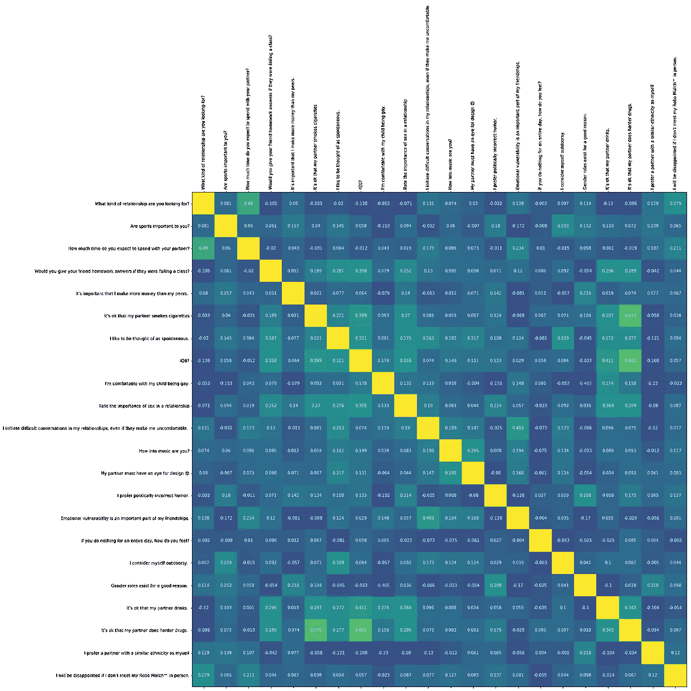
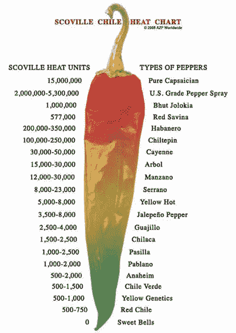
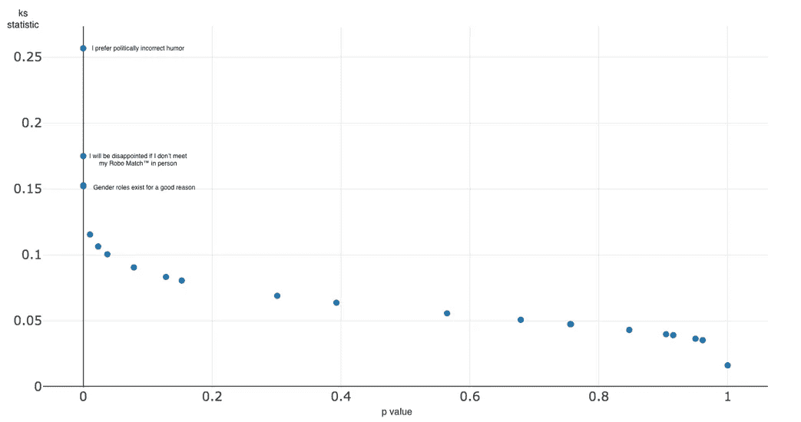
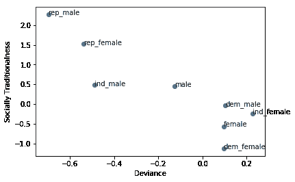

# 爱情机器(学习)

> 原文：<https://towardsdatascience.com/the-love-machine-learning-2cfa524a8c78?source=collection_archive---------7----------------------->

*化名是为了保护受访者的身份，是受访者自己选择的，而不是作者。

“机器可能已经计划好了我们的婚礼和一切”，伏地魔给一个陌生人写信，他刚刚才知道他的存在。不过别担心，他事先让脸书跟踪斯普盖提欧，以证实她实际上不是精神病患者。Sphagettio 一天后才回复；她也证实了他不是精神病患者。

在交换了电话号码后，两人决定在 Tech Rec 见面，因为这是一个中立的公共场所。显然，精神病的事情仍然在他们的脑海里。斯皮盖提欧带来的朋友进一步证明了这一点，他坐在离他们只有几个座位的地方，看着他们的整个互动过程，就像在和简·古道尔约会一样。

这对夫妇通过讨论将他们带到一起的算法，很快克服了第一次约会的尴尬——该算法了解他们性格的关键方面，以便将他们配对，从而使他们的第一次约会能够顺利进行。所有这一切都没有让他们彼此说一个字。

2018 年秋天，我发现自己在想什么是一段和谐健康的关系。当时我正在学习社会心理学，对如何通过定量和定性的视角来模拟关系非常着迷。

社会心理学家兼婚姻顾问约翰·戈特曼研究夫妻交流模式多年。根据这些数据，他观察到了四个标准，这四个标准可以以 93%的准确率预测给定耦合的成功或失败。这些标准被称为[启示录](https://www.gottman.com/about/research/couples/)的四骑士，详细描述了批评、防御、蔑视和阻碍如何破坏沟通习惯，从而破坏人际关系。

The original, biblical Four Horsemen are Conquest, War, Famine, and Death which can also be Debbie Downers

如果一段特定关系失败的可能性可以量化，那么一段关系的成功也可以量化吗？11 月，通过我的关系研究，我偶然发现了[斯坦福婚姻契约](https://www.stanforddaily.com/2017/12/01/marriage-pact-pairs-students-off-using-nobel-prize-algorithm/)，这是两名斯坦福学生为他们的市场设计课开创的一个巧妙项目。在这个项目中，他们使用了延迟接受算法，这是诺贝尔奖获奖的解决[稳定婚姻问题](https://en.wikipedia.org/wiki/Stable_marriage_problem)的方法，根据个性将他们的同学配对。

进一步研究数据驱动的配对，我发现哈佛有自己的算法版本。Datamatch 拥有一个卓越的人工智能匹配系统，并承诺其方法植根于强大的数据分析。

读了更多关于这个群体的资料，我对 Datamatch 如何解决两个以上性别和取向群体的稳定婚姻问题很感兴趣，因为在现实世界中，性和性别是一个光谱，而不是两个具体的单元。他们能够调整稳定的婚姻代码来与属于多个团体的多个成员一起工作吗？他们专有算法背后的真正方法论是什么？

在与 Datamatch 的联席主管之一进行了一些交流后，我对他们选择封锁其代码感到失望。如果我们想帮助宣传这项服务，他慷慨地提出将 Datamatch 扩展到佐治亚理工学院。我们与该机构[的](https://gtagency.github.io/)官员团队的其他人讨论了这个想法，认为看看我们是否能找到自己的解决方案会很有趣。

我们使用 32 个问题创建了爱情机器(学习)调查，这些问题代表了我们匹配的个人的背景、信仰和个性。前 10 个问题是人口统计学问题，后 22 个问题是 1-7 个李克特量表，用于衡量对各种说法的认同程度。

一旦我们衡量了每个参与者对各种重要主题的观点(毕竟 [羽毛群](https://ecommons.udayton.edu/cgi/viewcontent.cgi?article=1012&context=psy_fac_pub)中的[鸟](https://www.researchgate.net/publication/232600936_Longitudal_study_of_marital_success_and_failure) [在一起通常被引用为](https://journals.sagepub.com/doi/abs/10.1177/0265407505054524)[相似吸引理论](https://www.encyclopedia.com/social-sciences/applied-and-social-sciences-magazines/similarityattraction-theory))，我们就根据每对夫妇在性、政治派别和宗教方面是否符合对方要求的人口统计来给他们的兼容性打分。对于每个人，我们计算了所有其他参与者的分数。因此，一个耦合将具有两个分数:从人 A 到人 B 以及从人 B 到人 A。这些分数可能不同，因为人 B 可能不识别为 A 所请求的性别，而人 A 可以识别为 B 所请求的性别。这也适用于其他人口统计因素。如果另一个人碰巧不属于这个人所要求的人口统计数据，我们会将他们之间的分数增加到基本上无穷大，这样这两个人就永远不会匹配。

至于非人口统计学问题，我们计算了每个参与者的答案之间的平方差，并将其添加到他们的分数中。这意味着有相似答案的参与者之间会有较低的分数，使他们成为更好的匹配(0 将是完美匹配)。

我们还提出了一些我们认为对匹配非常重要的问题，并给他们的分数增加了一个乘数。这使得问题的答案在决定这对夫妇的得分时变得更加重要。一个人和自己之间的分数被自动设置为无限大，使得匹配不可能。

为了优化可能的最佳配对，我们决定使用遗传算法。我们首先研究了一种监督方法，但无法找到重要的数据来进行训练，所以我们决定在未来某个时候当我们能够获得足够的数据时，尝试一下这将是一件有趣的事情。[我们的遗传算法的代码可以在这里找到](https://github.com/gtagency/robot-love)。

遗传算法利用自然选择过程中产生的灵感来解决优化问题(在这种情况下，是给定我们的参与者群体的最佳可能匹配)。通过使用组合历史上“合适”的解决方案来生成更多的解决方案，它搜索富有成效的空间，而忽略其他空间。然后，每个解决方案都由一个“适应度函数”进行评估，以确定它解决问题的效果如何，以及它是否能延续到下一代。这只是算法行为的简要概述，然而，我强烈推荐阅读更多关于[遗传算法](https://medium.com/analytics-vidhya/understanding-genetic-algorithms-in-the-artificial-intelligence-spectrum-7021b7cc25e7)的内容。

我们使用一些非常高科技的方法收集数据，比如这个革命性的标志:

Memes get people in the mood

我们还利用社交媒体和口碑传播调查。我们知道，我们的收集方法肯定会导致某些群体的代表性过高。我们中的许多人都是计算机科学专业的，所以我们倾向于在我们的大楼周围张贴传单。我们还通过 CS 电子邮件列表发送了调查。我们没有收集专业作为人口统计，但如果我们这样做了，如果 CS 是最受欢迎的，我不会感到惊讶。

另一个值得指出的观察是，我们的许多回答选项是以开玩笑的方式写的，因此参与者可能会以不同的方式解释量表的范围，因为它们是以幽默而不是准确的方式写的。此外，量表从 1 到 7，这将允许参与者选择主题的中立立场。因此，答案中很可能反映出一些[中心倾向偏差](https://www.statisticshowto.datasciencecentral.com/central-tendency-bias/)。

就参与度而言，我们的调查比我们想象的受到了更多的关注。事实上，我们收到了 789 个回复，尽管我们不得不过滤掉几个(我们毕竟不想让 admissions@gatech.edu[成为某人的匹配)。考虑到学生团体的参与度如此之高，我决定写下我在经过清理的数据集中看到的一些总体趋势(所有可识别的标记和虚假电子邮件都被删除)。我首先关注的是参与者的基本人口统计数据:](mailto:admissions@gatech.edu)

参与者的百分比随着完成年数的增加而下降。这种下降趋势可以解释为，科技的毁灭性环境是如何导致年长、明智的学生放弃所有爱情前景的。这也可以解释为，由于毕业、转学和退学，每年的班级人数随着时间的推移而减少。请随意选择适合你需要的。

调查参与者的性别认同，我对结果并不感到惊讶。乔治亚理工学院因性别失衡而臭名昭著——这是我自己在接受我的提议时所担心的。

最新的佐治亚理工学院学生氛围评估显示，近年来女性人数有所增加，目前占 36%。按专业细分人口，计算机科学在 2018 年约为 [24.7%的女性](https://irp.gatech.edu/archival-fact-book)，这可能解释了我们样本中女性的缺乏。尽管最近女性占总人口的比例有所增加，但总体比例仍然很低，特别是在数据偏向的计算学院。

令我惊讶的是，只有 86.44%的参与者是异性恋。这与全国平均水平(根据 2017 年进行的盖洛普调查估计)不一致，全国平均水平估计 T4 的 LGBT 人口约占总人口的 4.5%。我决定进一步调查亚特兰大的人口估计，发现它是美国 LGBTQ 人口最多的地方之一。尽管如此，与亚特兰大作为一个整体相比，调查人口仍然有夸大的数字。我很好奇大学人口是否会有所不同，所以我读了一份由美国大学健康协会完成的调查，调查对象是来自 40 所不同大学的大约 20，000 名不同的本科生。调查非常详细，显示只有 81%的被调查学生是异性恋。所以总的来说，与其他大学相比，佐治亚理工学院不认为自己是异性恋的学生人数较少，这与我的第一印象相反。

最大的政治派别是民主党。大约 53%的学生认为自己是民主党人，10%的学生认为自己是共和党人，24%的学生认为自己是无党派人士。众所周知，大学校园往往更加自由，但我对我们的校园如此左倾感到惊讶。我对我们大学的技术性质是否会影响政治代表性很感兴趣，决定进一步研究政治和研究领域之间的关系。2009 年的一项皮尤研究测量了研究科学家和工程师的政治立场，发现他们中 81%是民主党人或左倾，12%是共和党人或右倾。捐款也表明科学家在政治上倾向于左派，就像 T2 一样，他们通常会捐款给民主党候选人。2016 年大选后，一系列关于[科学游行](https://www.aaaspolicyfellowships.org/blog/marching-science-blurry-line-between-values-and-facts)和其他倡议的新闻文章进一步强化了近年来出现的[科学政治化](https://slate.com/technology/2010/12/most-scientists-in-this-country-are-democrats-that-s-a-problem.html)。

我对调查中缺乏种族和民族多样性并不感到惊讶，因为这很能代表我在课堂和课外所看到的情况。我决定进一步研究前面提到的气候评估调查，看看在这方面有哪些因素会影响我们的大学。查看大学的种族分类统计数据，我发现这项调查很能代表学生群体。在接受调查的人口中，只有 7.8%是西班牙裔或拉丁裔。其余类别可以细分如下:

*   *白人或欧裔美国人- 50.4%*
*   *亚裔或亚裔美国人- 34.5%*
*   *黑人或非裔美国人——6.9%。*

它证实了我的数据，佐治亚理工学院正在努力适应多元化。这种趋势不仅仅发生在我们大学，而是发生在整个科技领域。

在阅读调查时，我无意中发现了这句话:*“与 2013 年的受访者相比，学生们感到基于各种特征的尊重更少，总体而言，他们更少参与自己文化之外的活动，也更少讨论多元化问题”*。令我惊讶的是，近年来，多元化的话题变得越来越难以突破，特别是随着政府推出新举措，试图改善这一问题。在调查代表性不足的少数民族(URM)和非 URM 人之间是否存在显著差异时，我发现了一些令人不安的趋势。

反映两组之间显著差异的问题包括:

*   *我所学专业的校园声誉影响了我对佐治亚理工学院的归属感*
*   *佐治亚理工学院对我来说是一个舒适和包容的环境*
*   出于对共事合议的担忧，我曾考虑离开佐治亚理工学院
*   *佐治亚理工学院有效地招收了来自不同背景的学生*
*   *乔治亚理工学院提供一系列满足我的社会和文化需求的项目和活动*
*   *我觉得学生不论种族或民族都受到尊重*

尽管存在这些问题,“佐治亚理工学院在授予非洲裔美国人、西班牙裔美国人和土著美国人 STEM 领域的学士、硕士和博士学位方面一直被列为全国顶尖学校之一”,根据《多样化:高等教育中的问题》。我对 GT 的主网站上的报价持怀疑态度，我亲自查看了排名，发现 GT 和其他几所学校并列第一。在多样性方面，6.9%的黑人/非洲裔美国学生和 7.8%的西班牙裔/拉丁裔学生在 GT 排名第一。这些获得如此高赞誉的低数字揭示了 STEM 多样性的可悲状况。

有了这么大的学生数据子集，我想知道我们是否可以从中确定我们学校文化的各个方面。科技专业的学生在某些话题上有令人震惊的分歧吗？我们在偏好方面有共同点吗？我计算了每个问题的标准差，并列出我们人群中争议最大和最少的三个问题，以及它们的平均值和基本分布。

最有争议的问题集中在大麻消费上。大多数接受调查的学生选择不吃，尽管也有相当多的学生崇拜魔鬼生菜。2017 年 10 月，亚特兰大选择将持有大麻合法化。我想知道，随着法律对这一问题越来越宽松，学生群体是否会慢慢转向接受这种药物。

对于为什么参加我们的调查，学生们意见不一。他们似乎无法决定这只是为了好玩，还是准备好去见自己的灵魂伴侣，在郊区买一栋房子，抚养五个可爱的孩子，买一艘他们一直想要的船屋。在中心也有一群人，他们可能不想显得太急切，但实际上确实想见到他们的对手。

我毫不惊讶地发现，大多数人都不介意他们的伴侣喝酒。这符合我们非正式的校训:“我们是一所有工程问题的饮酒学校”。我也不惊讶地看到大多数人听音乐，尽管我对选择“什么是音乐？”的人有一些问题，很多问题。人们也倾向于想要更复杂的关系，但幸运的是，他们选择了一个更平衡的中点，而不是决定与他们爱的人结合。

进一步探究这些问题，我想知道，人们回答问题的方式是否相关？如果你是一个瘾君子，你是否更容易接受你的伴侣吸食更难的毒品？相信严格性别角色的人也不太赞同他们的孩子是同性恋吗？这些问题可以通过下面的相关矩阵轻松回答:

如果你不想花五分钟时间盯着这些小盒子看，我在下面列出了一些显著的相关性。

一些较强的正相关性包括:

*   *喜欢户外活动，喜欢被认为是自发的*
*   *不顾不适发起艰难的对话，寻求友谊中的情感脆弱*
*   *正在寻找一段更认真的感情，想要花更多的时间和伴侣在一起*
*   *没事 420 和没事用硬药*

一些较强的负相关性包括:

*   *认为性别角色很重要，对有一个同性恋孩子感到舒适*
*   *想要一个同种族的伴侣，并且对有一个同性恋孩子感到舒适*
*   *对运动感兴趣，情感脆弱对友谊很重要*
*   *喜欢政治上不正确的幽默，喜欢和同性恋孩子在一起*

看到一组问题(饮酒、吸烟、烈性毒品、大麻和性)之间存在相关性，我想知道是否可以使用因子分析来看看它们是否描述了数据的一个维度。使用 [PCA](https://stats.stackexchange.com/questions/2691/making-sense-of-principal-component-analysis-eigenvectors-eigenvalues) 我发现前两个主成分描述了方差的三分之一，其余成分描述了非常少量的方差(< 1)。我决定研究这些问题是如何描述这些组成部分的(按影响程度排序)，并发现:

第一部分主要由 420 描述，更难的毒品，香烟，饮酒，性的重要性，给你的朋友家庭作业答案。这个维度似乎就是**的调皮/辛辣维度。**

第二部分主要被描述为与相似的种族约会，想要满足匹配，寻求一段认真的关系，相信性别角色，运动很重要，对同性恋孩子感到不安，以及享受政治上不正确的幽默。这似乎是**社会上的** **传统维度**。

I’m looking for someone who’s **at least** a Cayenne, how about you?

性别比例失调是一些参与者不匹配的主要原因。62 名不匹配的参与者中有 61 名被确定为男性，62 名参与者中有 60 名是异性恋。鉴于前面提到的关于性取向和性别认同的统计数据，不匹配的个体大多是异性恋男性就不足为奇了。

决定个人是否匹配的最重要因素是调查的最后一个问题:“如果我没有亲自见到我的 Robo Match，我会感到失望。”。如果一个人选择了一个更接近 1 的数字，他们就不会像选择了一个更接近 7 的数字的人那样在意匹配。当我对不匹配人群中的个体的回答进行平均时，他们的平均回答比总体回答低了整整 2 个百分点。大多数人回答了一两个关于他们有多渴望遇到对手的问题。

调查性别差异(男性和女性之间，因为他们是唯一有显著数据的群体)，只有 3 个问题在不同性别之间有显著差异。使用双样本 ks 检验计算的 p 值和 KS 统计量，我标记了前三个最重要的值。

与女性分布相比，男性分布更倾向于政治上不正确的幽默，希望亲自见到他们的对手，并相信性别角色的存在有一个很好的理由。

我感兴趣的是两性对政治不正确幽默的态度上的巨大差异，因为我不认为这是分裂他们的问题。在 2018 年 NPR [的一项研究](https://www.npr.org/2018/12/19/677346260/warning-to-democrats-most-americans-against-u-s-getting-more-politically-correct)中，研究人员发现了对政治正确性看法的性别差异。按性别划分，问题“总的来说，你是否赞成美国变得更加政治正确”显示出显著的差异。在男性中，28%的人同意这一说法，60%的人反对。在女性中，43%的人同意这一说法，而 45%的人反对。

政治不正确笑话的主题通常是女性和其他面临歧视的群体，因此阅读更多关于政治不正确幽默的研究，可以理解为什么这个问题在性别之间会有不同的结果。

我还注意到，男性和女性分布之间的问题让我想起了我在因子分析中发现的社会传统维度。事实上，这些是维度的主要组成部分。可以通过观察参与者在这个维度上的位置来对性别进行分类吗？

根据众多因素来观察参与者在两个坐标轴上的平均位置，政治派别比性别更能预测个人的观点。平均而言，男性比女性更倾向于社会传统，然而，当你将男性子集限制在民主党人时，这就变得可以忽略不计了。这符合我们在上面的分布中看到的偏斜。

在开始一些闲聊后，Sphagettio 和伏地魔转向了调查问题，好奇的想看看他们是否根据他们的答案配对。经过一番比较后，他们发现他们在大多数他们认为重要的事情上意见一致，甚至超出了调查的范围。继续他们的爱好和课外活动，他们甚至意识到他们都参加了校园牧师，并且都是狂热的*人类大战僵尸*玩家。

在整个决赛中，两人继续邀请对方进行小冒险，并相互了解，从一次不太可能的相遇发展成一段关系。当我问伏地魔，他是否认为他们会相遇，他回答说，“虽然我们可能会在未来 3 年的某个时候相遇，但这不太可能，而且我们开始约会可能需要更长的时间”。

伏地魔的观察是[邻近效应](https://en.wikipedia.org/wiki/Propinquity)在起作用的一个完美例子:因为两人没有相似的朋友或者住在相似的地方，他们不太可能相遇或者建立关系。事实上，在各种不同的实验中，比如麻省理工学院的“[韦斯特盖特西部”住宅研究中，人们已经测量了作为距离函数的关系形成的可能性。](https://repository.upenn.edu/cgi/viewcontent.cgi?article=1019&context=mcnair_scholars)

Westgate West 的研究得出结论，大学生最常交往的人中有 2/3 住在宿舍。此外，学生与隔壁邻居交朋友的可能性是住在走廊另一端的学生的四倍，住在楼梯间旁边的学生与楼上邻居建立的友谊是住在走廊中间的学生的两倍。这些研究表明，校园的结构和居住环境对我们建立人际关系的影响比我们通常认为的要大得多。如果我们让一种算法来决定我们与谁交往，而不是依靠距离，会怎么样？关系可能更难维持。毕竟，东西方校园关系被视为“异地恋”(我们这个时代的罗密欧与朱丽叶禁忌之爱)，而这一鸿沟不到一英里。但总的来说，消除偏见可以显示真正兼容性的改善。

对一些人来说，通过算法见面似乎令人生畏，但伏地魔和斯皮格蒂奥已经决定接受它。至于长期以来令人恐惧的“你们是如何相遇的？”问题情侣们不得不在这个充满火药味的约会时代笨拙地导航，他们决定自豪地解释他们是如何通过机器学习认识的。❤