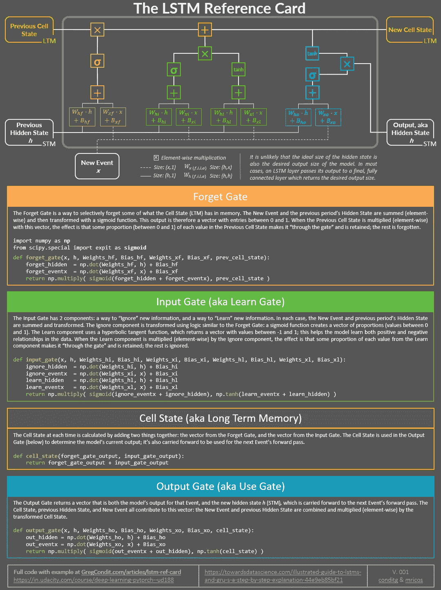

# 要理解 LSTM 架构，只需用 NumPy 编写一个向前传递的代码

> 原文：<https://towardsdatascience.com/the-lstm-reference-card-6163ca98ae87?source=collection_archive---------6----------------------->

Photo by [Maarten Deckers](https://unsplash.com/@maartendeckers?utm_source=medium&utm_medium=referral) on [Unsplash](https://unsplash.com?utm_source=medium&utm_medium=referral)

如果你像我一样，从简单开始，从头开始，你会学得最好。不管我在 RNNs 上读了多少次 colah 的[著名的 LSTM 邮报](https://colah.github.io/posts/2015-08-Understanding-LSTMs/)，或者 Karpathy 的[邮报](http://karpathy.github.io/2015/05/21/rnn-effectiveness/)(伟大的资源！)，LSTM 的网络架构看起来过于复杂，门户也很模糊。

最终，我用 NumPy 写了一个 LSTM 向前传球。我强烈推荐做这个练习，因为您可以检查隐藏和单元格状态、输入和输出，并清楚地看到它们是如何创建的。

在本演练中，我们将:

1.  用自己独特的 Python 函数表示每个 LSTM 门
2.  将它们逻辑地链接在一起，以创建具有单个 LSTM 单元的数字网络

这里的要点是:这些函数可以被编辑以包括打印语句，这允许检查您的数据的形状、隐藏状态(短期记忆)以及整个 LSTM 单元格中不同阶段的单元格状态(长期记忆)。这将帮助你理解为什么门存在。

其次，为了确认我们做得对，我们将:

1.  使用 PyTorch 建立一个具有单个 LSTM 细胞的小型神经网络
2.  用相同的随机权重初始化两个网络
3.  使用两个网络进行 1 次转发，并检查输出是否相同

我们走吧！

## 第 1 部分:创建 NumPy 网络

下面是 LSTM 参考卡。它包含 Python 函数，以及一个重要的图表。在该图中可以找到来自 LSTM 门函数的每个单独操作和变量(输入、权重、状态)的*。它们以颜色编码，以匹配它们所属的门。*

这些功能的代码可以复制在卡片下面。我强烈建议保存这张参考卡，用它来分析和理解 LSTM 建筑。(可打印的 pdf 版本可从这里下载。)

下面是来自上述参考卡的可复制代码—每个门有一个功能:

通常，LSTM 为最终的全连接线性图层提供信息。让我们也这样做:

## 第 2 部分:比较 PyTorch LSTM

用相同的参数创建一个 PyTorch LSTM。PyTorch 将自动为权重分配随机值——我们将提取这些值，并使用它们来初始化我们的 NumPy 网络。

不要不知所措！PyTorch 文档解释了我们需要分解的所有内容:

*   中每个门的权重依次为:*忽略、忘记、学习、输出*
*   名称中带有“ih”的键是输入的权重/偏差，或 Wx_ 和 Bx_
*   名称中带有“hh”的键是隐藏状态的权重/偏差，或 Wh_ 和 Bh_

给定我们选择的参数，我们因此可以提取 NumPy LSTM 的权重，以此方式使用:

现在，我们有两个网络——一个在 PyTorch，一个在 NumPy——使用相同的起始重量。我们将把一些时间序列数据放入其中，以确保它们是相同的。为了对我们的网络进行正向传递，我们将按顺序将数据传递到 LSTM 门，并在每个事件后打印输出:

好消息！将相同的数据放入 PyTorch 模型显示，我们返回相同的输出:

我们还可以验证，在数据通过 LSTM 单元后，两个模型具有相同的隐藏和单元状态:

我希望这有助于对 LSTM 网络如何进行预测建立一种直觉！你可以从[这个要点](https://gist.github.com/conditg/47eb195eb1d5b80ea299c567c8d0f3bf)开始一次性复制整个代码。

*LSTM 参考卡可从* [*本页*](https://www.gregcondit.com/articles/lstm-ref-card) *下载，包括可打印版本。感谢 Mike Ricos 合作创建了这个伟大的资源。*