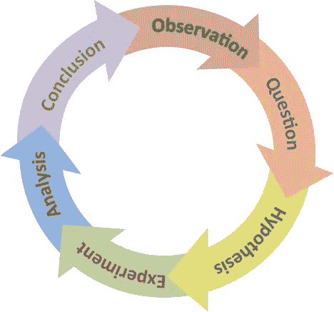
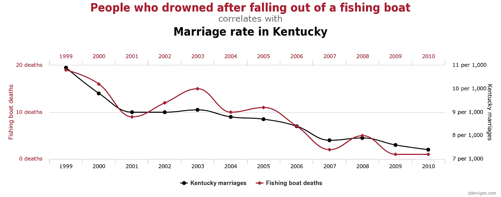
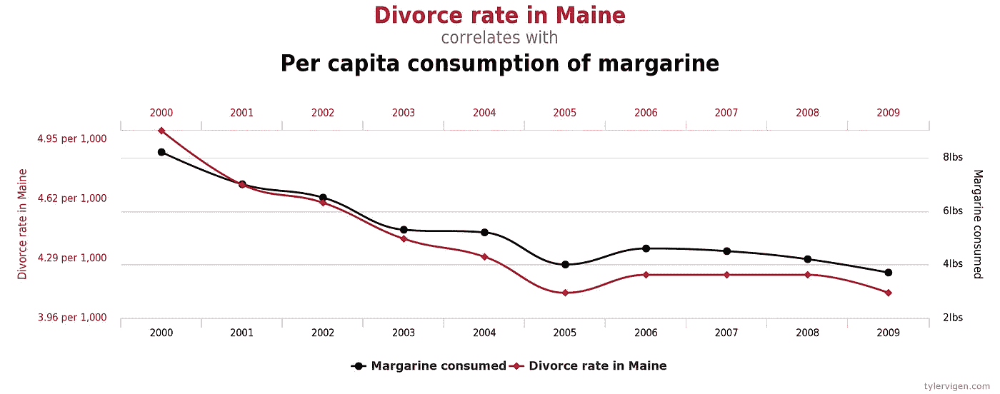

# 科学研究中的机器学习危机

> 原文：<https://towardsdatascience.com/the-machine-learning-crisis-in-scientific-research-91e61691ae76?source=collection_archive---------8----------------------->

## 一个实验如果没有可重复性还算科学吗？

> “现在科学界普遍认识到了再现性危机。我敢说，其中很大一部分确实来自科学中机器学习技术的使用。”***——gene vera Allen，莱斯大学*统计与电气工程教授**

机器学习的使用在科学过程中越来越普遍，取代了传统的统计方法。这对科学界和对知识的追求有什么影响？一些人认为，机器学习技术的黑盒方法是科学研究中可重复性危机的原因。毕竟，如果一个东西不具有可复制性，它就真的是科学的吗？

**免责声明:**本文是我根据参考资料中提到的材料发表的个人观点。这在学术界是一个有争议的领域，建设性的辩论是受欢迎的。

The cycle of the scientific process.

机器学习(ML)在科学研究中已经变得无处不在，并且在许多地方已经取代了传统统计技术的使用。虽然 ML 技术通常更容易进行分析，但其固有的黑盒方法在寻求真相时会导致严重的问题。

《科学》中的**“再现性危机”**指的是另一组科学家尝试同样的实验时，研究结果不被重复的惊人数量。这可能意味着最初的结果是错误的。一项分析表明，世界上 85%的生物医学研究都是徒劳的。

关于再现性危机的辩论可能是学术界最接近机器学习和统计部门之间的战争。

一位人工智能研究人员在《科学》杂志的一篇文章中声称，机器学习已经成为一种“炼金术”。

 [## 人工智能研究人员声称，机器学习是炼金术

### 加州旧金山谷歌人工智能(AI)研究员阿里·拉希米(Ali Rahimi)抨击了他的…

www.sciencemag.org](https://www.sciencemag.org/news/2018/05/ai-researchers-allege-machine-learning-alchemy) 

他的论文和博客文章都值得一读:

[https://people . eecs . Berkeley . edu/~ Brecht/papers/07 . rah . rec . nips . pdf](https://people.eecs.berkeley.edu/~brecht/papers/07.rah.rec.nips.pdf)

 [## 关于随机厨房水槽的思考

### 由…编辑注:阿里·拉希米和我的论文《大规模随机特征》获得了 NIPS 2017 的时间检验奖

www.argmin.net](http://www.argmin.net/2017/12/05/kitchen-sinks/) 

ML 很好地补充了科学过程，使其在研究中的使用最终不可避免。ML 可以被认为是一项工程任务——就像一条具有建模、参数调整、数据准备和优化组件的装配线。ML 的目的是找到最佳答案或预测——这是科学探究的一个子集。

机器学习的类型和算法本身可以是科学的主题。正如过去的统计方法一样，许多研究论文都是关于各种类型和子类型的最大似然算法。

2019 年 2 月，Genevera Allen 在美国科学促进协会(American Association for the Advancement of Science)上发出了一个严重的警告,即科学家正在依靠机器学习算法来寻找数据中的模式，即使这些算法只是专注于另一个实验无法重现的噪声。

这一挑战涉及多个学科，因为机器学习被用于在许多领域获得发现，如天文学、基因组学、环境科学和医疗保健。

她使用的主要例子是基因组数据，这通常是难以置信的大数据集，有数百千兆字节或数兆兆字节。Allen 指出，当科学家使用缺乏理解的 ML 算法对基因组图谱进行聚类时，往往会出现似是而非和不可重复的结果。

直到另一个团队进行类似的分析并发现非常不同的结果，这些结果才受到质疑和怀疑。这可能有多种原因:

*   缺乏关于算法的知识
*   缺乏关于数据的知识
*   对结果的误解

## 缺乏算法知识

**缺乏算法知识**在机器学习中极为常见。如果你不明白一个算法是如何产生结果的，那么你怎么能确定它不是在作弊或者在变量之间寻找虚假的相关性呢？

由于参数过多(深度神经网络通常有数百万个)，这在神经网络中是一个巨大的问题。不仅参数很重要，超参数也很重要，包括学习速率、初始化策略、历元数和网络架构等项目。

意识到自己缺乏算法知识不足以解决问题。如果不同的研究论文使用不同的网络，如何比较结果？由于高维神经网络损失景观的高度复杂和动态结构，即使添加单个额外变量或改变一个超参数也可以显著影响结果。

## 缺乏数据知识

**缺乏数据知识**也是一个巨大的问题，但它延伸到了传统的统计技术。数据采集中的误差——如[量化](https://en.wikipedia.org/wiki/Quantization_(signal_processing))误差、[传感器不确定性](https://en.wikipedia.org/wiki/Measurement_uncertainty)，以及[代理](https://en.wikipedia.org/wiki/Proxy_(statistics))变量的使用——是主要问题之一。

次优数据总是一个问题，但是了解什么样的数据使用什么样的算法也是非常重要的，并且会对结果产生重大影响。这可以通过一个简单的回归分析来说明。

如果我们使用参数多于数据点的线性回归(在基因组学中，这是一种非常正常的情况，我们有许多基因和很少的数据点)，那么我们对正则化的选择会严重影响哪些参数被确定为“重要”。

如果我们使用 [*套索*](https://en.wikipedia.org/wiki/Lasso_(statistics)) *回归*，这往往会将明显不重要的变量推为零，从而将它们从回归中消除，并提供一些变量选择。

如果我们使用一个 [*脊*](https://en.wikipedia.org/wiki/Tikhonov_regularization) *回归*，回归往往会将这些参数缩小到足够小，以至于它们可以忽略不计，但却必然会将它们从数据集中移除。

如果我们使用 [*弹性网*](https://en.wikipedia.org/wiki/Elastic_net_regularization) *回归*(套索和脊回归的结合)，我们将再次得到截然不同的答案。

如果我们不使用任何回归，那么算法将明显地过度适应数据，因为我们有比数据点更多的变量，所以算法将平凡地适应所有的数据点。

很明显，使用线性回归，可以进行统计测试，以置信区间、 *p* 测试等形式评估准确性。然而，对于神经网络来说，同样的奢侈并不存在，所以我们如何确定我们的结论呢？我们目前能做的最好的事情是陈述模型的确切架构和超参数，并提供代码作为开源，供其他科学家分析和重用该模型。

## 对结果的误解

**对结果的曲解**在科学界可能非常普遍。其中一个原因是相关性并不意味着因果关系——两个变量 *A* 和 *B* 可能相关有几个原因:

*   *A* 可能是由 *B* 的发生引起的
*   *B* 可能是由 *A* 的发生引起的
*   *A* 和 *B* 可能是由进一步的 [*混杂变量*](https://en.wikipedia.org/wiki/Confounding) 、 *C* 引起的
*   *A* 和 *B* 可能虚假相关

显示两个值之间的相关性很容易，但确定这种结果的因果关系却极其困难。通过在谷歌上输入虚假的相关性，你可以得出一些非常有趣且明显荒谬的相关性，它们具有统计学意义:

这些可能看起来像是荒谬的相关性，但关键是，如果这些变量被放在一个数据集中，并被输入到机器学习算法中，该算法会将其作为一个因果变量，而不会对所述因果关系的有效性提出任何问题。从这个意义上说，该算法很可能是不准确或错误的，因为该软件正在识别只存在于该数据集而非真实世界中的模式。

伪相关性的出现，但由于使用了具有数千个变量的大型数据集，这种现象在最近几年变得更加普遍。

如果我有一千个变量，几百万个数据点，数据之间难免会有一些关联。算法可以抓住这些并假设因果关系，有效地执行无意识的 [**p-hacking**](https://en.wikipedia.org/wiki/Data_dredging) ，这是一种学术界不赞成的技术。

## 什么是 p-hacking？

p-hacking 的实践包括获取一个数据集，彻底搜索具有统计意义的相关性，并将其视为科学上有效的。

你拥有的数据越多，你就越有可能发现两个变量之间的虚假相关性。

通常，科学包括假设的形成、数据的收集和数据的分析，以确定假设是否有效。p-hacking 所做的是进行一项实验，然后形成事后假设来解释所获得的数据。有时，这样做没有恶意，但其他时候科学家这样做是为了他们能够发表更多的论文。

## 加强相关性

机器学习算法的另一个问题是算法必须做出预测。算法不能说‘我什么也没找到’。这种脆弱的框架意味着算法会找到某种方式来解释数据，无论它被赋予的特征有多不合适(只要算法和数据被正确设置，否则它可能无法收敛)。

目前，我不知道有任何机器学习算法能够回到用户身边，告诉他们数据不合适，这隐含地预设为科学家的工作——这不是一个不公平的假设。

## 那为什么要用机器学习呢？

这是一个好问题。机器学习使得分析数据集更加容易，ML 算法为用户执行大部分工作。在数据集太大而无法使用标准统计技术进行有效分析的领域，这变得非常有价值。然而，尽管它加快了科学家的工作，但机器学习带来的生产力增长可以说被这些预测的质量抵消了。

## 能做些什么？

这并不完全是悲观的。传统的统计方法和数据集一直存在同样的问题，这些问题只是由于使用大型数据集和算法而被放大，这些数据集和算法可以自动找到相关性，并且比传统技术更难解释。这种放大暴露了科学过程中必须消除的弱点。

然而，下一代机器学习系统的工作正在进行中，以确保它们能够评估其预测的不确定性和可重复性。

也就是说，将失败归咎于工具的是一个糟糕的工作者，科学家需要在使用 ML 算法时更加小心，以确保他们的研究得到证实和验证。同行评审过程旨在确保这一点，但这也是每个研究者的责任。研究人员需要了解他们正在使用的技术，并了解它们的局限性。如果他们不具备这些专业知识，那么或许去一趟统计部门，与一位教授讨论一下，会有所收获(就像我自己所做的那样)。

Rahimi(他认为 ML 是炼金术的一种形式)提供了几个建议来学习哪种算法在什么时候效果最好。他指出，研究人员应该进行**消融研究**——连续移除参数，以评估它们对算法的影响。拉希米还呼吁进行**切片分析**——分析一种算法的性能，看看在某些领域的改进如何可能在其他领域产生成本。最后，他建议用各种不同的超参数设置运行算法，并报告所有这些算法的性能。这些技术将使用最大似然算法提供更稳健的数据分析。

由于科学过程的性质，一旦这些问题得到解决，以前被发现是准确的关系，实际上是虚假的，最终将被发现和纠正。准确的关系当然经得起时间的考验。

## **最终意见**

由于结果缺乏可重复性，科学中的机器学习在学术界确实存在问题。然而，科学家们已经意识到了这些问题，并正在推动更具可重复性和可解释性的机器学习模型。真正的突破将是神经网络的研究一旦完成。

Genevera Allen 强调了机器智能面临的一个基本问题:数据科学家仍然不理解机器学习的机制。科学界必须做出一致努力，以了解这些算法如何工作，以及如何最好地使用它们，以确保使用数据驱动的方法得出可靠、可重复和科学有效的结论。

甚至声称机器学习是炼金术的拉希米也仍然对其潜力充满希望。他说“炼金术发明了冶金术、制造药物的方法、纺织品的染色技术以及我们现代的玻璃制造工艺。此外，炼金术士还认为他们可以将贱金属变成黄金，水蛭是治疗疾病的好方法。

正如物理学家理查德·费曼 1974 年在加州理工学院[的毕业典礼演讲](http://calteches.library.caltech.edu/51/2/CargoCult.htm)中所说，

> “[科学]的首要原则是你不能愚弄自己，而你是最容易被愚弄的人。”

## 时事通讯

关于新博客文章和额外内容的更新，请注册我的时事通讯。

 [## 时事通讯订阅

### 丰富您的学术之旅，加入一个由科学家，研究人员和行业专业人士组成的社区，以获得…

mailchi.mp](https://mailchi.mp/6304809e49e7/matthew-stewart) 

# **参考文献**

[1][https://science-science mag-org . ezp-prod 1 . hul . Harvard . edu/content/sci/365/6452/416 . full . pdf](https://science-sciencemag-org.ezp-prod1.hul.harvard.edu/content/sci/365/6452/416.full.pdf)

[2][https://research . FB . com/WP-content/uploads/2019/05/The-Scientific-Method-in-The-Science-of-The-Science-of-Machine-learning . pdf？](https://research.fb.com/wp-content/uploads/2019/05/The-Scientific-Method-in-the-Science-of-Machine-Learning.pdf?)

[3][https://bigdata-made simple . com/machine-learning-disrupting-science-research-heres/](https://bigdata-madesimple.com/machine-learning-disrupting-science-research-heres/)

[4][https://bio data mining . biomed central . com/track/pdf/10.1186/s 13040-018-0167-7](https://biodatamining.biomedcentral.com/track/pdf/10.1186/s13040-018-0167-7)

[5][https://www . science mag . org/news/2018/05/ai-研究人员-宣称-机器学习-炼金术](https://www.sciencemag.org/news/2018/05/ai-researchers-allege-machine-learning-alchemy)

[6][https://www . science daily . com/releases/2019/02/190215110303 . htm](https://www.sciencedaily.com/releases/2019/02/190215110303.htm)

[7][https://phys . org/news/2018-09-machine-scientific-discoveries-faster . html](https://phys.org/news/2018-09-machine-scientific-discoveries-faster.html)

[8][https://www . American scientist . org/blog/macro scope/people-cause-replication-problems-not-machine-learning](https://www.americanscientist.org/blog/macroscope/people-cause-replication-problems-not-machine-learning)

[9][https://www . datanami . com/2019/02/19/machine-learning-for-science-proving-problem/](https://www.datanami.com/2019/02/19/machine-learning-for-science-proving-problematic/)

[10][https://www . quanta magazine . org/how-artificial-intelligence-is-changing-science-2019 03 11/](https://www.quantamagazine.org/how-artificial-intelligence-is-changing-science-20190311/)

[11][https://ml4sci.lbl.gov/](https://ml4sci.lbl.gov/)

[12][https://blogs . NVIDIA . com/blog/2019/03/27/how-ai-machine-learning-are-advanced-academic-research/](https://blogs.nvidia.com/blog/2019/03/27/how-ai-machine-learning-are-advancing-academic-research/)

[13][https://towards data science . com/a-quick-response-to-gene vera-Allen-about-machine-learning-cause-science-crisis-8465 bbf 9 da 82 #-responses](/a-quick-response-to-genevera-allen-about-machine-learning-causing-science-crisis-8465bbf9da82#--responses)

[14][https://www . HPC wire . com/2019/02/19/machine-learning-reproducibility-crisis-science/](https://www.hpcwire.com/2019/02/19/machine-learning-reproducability-crisis-science/)