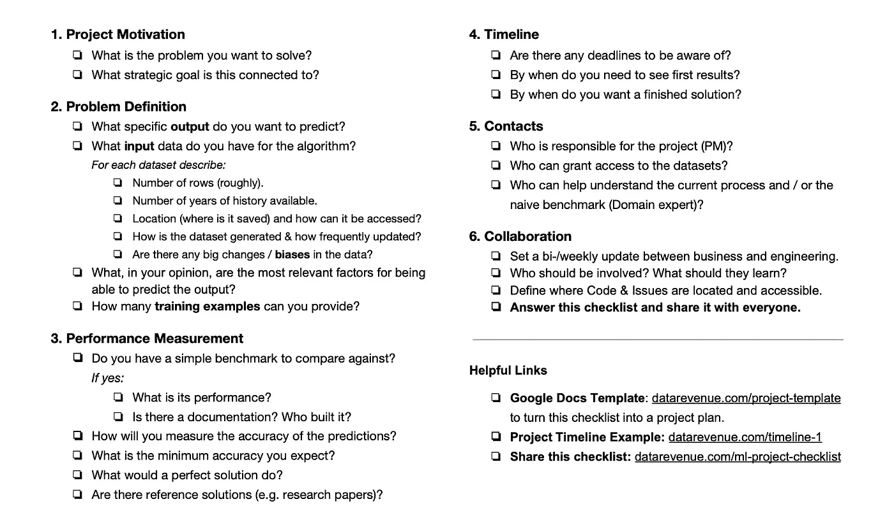
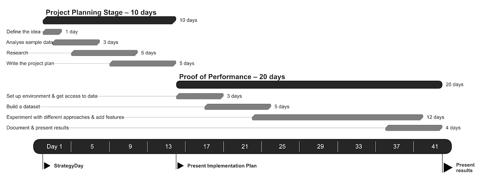

# 机器学习项目清单

> 原文：<https://towardsdatascience.com/the-machine-learning-project-checklist-d9ee6e33a2b2?source=collection_archive---------19----------------------->

## 计划 ML 项目很难——这个清单让它变得更容易。

Download it: [www.datarevenue.com/en-resources/ml-project-checklist](http://www.datarevenue.com/en-resources/ml-project-checklist)

对许多人来说，机器学习仍然是一项新技术，这可能会使其难以管理。

项目经理通常不知道如何与数据科学家谈论他们的想法。

在我们规划 30 多个机器学习项目的经验中，我们已经提炼出了一个简单有效的清单。

TLDR:点击此处查看清单和模板:

*   www.datarevenue.com/en-resources/ml-project-checklist

# 1.项目动机

Be clear about the broader meaning of your project.

*   你想解决的**问题**是什么？
*   与哪个战略目标挂钩？

如果项目团队不理解你的动机，那么他们很难提出好的建议。

有许多方法可以解决机器学习的问题。因此，帮助你的团队为你的最大利益而工作——后退一步，告诉他们为什么这个项目很重要。

# 2.问题定义

*   你想预测什么具体的**输出**？

对于给定的输入，你的机器学习模型将理想地学习预测一个非常具体的输出。

所以你需要尽可能的清楚。“预测机器故障”可能意味着很多事情——“告诉我未来 24 小时内计划外停机的风险何时超过 50%”更好。

*   算法有哪些**输入**数据？

模型可以预测您的输出的唯一方法是从您提供给模型的输入因素中推导出它。因此，为了有机会做出好的预测，你必须有与输出相关的数据。数据越多越好。

*   预测你的具体产出最相关的**因素**是什么？

一个算法不理解我们的世界。至关重要的是，你要给数据科学家一些提示，告诉他哪些数据实际上是相关的，以便他能够以算法能够理解的方式选择和分割数据。

*   你能提供多少**培训实例**？

与人类相比，算法需要更多的练习来学习一些东西。你至少应该有 200 个例子。越多越好。

# 3.性能测定

你怎么知道什么是好结果？

*   你有一个简单的基准来比较你的结果吗？

有没有一种简单的方法可以利用已经有的数据进行预测？也许你可以根据去年的数字预测销售额，或者通过计算客户上次登录后的天数来评估客户离开的风险。

一个简单的基准可以让你的团队对问题有有价值的洞察力。它给你一些东西来衡量模型。

*   你将如何衡量预测的准确性？
*   你期望的最低精确度是多少？

你希望预测的准确度平均在 5% *以内*——还是更重要的是没有预测的误差超过 10%？您的模型可以通过两种方式进行调整。哪种方式更好取决于对你来说什么是重要的。

*   一个**完美的解决方案**会是什么样子？

即使这对你来说似乎是显而易见的，把它写在纸上有助于澄清你的愿景。

*   有没有**参考解**(类似研究论文)？

如果有人以前解决过类似的问题，把他们的解决方案作为灵感。

这给了每个人一个共同的起点，因此他们可以看到使用哪些数据，可能会出现哪些问题，以及要尝试哪些算法。

# 4.时间表

A sample timeline for a Proof of Performance project.

*   有需要注意的截止日期吗？
*   你什么时候需要看到第一个结果？
*   你想什么时候有一个完整的解决方案？

一个人工智能解决方案可以无限改进。明确的截止日期有助于团队聚焦。

# 5.联系人

*   谁**负责**项目(PM)？
*   谁可以授权**访问**数据集？
*   谁能帮助**理解**当前流程和/或简单基准(领域专家)？

在项目过程中会出现许多问题。明确你的工程师可以向谁求助。

# 6.合作

*   在业务和工程团队之间建立双/周**更新**。

每周安排一次会议，看看当前的结果，讨论那些不仅仅需要一封邮件来回答的问题。

*   谁应该参与其中？
*   他们应该学什么？

在学习如何管理人工智能时，没有什么比实际项目的实践经验更有价值。如果你想让你团队的其他成员学习，从一开始就要明确这一点。

*   定义代码和问题的位置以及如何访问它们。

从一开始就让所有的开发透明化。这样，任何人都可以很容易地加入进来，给出提示，并检查进度。

## 回答清单上的问题，并与大家分享。

世界仍在研究如何最好地运行人工智能/机器学习项目。

填写这份清单将让你获得任何成功的机器学习项目的一个要素:理解。

# 下载清单

访问我们的页面，注册 *AI for Managers* 邮件列表，并在此下载清单:

[www.datarevenue.com/en-resources/ml-project-checklist](http://www.datarevenue.com/en-resources/ml-project-checklist)

清单还包括:

*   谷歌文档模板——这样你就可以马上开始填写。
*   时间表示例——规划项目的良好参考。

PS:如果你对清单的修改有任何建议，请在评论中告诉我。