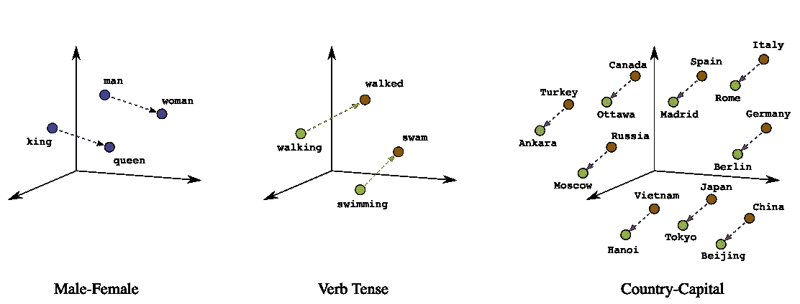
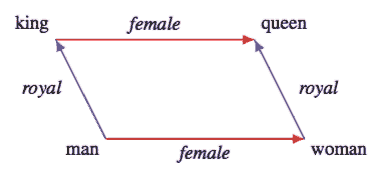
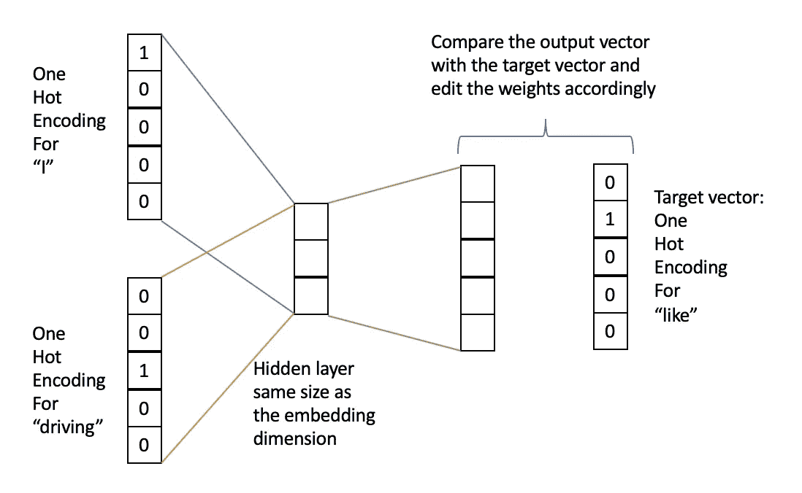
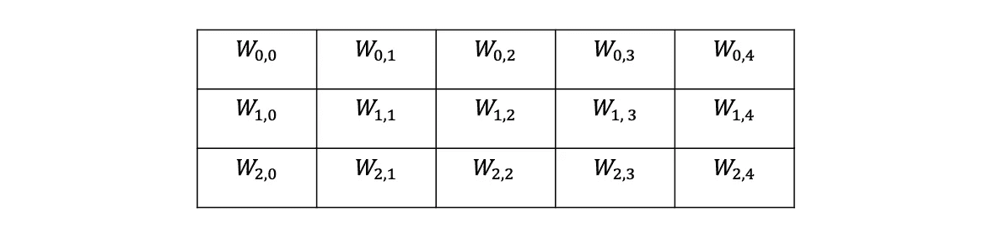
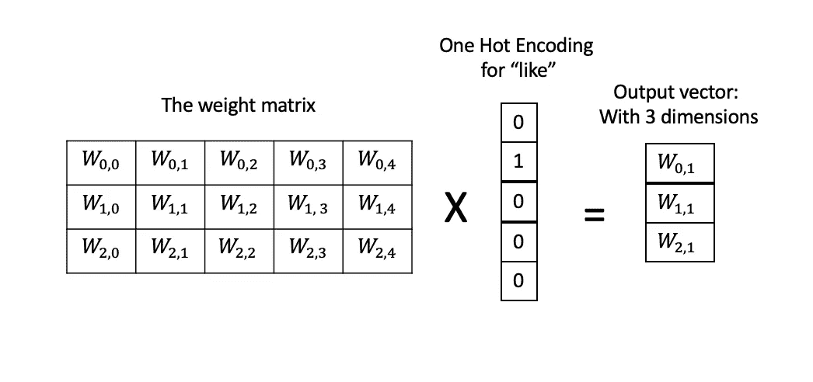
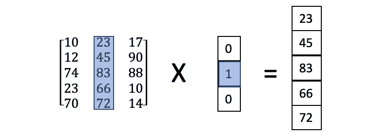
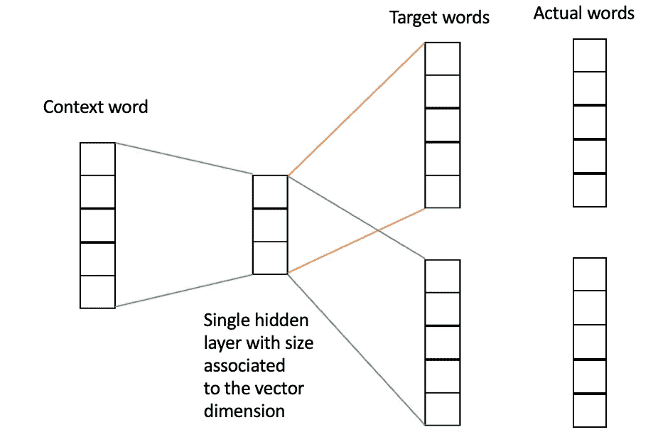
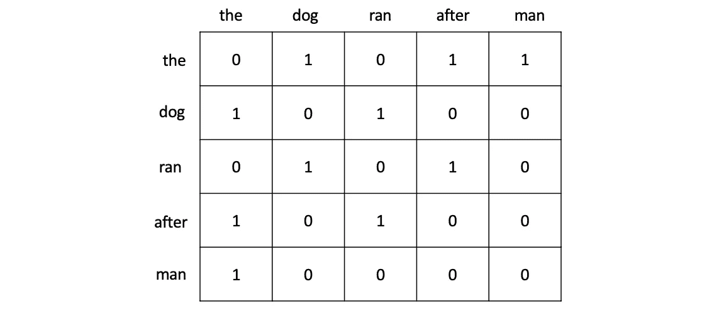

# 嵌入模型背后的魔力

> 原文：<https://towardsdatascience.com/the-magic-behind-embedding-models-c3af62f71fb?source=collection_archive---------37----------------------->

## 探索 Word2vec 和 GloVe 的实现

Image by [Natalia Y](https://unsplash.com/@foxfox) — Unsplash

# 什么是嵌入？

嵌入是知识表示的一种类型，其中每个文本变量都用一个向量来表示(现在可以把它想象成一个数字列表)。文本变量可以是单词、图中的节点或者知识图中两个节点之间的关系。这些向量可以有不同的名称，如空间向量、潜在向量或嵌入向量。这些向量表示机器学习方法可以应用的多维特征空间。因此，我们需要改变我们对语言的看法，从单词序列到占据高维语义空间的点，空间中的点可以靠近也可以远离。

# 为什么我们需要嵌入？

这种表示的目的是让具有相似含义(语义相关)的单词具有相似的表示，并在空间中绘制后彼此更接近。为什么这很重要？嗯，原因很多，主要是:

1.  计算机不理解文本和单词之间的关系，所以你需要一种方法用计算机能理解的数字来表示这些单词。
2.  嵌入可以用于许多应用中，例如问题回答系统、推荐系统、情感分析、文本分类，并且它还使得搜索、返回同义词更容易。让我们举一个简单的例子来理解嵌入是如何帮助实现所有这些的。

Image Source: (Embeddings: Translating to a Lower-Dimensional Space) by Google.

# 简单嵌入示例

为了简单起见，让我们从这个例子开始，考虑单词“国王”、“王后”、“男人”和“女人”分别用向量[9，8，7]、[5，6，4]、[5，5，5]和[1，3，2]来表示。图(1)描绘了这些向量的表示。请注意，单词“king”和单词“man”在语义上是相关的，因为“man”和“king”都代表男性。然而,“国王”这个词还有一个额外的特征，那就是皇室。类似地,“queen”这个词和“woman”相似，但是有一个额外的特征，那就是皇室。

既然“国王”和“王后”(男性皇族-女性皇族)之间的关系类似于“男人”和“女人”(男性人类-女性人类)之间的关系，那么将它们相减就得到这个著名的等式:(国王-王后=男人-女人)。顺便说一下，当两个单词相减时，我们减去它们的向量。

# 嵌入背后的魔力

假设我们不知道“国王”的女性名字是什么，那么我们如何得到它呢？好吧，既然知道了(国王-王后=男人-女人)，我们就把公式改成(王后=国王-男人+女人)这样就有道理了。该公式表明，如果你从“国王”中删除男性性别(皇室是提醒)，然后将女性性别添加到皇室，以给出我们正在寻找的“女王”。

Image by ([Kawin Ethayarajh](https://kawine.github.io/)), Why does King — Man + Woman = Queen? Understanding Word Analogies

图片摘自( [Kawin Ethayarajh](https://kawine.github.io/) )，为什么国王-男人+女人=女王？理解词语类比

现在我们知道嵌入在问答系统中是有帮助的。其他例子可能也差不多(美国-英语=法国-法语)，(德国-柏林=法国-巴黎)。此外，嵌入在简单的推荐任务中也很有帮助。例如，如果有人喜欢“橙色”，那么我们查看与代表“橙色”的向量最相似的向量，并得到代表“苹果”、“樱桃”和“香蕉”的向量。正如我们所看到的，我们对每个单词的表示(数字列表)越好，我们的推荐系统就越准确。所以提醒的问题是，我们如何为每个单词想出这个数字列表？(也就是所谓的嵌入、潜在或空间向量)。

# 嵌入类别

有三个主要类别，我们将逐一讨论:

1.  **单词嵌入** (Word2vec，GloVe，FastText，…)
2.  **图嵌入** (DeepWalk，LINE，Node2vec，GEMSEC，…)
3.  **知识图嵌入** (RESCAL 及其扩展，TransE 及其扩展，…)。

# Word2vec

Word2vec 是最早的载体之一，主要是嵌入单词而不是句子或书籍。此外，Word2vec 的维数与训练数据中的字数无关，因为它使用一些算法将维数减少到(50，100，300 等。).Word2vec 属于基于预测的嵌入，它倾向于预测给定上下文中的单词。Word2vec 有两种风格:连续单词包(CBOW)和 Skip-Gram 模型。CBOW 倾向于在给定上下文的情况下预测单词的概率，而 skip-Gram 使用相反的 CBOW 架构(在给定单个单词的情况下预测上下文)。

## CBOW

我们从指定上下文窗口大小开始，它是每个上下文的开始和结束。然后我们得到每个单词的一个热编码向量。给定语料库“我喜欢开快车”，窗口大小是 1(目标单词前一个单词和后一个单词)，向量维数是 3，并且我们想要从上下文“我……”中预测中间单词“驾驶”。开车”。请注意，我们只有 1 个隐藏层，其大小与所需的矢量尺寸相关，这就是为什么我们称这种技术为*学习矢量的表示*，因为我们只有 1 个隐藏层。下面是架构，注意输入是上下文窗口大小中的单词，输出是学习目标单词的表示。还要注意，没有激活功能应用于隐藏层。但是，输出层使用 Softmax。

前一个神经网络的输出是下面的权重矩阵:

在得到权重矩阵之后，我们将该矩阵与目标单词的一个热编码向量相乘，以获得其表示向量。

你可能会问，为什么我们要把权重矩阵和一个向量相乘，这个向量里充满了 0 和 1。当然，输出只是它在矩阵中的位置，考虑下面的例子:

这个乘法的真正目的只是根据目标单词向量在 Hot 编码向量中的空间来查找它。

## 跳跃图

Skip-Gram 或有时称为 Skip-Ngram 模型使用 CBOW 的头翻转架构，其余部分是相同的。下面是 skip-gram 的架构，其中我们尝试预测给定一个上下文单词的窗口大小内的所有单词:

# GloVe:单词表示的全局向量

GloVe 是基于共现矩阵计数训练的单词嵌入模型。它通过最小化最小二乘误差来使用语料库统计量，以获得词向量空间。

## 共生矩阵

给定具有 *V* 个单词的语料库，我们的同现矩阵 *X* 的大小将为 VxV，其中 *X* 中的每个单词 *i* 是语料库中的唯一单词，并且每个单词 *j* 表示在单词 *i* 的窗口大小中出现的次数。给定这句话“狗追着人跑”和大小为 1 的窗口，我们得到下面的矩阵:

Notice how the matrix is symmetric

让我们从这个简单的公式开始:

其中`P_ij`是指单词 *j* 出现在单词 *i* 的上下文中的概率。公式表示这个概率，其中`X_ij`是在 *i* 的上下文中出现的次数 *j* ，而`X_i`是在 *i* 的上下文中出现的总字数。

此外，我们需要一个函数 *F* 来获取单词 *i，k，j* (其中 *k* 是上下文向量的索引)的输入嵌入，并计算它们的输出嵌入(因此表示为`w`和`w~`)。GloVe 的主要目标是使用简单的算术运算构建有意义的嵌入，这使得 *F* 的输入成为矢量 *i* 和 *j:* 之间的差

尽管如此，我们在之前的公式中仍然有一个简单的问题，那就是公式的左边是一个矢量，而右边只是一个标量。为了从数学上解决这个问题，我们使用`(w_i, w_j)`和`(w_k)`的转置之间的点积得到如下结果:

虽然在我们的共现矩阵中上下文单词和标准单词之间的区别是任意的，但是我们可以用它们的比率替换公式中的概率:

求解方程得到:

还有一个问题，T4 的函数是什么？让我们称之为`exp()`函数。然后我们求解:

将`log(X_i)`移至左侧:

为了给我们的等式增加一个偏差，我们用`log(X_i)`来代替，得到:

最后，手套效率依赖于最小化作为其损失函数的线性回归函数。

# 资源:

*   [手套:单词表示的全局向量](https://nlp.stanford.edu/pubs/glove.pdf)
*   [单词嵌入:探索、解释和利用(使用 Python 代码)](/word-embeddings-exploration-explanation-and-exploitation-with-code-in-python-5dac99d5d795)