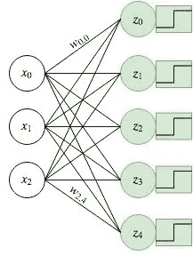
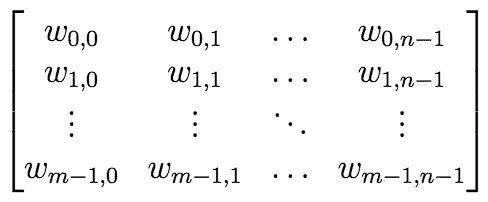
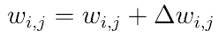
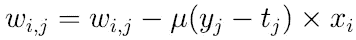
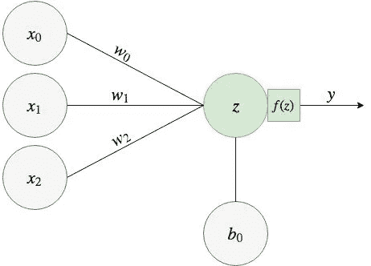
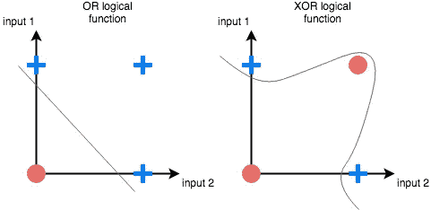

# 感知器网络背后的魔力

> 原文：<https://towardsdatascience.com/the-magic-behind-the-perceptron-network-eaa461088367?source=collection_archive---------23----------------------->

## [神经网络系列](https://towardsdatascience.com/tagged/neural-networks-series)

## 神经网络系列—第 1 章，第 1 部分

## 序言注释

这个故事是我正在创作的关于神经网络系列的一部分。这一章致力于一种非常简单的神经网络，它的创建归功于 [Frank Rosenblatt](https://en.wikipedia.org/wiki/Frank_Rosenblatt) 在五六十年代的研究。我要谈谈[感知器](https://en.wikipedia.org/wiki/Perceptron)。

## 感知神经元

感知机是我在上一篇文章中提到的麦卡洛克和皮茨神经元的增强版。类似于麦卡洛克和皮茨模型，它是使用阈值函数作为激活函数的单个神经元，以及将几个输入连接到神经元的具有不同强度的一组连接。然而，Rosenblatt 介绍的主要突破是提出了一种神经网络可以自己学习最佳权重值的方法。这些权重现在可以是数字的，并由学习算法确定，而不是手工制作的，并限于布尔方式(正/负)。优化这些权重值的方法是使用一种叫做**监督学习**的学习策略。

监督学习是一种学习类型，它意味着在学习过程中存在一个监督人/教师来指导模型。在实践中，这意味着向网络提供几个示例及其正确答案，以提供一些可以改进的指导。然后，网络根据错误的答案调整其权重，以便在未来的迭代中，网络可以增加正确预测的示例数量。

感知器是为特定类型的机器学习问题而设计的:**二元分类问题**。分类问题是指我们的一组可能答案是有限的，并且仅限于一组类别/类(例如，检测电子邮件是否是垃圾邮件)。在我们的感知器案例中，它之所以只解决二元分类问题，是因为它的激活函数的性质。我在上一篇文章中提到，一个神经网络的输出 *y* 就是激活函数 *f(z)* 的输出。假设感知器使用阈值函数作为激活，并且该函数具有两个可能的输出， *0* 或 *1* ，则输出将被调节为仅区分两个不同的类别。你可以把这想象成一个神经元试图决定关灯还是开灯。

Just a cat acting like a perceptron neuron

## 构建感知器网络

让我们增加情趣。让我们的网络架构更复杂一点的可能方法是放置几个感知器，并确保所有输入都连接到我们放置的每个感知器。图 1 描绘了我刚才描述的内容。在机器学习术语中，人们将这组神经元视为**全连接层**或**密集层**，因为每一个输入都与每一个神经元有连接。神经网络可以有几个层次，这个概念将在我的下一篇文章中详细探讨，现在让它保持简单。

Figure 1: Architecture of a neural network with multiple perceptrons

在图 1 中有 3 个输入，每一个都连接到 5 个不同的神经元。绿色方块代表阈值激活函数的曲线。

由于从每一个输入到每一个神经元都有一个连接，可以说这些神经元是相互独立的:它们输出的计算不依赖于其他神经元。它取决于输入(对于每个神经元来说自然是相同的)、它们的权重(每个神经元都有自己的集合)以及它们的激活函数(每个神经元都有自己的)。这迫使我们重新定义在第 0 章中完成的权重向量定义。

从现在开始，每个连接将被标识为 ***w* ( *i，j)*** ，其中 *i* 标识连接来自的输入，而 *j* 是连接去往的神经元。形式表示如下:假设一个神经网络有 *m* 个输入和 *n* 个神经元。每个连接由 ***w* ( *i，j)*** 表示，其中 0 ≦ *i < m* 和 0≦*j*n*，*依次一起构成权重矩阵 **W**

这个矩阵描述了从感知器层到所有神经元的所有输入之间的联系。对于图 1 中描述的示例，我们有 *m* =3，因为这是输入的数量，有 *n* =5，因为这是神经元的数量，这意味着矩阵 **W** 将有 3 行和 5 列。

## 训练感知器网络

罗森布拉特提出的感知器网络的训练过程非常简单。它包括向网络展示一组它应该学习的例子。每个示例都有一个预期的输出和一组与之相关的度量/特征，这些被称为特性。每个示例的特征通过网络的输入节点输入到网络中，以便可以计算预测的输出。然后，根据预期输出( *t* )和预测输出( *y* )之间的任何偏差来调整权重。这个过程是迭代的，因为相同的例子被多次显示给网络。但是我们如何改变这些权重呢？

我们希望权重以这样的方式改变，即当在下一次迭代中向网络显示相同的示例时，它们允许网络的预测更接近实际结果。其背后的逻辑是，如果一个神经元触发，但它不应该触发( *y=1* 和 *t=0* )，则减少权重；如果一个神经元没有触发，但它应该触发( *y=0* 和 *t=1* )，则增加权重。从形式上来说，我们希望在当前权重 *w(i，j)* 上添加一个 delta***δw(I，j)*** ，并创建一个新的权重来替换现有的权重。

所以下一个问题是这个 delta 应该是多少？更新公式依赖于 3 个因素:

*   预期和预测输出之间的差异
    我们可以使用*-【y-t】*来模拟权重更新的预期行为。如果神经元应该触发，我们将得到*δw(I，j)=-(0–1)= 1*(权重增加)，而如果神经元不应该触发，我们将得到*δw(I，j)=-(1–0)=-1*(权重减少)；
*   输入符号
    如果输入符号为负，则上述用于更新权重的逻辑被反转。想象一下，在向具有单个正权重 *w(i，j)* 的感知器显示负输入后，一个神经元应该已经触发，但它没有触发( *t=1* 和 *y=0* )。利用上述逻辑*δw(I，j)=1* ，，这意味着我们的权重将变得更正，在 *x* 和 *w* 之间的乘法变得更负，并且在激活函数之后的结果将仍然是 0，但是甚至更远离阈值点。为了说明这一点，我们将输入作为公式的一部分，将其乘以: *-(y-t) × x*
*   学习率
    这是训练过程中最重要的参数之一，因为它通过定义多少误差应该用于权重更新来定义网络学习其权重的速度。它通常是一个很小的数(比如说在 *0.1* 和 *0.4* 之间)，用一个*来表示。*

鉴于这三个因素，这是如何训练感知器的最终公式:

其中 *w* ( *i，j)* 是将输入 *i* 连接到神经元 *j* ， *y(j)* 标识感知器的输出，t *(j)* 标识感知器的预期结果，x *(i)* 标识输入，

## *偏见角色*

*我们之前已经看到，感知器神经元的输出是输入( *x* )和受阈值激活函数影响的权重( *w* )之间的点积。但是如果输入是 0 会发生什么呢？让我们想象一个只有单一输入的神经元。我们知道我们的产量 *y* 由 *y=f(x₀ × w₀)* 决定。如果输入是 *x₀=0* ，那么 *y=f(0)=1。**

*在这种情况下，由于零积特性，无论权重值如何，神经元的输出都是相同的。这意味着没有学习发生，因为在学习过程中改变了多少权重值，神经元仍将输出相同的结果。解决这个问题的方法是增加一个连接到神经元的额外节点，称为**偏置节点**，以使学习成为可能。修改后的感知器架构如图 2 所示。*

**

*Figure 2: Architecture of a single neuron with bias*

*考虑图 2 中描述的例子，得到输出 y 的公式将是*y =**f(x₀×w₀*﹢*x₁×w₁*﹢*x*₂*×w*₂+*b⊇)*。*

## *优势和局限性*

> *鉴于感知器的简单性，它是一个强大的问题解决器。如果一个问题有一个线性可分的解，那么就证明了感知器总能收敛到一个最优解。*

*我的最后一句话提出了两点:*

*   **‘线性可分解’*是什么意思？
    想象一个数据集，它有两个类(圆和十字)和两个特征，可以作为感知器的输入。该网络的目标是根据这两个特征来猜测某物是十字还是圆。可视化数据集的一种方法是绘制数据集的二维图，其中 y 轴是第一个输入，x 轴是第二个输入。如果有一种方法可以画一条直线，使得圆在直线的一边，而十字在直线的另一边，那么这个问题就可以说是线性可分的。对于具有更多要素/输入的问题，逻辑仍然适用，尽管对于 3 个要素，分类的分界线不再是一条线，而是一个平面。超过 3 个特征的边界称为超平面。*
*   *我们怎么知道我们实际上能得到一个最优解？
    在这种情况下，最佳解决方案是能够通过感知器训练过程创建分隔两类的边界的解决方案。感知器收敛定理证明表明，当网络没有得到正确的示例时，其权重将以这样的方式更新，即分类器边界变得更接近平行于分隔两个类的假设边界。欲了解更多数学术语的详细信息，请点击链接。*

*然而，感知器的问题是，许多现实世界的问题不是线性可分的，因此很可能使用一层感知器将不是您的问题的最佳解决方案，因为它将无法找到分隔您的类的最佳边界。图 4 通过所谓的[异或问题](https://medium.com/@jayeshbahire/the-xor-problem-in-neural-networks-50006411840b)说明了这种限制。*

**

*Figure 4: XOR problem and the linear separability problem illustrated*

*在上图中，有一个逻辑 OR 函数和 XOR 函数的图形表示(XOR 代表“异或”)。OR 函数是基于两个输入的函数，如果任何一个输入为 *1* ，则返回 *1* (否则结果为 *0* )，而 XOR 函数在只有一个输入为 *1* 时输出 *1* 。*

*如果我们使用具有两个输入的感知器来教授这些函数，我们可以在图 4(或函数)的最左边的图中看到，有一条线将十字与圆分开，而在最右边的图(XOR 函数)中，分开两个类的唯一方法是使用非线性边界。这意味着单个感知器可以学习 OR 函数，但它不能学习 XOR 函数。*

*在这篇文章中，我解释了什么是感知器，它解决什么样的问题，如何通过分类来训练它学习模式，以及它的局限性。然而，现在需要深入研究代码并在实践中实现这一点，因此在我的下一篇文章中，我将向您展示如何创建一个感知器，训练它并使用它。敬请期待！*

*感谢阅读！你喜欢这篇文章吗？非常感谢你的反馈，🗣。请随时在 [**Twitter**](https://twitter.com/adrianovinhas) 或 [**LinkedIn**](https://www.linkedin.com/in/adrianovinhas/) 上联系我，或者如果你对下一章的最新消息感兴趣，就在 Medium 上关注我😀。*

*一些相关阅读:*

*   *[感知器是什么鬼？](/what-the-hell-is-perceptron-626217814f53)由[萨加尔·夏尔马](https://medium.com/u/165370addbb5?source=post_page-----eaa461088367--------------------------------)；*
*   *[简单感知器训练算法:由](https://medium.com/@nikhilc3013/simple-perceptron-training-algorithm-explained-7bbfdff2c57d) [Nikhil Chigali](https://medium.com/u/a7dad0bdd4ac?source=post_page-----eaa461088367--------------------------------) 讲解；*
*   *[真实网络中的感知机](https://medium.com/@thomascountz/perceptrons-in-neural-networks-dc41f3e4c1b9)作者[托马斯·康茨](https://medium.com/u/5deb80af2cc0?source=post_page-----eaa461088367--------------------------------)；*
*   *[感知器算法](https://medium.com/anubhav-shrimal/perceptron-algorithm-1b387058ecfb)通过[Anubhav Shrimal](https://medium.com/u/c8ac91815c3d?source=post_page-----eaa461088367--------------------------------)；*
*   *[神经网络中的异或问题](https://medium.com/@jayeshbahire/the-xor-problem-in-neural-networks-50006411840b)作者[Jayesh Bapu Ahire](https://medium.com/u/4d137af1d608?source=post_page-----eaa461088367--------------------------------)；*
*   *[感知器、逻辑功能和 XOR 问题](/perceptrons-logical-functions-and-the-xor-problem-37ca5025790a)作者[Francesco Cicala](https://medium.com/u/e217ceca2278?source=post_page-----eaa461088367--------------------------------)；*
*   *[感知器学习算法:对其工作原理的图形化解释](/perceptron-learning-algorithm-d5db0deab975)作者[阿克谢·钱德拉·拉甘杜拉](https://medium.com/u/202534492f47?source=post_page-----eaa461088367--------------------------------)*