# 使用机器学习识别金融欺诈的主要问题(以及如何解决)

> 原文：<https://towardsdatascience.com/the-main-issue-with-identifying-financial-fraud-using-machine-learning-and-how-to-address-it-3b1bf8fa1e0c?source=collection_archive---------19----------------------->

## 处理不平衡数据的策略

支付处理器每天处理的金融交易数量惊人，而且还在不断增加:2012 年[大约每天 7000 万笔信用卡交易](https://www.nasdaq.com/article/credit-card-statistics-industry-facts-debt-statistics-cm21786)，2017 年[损失数十亿美元](https://www.creditdonkey.com/credit-card-fraud-statistics.html)。仅仅由于交易量，确定交易是合法的还是欺诈是计算机系统的专有工作。传统的机器学习方法是建立一个分类器，帮助循环中的人减少必须查看的交易数量。

The goal of the machine learning classifier is to reduce the number of transactions that a human has to investigate.

机器学习分类器面临的挑战是欺诈交易的百分比在 1-2%的数量级，这意味着分类器必须考虑训练数据中的严重不平衡。

这是一个非常棒的视频，展示了机器学习工程师在系统检测欺诈交易时必须经历的挑战:

即使是金融欺诈的合成数据集也是有偏差的，例如，在预测金融支付服务欺诈的 [Kaggle 数据集](https://www.kaggle.com/arjunjoshua/predicting-fraud-in-financial-payment-services)上的不平衡:

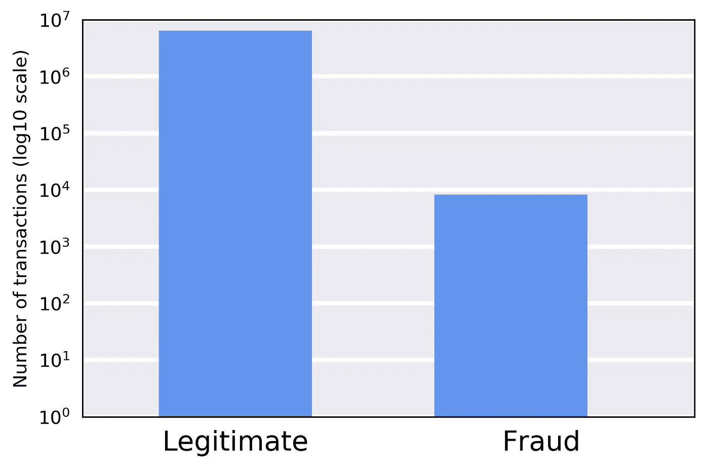

该数据集包含超过 600 万个交易和 11 个特征:

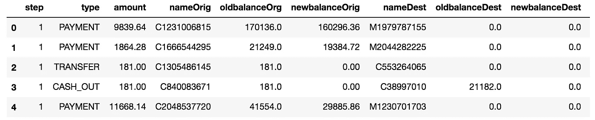

数据不平衡问题并不仅限于金融领域的机器学习应用，还包括一些应用，如检测罕见疾病患者的图像、从入境口岸的 X 射线图像中对受限对象进行图像分类、石油泄漏的图像识别等。

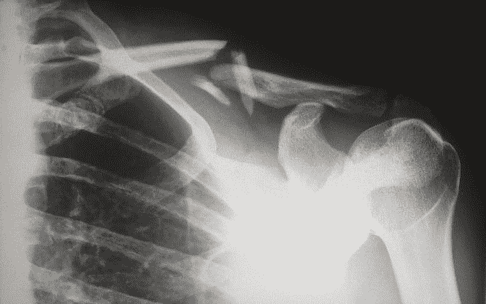

Photos courtesy of [Unsplash](https://unsplash.com?utm_source=medium&utm_medium=referral)

在本文中，我将描述可以用来缓解数据不平衡的技术，目标是用平衡的数据集训练二元分类器。

为了便于说明，我们将创建一个二维的合成数据集，尽管典型的金融数据集通常有更多的特征，例如，之前的 [Kaggle 数据集](https://www.kaggle.com/arjunjoshua/predicting-fraud-in-financial-payment-services)有 28 个特征。

一般来说，不平衡数据集看起来是这样的:

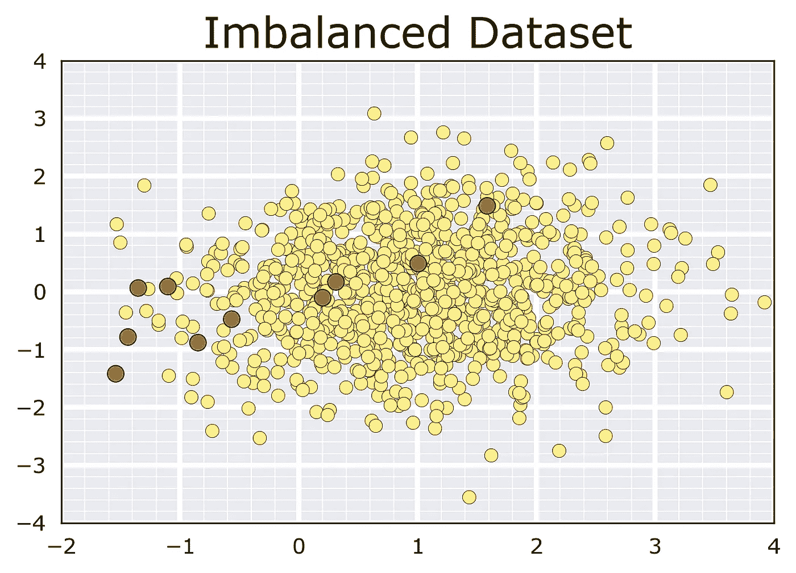

Dataset depicting a 99:1 class imbalance ratio. There are 1,000 samples on the yellow class (majority), and 10 samples on the orange class (minority).

有两种缓解不平衡的一般策略:减少多数类(欠采样)，或从少数类生成合成数据(过采样)。我们将讨论这两者。

# 策略一。欠采样多数类

在这个策略中，思想是减少多数类的样本数量。

## 1.1 随机欠采样

第一种策略是忽略来自多数类的数据样本。以下动画忽略了来自多数类的随机样本，直到达到平衡数据集。

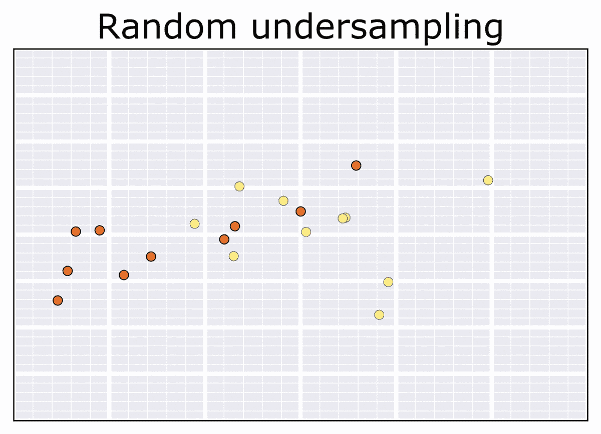

Random undersampling

## 1.2 聚类欠采样

另一个策略是将多数样本减少到 *k* 个样本，这对应于多数类的 *k* 个质心。这些质心由 [*k 均值聚类*](https://en.wikipedia.org/wiki/K-means_clustering) 无监督算法计算。质心的数量通常被设置为少数类中样本的数量，以便整个数据集是平衡的。

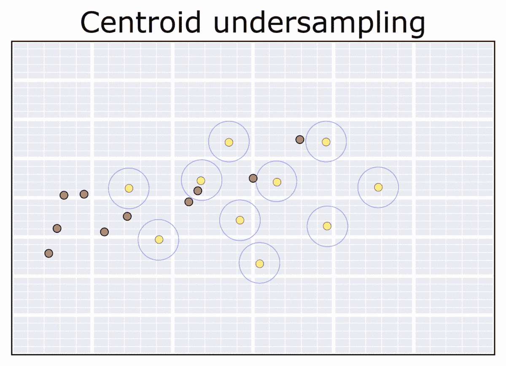

Clustering undersampling

## 1.3 Tomek 链接

对多数类进行欠采样的另一个策略是移除所谓的“ [Tomek 链接](https://ieeexplore.ieee.org/document/4309452)”。这些点是离少数类最近的邻居(离对面类最近)。通过移除这些点，通过从多数类的点中“清除”其周围空间，给予少数类样本更多的权重。

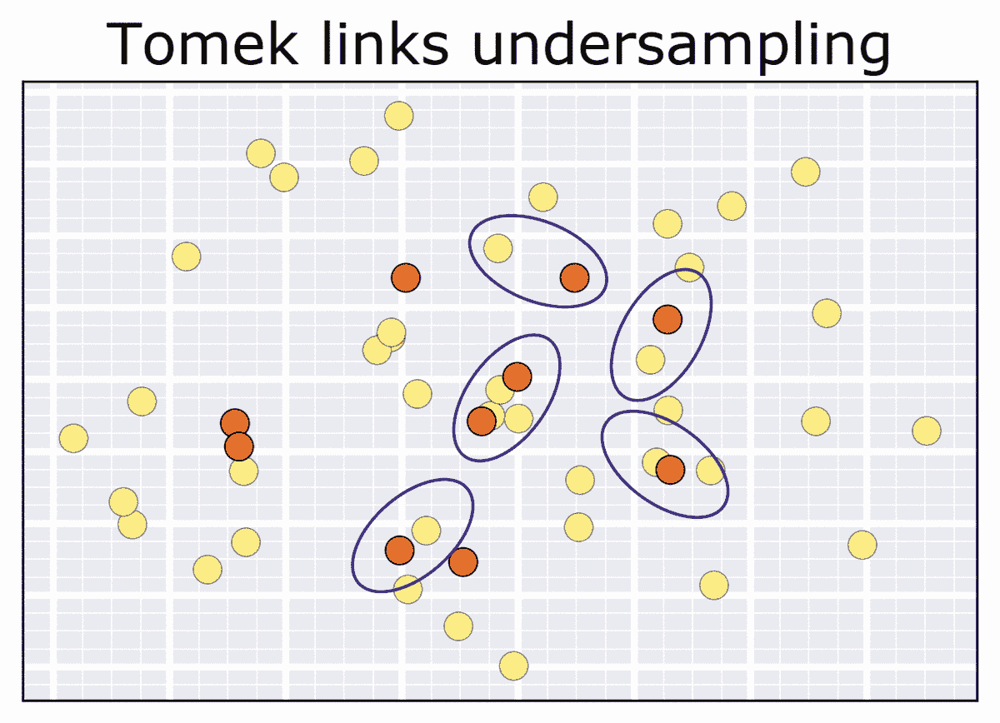

Tomek links undersampling

# 策略二。对少数民族阶层进行过度采样

在这个策略中，想法是增加少数类的样本数量。

## 2.1 通过少数类的随机复制进行过采样

在第一个策略中，也是最容易实现的，从少数类中选择随机样本并复制它们。尽管简单明了，但这可能会导致过度拟合。

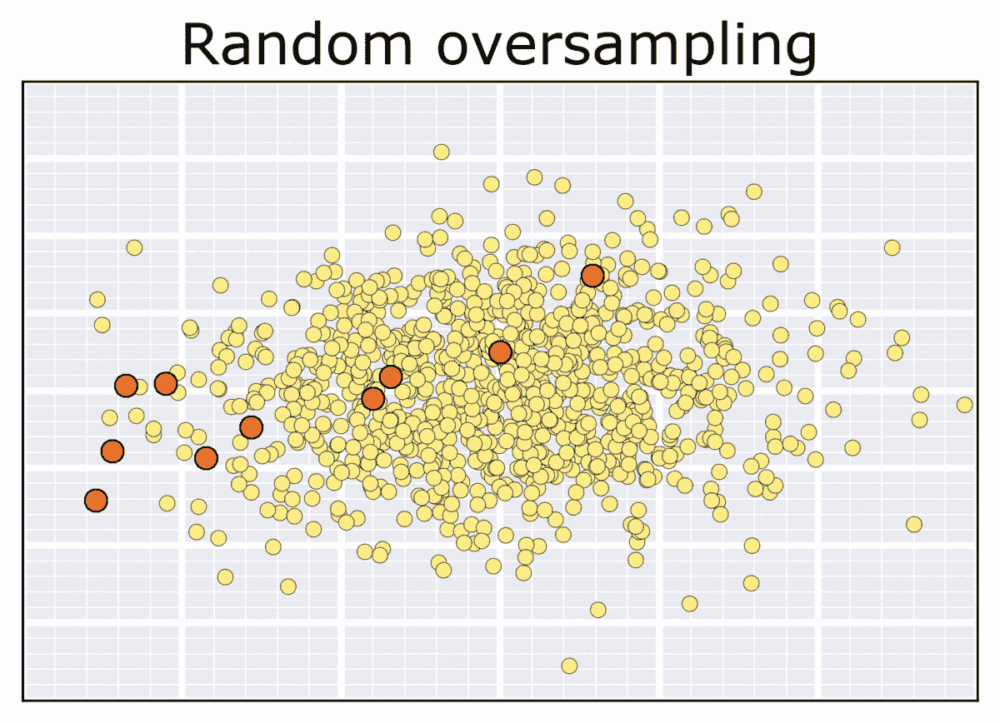

Random oversampling

## 2.2 合成少数过采样(SMOTE)

[SMOTE](https://www.cs.cmu.edu/afs/cs/project/jair/pub/volume16/chawla02a-html/node6.html) 算法背后的思想是沿着来自少数类的两个样本之间的向量创建“合成”数据点，这些样本是由其最近的邻居(即最近的)选择的。新点沿该向量以随机长度设置。有关简化数据集的示例，请参见以下动画:

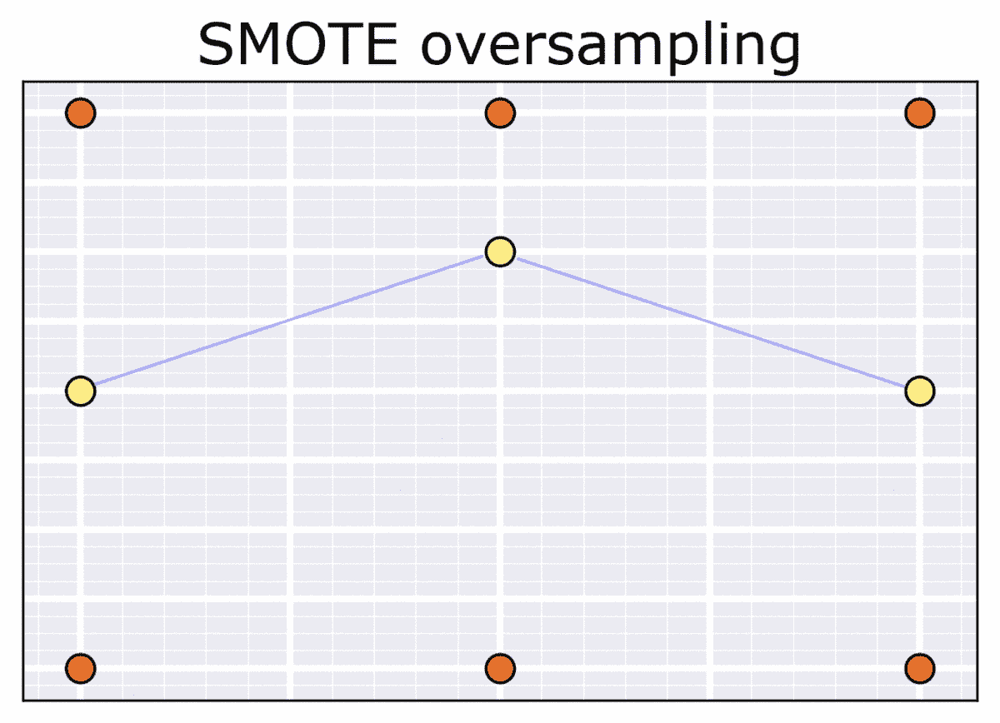

SMOTE interpolates over nearest neighbors.

以下动画应用于我们之前的示例进行说明:

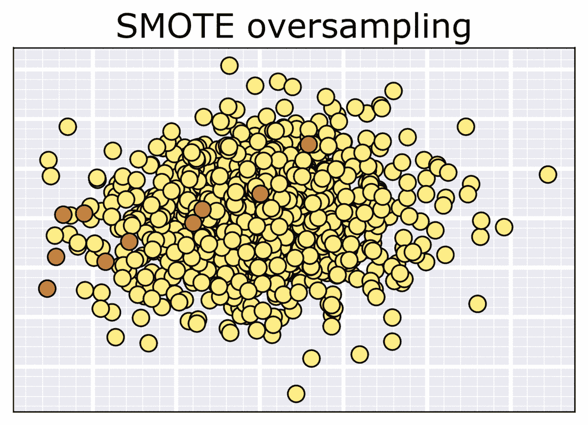

Synthetic Minority Over-sampling (SMOTE) example.

## 2.3 自适应合成(ADASYN)

与 SMOTE 类似， [ADASYN](https://sci2s.ugr.es/keel/pdf/algorithm/congreso/2008-He-ieee.pdf) 算法也生成新的合成点，但通过对少数样本应用不同的权重来补偿偏斜分布。在 SMOTE 算法中，为每个少数数据示例生成相同数量的合成样本。

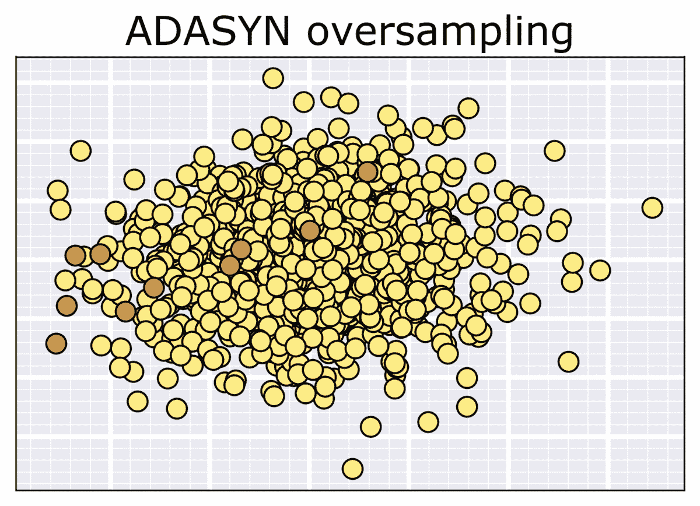

Adaptive Synthetic (ADASYN)

# 3.过采样和欠采样(SMOTE + Tomek 链接)

最后，过采样(例如通过 SMOTE)和欠采样(例如通过 Tomek 链接)的结合也许是处理不平衡数据的理想途径。过采样算法创建新的实例来匹配平衡，而欠采样过程从多数类中移除点，否则这些点会减去少数类的珍贵样本的权重。这种策略 a 的一个例子可以在下面的动画中看到:

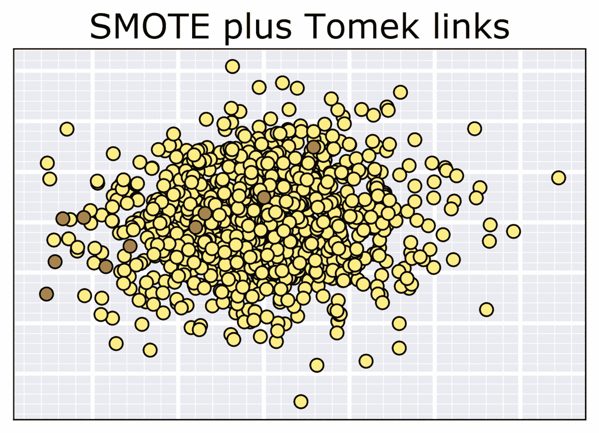

SMOTE + Tomek links

# 摘要

策略的选择将取决于问题，并最终由业务决定支持的东西来指导:[精度或召回](/precision-vs-recall-386cf9f89488)。

幸运的是，通过 Python 库[不平衡学习](https://imbalanced-learn.readthedocs.io/en/stable/index.html)，可以直接测试这些技术的性能。

## 延伸阅读:

*   [从不平衡的班级中学习](https://www.svds.com/learning-imbalanced-classes/)作者[汤姆·福塞特](https://medium.com/u/508c5779b512?source=post_page-----3b1bf8fa1e0c--------------------------------)
*   [不平衡数据集的重采样策略](https://www.kaggle.com/rafjaa/resampling-strategies-for-imbalanced-datasets)作者[拉斐尔·阿伦卡尔](https://medium.com/u/c5914bcc00bd?source=post_page-----3b1bf8fa1e0c--------------------------------)

# 源代码:

在这个存储库中[https://github . com/gchave z2/code _ machine _ learning _ algorithms](https://github.com/gchavez2/code_machine_learning_algorithms)您可以找到用于生成本文实验的 Python 代码，以 Jupyter 笔记本的形式:

[https://github.com/gchavez2/code_machine_learning_algorithms](https://github.com/gchavez2/code_machine_learning_algorithms)

*我是劳伦斯伯克利国家实验室的博士后，在那里从事机器学习和高性能计算的交叉研究。*

*如果你觉得这篇文章很有趣，请随意打个招呼，LinkedIn* *，我总是很乐意与该领域的其他专业人士联系。*

No Spam, ever.