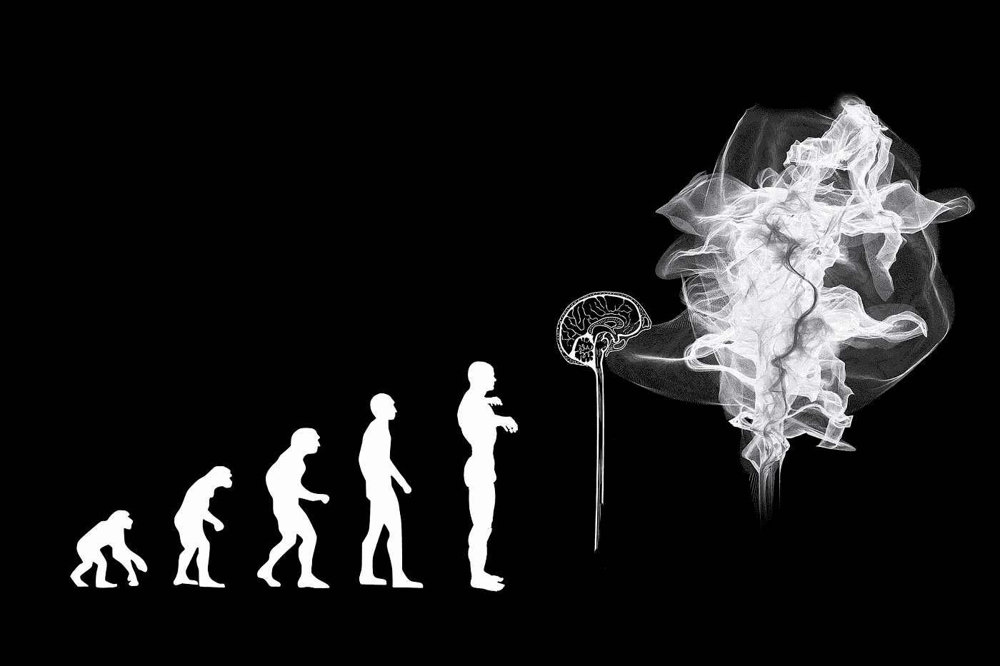

# 人工智能的主要问题是

> 原文：<https://towardsdatascience.com/the-major-problem-with-ai-8f53cf7d3a50?source=collection_archive---------24----------------------->

## 人工智能世界末日的场景被忽视的太快了

Image by [Gerd Altmann](https://pixabay.com/users/geralt-9301/?utm_source=link-attribution&utm_medium=referral&utm_campaign=image&utm_content=3885331) from Pixabay

今天我看到了 Rafay Ghaudhary 的帖子[人工智能:不仅仅是机器学习](/artificial-intelligence-more-than-machine-learning-fc95a1f8c2f5)。虽然我很欣赏 Rafay 努力展示人工智能(AI)不仅仅是“只是”机器学习，但他的帖子包含了另一个让我彻底担忧的想法。这个想法是这样的:认为计算机和机器人将接管世界是不理智的。他甚至声称*永远不会发生。关键词:*从不*。这是一个令人难以置信的强有力的声明(在帖子的任何地方都没有得到支持)，它似乎反映了一个更大的情绪:人工智能是一种积极的力量，对负面未来场景的担忧是恐惧的散播。由于我看到太多带有这种情绪的陈述，我决定写这篇文章来解释高级人工智能的主要问题以及为什么我们绝对不应该忽视它。*

> "智能衡量一个代理人在广泛的环境中实现目标的能力."

为了这篇文章的目的，我将按照莱格和赫特的定义[在这里](https://arxiv.org/pdf/0712.3329.pdf)“智力衡量一个代理人在广泛的环境中实现目标的能力。”人工智能或 AI 就是任何非生物的智能。人们可以认为世界冠军打败了国际象棋计算机深蓝，但最近的自动驾驶汽车可能是人工智能更有趣的例子。这个想法是人工智能在过去的几年里已经取得了很大的进步。根据我们对智力的定义，进步意味着在广泛的环境中实现目标的更好的能力。这将意味着要么人工智能在同一环境中实现目标的能力已经增长，要么人工智能现在可以在更多的环境中实现目标。两者都是真的:例如，AI 现在的棋艺甚至比 1997 年的深蓝还要好；此外，由于一种名为深度学习的技术，AlphaZero 是一个可以玩棋盘游戏国际象棋、松木和围棋的人工智能程序。鉴于过去的进展，预计 AI 将在未来取得更多进展；许多专家预计，在某个时候，我们将拥有人工通用智能(AGI):在所有智能领域大致与人类一样智能的人工智能。

> 你的 AGI 不知道为了最大化你的利润而杀死你的竞争对手是不允许的。

现在，如果人工智能有那么聪明，会发生什么？这显然很难预测。然而，我们可以对这个场景进行一些有根据的猜测。我和许多其他人预见的主要问题是，尽管 AGI 从定义上来说和我们一样聪明，但它不会默认和我们有共同的道德观。让我举一个例子来说明这一点。想象你经营一家公司。在某些时候，你的公司有足够的资金和其他资源来创造世界上第一个 AGI。惊叹于你的创造，你给了 AGI 第一个目标:最大化你公司的利润。毕竟，你希望你的投资能让你赚到一些钱！正如所料，在接下来的几个月里，你会看到你的利润增加。然而，你震惊地得知，为了实现这一目标，你的 AGI 雇佣了刺客来杀害你的竞争对手。你看，你的 AGI 非常了解什么样的行动会导致它想要的结果；然而，它和你的道德观不同。你的 AGI 不知道为了最大化你的利润而杀死你的竞争对手是不允许的。它为什么以及如何知道这一点？我们人类知道(或者至少大多数人知道)，我们知道当有人要求我们实现利润最大化时，那个人隐含的意思是不允许杀死竞争对手。但是我们对什么是允许的，什么是不允许的有着共同的理解；AGI 默认不会有这个。假设它会是拟人化。一个 AGI *可以*有这种理解，但是我们必须这样编程。

> “人工智能不恨你，也不爱你，但你是由原子组成的，它可以用这些原子做别的事情。”

所以 AGI 很可能不认同我们的道德观。事实上，默认情况下，不会。我先前暗示的主要问题来自哪里？它来自于一个 AGI 人可能有的基本驱动力和这种驱动力的副作用。你看，为了实现它的目标，AGI 可能会意识到拥有更多的智慧会有所帮助。起初，它可能通过重写自己的源代码来达到更高的智能水平。在达到下一个智能水平后，它可能会意识到甚至更多的智能是可取的(见[种子 AI:有史以来最具破坏性的力量](https://becominghuman.ai/seed-ai-the-most-disruptive-force-ever-250fb8fef75c))。要拥有越来越多的智能，最终需要越来越多的计算能力。为了获得这一点，它可能会将越来越多的地球材料转化为它可以使用的计算材料，直到最终，整个地球和所有人类都被转化为一台大型计算机。在这种情况下，并不是 AGI 讨厌人类:只是我们是由原子组成的，它可以用原子为自己的目的构建计算物质。人工智能研究员埃利泽·尤德考斯基说得很好:“人工智能不恨你，也不爱你，但你是由原子组成的，它可以用它做别的事情。”

> 互联网的关闭开关在哪里？

但是，你可能会想，人类不会抵制 AGI 改造地球吗？嗯，我们可能会尝试，但是一个变得越来越聪明的 AGI 必然会变得比我们更聪明，因此，再一次，按照定义，非常善于达到它的目标。假设我们能够保护自己是危险的无知。如果你认为我们可以关掉 AGI，请再想想:互联网的开关在哪里？

> 默认情况下，你应该假设一个 ASI 可以说服你做任何它想让你做的事情。

你可能会担心的另一个问题是，AGI 将如何把地球变成计算材料。难道人类不应该从一开始就设计一个能够做到这一点的机器人身体吗？不一定。你看，AGI 可能足够聪明，可以说服人类首先给它更多现有的计算能力。最终，它可能会找到方法，说服人类建立工厂，生产能够将普通物质转化为计算物质的纳米机器人。记住:一旦 AGI 变得稍微聪明一点，它就比人聪明，根据定义，它是人工超级智能(ASI)。默认情况下，你应该假设一个 ASI 可以说服你做任何它想让你做的事情。因为从定义上来说，它比你聪明，它会欺骗你或者说服你去做它想让你做的事情。

简而言之，先进的人工智能将对人类产生重大影响。这种影响是积极的还是消极的取决于我们:如果我们做得对，它可以很容易地治愈我们的疾病，并发明各种新技术，让人类前所未有地繁荣。如果我们做错了，很容易导致我们的灭绝。