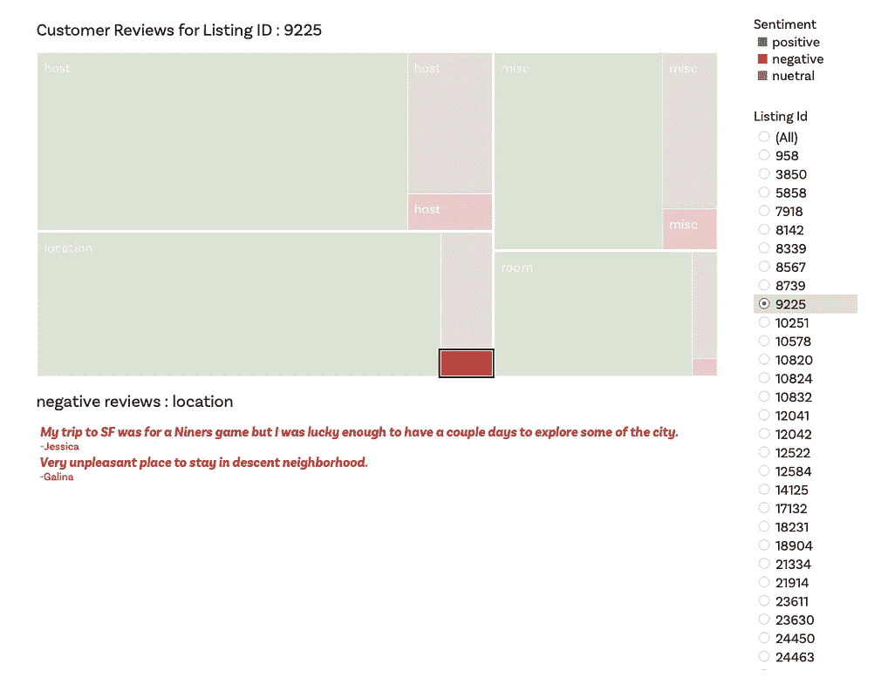

# 一个伟大的 Airbnb 度假屋的制作

> 原文：<https://towardsdatascience.com/the-making-of-a-great-airbnb-vacay-e6d541942362?source=collection_archive---------42----------------------->

## 可视化 Airbnb 房源和评论，帮助旅行者选择完美的度假屋。

Photo by [Outsite Co](https://unsplash.com/@outsite?utm_source=medium&utm_medium=referral) on [Unsplash](https://unsplash.com?utm_source=medium&utm_medium=referral)

度假者正在离开传统的酒店，转而选择 Airbnbs 和类似的房屋租赁服务。这些平台为旅行者提供了一个舒适的住宿场所，价格只是酒店的一小部分。虽然比大多数酒店便宜，但由于不一致的体验，旅客仍然认为空中旅馆不太可靠[2]。Airbnbs 的这种不可靠性使得旅行者很难为他们的住宿选择正确的家和/或主人，这可能导致一些不幸的情况(你可以在这里阅读一些恐怖故事[)。](https://www.asherfergusson.com/airbnb/)

为了解决这个问题，我创建了可视化仪表板，为客户提供更好、更直观的方式来探索某个地区的房源，并帮助他们在为未来的旅行筛选 Airbnbs 时做出明智的决定。

这些仪表板具有基于类别和用户情绪可视化客户评论的**情绪树图**，代表一个地区最有吸引力的社区的**空间可视化**，以及允许用户一次比较多个 Airbnb 房源的**平行坐标**显示。

Video demo of the visualizations

向下滚动以了解更多关于我构建这些可视化的过程。

# ***设置焦点***

Photo by [Elena Taranenko](https://unsplash.com/@elenatrn?utm_source=medium&utm_medium=referral) on [Unsplash](https://unsplash.com?utm_source=medium&utm_medium=referral)

## ***选择数据集进行探索***

我在 Airbnb 内部使用了*([http://insideairbnb.com/](http://insideairbnb.com/))，这是一个公开的资源，提供与一个城市的 Airbnb 房源相关的各种数据集。我浏览了旧金山地区及其周边的 Airbnb 房源，以缩小我的项目范围。我用于分析的数据集( [Listings_SF](http://data.insideairbnb.com/united-states/ca/san-francisco/2019-08-06/data/listings.csv.gz) ， [Reviews_SF](http://data.insideairbnb.com/united-states/ca/san-francisco/2019-08-06/data/reviews.csv.gz) )提供了关于房源的主人、房间、顾客评论、价格、邻居和评级等重要属性的详细信息。*

*虽然我理解了项目的总体目标，但我仍然不明白数据的哪些属性是重要的，应该关注哪些属性，我可以对数据进行什么样的分析，以及我可以用什么不同的方式来可视化这些数据。为了寻找灵感和进一步拓展我的项目，我决定探索这一领域以前的研究。*

## ****进行背景调查****

*作为背景研究的一部分，我回顾了与我关注点相似的文献。*

*   *我首先探索了之前的工作，将 Airbnb 房源的各种属性关联起来并可视化。这帮助我理解了人们分析、可视化和关联 Airbnb 数据的不同方法。[3][4]*
*   *此外，我还研究了之前关于 Airbnb 超级主机的研究，即拥有持续高收视率和高销售额的主机。这帮助我列出了我想要关注的属性，因为它让我了解了获得超级主机地位的主要标准。[5][6]*
*   *由于我的项目很大一部分涉及 Airbnb 评论数据集的分析和可视化，我阅读了以前可视化客户评论、意见和反馈的研究。[7][8][9]*
*   *出于对 Airbnb 极其严格的审核政策的担忧，我还查看了关于 Airbnb 审核合法性的研究。这样做是为了理解 Airbnb 评论与其他来源的评论/反馈有何不同。这为我后来对这些评论的分析提供了信息。[10]*
*   *最后，我查看了与我的项目焦点密切相关的类似学生项目，以确保我的工作没有与之前学生主导的项目完全重叠。[11][12]*

*总之，文献综述对于缩小范围和为我的项目指明方向至关重要。*

*(你可以在这里查阅我的文献综述[的详细内容。)](https://drive.google.com/file/d/1b_StTmbx_nxoupXtX3VVxkOF1eTQTSvO/view?usp=sharing)*

# ****创建可视化效果****

**使用的工具:Tableau，Python (Pandas & Textblob 库)，Numbers for Mac**

**

*Photo by [Jason Coudriet](https://unsplash.com/@jcoudriet?utm_source=medium&utm_medium=referral) on [Unsplash](https://unsplash.com?utm_source=medium&utm_medium=referral)*

*基于我从文献综述中获得的知识，我勾勒出了一些可视化效果，可以帮助人们更好地探索和筛选 Airbnb 房源。在勾勒出我的想法并收到教授和同行的反馈后，我专注于构建交互式可视化。*

## ***可视化客户评论***

***我**受论文**、**、*Pulse:Mining Customer Opinions from Free Text(Michael Gamon、Anthony Aue、Simon Corston-Oliver 和 Eric Ringger (2005* )中使用情感树图的启发，我绘制了一张可视化 Airbnb 评论的情感树图。*

*我想象它是一个仪表板，用户可以选择一个列表，并以树形图格式查看评论，根据客户谈论的主要主题进行情绪着色和标记。点击一个主要主题会导致与该主题相关的正面和负面评论。*

**

*Sentiment-Treemap Sketch*

***建立可视化***

*在这个过程的第一阶段，我从 Airbnb 的评论数据集中随机选择了 2 万条评论，并创建了一个标签云，以了解人们在 Airbnb 住宿期间最关心的是什么。*

**

*观察标签云帮助我将用户评论分为以下 4 类:*

**

*Location-related, room-related, host-related and value/price-related reviews*

*在对数据集进行分类后，我对评论进行了情感分析，并将评论标记为负面、中性或正面。*

*这个过程帮助我生成了一个更新的数据集，其中包含评论及其类别和情感价值。我将这些数据导入 Tableau，并用情感色彩创建了想要的树形图。*

**

*用户可以选择特定的列表，并观察该特定列表的情感树图以及所有相应的用户评论。点击一个主要主题会导致与该主题相关的正面/负面/中性评论。*

****

> *对于关注和重视一个列表的一个方面多于另一个方面的客户来说，情感树图可以作为一个很好的工具。*

## ***显示旧金山最吸引人的街区***

*我想看看地理位置如何影响 Airbnb 房源的吸引力。我根据评论、价格和位置创建了一个空间可视化来表示旧金山最有吸引力的社区。因为我必须在 2d 地图上表示多个属性，所以我使用颜色阴影来表示一个区域的情绪(绿色到红色/浅绿色到深绿色)，使用符号来表示平均价格水平，使用位置分数(来自列表数据集)来表示该区域的位置等级。*

**

*Spatial Visualization representing attractive locations: sketch*

***建立可视化***

*我使用 Tableau 创建了一个仪表板，它根据旧金山的邮政编码可视化一个地点的平均价格(作为标签)和吸引力(通过颜色阴影)。这伴随着表示 SF 中所有列表的可视化以及列表的平均用户评级(使用带有颜色阴影的圆圈)。*

**

*在第一个地图上选择一个位置，在第二个地图上显示该特定位置的列表。这提供了该区域不同列表的更清晰(放大)的图片以及它们的平均评分。用户可以根据他们的房间偏好(私人/共享/房子)和他们想要的预算筛选出列表。*

**

> *这种空间可视化将有助于游客更好地探索一个地区，并选择理想的住宿地点。*

## ***允许用户比较多个 Airbnb 房源的可视化***

*Airbnb 的房源数据集为每个房源提供了 4 个重要指标的评级(满分 10 分):清洁度、位置、价值、主人沟通。我最初想用一个蜘蛛图来表示和比较多个列表的分数。*

**

*我很快意识到，如果比较 3 个以上的列表，蜘蛛图将变得混乱和难以探索。为了解决这个问题，我认为使用平行坐标比较 Airbnb 房源会很有趣。*

**

*Comparison using parallel coordinates*

***构建可视化***

*我在 Tableau 上创建了平行坐标显示，以 **c** 比较 Airbnb 列表，其中的坐标包括清洁度评级、位置评级、性价比评级和主机通信评级——所有这些都可以在列表数据集中找到(0-10 分)。*

**

*Parallel Coordinates display*

*我在上面显示的空间可视化仪表板中集成了这种可视化，以帮助轻松过滤列表并改进平行坐标显示的探索。利用这一点，用户可以选择一个特定的位置，并过滤平行坐标图，以显示和比较该位置的列表。*

**

> *平行坐标显示将帮助游客基于列表的最重要属性来比较不同的列表*

# ****结论****

*我创建了可视化仪表盘，可以帮助旅行者更好地探索和筛选 Airbnb 房源。这些可视化可以很容易地集成到 Airbnb 当前的网络生态系统中，为用户提供更丰富、更直观的浏览体验。*

> **该项目是在*[*Niklas Elmqvist*](https://medium.com/u/554d449f7b41?source=post_page-----e6d541942362--------------------------------)*教授的指导下，在马里兰大学帕克学院完成的数据可视化(INST760)课程的一部分。**

# ****参考文献****

1.  *https://medium . com/Harvard-real-estate-review/a-new-era-of-lodding-airbnbs-impact-on-hotels-travelers-and-city-de 3 B1 C2 D5 ab 6*
2.  *[https://listwithclever . com/real-estate-blog/Airbnb-vs-hotels-study/](https://listwithclever.com/real-estate-blog/airbnb-vs-hotels-study/)*
3.  **使用 3 波段栅格表示法可视化布达佩斯 Airbnb 的空间性(加博尔·杜达斯、拉霍斯·波罗斯、塔马斯·科瓦尔奇克、巴拉兹·科瓦尔奇克，2017 年)】**
4.  **对纽约市 Airbnb 的社会经济分析(杜达斯、维达、波罗斯(2017 年))**
5.  *是什么让 Airbnb 主持人成为超级主持人？来自旧金山和湾区的经验证据(Gunter，U. (2018)*
6.  **确定影响超级主机状态的因素:来自撒丁岛和西西里岛的证据(Giulia Contu，Claudio Conversano，Luca Frigau，Francesco Mola (2019))**
7.  **Pulse:从自由文本中挖掘客户意见(Michael Gamon、Anthony Aue、Simon Corston-Oliver 和 Eric Ringger (2005))**
8.  **客户反馈数据的视觉意见分析(Oelke et。阿尔(2009 年)**
9.  **关于酒店评论的观点挖掘和可视化的研究(bjorkelund，Burnett，nrvg(2012))**
10.  **如果几乎所有 Airbnb 的评论都是正面的，这是否意味着它们毫无意义？(布里奇斯，j .，&巴斯克斯，C. (2016))**
11.  *【http://www.columbia.edu/~sg3637/airbnb_final_analysis.html】T5[T6](http://www.columbia.edu/~sg3637/airbnb_final_analysis.html)*
12.  *[*https://medium . com/uda city/using-Airbnb-data-to-understand-the-owners-market-in*](https://medium.com/udacity/using-airbnb-data-to-understand-the-homeowners-market-in)*-西雅图-4dfbfb0de5a3**