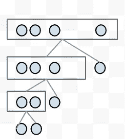
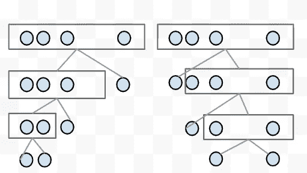

# 穿西装戴草帽的男人

> 原文：<https://towardsdatascience.com/the-man-with-a-suit-and-a-straw-hat-fabe5be1fb3c?source=collection_archive---------25----------------------->

## **向非技术观众揭开异常检测的神秘面纱**

检测异常就是检测异常值。这看起来很简单，但并不总是如此。问题是，你如何定义一个离群值？

我们先想象一个穿西装的男人。这很正常。然后想象一个戴着草帽的男人，这也很正常。现在把这两张照片合成一张，想象同一个男人穿着西装，戴着草帽。既正式又随意？这似乎不正常。

在预测性维护等情况下，这是异常检测的常见情况。用数据科学家的话来说，有时不是单个特征说明异常，而是多个特征的组合。

> 我们不应该看这幅画的一部分，而应该退一步看它的整体。

有不同的方法来检测异常。最常见的方法是创建一个正常的情况简介，然后将其他所有情况归类为异常。在这里，我们将研究一种完全不同的模型，它从一些异常情况中学习— **隔离森林**。单词“**隔离**”暗示我们可以通过距离的概念发现异常。直觉上，一个数据点越异常，它就越孤立于其他数据点。

在实际应用中，大多数数据集都有多个维度。例如，对于预测性维护，相关特征可以是机器的振动、声音等。为简化起见，我们在这里只考虑用几个蓝色圆圈表示的一维数据。人类可以很容易地观察到，最靠右的那颗是异常的。但是机器是如何找到它的呢？

让我们用针来举例说明。假设有人在上空飞行，随机扔出一根针，这根针最终会停在线上。且针有相等机会落在从最左边到最右边样本的任何位置。

如果指针落在 3 和 4 之间，它隔离 4。如果指针落在 1 和 2 之间，它隔离 1。如果针落在 2 和 3 之间，它不会分离任何样品，因此我们继续投掷更多的针，直到至少一个样品被分离。我们递归地重复该过程，直到分离出所有样本。

对于每个样本，我们计算在分离前使用的针数。这个数字就是我们所说的**异常分数**。由于着陆针的位置是均匀分布的，样品距离越远，越有可能被更快地分离，因此可能需要更少的针。基于来自现有数据集的异常分数，我们可以定义一个阈值，使得任何异常分数低于该阈值的未来数据将被分类为异常。

到实验结束时，我们会将所有样本分开，每个样本都有一个指定的异常分数。如下面的"**树**所示，那些具有较小异常分数的更接近树的根，因为它们在早期阶段被隔离。那些分数较大的离根更远，因为它们后来被隔离。因此，这样的树描述了所有样本的隔离状态，粗略地显示了特定样本与其他样本相比有多异常。

现在，在去“**森林**”之前，让我们停留片刻在机器学习的一个基本概念上——“T4 方差”。你可能遇到过偏差-方差权衡的概念。但是我们现在将跳过“**偏差**”。

在实践中使用这个简单的模型可能会有什么问题？我们观察不到的真实世界数据可能有不同的模式。换句话说，从样本数据得出的异常检测阈值可能不适用于群体数据。这就是当我们有一个高方差的问题时，或者正如我们经常说的，模型过度适应训练数据。

对此的一个解决方案是，我们可以使用多棵树，而不是只构建一棵树。这就是“**森林**”这个术语的由来。在针头实验中，我们会多次重复同样的过程。由于每个实验都有随机性，通过对不同模型的异常分数进行平均，我们可以得到一个更能捕捉群体异常的最终模型。

有了隔离森林和一个有一些异常的数据集，我们能够创建某些检测规则，允许我们谈论新的传感器值、新的金融交易，或者关于一个穿西装戴草帽的人。