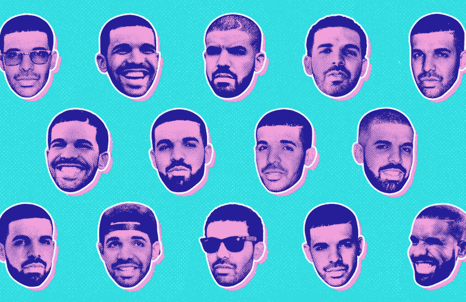
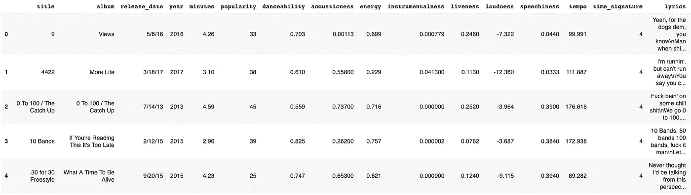
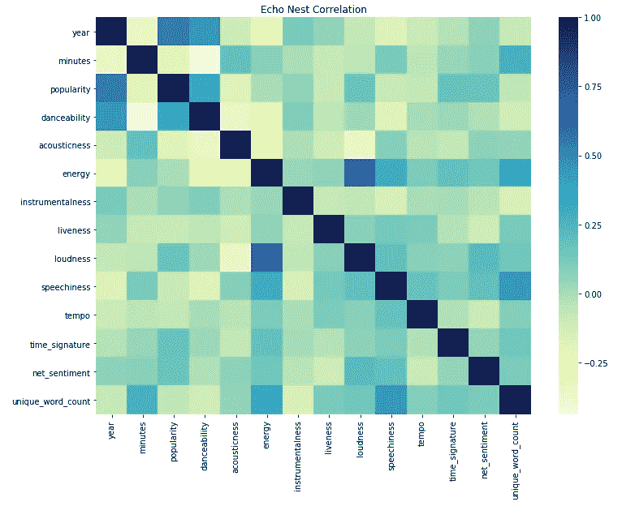
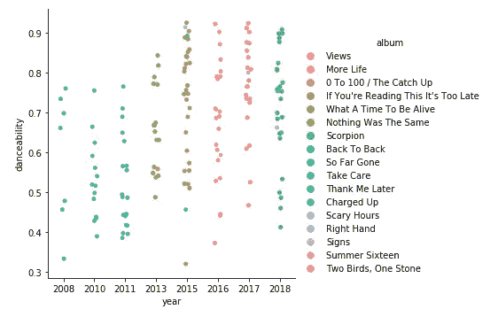
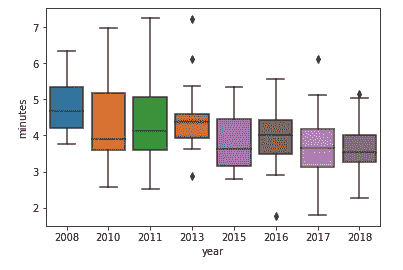
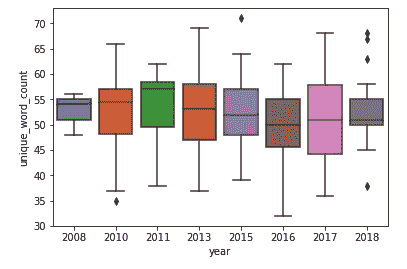
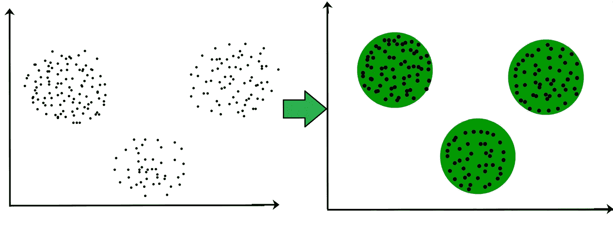
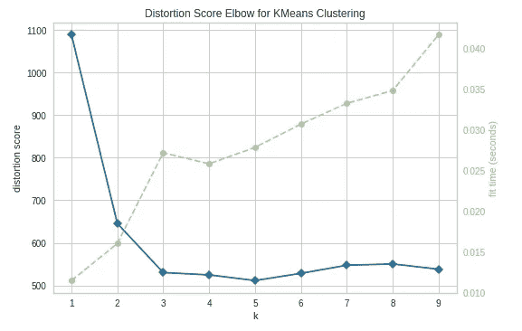
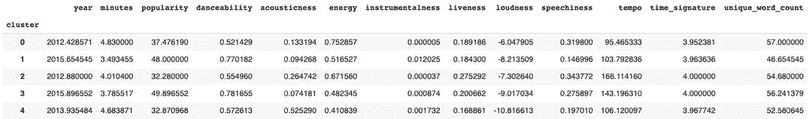

# 德雷克的许多集群

> 原文：<https://towardsdatascience.com/the-many-clusters-of-drake-8718607401ad?source=collection_archive---------14----------------------->

## 使用机器学习和 Spotify 数据对德雷克歌曲进行分组

[Source: The Ringer](https://www.theringer.com/music/2018/7/4/17530970/best-drake-songs-ranked-scorpion-take-care-marvins-room-hotline-bling)

# 介绍

格雷汉姆是当今最大的音乐巨星之一。这位加拿大说唱歌手主宰了流行音乐排行榜和互联网文化。自从他广受好评的混音带问世以来的十年里，德雷克已经发行了 7 张个人专辑和 1 张联合混音带，他正在成为有史以来流量最大的艺术家。

在一个充满昙花一现的奇迹和不断变化的时尚的行业里，是什么让这位前青少年戏剧演员保持领先地位？答案是多功能。德雷克最大的优势在于，他可以无缝地从嘻哈虚张声势过渡到情绪化的民谣，在敏感性和可共鸣性之间达到完美的平衡。从[英国尘垢](https://www.youtube.com/watch?v=yUif6C_uJgk)到[舞厅](https://open.spotify.com/track/1zi7xx7UVEFkmKfv06H8x0)到[雷鬼音乐](https://www.youtube.com/watch?v=OSUxrSe5GbI)，他已经证明没有他不能适应的声音。虽然许多人会争论他的方法的真实性，但它的成功是无可争议的。

为了进一步分析他的多才多艺和音乐发展，我开始使用机器学习来识别他音乐中不断变化的模式，并根据每首歌的指标创建集群(分组)。

# **数据来源**

主要数据集通过 [Spotify 的 Web API](https://developer.spotify.com/documentation/web-api/) 获得，包含 Echo Nest 的音乐属性，定义如下:

*   **声学**:音轨是否声学的置信度测量
*   **可舞性**:一首歌的可舞性取决于音乐元素，包括速度、节奏稳定性、节拍强度和整体规律性
*   **能量**:强度和活动的感知度量。有助于该属性的特征包括动态范围、感知响度、音色、开始速率和一般熵
*   **乐器性**:预测一个音轨是否不包含人声。“Ooh”和“aah”声音被视为乐器，而 rap 或口语显然是“人声”。高于 0.5 的值表示乐器
*   **响度**:整个音轨平均的整体响度，以分贝(dB)为单位。用于比较轨道的相对响度
*   **语速**:音轨中口语词的出现。介于 0.33 和 0.66 之间的值描述可能包含音乐和语音的轨道，可以是分段的，也可以是分层的，包括说唱音乐。

*(更多信息和示例，* [*请参考本文*](https://pudding.cool/2018/05/similarity/) *)*

额外的歌词数据是使用约翰·米勒利用流行歌词网站 [Genius](https://genius.com/) 的 web API 创建的 [python 包在网上搜集的。](https://github.com/johnwmillr/lyricsgenius)

最终的数据集包括 Spotify 上的 162 首德雷克歌曲。这些不包括他出现在其他歌手歌曲中的歌曲。

Preview of the dataset

# **探索德雷克音乐背后的数据**

The correlation heatmap shows a correlation score (color) between every data point

基于上面的关联热图，我们看到一个关联，其中歌曲**随着时间的推移**越来越受欢迎，越来越受欢迎。还有一个**负相关**，随着时间的推移，歌曲的长度(分钟)变得**更短。这表明德雷克的音乐随着时间的推移变得越来越短，越来越有节奏，总的来说更适合广播。**

接下来，我将深入研究这些属性，并考察这些数据点如何反映德雷克职业生涯后半期的风格变化。

## 1.2015 年后，一切都变了

Cat-plot (left) shows the danceability scores of each Drake’s songs, and the box-plot (right) shows the length of each song over time

上面的图表显示，随着时间的推移，德雷克的音乐变得越来越短，越来越适合跳舞，这表明了一种向流行音乐的普遍转变。这也是由于像 Spotify 这样的流媒体应用的兴起，这些应用鼓励较短的歌曲，因为每个流都产生收入。

2015 年也是这两个指标发生重大转变的一年。这是德雷克职业生涯中关键的一年；他发行了两张混音带，一张病毒 diss 唱片(*背靠背)*，以及他迄今为止最重要的单曲*《热线金光闪闪》*。

尽管缺乏营销——在 SoundCloud 上作为他最初的 Meek Mill diss 曲目的 [b 端填充发布,*充电(*前传到*背靠背)*](https://www.thehypemagazine.com/2015/07/drake-releases-3-new-songs-on-ovo-sound-radio/)*——Hot Bling*在[广告牌 Hot 100](https://www.billboard.com/articles/columns/chart-beat/7801076/drake-top-hot-100-hits-one-dance-work-hotline-bling) 上达到第二名(这是他自 2009 年首张单曲以来的最高分，*我有过的最好成绩*)。这首歌将集中体现德雷克的转变，通过风格弯曲的声音和充满毫不掩饰的乡巴佬和无数潮湿文化的音乐视频成为今天的互联网超级巨星。

## 2.对抒情的影响

(Note: the edge of the box represent 1st and 3rd quartile, middle line is the median and whiskers represent min and max, all diamonds are considered outliers)

随着他的歌曲和整体品牌变得更加主流，我想探索这是如何影响他作为一个说唱歌手的抒情性的。为了衡量这一点，我使用独特的字数作为衡量歌曲创作的创造力和努力的指标(受这篇关于说唱歌手词汇的[文章](https://pudding.cool/projects/vocabulary/)和这篇关于德雷克的[机器学习 NLP 文章](/drake-using-natural-language-processing-to-understand-his-lyrics-49e54ace3662)的影响)。

这里的结果有点不清楚，但我认为从 2013 年开始有轻微的负面趋势。我们在 2017 年看到的增长可能是由于 *More Life* 是一个汇集了许多不同艺术家的混音带。不过总的来说，我想说他的抒情很大程度上没有受到影响。他没有用更少的独特词来创作歌曲，而是找到了 50 到 55 个独特词的最佳位置，正如他 2018 年的双专辑 *Scorpion* 所证明的那样，该专辑拥有所有项目中最多的歌曲(25 首)，但字数差异最小。

# 聚类德雷克的音乐

[聚类](https://www.geeksforgeeks.org/clustering-in-machine-learning/)是[无监督机器学习](https://en.wikipedia.org/wiki/Unsupervised_learning)的一种形式，它“识别数据中的共性，并根据这种共性的存在或不存在做出反应”。换句话说，它通过观察到的模式将数据点组合在一起。由于我们的数据集主要包含数字属性，机器学习可以自动创建歌曲聚类

[Source](https://www.geeksforgeeks.org/clustering-in-machine-learning/)

## 我们创建了多少个集群？

确定最佳聚类数的一种常用方法是使用[肘形法](https://en.wikipedia.org/wiki/Elbow_method_(clustering))，该方法在图中寻找一个“肘形”，在该处添加一个额外的聚类(x 轴)会导致失真(y 轴)的最小减少。

The blue line measures distortion based on clusters (k), and the dotted green line measures time

我们的数据的肘形图实际上显示了理想的集群数为 3。然而，鉴于德雷克众所周知的多面性和这一分析的范围，只有 3 组德雷克歌曲将是非常无聊的。相反，我选择了下一个理想的数字，5。

## 我们使用什么指标？

我对以下数字数据属性使用了标准的 k 均值聚类模型:*分钟、受欢迎程度、可跳舞性、声音、能量、乐器感、活跃度、响度、语速、节奏和独特字数*。我从模型中去掉了*年*，因为它在区分歌曲的音乐元素方面没有内在的意义。每个集群的汇总结果如下:

现在，让我们深入了解每个集群！

## 集群 0:“崛起”

> 钱改变了一切，我想知道没有钱的生活会怎样

在德雷克的音乐宝库中，这不是最闪亮或最受欢迎的一面，但这张专辑展示了他作为一名艺术家的崛起，其中有关于追逐梦想、短暂的幸福和应对逆境的自省主题。

**歌曲属性**:

*   **低节奏和舞蹈性**反映了大多数歌曲的内省情绪和信息，只有少数例外( *Over、Fancy、HYFR*
*   **高绝字数**节目重点在于**抒情**和**评书**

## 群组 1:“多才多艺的热门人物”

> 她说，“你爱我吗？”我告诉她“只是部分地”，我只爱我的床和妈妈，对不起

德雷克最大的集群不仅在歌曲数量上，而且在多功能性和热门唱片数量上。风格上没有真正的共同主题，除了它们都很吸引人，容易听和受欢迎。

**歌曲属性**:

*   在所有聚类中，**的高节奏和舞蹈性**以及最低的独特字数(平均每首歌少 8 个字)表明歌曲更有旋律、更吸引人、更适合广播
*   **最高乐器感**反映了多样化的制作和子流派，包括陷阱、弹跳、舞厅等。
*   包含了他的大部分**最受欢迎的热门歌曲**像*上帝的计划，尼斯什么，西番莲，从底部开始，假爱，一个舞蹈*

## 第二组:“新学校的领导者”

> 每晚都喝酒，因为我们为我的成就干杯

风格上与 cluster 0 非常相似，但这些嘻哈歌曲更多的是虚张声势，而不是自省，因为德雷克努力巩固他作为他这一代人，甚至可能是有史以来最大、最成功的说唱歌手的遗产。

**歌曲属性**:

*   不像集群 0，这些歌曲在所有集群中具有最高的速度，适合节奏快、节奏复杂的说唱歌曲
*   德雷克在这里传达的信息是更多的自吹自擂，并专注于金钱和地位。然而，这些主题主要是用来显示他在嘻哈音乐中的地位以及在同龄人中脱颖而出
*   许多歌曲来自他的大二经典，*保重*，包括他早期的热门歌曲，*头条*

## 第三组:“陷阱星”

> 得到了一个运动鞋交易，我不流汗

这是最特定流派的群集捕获了流行的子流派[陷阱音乐](https://en.wikipedia.org/wiki/Trap_music)。特别是，这个集群通过采用这种受亚特兰大影响的重 808 鼓、高帽和三连音流的声音，显示了毛毛适应和改变音乐趋势的能力。

**宋属性**:

*   高舞蹈性、速度和语速的独特组合；大多是快节奏、朗朗上口的说唱歌曲，最适合派对和夜生活
*   包含许多来自亚特兰大说唱歌手的类似功能，如未来，2Chainz，Quavo 和年轻的暴徒

## 第四组:“在我的感觉中”

> 我只是说你可以做得更好，告诉我你最近听到了吗？

这一组歌曲最好地体现了他的标志性风格，喜怒无常的 R&B 混合了情感说唱的低端低音鼓。这是一种流行的风格，影响了像 Bryson Tiller，Amir Obe，6lack 等新艺术家。

**歌曲属性**:

*   这些歌曲大部分是由他的长期音乐伙伴创作的。这种标志性的忧郁、缓慢的声音提供了**低沉的能量和节奏，而德雷克忧郁的声音弥补了**低沉的嗓音****
*   在主题上，这首歌围绕分手和单恋，最好的例子是他的经典 R&B 曲目， [*马文的房间*](https://www.youtube.com/watch?v=nwyjxsOYnys)

# 模型结论

*   总体而言，这些集群完全捕获了德雷克庞大的唱片目录中的 5 种独特声音，尽管每个集群中的一些歌曲被放错了位置
*   群组 1 缺乏**明确的音乐或抒情主题。**为了更准确，有许多歌曲分散到其他聚类中(这可能是由于这些歌曲中的流行度度量相似)
*   尽管从聚类分析中去除了年份，聚类通常仍然显示来自**相似时间段/专辑**的歌曲。这意味着随着时间的推移，音乐和主题的变化会通过数据反映出来

## **最终想法和后续步骤**

这一分析不仅深入研究了德雷克的音乐进化，还展示了机器学习的力量。一个简单的聚类模型可以准确地对一组广泛的歌曲进行聚类，并作为创建个性化播放列表和推荐的基础。Spotify 等流媒体服务无疑正在基于这些类型的数据和更多内容，创建更加复杂的模式和播放列表。

作为一个对 hip-hop 充满热情的人，我想继续使用 Spotify Web API 的数据来探索其他说唱歌手，如 Kendrick Lamar 和 J.Cole，并将他们的音乐与 Drake 或其他流行艺术家进行比较，以通过数据更好地了解他们在音乐上的差异。

*(*[*Github Python 笔记本链接*](https://github.com/yushunli2013/Sandbox/blob/master/Drake_Music_Analysis_and_Clustering.ipynb) *)*